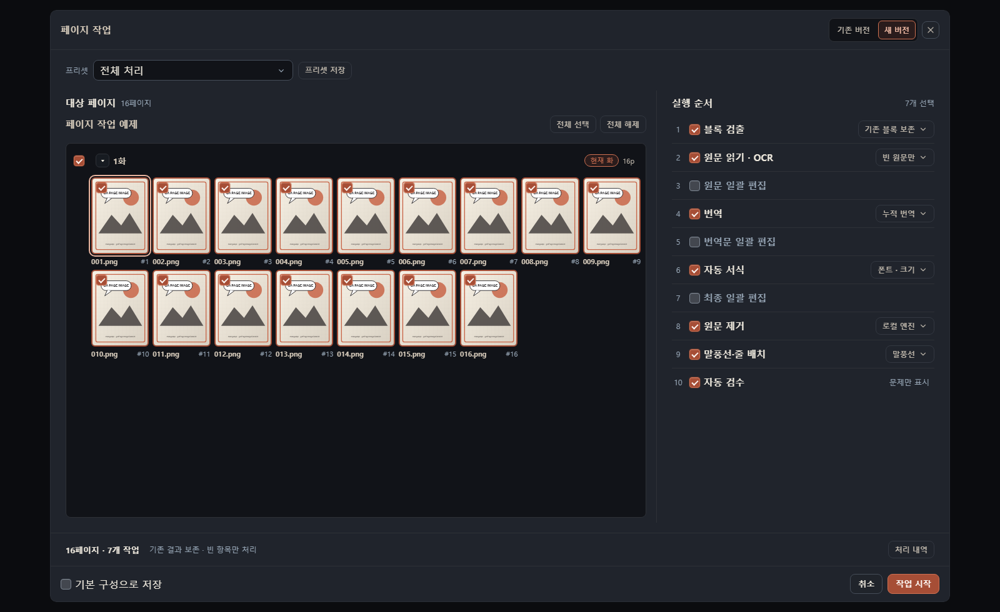

<p align="center"></p>

# 당근망가번역기

만화의 **글자 찾기 → 번역 → 원문 지우기 → 식자·검수 → 출력**을 한곳에서 하는 데스크톱 앱입니다. 직접 준비한 원고를 사용하며, 번역은 로컬 Gemma·Codex·OpenAI 호환 API 중에서 선택합니다.

**한국어** · [English](README.en.md) · [日本語](README.ja.md) · [简体中文](README.zh-Hans.md) · [繁體中文](README.zh-Hant.md)

**[v2.8.2 다운로드](https://github.com/ucx0204/CarrotMangaTranslator/releases/tag/v2.8.2)** · [변경 사항](docs/release-notes/v2.8.2.md) · [오류·제안](https://github.com/ucx0204/CarrotMangaTranslator/issues)

[처음 시작](#start) · [텍스트 편집](#edit) · [효과음 ImageGen](#sfx) · [단축키](#shortcuts) · [문제 해결](#troubleshooting)

Windows 10/11 · Apple Silicon macOS 14+ · [GPL-3.0-only](LICENSE)


대사는 **수정 가능한 텍스트 블록**으로, 커다란 효과음은 **Codex ImageGen**으로 원고에 어울리는 한국어 이미지로 바꿀 수 있습니다. [효과음 전후 비교와 사용법](#sfx)

<a id="start"></a>

## 처음에는 한 장만 완성해 보세요

1. **[설치](#install)** 후 **설정 → AI → 번역**에서 원문·번역 언어와 엔진을 고릅니다.
2. **[OCR·이미지 설정](#setup)**을 확인하고 **확인/업데이트 → OCR/모델 확인**을 실행합니다.
3. **[새 원본 추가](#import)**로 이미지나 폴더를 가져옵니다.
4. 화를 열고 **[번역 설정…](#translate)**에서 한 페이지를 선택합니다. 처음에는 **번역만**으로 결과를 확인하세요.
5. 틀린 **[원문·번역문을 고치고](#edit)**, **[원문 지우기](#erase)**와 **말풍선 맞춤**으로 정리합니다.
6. **[결과물 출력](#export)**으로 완성 이미지를 저장합니다. 설정이 맞으면 나머지 페이지로 범위를 넓힙니다.

### 필요한 곳으로 바로 가기

| 지금 하고 싶은 일                       | 바로 가기                                                     |
| --------------------------------------- | ------------------------------------------------------------- |
| 처음 설치하거나 엔진을 바꾸기           | [설치](#install) · [AI·언어·하드웨어](#setup)                 |
| 여러 화, 압축파일, PDF, 링크 가져오기   | [보관함과 가져오기](#import)                                  |
| 번역 범위·재번역·실패한 페이지 처리     | [번역 실행](#translate)                                       |
| 화면 이동, 선택, 원본 비교              | [작업 화면](#workspace)                                       |
| 대사·글자 크기·줄바꿈·곡선·워프 수정    | [텍스트와 배치](#edit)                                        |
| 폰트와 서식을 재사용하기                | [폰트·프리셋·블록 라이브러리](#styles)                        |
| 남은 글자 지우기, 칠하기, 원본 복원     | [원문 제거와 보정](#erase)                                    |
| 효과음을 번역하거나 이미지로 만들기     | [효과음](#sfx)                                                |
| 전송할 이미지 일부 가리기               | [전송 이미지 가리기](#redaction)                              |
| 인물 이름·말투·앞 장면을 기억시키기     | [용어/기억과 인터넷 조사](#context)                           |
| 이름·문장·서식을 한꺼번에 바꾸기        | [일괄 편집](#batch)                                           |
| 대사만 읽고 외부에서 검수하기           | [텍스트 모아보기·검수표](#review)                             |
| PNG·JPEG·WebP·PSD, 자동 저장, 작업 공유 | [출력](#export) · [자동 저장](#autosave) · [백업·공유](#data) |
| 기능 찾기, 오류 해결                    | [단축키](#shortcuts) · [문제 해결](#troubleshooting)          |

<a id="install"></a>

## 설치

| 환경              | 받을 파일과 실행 방법                                                                                                      |
| ----------------- | -------------------------------------------------------------------------------------------------------------------------- |
| Windows 10/11     | 릴리스의 **Setup EXE**를 실행하고 데이터 폴더를 정합니다.                                                                  |
| Apple Silicon Mac | **arm64 DMG 또는 ZIP**을 받아 앱을 **응용 프로그램**으로 옮깁니다. macOS 14 이상이 필요하며 Intel Mac은 지원하지 않습니다. |

실행 경고가 나오면 해당 릴리스의 서명 상태와 체크섬을 확인하세요. Mac의 첫 실행 승인은 **시스템 설정 → 개인정보 보호 및 보안**에서 할 수 있습니다. [서명 정책](CODE_SIGNING_POLICY.md)

모델과 런타임은 앱과 별도로 내려받으므로 여유 저장 공간이 필요합니다. 첫 준비에는 인터넷이 필요하고, 로컬 Gemma·OCR·인페인팅은 필요한 파일을 준비한 뒤 로컬에서 실행할 수 있습니다. Codex·외부 API·인터넷 조사는 연결이 필요합니다.

<a id="setup"></a>

## 언어와 AI 설정

**앱의 표시 언어**는 **설정 → 일반**, **원고와 번역의 언어**는 **설정 → AI → 번역**에서 따로 정합니다.


| 번역 엔진      | 준비할 것                     | 선택 후 확인할 것                                                                               |
| -------------- | ----------------------------- | ----------------------------------------------------------------------------------------------- |
| **Gemma 로컬** | 모델 공간, RAM/VRAM           | 모델 프리셋과 런타임. 장치에 맞는 작은 프리셋부터 시험합니다.                                   |
| **Codex**      | 앱 안에서 ChatGPT 로그인      | 계정에서 제공하는 모델과 추론 강도. 내장 서버를 사용하므로 별도 Codex CLI 설치가 필요 없습니다. |
| **API**        | Base URL, 모델 ID, 필요 시 키 | OpenAI 호환 여부와 이미지 입력 지원. 로컬 호환 서버도 사용할 수 있습니다.                       |

**AI 탭 안의 설정은 용도가 다릅니다.** 번역 엔진을 바꾸어도 OCR·원문 제거·Codex 이미지 도구·인터넷 조사 설정이 모두 함께 바뀌는 것은 아닙니다.

| AI 하위 탭      | 설정 내용                                                                                                          |
| --------------- | ------------------------------------------------------------------------------------------------------------------ |
| **번역**        | 원문/번역 언어, Gemma·Codex·API, 생성 한도                                                                         |
| **OCR**         | HayaiOCR/PaddleOCR, 지원 장치. 영역이나 읽기 결과가 나쁘면 같은 페이지로 비교하세요.                               |
| **이미지**      | 기본 원문 제거 모델 **AOT / LaMa / Flux**, 지원 백엔드, 별도의 **Codex 이미지 모델·추론 강도**, 전송 이미지 가리기 |
| **인터넷 조사** | 조사 엔진에 필요한 계정·키, 검색 결과 분석 모델, 사용 한도                                                         |
| **하드웨어**    | 앱 그래픽 GPU와 로컬 AI 연산 GPU, 감지된 장치의 권장값. 그래픽 GPU 변경은 저장 후 재시작이 필요합니다.             |

<details>
<summary>고급 설정과 화면 더 보기</summary>

- **Gemma:** Hugging Face 모델 또는 로컬 모델 파일을 선택합니다. 프리셋의 메모리 표기는 선택 가이드이며, 긴 페이지·큰 문맥·다른 프로그램 사용량도 영향을 줍니다. 런타임은 장치에 맞추고, OOM이 나면 작은 프리셋과 낮은 문맥 한도부터 시험하세요.
- **API:** Temperature·top_p·top_k·reasoning_effort·추가 JSON·사용자 헤더는 서버가 지원하는 항목만 넣습니다. 요청 간격·재시도·키 설정은 서비스 제한에 맞춥니다. 키가 보이는 화면은 공유하지 마세요.
- **생성 한도:** 최대 출력 토큰은 응답 길이, 작품 정보 예산은 참고할 문맥의 양에 관계됩니다. 값이 크다고 항상 번역이 좋아지는 것은 아닙니다.
- **준비 확인:** 설정을 저장한 뒤 **확인/업데이트 → OCR/모델 확인**으로 설치·작동을 확인합니다. 업데이트 확인은 릴리스 페이지를 엽니다.
- 화면: [일반](docs/images/readme-v2712/settings-general.png) · [OCR](docs/images/readme-v2712/settings-ocr.png) · [이미지](docs/images/readme-v2712/settings-image.png) · [인터넷 조사](docs/images/readme-v2712/settings-research.png) · [하드웨어](docs/images/readme-v2712/settings-hardware.png) · [확인/업데이트](docs/images/readme-v2712/settings-test.png)

</details>

<a id="import"></a>

## 원고 가져오기와 보관함

**작품 → 화 → 페이지 → 블록** 순으로 관리합니다. 작품에는 공통 용어와 캐릭터가, 화에는 여러 페이지가, 페이지에는 원본·번역 블록·보정 결과가 들어갑니다. 블록은 대사·나레이션·효과음 한 덩어리입니다.

**새 원본 추가**에서 소스를 고른 뒤 미리보기의 순서와 제외할 항목을 확인하고, 새 작품 또는 기존 작품의 새 화로 추가합니다. 여러 회차를 한꺼번에 넣을 때는 **여러 화 추가**를 사용하세요. 파일·폴더를 앱으로 끌어오는 방법도 있습니다.


| 원고                       | 사용 방법                                                   |
| -------------------------- | ----------------------------------------------------------- |
| PNG·JPEG·WebP              | 이미지 선택 또는 이미지가 든 폴더 가져오기                  |
| ZIP·CBZ·RAR·CBR            | 압축파일을 선택하고 내부 이미지 확인                        |
| PDF                        | 페이지를 이미지로 가져오기                                  |
| 여러 화가 든 폴더/압축파일 | 여러 화 추가에서 화 구분과 순서 확인                        |
| 웹 페이지                  | 링크의 이미지 목록에서 크기로 거르고 필요한 이미지만 선택   |
| `.mgtshare`                | **작업 가져오기**로 기존 편집 작업 복원. [공유 설명](#data) |

보관함 검색은 작품·화를 찾고, 페이지 목록에서는 처리 상태와 순서를 확인합니다. 손상되거나 지원하지 않는 파일이 제외되었다면 가져오기 결과를 확인하세요. 웹의 로그인·접근 제한 때문에 이미지를 읽지 못하는 경우에는 직접 준비한 파일을 사용합니다.

<a id="translate"></a>

## 번역 실행·이어서 번역

화를 열고 **번역 설정…** 또는 `T`를 누릅니다. 작품 안에서 번역할 화와 페이지를 고르고, **미번역만**으로 남은 대상을 좁힐 수 있습니다.


| 선택                     | 동작과 사용 시점                                                                                               |
| ------------------------ | -------------------------------------------------------------------------------------------------------------- |
| **빠른 1회**             | 페이지를 한 번 번역하고 간단한 최근 문맥을 참고합니다.                                                         |
| **누적 컨텍스트**        | 장면·용어·캐릭터 정보를 쌓아 다음 페이지에 활용합니다. 상세 기록 / 균형 기록 / 필수 용어만 중 범위를 고릅니다. |
| **자동 생성**            | 텍스트 영역을 다시 찾습니다.                                                                                   |
| **기존 블록 유지**       | 영역과 서식을 유지하고 텍스트를 다시 채웁니다. 블록이 없는 페이지는 자동 생성합니다.                           |
| **자연스러운 줄 나눔**   | 번역문 자체에 블록 크기를 고려한 줄바꿈을 넣습니다. 수동 줄바꿈을 살리고 싶다면 켜기 전에 확인하세요.          |
| **글자 크기 AI 맞춤**    | 원문 글자 크기를 추정합니다.                                                                                   |
| **폰트 자동 맞춤**       | 원문 분위기에 맞는 **한글 폰트**를 블록별로 적용합니다. 크기 맞춤과는 별도입니다.                              |
| **번역만 / 원문 지우기** | 번역에서 끝낼지, 원문 제거까지 이어서 할지 정합니다.                                                           |
| **말풍선 맞춤**          | 원문을 지운 뒤 말풍선 안쪽에 번역문을 맞춥니다.                                                                |
| **Codex가 지우기**       | 제공되는 조건에서 Codex 이미지 작업으로 원문을 제거합니다. [이미지 설정](#setup)도 확인하세요.                 |

자주 쓰는 조합은 **다음 번역의 기본값으로 저장**합니다. `Shift+T`는 남은 페이지를 이어서 번역합니다. 진행 상황과 실패 사유는 작업 상태에서 확인하고, 완료된 페이지를 무조건 다시 번역하기보다 남은 대상을 선택하세요.

**재번역은 수동 수정과 기존 결과를 바꿀 수 있으며, 작업 공간의 실행 취소로 되돌리는 작업이 아닙니다.** 보존할 편집본은 먼저 [작업 내보내기](#data)로 저장하세요. 작업 중인 페이지의 수정은 제한되지만, 잠기지 않은 다른 페이지는 편집할 수 있습니다. 현재 화 전체를 바꾸는 명령은 그 화의 작업 상태에 따라 제한됩니다.

### HayaiOCR 페이지 작업

HayaiOCR에서는 오른쪽 위 **기존 버전 / 새 버전**으로 화면을 전환합니다. 마지막 선택을 기억하며, 전환할 때 창의 가로 폭이 자연스럽게 바뀝니다. 기존 버전은 익숙한 번역 설정과 실행 방식을 제공합니다.



_실제 페이지 작업 컴포넌트를 자체 QA 도구로 캡처한 화면입니다. 썸네일은 예시 이미지입니다._

새 버전에서는 **대상 페이지 → 프리셋·작업 선택 → 작업 시작** 순서로 진행합니다. 작업 이름과 세부 옵션에 마우스를 올리면 설명을 볼 수 있습니다.

| 프리셋      | 실행 내용                                          |
| ----------- | -------------------------------------------------- |
| 전체 처리   | 검출 → OCR → 번역 → 자동 서식 → 제거 → 배치 → 검수 |
| 손번역 준비 | 검출 → OCR → 제거                                  |
| 원문 제거만 | 검출 → 제거                                        |
| 번역만      | 저장된 원문으로 번역 → 검수                        |
| 식자 마무리 | 자동 서식 → 제거 → 배치 → 검수                     |

- 기본적으로 기존 결과를 보존하고 빈 항목만 채웁니다. 다시 처리할 항목은 해당 단계 옵션에서 고릅니다.
- **손번역 준비** 후 원문을 교정하고 **번역만**을 실행하면 교정한 원문을 사용합니다.
- 일괄 편집은 원문·번역문·최종 서식 단계에서 규칙을 선택해 적용합니다.
- 프리셋 목록의 별로 즐겨찾기를 지정합니다. 저장한 프리셋을 수정한 뒤 **변경 저장**으로 덮어쓰거나 **새로 저장**으로 복사합니다. 삭제는 목록의 휴지통을 사용합니다.
- 중단된 작업은 상단의 이어하기 선택으로 재개합니다.

<a id="workspace"></a>

## 작업 화면 익히기

왼쪽은 **보관함·페이지**, 가운데는 **원고**, 오른쪽은 **페이지 블록·선택한 블록 편집**입니다. 패널을 접고 펼쳐 원고 공간을 확보할 수 있습니다. 번역문 또는 블록 목록의 항목을 선택하면 해당 블록을 편집합니다.

| 조작           | 방법                                                                |
| -------------- | ------------------------------------------------------------------- |
| 페이지 이동    | 왼쪽 썸네일, `PageUp` / `PageDown`                                  |
| 원고 이동      | 손바닥 도구 `H` 또는 `3`로 드래그                                   |
| 확대·축소      | `Ctrl+휠`, 확대 컨트롤. 화면/너비/높이 맞춤과 실제 크기도 선택 가능 |
| 원본 비교      | `O`로 원본 미리보기 전환                                            |
| 번역문 표시    | `V`로 블록 표시, `Shift+B`로 편집 배경·테두리 전환                  |
| 블록 만들기    | 블록 도구 `W` 또는 `2`에서 영역 드래그                              |
| 선택·이동·크기 | 선택 도구 `S` 또는 `1`, 블록과 조절점 드래그                        |
| 여러 블록      | 다중 선택 또는 `Ctrl+A`로 현재 페이지 전체 선택                     |
| 읽기 순서      | 블록 목록의 위·아래 버튼, `Ctrl+Alt+↑/↓`, **좌표순 정렬**           |

화면의 노란 선택 표시와 편집용 테두리는 출력 결과와 구분해서 보세요. 원고를 확대해 확인한 뒤 전체 화면에서도 줄바꿈·균형을 확인하는 편이 좋습니다.

<a id="edit"></a>

## 대사와 식자 다듬기

### 텍스트: 번역이 이상하면 OCR부터

블록을 선택하고 **텍스트** 탭에서 원문과 번역문을 비교합니다. 이름·숫자·부호가 잘못 읽혔다면 원문부터 바로잡고 필요한 범위만 다시 번역하세요. 블록의 역할·화자·검수 상태·메모도 이후 일괄 편집과 검수에 쓰입니다.


번역문의 일부를 선택하면 그 글자에만 굵기·기울임·폰트·크기·색·투명도·배경·외곽선·광선을 적용할 수 있습니다. 선택 없이 입력할 때는 이후 입력할 글자에 적용되는지 표시를 확인하세요. **코드** 보기에서는 서식 표현을 직접 확인하고 수정합니다. **서식 전체 초기화**는 문장 안의 부분 서식을 제거합니다.

### 배치: 말풍선에 들어가게 만들기

| 조정                  | 쓰임                                                                                                                                  |
| --------------------- | ------------------------------------------------------------------------------------------------------------------------------------- |
| 위치·크기·회전        | 블록을 옮기고 영역을 조절합니다. 회전 초기화는 `Ctrl+Shift+T`.                                                                        |
| 가로/세로·정렬·줄바꿈 | 원고 방향과 말풍선 모양에 맞춥니다. 문장에 직접 넣은 줄바꿈과 자동 줄바꿈을 구분하세요.                                               |
| 말풍선 맞춤           | 말풍선 내부를 기준으로 배치합니다. 모양 편집은 다각형으로 지정하거나 브러시로 늘리고 깎습니다. 해제하면 원래 OCR 영역으로 돌아갑니다. |
| 곡선·원근·워프        | 휘거나 기울어진 대사·효과음을 맞춥니다. 화면의 조절점을 움직이고 미리보기로 확인합니다.                                               |

### 서식: 글자 모양과 간격

**서식** 탭에서 폰트·크기·굵기·기울임·정렬·글자색·외곽선·광선·줄 간격·자간·장평·투명도를 조정합니다. 블록 전체 서식과 문장 일부의 서식이 겹치면 해당 부분의 설정도 확인하세요.

선택 블록의 서식을 다른 곳에 복사하려면 **일괄 적용**에서 적용할 항목과 범위(선택/페이지/화)를 고릅니다. 색만 옮기려는데 글자 크기까지 바뀌지 않도록 항목을 확인하세요. [배치 화면](docs/images/readme-v2712/editor-layout.png) · [서식 화면](docs/images/readme-v2712/editor-format.png)

<a id="styles"></a>

## 폰트·서식·블록 재사용

| 기능                | 저장하는 것                | 사용하는 곳                                                                                     |
| ------------------- | -------------------------- | ----------------------------------------------------------------------------------------------- |
| **기본 서식**       | 새 블록에 사용할 기본값    | 설정 → 기본 서식. 기존 블록을 일괄 변경하려면 별도로 적용합니다.                                |
| **서식 프리셋**     | 선택한 서식 항목           | 현재 서식으로 만들기 → 이름·포함할 그룹 선택 → 빠른 서식에 고정. `Alt+1`~`Alt+0` 슬롯 지정 가능 |
| **블록 라이브러리** | 다시 쓸 텍스트와 블록 서식 | 블록의 더 보기 → 라이브러리에 저장. 이름·원문·번역문 검색 후 현재 페이지에 삽입                 |
| **폰트 관리**       | 등록 폰트와 표시 순서      | TTF/OTF 등록, 즐겨찾기, 숨기기, 순서 변경, 기본 폰트 지정                                       |

프리셋은 이름 변경·그룹 정리·현재 서식으로 덮어쓰기가 가능합니다. 블록 라이브러리에서는 내용도 편집할 수 있습니다. 다른 PC에서 열었을 때 폰트가 없다면 같은 폰트를 등록하거나 대체하세요. 자동 폰트 맞춤은 번역 시점의 기능이며, 프리셋을 저장하는 기능과 다릅니다.

[기본 서식 화면](docs/images/readme-v2712/settings-format.png)

Codex ImageGen으로 만든 효과음도 **블록 라이브러리**에 저장할 수 있습니다. 이미지·마스크·글꼴 굵기를 함께 보존해 다른 페이지에서 재사용합니다. 선택한 텍스트·이미지 블록은 `Ctrl+C` / `Ctrl+V`로 페이지·화·작품 사이에 복사할 수 있습니다.

<a id="erase"></a>

## 원문 지우기와 수동 보정

**자동 지우기 → 남은 자국 보정 → 원본 비교** 순으로 진행하면 편합니다. 자동 지우기는 블록의 원문 영역을 기준으로 배경을 복원합니다. 남길 글자는 블록의 더 보기에서 **자동 지우기에서 제외**하세요.


| 도구                              | 하는 일                                                                              |
| --------------------------------- | ------------------------------------------------------------------------------------ |
| **자동 지우기** / `I`             | 대상 페이지를 고르고 설정된 인페인팅 모델로 원문 제거. 후속 말풍선 맞춤도 선택 가능  |
| **마스크** / `J`                  | 지울 영역을 직접 칠한 뒤 적용하여 배경 복원                                          |
| **브러시** / `B`                  | 선택한 색으로 칠하기. 평평한 배경의 작은 자국 수정에 유용                            |
| **사각형** / `R`, **원형** / `E`  | 드래그한 도형을 선택한 색으로 덮기                                                   |
| **지우개** / `X`, **사각 지우개** | 보정한 영역을 **원본 이미지의 픽셀로 복원**. 제거용 마스크를 지우는 도구가 아닙니다. |
| **색 추출** / `P`                 | 원고에서 칠할 색 선택                                                                |

**브러시·사각형·원형에서 `Alt+좌클릭`하면 색을 추출**합니다. 그리기 도구의 `Alt+우클릭 드래그`는 브러시 반경 조절에 쓰입니다. 브러시 선을 곧게 만들 때는 `Shift` 드래그를 사용합니다. 마스크 적용은 도구 상태에 따라 `Space`로 실행할 수 있습니다.

사각형·원형·사각 지우개의 시작점은 밝은 원고와 어두운 원고 모두에서 보이도록 흑백 이중 윤곽 십자 커서를 사용합니다. 잘못 칠했다면 실행 취소, 원본 복원이 필요하면 지우개를 사용하세요. [자동 지우기 화면](docs/images/readme-v2712/erase.png)

<a id="sfx"></a>

## 효과음: 후보 확인부터 출력까지

큰 효과음은 글꼴만 바꾸면 원래의 붓 터치와 박력이 사라지기 쉽습니다. **Codex ImageGen**으로 이미지 자체를 한국어로 바꾸고, 말풍선 대사는 계속 편집 가능한 텍스트로 유지할 수 있습니다.

| 일본어 원본                                                                              | 한국어 대사 + 이미지 효과음                                                                             |
| ---------------------------------------------------------------------------------------- | ------------------------------------------------------------------------------------------------------- |
|  |  |

예제의 큰 `ドン`은 붓글씨 `쾅`으로 바꿨습니다. 대사는 원문을 지운 자리에 텍스트 블록을 맞춰 얹었습니다. 이 비교는 Codex 내장 imagegen으로 준비한 예제와 앱의 실제 식자 렌더러를 사용했습니다. [제작 과정](docs/images/readme-v2712/README.md)

HayaiOCR이 찾은 효과음 후보는 대사와 별도로 검토할 수 있습니다. **효과음 번역 실행**을 열고 페이지별 후보를 포함·제외합니다. 그림을 잘못 잡았다면 제외하고, 놓친 효과음은 영역을 직접 추가하거나 수정하세요.


1. 원문과 영역이 맞는지 확인합니다. 잘못된 후보를 그대로 번역하지 마세요.
2. **텍스트**로 번역할지, **Codex 이미지**로 생성할지 고릅니다. 이미지 방식은 별도의 Codex 이미지 설정을 사용합니다.
3. 이미지 방식에서는 먼저 번역문을 검토하고 **전체 확정 후 생성**합니다. 그림에 넣을 문구를 이때 다듬습니다.
4. 결과를 원본과 비교합니다. 텍스트는 일반 블록처럼 편집하고, 생성된 글자는 제공되는 이미지 편집·복원 도구로 다듬습니다.

단건 번역은 원문을 유지합니다. 원문 지우기는 전체 효과음 번역의 옵션에서 선택하세요. 삭제·제외한 후보는 **초기화**로 다시 표시할 수 있으며 영역 수정과 번역 결과는 유지됩니다.

이미지 작업을 이어서 실행할 때 **가리기와 효과음이 겹친 페이지는 번역문을 저장한 채 이미지 작업을 보류**합니다. 다른 페이지는 계속 처리합니다. 해당 페이지의 가리기를 조정한 뒤 이어서 실행하면 미완료 이미지 작업을 처리합니다. [가리기 설명](#redaction)

<a id="redaction"></a>

## 전송 이미지 가리기

**설정 → AI → 이미지 → 전송 이미지 가리기**에서 사용합니다. 가리기는 지원되는 AI 이미지 전송 흐름의 **전송 사본**에 적용되며 원본 파일을 칠하는 기능과 다릅니다.

페이지·화·작품 범위의 **가리기 준비** 명령으로 영역을 검토하고 필요한 부분을 수정합니다. 자동 판정 결과는 직접 확인하세요. 번역하거나 생성해야 할 글자 영역을 가리면 처리할 수 없으므로 대상 텍스트와 겹치지 않게 조정합니다. 원문 지우기와는 목적이 다릅니다.

가리기를 켰다고 번역 요청의 OCR 텍스트·작품 문맥까지 모두 제거되는 것은 아닙니다. 외부로 보내는 정보를 확인하려면 사용하는 엔진과 [개인정보 안내](docs/privacy-policy.md)를 함께 확인하세요.

<a id="context"></a>

## 이름·말투를 유지하는 용어/기억

오른쪽 도구의 **용어/기억**을 엽니다. 같은 작품의 여러 화에서 공통 표기를 유지할 때 사용합니다.


| 탭                | 넣을 내용                                   | 예제 원고에서는                                    |
| ----------------- | ------------------------------------------- | -------------------------------------------------- |
| **용어집**        | 원문·번역 표기, 별칭, 종류, 메모, 사용 여부 | `侍従長 → 시종장`                                  |
| **캐릭터**        | 이름·별칭·화법·인물 메모                    | 세라피나: 차분한 존댓말로 잔혹한 명령을 내림       |
| **번역 규칙**     | 호칭, 효과음 처리, 기본 번역 톤             | 호칭 유지, 효과음 번역                             |
| **스토리 메모리** | 페이지별 장면 요약·시각적 정보              | 홍차가 식었다는 이유로 처형을 명해 궁정이 조용해짐 |

수동으로 입력하거나 **AI 용어/기억**으로 분석한 뒤 확인합니다. 누적 번역이 만든 내용도 정리할 수 있습니다. 비슷한 인물·별칭이 중복 등록되었다면 합당한 표기로 정리하고 저장하세요. [캐릭터](docs/images/readme-v2712/context-characters.png) · [규칙](docs/images/readme-v2712/context-rules.png) · [스토리](docs/images/readme-v2712/context-memory.png)

<details>
<summary>인터넷 조사, 적용 검토, 문맥 예산</summary>

**인터넷 조사**는 작품 제목을 확인하고 조사 엔진·범위를 선택해 외부 정보를 보충합니다. 검색용 제목은 보관함의 작품명과 구분됩니다. Codex 조사와 Tavily 검색 후 LLM 분석은 준비할 계정·키와 한도가 다르므로 **설정 → AI → 인터넷 조사**를 먼저 확인하세요.

제안된 용어·캐릭터·규칙은 출처와 현재 내용을 비교하고 필요한 항목만 적용합니다. 검색 결과는 틀리거나 다른 작품의 정보일 수 있습니다. 단순한 예제 원고처럼 외부 자료가 없는 작품은 직접 작성하면 됩니다.

작품 정보가 많아지면 예산 표시를 확인하고 번역에 필요한 내용을 우선 남기세요. 저장 충돌이 표시되면 다른 작업의 변경을 확인한 뒤 최신 내용을 다시 열어 반영합니다. **용어·기억 전체 초기화**는 작품의 용어집·캐릭터·모든 화의 스토리 메모리를 지우므로 일반 정리 대신 사용하지 마세요.

</details>

<a id="batch"></a>

## 이름·문장·서식을 한꺼번에 수정

`Ctrl+H`로 **텍스트 일괄 편집**을 엽니다. **범위 → 조건 → 작업 → 변경 전후 확인 → 적용** 순서입니다. 먼저 현재 페이지에서 규칙을 확인한 뒤 현재 화 전체로 넓히면 실수를 줄일 수 있습니다.


조건은 원문·번역문뿐 아니라 역할·화자·검수 상태 등으로 좁힐 수 있습니다. **모두 맞을 때**와 **하나라도 맞을 때**를 구분하고, **모든 말풍선**은 범위 안의 전체 블록을 대상으로 한다는 점에 주의하세요. 작업은 문자 치환, 서식·필드 변경, 일부 글자 강조 등을 순서대로 구성합니다.

### 예제: 세라피나의 말투만 통일하기

1. 조건을 **화자 = 세라피나**, **번역문에 `처형했습니다` 포함**, **모두 맞을 때**로 설정합니다.
2. `처형했습니다`를 `처형하였습니다`로 치환합니다.
3. 새로 생긴 `처형하였습니다` 부분에만 굵게를 적용합니다.
4. 미리보기에서 시종의 대사는 바뀌지 않는지 확인하고 적용합니다.

화자 조건을 쓰려면 해당 블록에 올바른 화자가 연결되어 있어야 합니다. 작품마다 ID가 다르므로 예제의 이름이나 ID를 그대로 복사하지 마세요.

<details>
<summary>다른 활용법과 규칙 저장</summary>

- **말줄임표·공백:** 기본 예제 규칙으로 `...`을 `…`으로 바꾸고 연속 공백을 정리합니다.
- **효과음 서식:** 역할이 효과음인 블록만 골라 굵기·크기·외곽선을 바꿉니다.
- **검수 대상 표시:** 빈 번역문이나 특정 표현에 맞는 항목을 골라 검수 상태·메모를 정리합니다.
- **정규식:** 일반 문자 검색으로 부족할 때 사용합니다. 대소문자와 전체 치환 설정도 확인하세요.
- **결과 제외:** 조건에 맞더라도 바꾸면 안 되는 결과는 적용 대상에서 빼세요. 실제 페이지의 변경 전/후와 적용 개수를 확인합니다.
- **재사용:** 규칙을 이름과 함께 YAML로 저장합니다. 여러 규칙을 순서대로 실행하는 시퀀스도 구성할 수 있습니다. 앞 단계의 결과가 다음 단계의 입력이 됩니다.
- **충돌:** 미리보기 뒤 바뀐 블록은 자동 덮어쓰기 대신 건너뜁니다. 최신 상태로 미리보기를 다시 만드세요. 방금 적용한 일괄 편집은 실행 취소로 되돌릴 수 있습니다.

</details>

<a id="review"></a>

## 대사만 읽고 검수하기

`G`로 **텍스트 모아보기**를 엽니다. 현재 화의 OCR·번역문을 함께 보거나 한쪽만 표시하고 검색할 수 있습니다. 페이지 제목을 눌러 원고로 이동하고, 블록을 골라 필요한 서식만 일괄 수정할 수도 있습니다.


| 가져오기·내보내기 | 대응 방식                                | 주의할 점                                                               |
| ----------------- | ---------------------------------------- | ----------------------------------------------------------------------- |
| 복사 / TXT 저장   | 현재 표시한 텍스트                       | 페이지 머리말 포함 여부 선택                                            |
| TXT 불러오기      | **번역문만**으로 저장한 텍스트의 줄 순서 | 순서를 바꾸면 대응이 틀어질 수 있습니다. 적용 전 경고·개수 확인         |
| CSV / TSV 검수표  | `block_id`                               | 번역문·검수 상태·메모를 반영하며 OCR 원문은 바꾸지 않습니다. ID 열 유지 |

외부 스프레드시트에서 검수할 때는 검수표를 쓰는 편이 대응 관계를 유지하기 좋습니다. 다시 가져오기 전에 원본을 보관하고, 알 수 없는 ID·중복·누락 등의 경고를 확인하세요.

<a id="export"></a>

## 완성 이미지와 PSD 출력

**결과물 출력** 또는 `Ctrl+E`에서 화·페이지를 고릅니다. **출력 전 확인**에 미번역·실패·후처리 누락이 있다면 해당 페이지로 돌아가 확인하세요.


| 결과물                            | 옵션과 용도                                                                                                                                                              |
| --------------------------------- | ------------------------------------------------------------------------------------------------------------------------------------------------------------------------ |
| **원본 형식 / PNG / JPEG / WebP** | 완성 이미지를 합성합니다. JPEG·WebP 품질, 원본 파일명·하위 폴더 유지 여부를 선택합니다.                                                                                  |
| **글자 없이 출력**                | 번역 글자를 합성하지 않고 정리된 배경을 저장합니다. 원문 제거 결과가 필요합니다.                                                                                         |
| **레이어 PSD**                    | 원본·정리 배경·블록별 대사를 나누어 저장합니다. 지원되는 대사는 편집 가능한 텍스트, 복잡한 세로·곡선·원근·부분 서식 등은 모양을 보존하는 래스터 레이어가 될 수 있습니다. |

새 타임스탬프 폴더 또는 선택 폴더 직접 저장을 고르고, 같은 파일명이 있으면 **교체 / 건너뛰기 / 출력 취소** 정책을 확인합니다. 이미지 출력과 [작업 파일 공유](#data)는 다릅니다. PSD도 앱의 모든 편집 상태를 그대로 복구하는 백업은 아닙니다. [PSD 화면](docs/images/readme-v2712/export-psd.png)

<a id="autosave"></a>

## 작업하면서 결과를 자동 저장

**설정 → 결과물 자동 저장**에서 작품·화의 연결 상태와 출력 형식을 관리합니다. 편집 내용을 외부 결과 폴더에 계속 반영하고 싶을 때 사용합니다. 연결한 폴더와 자동 저장 상태를 확인하고, 실패·대기 항목은 상태 안내에서 다시 처리하세요.


결과 폴더의 `result`는 완성 이미지, `originals`는 복구용 원본, `inpainted`는 원문 제거본, `mask`는 지운 영역입니다. 자동 저장은 앱의 편집 데이터 저장과 별개입니다. 연결을 끄거나 형식을 바꾸기 전에는 현재 저장 위치를 확인하고, 이 폴더들을 임의의 캐시처럼 지우지 마세요.

<a id="data"></a>

## 작업 공유·백업·개인정보

**작업 내보내기**에서 작품과 화를 골라 `.mgtshare`로 저장합니다. 다른 PC에서는 **작업 가져오기**로 새 작품을 만들거나 기존 작품의 화를 추가·교체합니다. 최종 목록과 순서를 확인한 뒤 적용하세요.

| 작업 파일에 포함                                               | 별도 준비                                                                                  |
| -------------------------------------------------------------- | ------------------------------------------------------------------------------------------ |
| 원고 이미지, 블록·읽기 순서·서식, 인페인팅 결과 등 작업 데이터 | 앱 설정, ChatGPT 로그인·API 키, AI/OCR 모델·런타임, 로그. 필요한 폰트도 사용 환경에서 확인 |

**설정 → 일반 → 백업 및 이관**에서 작업 환경을 ZIP 하나로 내보내고 새 PC에서 가져올 수 있습니다. 보관함 원본·편집 데이터·재개용 체크포인트, 설정, 추가 폰트, 프리셋과 가리기 초안을 포함합니다. 가져오기는 먼저 검증한 뒤 기존 환경을 보존하고 앱을 재시작해 교체합니다. 같은 화면에서 이전 환경으로 되돌릴 수 있으며, 복구용 환경은 자동 삭제하지 않습니다.

API 키·로그인 세션·서비스 계정 파일, API 사용자 지정 헤더와 추가 요청 본문, 모델·실행 도구·로그·캐시는 백업하지 않습니다. 복원 후 인증과 PC별 모델·GPU 설정을 확인하세요. 외부 연결 폴더와 별도 출력 파일은 따로 옮긴 뒤 다시 연결해야 하며, 동기화 대기열은 이관하지 않습니다. 백업에는 개인 원본과 번역이 포함되며 암호화된 공유 파일이 아닙니다.

수동으로는 앱을 종료하고 `library` 전체를 새 설치가 사용하는 실제 데이터 폴더에 복사하면 보관함 이미지 경로를 보정해 읽습니다. 이것만으로 설정·폰트까지 이관되지는 않습니다. API 키는 OS에 묶인 암호화 저장소를 사용하므로 설정 관련 파일을 그대로 복사해도 다른 PC에서 인증을 복원할 수 있다고 보장하지 않습니다.

전체 환경을 보관하려면 앱을 닫은 뒤 **데이터 폴더를 백업**하세요. `library`는 작품 원본과 편집 데이터이므로 삭제할 캐시가 아닙니다. 설정·폰트·로그·모델 캐시와 구분하고, 원본과 출력물을 따로 보존하세요. macOS 기본 데이터 위치는 `~/Library/Application Support/manga-gemma-translator`입니다.

외부 엔진은 요청에 필요한 이미지·텍스트·문맥을 해당 서비스로 보낼 수 있습니다. 로그에도 경로나 원고 내용 일부가 포함될 수 있으므로 공유 전 확인하세요. 오류 보고서는 자동 업로드되지 않습니다. [개인정보 안내](docs/privacy-policy.md) · [보안 정책](SECURITY.md)

<a id="shortcuts"></a>

## 단축키와 명령 찾기

**`Ctrl+K`로 기능 이름을 검색**, **`?`로 단축키 도움말**을 엽니다. **설정 → 단축키**에서 조합을 바꾸고 충돌을 확인하거나 기본값으로 되돌릴 수 있습니다. 아래 `Ctrl`은 macOS에서 `Cmd`로도 동작합니다. 글자 입력 중에는 일부 도구 단축키가 실행되지 않습니다.

| 작업                                  | 기본 키                                          |
| ------------------------------------- | ------------------------------------------------ |
| 설정 / 명령 팔레트 / 도움말           | `Ctrl+,` / `Ctrl+K` / `?`                        |
| 번역 설정 / 남은 페이지 이어서        | `T` / `Shift+T`                                  |
| 모아보기 / 일괄 편집 / 출력           | `G` / `Ctrl+H` / `Ctrl+E`                        |
| 이전·다음 페이지                      | `PageUp` / `PageDown` (`A` / `D`, 방향키도 가능) |
| 선택 / 블록 추가 / 손바닥             | `S` 또는 `1` / `W` 또는 `2` / `H` 또는 `3`       |
| 원본 / 번역문 / 편집 테두리           | `O` / `V` / `Shift+B`                            |
| 자동 지우기 / 마스크 / 브러시         | `I` / `J` / `B`                                  |
| 사각형 / 원형 / 복원 지우개 / 색 추출 | `R` / `E` / `X` / `P`                            |
| 확대·축소 / 초기화                    | `Ctrl+휠` / `Ctrl+0`                             |
| 실행 취소 / 다시 실행                 | `Ctrl+Z` / `Ctrl+Shift+Z`                        |
| 블록 전체 선택 / 복제 / 삭제          | `Ctrl+A` / `Ctrl+D` / `Delete`                   |
| 이전·다음 블록                        | `Ctrl+Shift+Tab` / `Ctrl+Tab`                    |
| 읽기 순서 이동 / 좌표순 정렬          | `Ctrl+Alt+↑/↓` / `Ctrl+Shift+R`                  |
| 서식 슬롯 1~10                        | `Alt+1`~`Alt+0`                                  |

[명령 팔레트](docs/images/readme-v2712/palette.png) · [단축키 설정](docs/images/readme-v2712/settings-shortcuts.png)

<a id="troubleshooting"></a>

## 막혔을 때

| 증상                       | 먼저 확인할 것                                                                |
| -------------------------- | ----------------------------------------------------------------------------- |
| 번역이 시작되지 않음       | 페이지 선택 → 언어·엔진 → 로그인/키/모델 준비 → OCR/모델 확인                 |
| 첫 실행이 오래 걸림        | 다운로드·검증 진행 상태 확인. 준비가 끝난 뒤 대표 한 장으로 비교              |
| 메모리 부족·GPU 오류       | 작은 Gemma 프리셋, 장치 권장값, OCR CPU, 가벼운 원문 제거 모델을 각각 시험    |
| OCR 합침·분리가 이상함     | 원문 언어, HayaiOCR/PaddleOCR 비교. 영역을 수정했다면 기존 블록 유지로 재번역 |
| 이름·말투가 흔들림         | 용어집·캐릭터·누적 컨텍스트. 이미 번역한 내용은 화자 조건 일괄 편집           |
| 글자가 넘치거나 너무 작음  | 영역·방향·줄바꿈·크기·장평 확인. 부분 서식과 말풍선 맞춤도 확인               |
| 인페인팅이 그림을 손상시킴 | 실행 취소/원본 복원, 제외 블록과 마스크 범위 축소, 다른 모델 비교             |
| 이미지 효과음이 보류됨     | 가리기와 대상 영역 겹침을 수정한 뒤 이미지 작업 이어서 실행                   |
| 저장·일괄 적용 충돌        | 최신 상태를 다시 열어 변경 비교. 다른 작업의 수정을 덮어쓰지 말고 재적용      |
| Codex 연결 실패            | 앱 안의 로그인·모델 목록 확인, 로그 폴더에서 내장 서버 오류 확인              |
| API 401/403/404            | 키·URL·모델·이미지 지원 확인. 서버가 지원하지 않는 고급 매개변수 제거         |
| 출력 폰트가 다름           | 폰트 등록·누락 여부, PSD 래스터 처리 대상인지 확인                            |

계속 재현되면 **설정 → 오류 보고**에서 보고서를 검토하고 [이슈](https://github.com/ucx0204/CarrotMangaTranslator/issues)에 앱 버전·OS·엔진·재현 순서·예상/실제 결과를 적어 주세요. API 키와 개인 경로·원고 내용은 공유 전에 확인하세요.

<a id="development"></a>

## 개발·문서·라이선스

Node.js와 npm, Git을 준비한 뒤:

```sh
npm install
npm run dev
```

검사는 `npm run check`, Windows 패키지는 `npm run dist:win`, Apple Silicon 패키지는 `npm run dist:mac`을 사용합니다. 실제 UI 캡처는 저장소의 `npm run qa:ui -- --help`를 참고하세요.

- [기여 안내](CONTRIBUTING.md) · [아키텍처](docs/architecture.md) · [UI 규칙](docs/ui-design-rules.md)
- [프로젝트 이용 현황](docs/reputation.md) · [서드파티 고지](THIRD_PARTY_NOTICES.md) · [번들 폰트 고지](third_party/fonts/README.md)
- Free code signing provided by [SignPath.io](https://about.signpath.io/), certificate by [SignPath Foundation](https://signpath.org/).
- 앱 소스는 [GPL-3.0-only](LICENSE)입니다. 폰트·모델·런타임 등은 각각의 배포 조건을 확인하세요.

이 문서는 v2.8.2를 기준으로 합니다. 화면은 실제 앱 컴포넌트에 예제 데이터를 넣어 캡처했습니다. 예제 원고·번역은 기능 설명용이며 모델 성능 비교 자료가 아닙니다. [캡처와 예제 출처](docs/images/readme-v2712/README.md)

[처음으로](#start)
