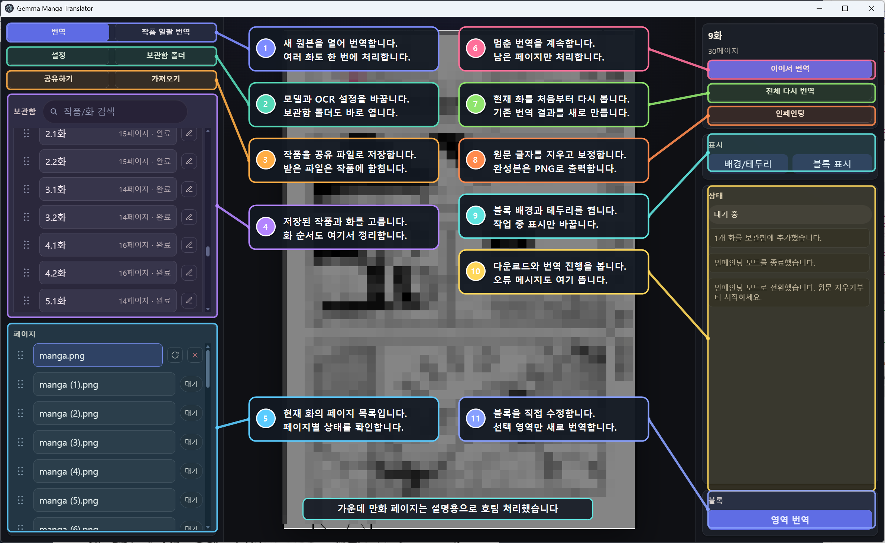
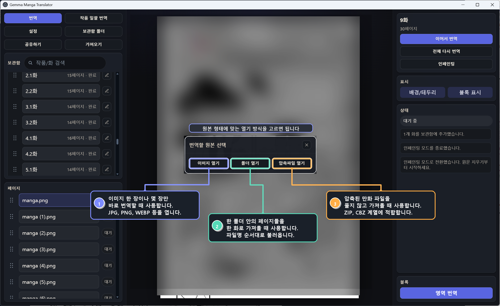
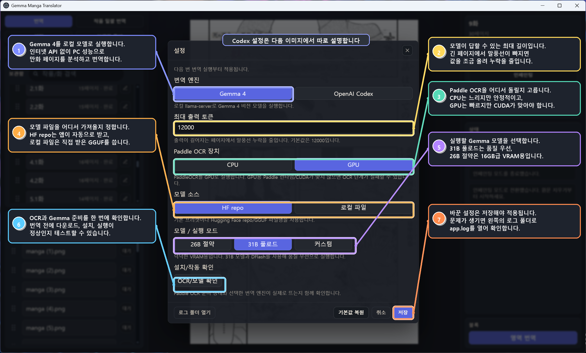
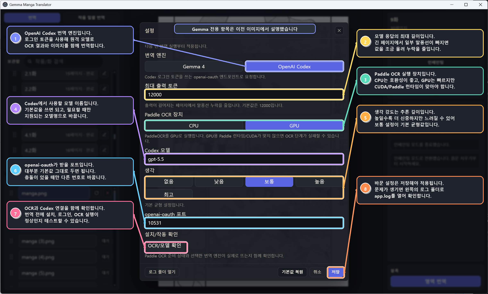
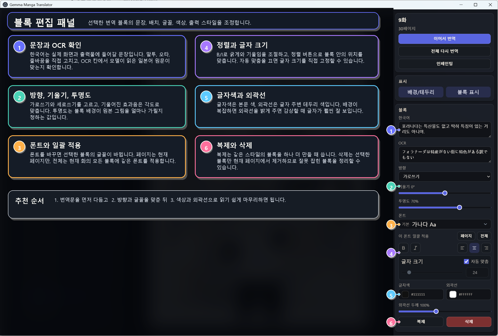
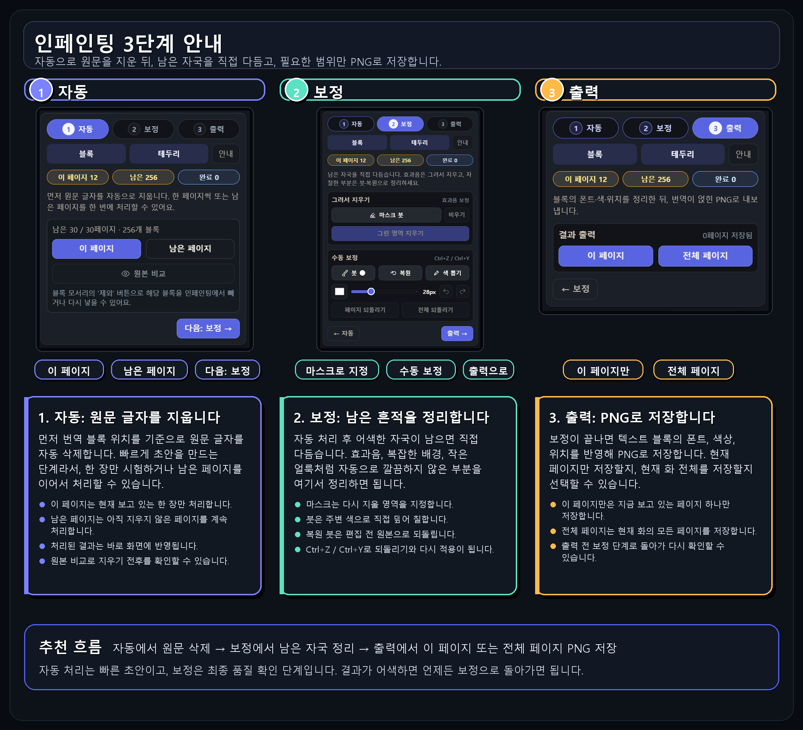
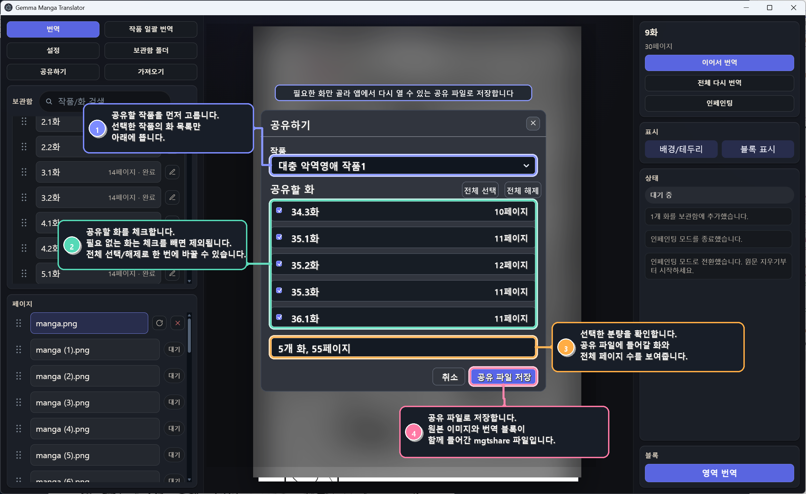
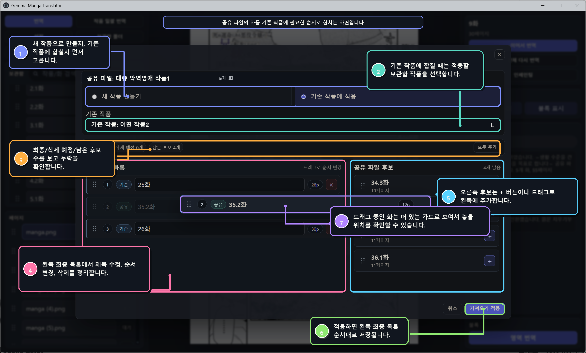

# 당근 만화 번역기

일본어 만화 이미지를 한국어로 번역하고, 번역 블록 편집, 원문 지우기, PNG 출력까지 한 앱에서 처리하는 **Windows 데스크톱 만화 번역 도구**입니다.

원본을 불러오고, OCR과 AI 번역으로 말풍선/효과음 후보를 만들고, 필요한 만큼 직접 손본 뒤 Flux 인페인팅으로 원문을 지우는 흐름을 한 화면에서 끝내는 것을 목표로 합니다.



## 주요 기능

- 이미지 한 장, 이미지 폴더, ZIP/CBZ 압축파일을 작품/화 단위로 보관합니다.
- 여러 화를 한 번에 가져오고 이어서 번역할 수 있습니다.
- `Gemma 4` 로컬 모델 또는 `OpenAI Codex` 엔진으로 번역합니다.
- Paddle OCR 선분석 결과를 AI 번역 엔진에 전달해 한국어 번역 블록을 만듭니다.
- 번역문, OCR 원문, 위치, 크기, 방향, 기울기, 폰트, 색상, 외곽선을 직접 수정합니다.
- 페이지 일부만 다시 분석하는 영역 번역을 지원합니다.
- Flux 인페인팅으로 원문 글자를 지우고, 마스크 붓/색 붓/복원 붓으로 보정합니다.
- 완성 페이지를 PNG로 출력합니다.
- `*.mgtshare` 공유 파일로 작품 데이터를 내보내고 가져옵니다.

## 설치

일반 사용자는 GitHub Releases에서 Windows 설치 파일을 받으면 됩니다.

- 다운로드: https://github.com/ucx0204/Gemma4MangaTranslatorForKorean/releases
- 설치 파일 예시: `당근 만화 번역기 Setup 0.5.1.exe`

현재 설치 파일은 얇은 설치 파일을 지향합니다. 앱 본체와 기본 실행 파일만 먼저 설치하고, Gemma 모델, OCR 런타임, Flux 모델/런타임처럼 큰 파일은 처음 사용할 때 앱 데이터 폴더로 내려받습니다.

C드라이브 용량이 부족하면 설치 또는 데이터 저장 위치를 여유 있는 드라이브로 잡는 것을 권장합니다.

## 처음 실행할 때

처음 번역하거나 처음 인페인팅을 실행하면 필요한 파일을 다운로드하고 검증합니다. 이 과정은 PC 성능과 인터넷 속도에 따라 꽤 오래 걸릴 수 있습니다.

- Gemma 4: GGUF 모델, mmproj, llama.cpp/beellama/Lemonade ROCm 런타임
- Paddle OCR: Python 런타임, PaddleOCR/PaddleOCR-VL 또는 AMD ROCm Transformers OCR 패키지, OCR 모델 캐시
- Flux 인페인팅: Flux Klein 모델, VAE, Flux 실행기, GPU 백엔드 준비
- OpenAI Codex: 로컬 Codex 로그인 토큰을 사용하는 openai-oauth 연결

다운로드 진행률을 알 수 있는 파일은 받은 용량 기준으로 표시합니다. pip 설치나 런타임 검증처럼 정확한 퍼센트를 알 수 없는 구간은 로그 중심으로 표시합니다.

## 빠른 시작

1. 앱을 실행합니다.
2. `설정`에서 번역 엔진과 하드웨어 런타임을 확인합니다.
3. `OCR/모델 확인`을 눌러 OCR과 선택한 번역 엔진이 실제로 준비되는지 테스트합니다.
4. `번역`을 눌러 이미지, 폴더, 압축파일 중 하나를 엽니다.
5. 보관함에 추가된 화를 선택합니다.
6. `이어서 번역` 또는 `전체 다시 번역`을 실행합니다.
7. 번역 블록을 눌러 문장, 폰트, 색상, 위치를 조정합니다.
8. 원문까지 지우려면 `인페인팅`으로 들어갑니다.
9. 자동 지우기, 보정, 출력 순서로 PNG를 저장합니다.

## 하드웨어 지원

앱은 처음 실행할 때 GPU를 감지해 기본 설정을 고릅니다. 나중에 `설정`에서 바꿀 수 있습니다.

| 환경                | Gemma 4 번역                     | Paddle OCR            | Flux 인페인팅                   |
| ------------------- | -------------------------------- | --------------------- | ------------------------------- |
| NVIDIA RTX 20/30/40 | CUDA 12 계열 llama 런타임        | CUDA `cu126`          | CUDA native                     |
| NVIDIA RTX 50       | CUDA 13 계열 llama 런타임        | CUDA `cu129`          | CUDA native                     |
| AMD Radeon/Instinct | ROCm 런타임 우선, 필요 시 Vulkan | ROCm Transformers OCR | ZLUDA native                    |
| GPU 미확인/부족     | Codex 기본, Gemma 후보는 12B     | CPU OCR               | CPU 또는 사용자가 선택한 백엔드 |

VRAM 기준 기본 프리셋은 대략 아래처럼 잡습니다.

- 24GB 이상: `Gemma 4` + `31B 풀로드`
- 16GB 이상: `Gemma 4` + `26B 절약`
- 8GB 이상: `Gemma 4` + `12B 최소`
- GPU 정보를 확실히 알 수 없거나 8GB 미만: `OpenAI Codex` + CPU OCR

## AMD 지원

AMD 지원은 이제 번역, OCR, 인페인팅이 각각 다른 경로로 준비됩니다. 한 곳이 실패해도 나머지를 CPU나 다른 런타임으로 돌릴 수 있게 분리되어 있습니다.

### Gemma 4 on AMD

지원되는 AMD GPU에서는 `AMD ROCm` Gemma 런타임을 우선 사용합니다. 앱은 GPU 이름, `rocm-smi`, Windows 장치 정보를 보고 ROCm target을 추정합니다.

지원 target 그룹은 다음과 같습니다.

- `gfx908`
- `gfx90a`
- `gfx103X`
- `gfx110X`
- `gfx1150`
- `gfx1151`
- `gfx120X`

ROCm target을 알 수 있으면 `lemonade-llama-b1291-rocm-<target>` 런타임을 앱 데이터의 `tools/` 아래로 내려받아 사용합니다. target을 못 잡는 AMD GPU에서는 `AMD Vulkan` llama.cpp 런타임을 예비 경로로 쓸 수 있습니다.

자동 감지가 틀리면 고급 사용자는 환경 변수로 target을 지정할 수 있습니다.

```powershell
$env:MANGA_TRANSLATOR_AMD_ROCM_TARGET = "gfx110X"
```

### AMD OCR GPU

기본값은 `float16`이고, 지원 GPU/드라이버가 맞지 않거나 첫 import 검증이 실패하면 OCR 장치만 `CPU`로 바꿔도 번역은 계속 사용할 수 있습니다. 번역 모델은 AMD ROCm/Vulkan으로 두고 OCR만 CPU로 쓰는 조합도 가능합니다.

### AMD ZLUDA 인페인팅

AMD에서 `AMD ZLUDA` 인페인팅을 쓰려면 AMD HIP SDK가 필요합니다. AMD 공식 HIP SDK 페이지에서 Windows용 최신 버전인 **ROCm 7.1.1 HIP SDK**를 설치하세요.

- 다운로드: https://www.amd.com/en/developer/resources/rocm-hub/hip-sdk.html

설치 후 앱을 다시 실행하고 `Flux 인페인팅 백엔드`를 `AMD ZLUDA`로 둔 뒤 인페인팅을 실행하면 됩니다. ZLUDA가 계속 실패하면 작업을 이어가기 위해 백엔드를 `CPU`로 바꿔 확인하세요.

## 화면 구성

메인 화면은 크게 다섯 영역입니다.

- 왼쪽 위: 번역, 일괄 번역, 설정, 공유/가져오기 버튼
- 왼쪽 중간: 보관함의 작품과 화 목록
- 왼쪽 아래: 현재 화의 페이지 목록
- 가운데: 현재 페이지 이미지와 번역 블록
- 오른쪽: 작업 버튼, 표시 옵션, 상태 로그, 블록 편집 패널

가운데 이미지 영역에서는 마우스 휠로 페이지를 넘길 수 있고, 번역 블록을 클릭하면 오른쪽 패널에서 바로 수정할 수 있습니다.

## 원본 불러오기

`번역` 버튼을 누르면 원본 선택 창이 뜹니다.



- `이미지 열기`: 한 장짜리 이미지 파일을 불러옵니다.
- `폴더 열기`: 폴더 안의 여러 이미지를 한 화로 불러옵니다.
- `압축파일 열기`: ZIP/CBZ 같은 압축 파일을 풀지 않고 한 화로 불러옵니다.

폴더나 압축파일을 불러오면 페이지 순서대로 보관함에 저장됩니다. 파일명이 `001.jpg`, `002.jpg`처럼 정렬 가능한 형태면 가장 안정적입니다.

## 작품 일괄 번역

`작품 일괄 번역`은 여러 화를 한 번에 추가하고 번역할 때 쓰는 기능입니다.

예를 들어 폴더 안에 여러 압축파일이 있거나, 여러 하위 폴더가 각각 한 화라면 이 기능으로 한 번에 보관함에 넣을 수 있습니다. 체크한 화만 생성되며, 적용 전에 화 제목을 바꿀 수 있습니다.

일괄 번역 중에는 한 화 단위로 Paddle OCR 선분석을 먼저 돌고, 그 다음 AI 번역 단계로 넘어갑니다. Gemma와 Paddle OCR이 동시에 VRAM을 잡아먹지 않도록 순서를 분리해 처리합니다.

## 설정

설정은 저장한 뒤 다음 작업부터 적용됩니다. `OCR/모델 확인`을 누르면 선택한 조합이 실제로 준비되는지 확인할 수 있습니다.

### Gemma 4

Gemma 4는 내 PC에서 로컬 모델 서버를 실행하는 방식입니다.



- `최대 출력 토큰`: 긴 페이지에서 말풍선 누락을 줄이기 위한 출력 한도입니다.
- `모델 소스`: 기본 Hugging Face repo 또는 직접 받은 로컬 GGUF 파일을 고릅니다.
- `모델 / 실행 모드`: `12B 최소`, `26B 절약`, `31B 풀로드`, `커스텀` 중 하나를 고릅니다.
- `Gemma GPU 런타임`: NVIDIA CUDA 12, RTX 50, AMD Vulkan, AMD ROCm 중 하드웨어에 맞는 런타임을 고릅니다.
- `Paddle OCR 장치`: NVIDIA CUDA, AMD ROCm, CPU 중에서 고릅니다.
- `Flux 인페인팅 백엔드`: NVIDIA CUDA, AMD ZLUDA, CPU 중에서 고릅니다.

감지된 AMD GPU에서는 CUDA/RTX 런타임이 비활성화되고 ROCm/Vulkan/ZLUDA 계열만 선택할 수 있습니다. 감지된 NVIDIA GPU에서는 ROCm/Vulkan/ZLUDA 대신 CUDA 계열을 사용합니다.

### OpenAI Codex

OpenAI Codex는 OpenAI 계정의 Codex 로그인 정보를 사용해 번역 요청을 보내는 방식입니다. 고성능 로컬 GPU가 없어도 사용할 수 있습니다.



- `Codex 모델`: 사용할 모델 이름입니다.
- `생각`: 모델이 답을 만들기 전에 더 검토할 정도입니다.
- `openai-oauth 포트`: Codex 로그인 토큰을 요청하는 로컬 포트입니다.
- `OCR/모델 확인`: Paddle OCR과 Codex 엔진 연결을 함께 확인합니다.

Codex 엔진은 앱에 API 키를 붙여 넣는 방식이 아닙니다. Windows 사용자 계정에 저장된 Codex CLI 로그인 정보를 사용합니다.

```powershell
npm i -g @openai/codex
codex --login
```

전역 설치가 싫다면 아래처럼 한 번만 실행할 수도 있습니다.

```powershell
npx @openai/codex --login
```

로그인 후 앱 설정에서 `OpenAI Codex`를 선택하고 `OCR/모델 확인`을 누르세요.

## 번역 블록 편집

번역이 끝난 뒤 가운데 페이지의 블록을 클릭하면 오른쪽 `블록` 패널에서 내용을 수정할 수 있습니다.



자주 쓰는 항목은 다음과 같습니다.

- `한국어`: 화면과 PNG 출력에 표시되는 번역문입니다.
- `OCR`: 모델이 읽은 원문입니다.
- `방향`: 가로쓰기 또는 세로쓰기를 고릅니다.
- `기울기`: 효과음이나 기울어진 글자에 맞춰 각도를 조절합니다.
- `투명도`: 블록 배경의 투명도를 조절합니다.
- `폰트`: 기본 폰트, 포함 폰트, 직접 추가한 폰트를 선택합니다.
- `이 폰트 일괄 적용`: 현재 페이지 또는 현재 화 전체의 블록에 같은 폰트를 적용합니다.
- `글자 크기`: 자동 맞춤을 끄고 직접 조절할 수 있습니다.
- `글자색`, `외곽선`, `외곽선 두께`: 배경에 따라 읽기 쉽게 조절합니다.
- `복제`, `삭제`: 선택한 블록을 복제하거나 제거합니다.

번역 중인 작업이 있어도 이미 완료된 페이지는 수정할 수 있습니다. 다만 같은 페이지가 다시 저장되는 순간과 겹치면 충돌이 생길 수 있으므로, 수정 직후 페이지 이동이나 저장 상태를 확인하는 것이 좋습니다.

## 영역 번역

오른쪽 `블록` 패널 아래의 `영역 번역`은 페이지 일부만 다시 분석할 때 씁니다.

1. `영역 번역`을 누릅니다.
2. 가운데 페이지에서 번역하고 싶은 영역을 드래그합니다.
3. 선택 영역 안에서 모델이 텍스트 그룹을 다시 찾고 블록을 만듭니다.

말풍선 하나만 다시 만들거나, 자동 번역이 놓친 작은 구역을 보강할 때 유용합니다.

## 인페인팅

인페인팅은 원문 글자를 지우고 PNG로 저장하기 위한 별도 작업 모드입니다.



### 1. 자동

번역 블록 위치를 기준으로 원문 글자를 먼저 지웁니다.

- `이 페이지`: 현재 보고 있는 한 페이지만 처리합니다.
- `남은 페이지`: 아직 지우지 않은 페이지를 이어서 처리합니다.
- 처리된 페이지는 바로 화면에 반영됩니다.
- 자동 결과가 어색하면 `원본 비교`로 확인합니다.

### 2. 보정

자동으로 지운 뒤 남은 자국을 직접 다듬습니다.

- `마스크 붓`: 다시 인페인팅할 영역을 지정합니다.
- `그린 영역 지우기`: 마스크로 칠한 부분만 다시 지웁니다.
- `붓`: 주변 색으로 직접 덮어 칠합니다.
- `색 뽑기`: 페이지에서 색을 찍어 붓 색으로 씁니다.
- `복원 붓`: 편집 전 원본 상태로 되돌립니다.
- `Ctrl+Z`, `Ctrl+Y`: 수동 보정을 되돌리거나 다시 적용합니다.

### 3. 출력

인페인팅과 보정이 끝난 뒤 PNG를 저장합니다.

- `이 페이지`: 현재 보고 있는 페이지 하나만 출력합니다.
- `전체 페이지`: 현재 화의 모든 페이지를 출력합니다.

출력 PNG에는 텍스트 블록의 폰트, 색상, 위치, 방향, 기울기 설정이 반영됩니다.

## 공유하기와 가져오기

`공유하기`는 완성 이미지를 내보내는 기능이 아니라, 앱에서 다시 열 수 있는 작품 데이터 패키지를 만드는 기능입니다.



- 공유 파일 확장자는 `*.mgtshare`입니다.
- 선택한 작품과 화만 포함합니다.
- 원본 페이지 이미지, 번역 블록, 좌표, 폰트/색상 같은 스타일 정보가 포함됩니다.
- 설정, 로그인 정보, 모델 파일, 로그, 임시 분석 파일은 포함하지 않습니다.

다른 사람이 보낸 `*.mgtshare` 파일은 `가져오기`로 열 수 있습니다.



- `새 작품 만들기`: 공유 파일을 새 작품으로 추가합니다.
- `기존 작품에 적용`: 기존 작품에 공유받은 화를 추가하거나, 순서를 바꾸거나, 일부 화를 교체합니다.

공유 파일에는 원본 페이지 이미지가 들어갈 수 있습니다. 저작권이 있는 작품을 다른 사람에게 배포할 때는 주의해야 합니다.

## 저장 위치

설치형 앱은 앱 파일과 사용자 데이터를 분리해 관리합니다. 보관함, 로그, 모델, OCR 런타임, 인페인팅 모델은 앱 데이터 저장 위치 아래에 들어갑니다.

일반적인 데이터 구조는 다음과 같습니다.

```text
data/
  settings.json
  library/
  logs/
  fonts/
  hf-cache/
  llama.cpp/
  ocr-runtime/
  models/
  tmp/
```

- `settings.json`: 앱 설정입니다.
- `library/`: 작품, 화, 페이지, 번역 블록 데이터입니다.
- `logs/`: 오류 확인용 로그입니다.
- `fonts/`: 사용자가 추가한 폰트입니다.
- `hf-cache/`: Hugging Face 모델 다운로드 캐시입니다.
- `llama.cpp/`: Gemma 실행 캐시입니다.
- `ocr-runtime/`: Paddle OCR Python 런타임과 OCR 모델 캐시입니다.
- `models/`: Flux 인페인팅 모델과 런타임 캐시입니다.
- `tmp/`: 출력 렌더링, 인페인팅, 모델 테스트 같은 임시 작업 파일입니다.

앱을 제거할 때는 언인스톨러에서 작품 데이터와 모델/OCR 캐시 삭제 옵션을 따로 선택할 수 있습니다.

## 자주 묻는 질문

### 번역이 너무 느립니다.

처음 실행이면 모델과 런타임을 받는 시간이 포함되어 느릴 수 있습니다. 이미 다운로드가 끝난 뒤에도 느리다면 VRAM에 맞춰 `12B 최소`, `26B 절약`, `31B 풀로드` 중 더 가벼운 모드를 고르거나 OCR 장치를 CPU/GPU로 바꿔 테스트해 보세요.

### AMD에서 Gemma가 시작되지 않습니다.

`OCR/모델 확인`을 먼저 실행하고 로그를 확인하세요. ROCm target을 못 잡는 경우 `MANGA_TRANSLATOR_AMD_ROCM_TARGET=gfx110X`처럼 target을 직접 지정할 수 있습니다. 그래도 실패하면 `Gemma GPU 런타임`을 `AMD Vulkan`으로 바꿔 확인하세요.

### AMD OCR GPU가 실패합니다.

AMD OCR GPU는 Windows ROCm PyTorch 2.9.1/ROCm 7.2.1이 지원하는 GPU와 드라이버가 필요합니다. 첫 import 검증이 오래 걸릴 수 있지만 반복해서 실패하면 설정에서 `Paddle OCR 장치`만 `CPU`로 바꾸면 됩니다.

### AMD ZLUDA 인페인팅이 실패합니다.

AMD 공식 HIP SDK 페이지에서 Windows용 최신 버전인 **ROCm 7.1.1 HIP SDK**를 설치한 뒤 앱을 다시 실행하세요: https://www.amd.com/en/developer/resources/rocm-hub/hip-sdk.html

당장 작업을 이어가야 하면 `Flux 인페인팅 백엔드`를 `CPU`로 바꿔 확인하세요.

### RTX 50번대에서 OCR이 실패합니다.

RTX 50번대는 CUDA/Paddle 조합이 민감합니다. 앱은 RTX 50번대용 `cu129` OCR 런타임을 사용하도록 처리하지만, 드라이버 상태에 따라 GPU OCR이 실패할 수 있습니다. 이 경우 설정에서 `Paddle OCR 장치`를 CPU로 바꿔도 번역은 계속 사용할 수 있습니다.

### Codex 연결이 안 됩니다.

PowerShell에서 `codex --login`을 다시 실행하고, 설정에서 `OpenAI Codex`를 선택한 뒤 `OCR/모델 확인`을 누르세요. 포트 충돌이 의심되면 `openai-oauth 포트` 값을 바꿔 저장하면 됩니다.

### 출력 PNG에 텍스트가 다르게 보입니다.

앱 화면과 PNG 출력은 같은 렌더링 규칙을 맞추도록 되어 있지만, 폰트 파일이 없거나 블록 방향/기울기/자동 맞춤 설정이 다르면 차이가 날 수 있습니다. 출력 전 보정 단계에서 페이지를 확인하고, 필요하면 폰트를 일괄 적용해 주세요.

### 빈 페이지인데 번역 블록이 생깁니다.

Paddle OCR에서 일본어 텍스트 근거가 없으면 모델 호출을 생략하도록 되어 있습니다. 그래도 블록이 생긴다면 해당 페이지가 예전 버전에서 분석된 결과일 수 있으니 `전체 다시 번역`으로 새로 분석해 보세요.

## 문제를 보고할 때

오류를 제보할 때는 아래 정보를 같이 주면 원인 파악이 빨라집니다.

- 앱 버전
- Windows 버전
- GPU 모델과 VRAM
- 선택한 번역 엔진: Gemma 4 또는 OpenAI Codex
- Gemma라면 모델 프리셋과 Gemma GPU 런타임
- Paddle OCR 장치: NVIDIA CUDA, AMD ROCm, CPU
- Flux 인페인팅 백엔드: NVIDIA CUDA, AMD ZLUDA, CPU
- 문제가 난 페이지 이미지 또는 재현 가능한 작품/화
- `로그 폴더 열기`에서 나온 `app.log`

로그에는 로컬 경로가 들어갈 수 있습니다. 공개 게시판에 올릴 때는 사용자 이름이나 민감한 경로를 가리고 올리는 것을 권장합니다.

## 개발자 메모

아래 내용은 앱을 직접 수정하거나 빌드하려는 사람을 위한 내용입니다.

### 개발 환경

- Windows
- Node.js LTS
- npm
- Git

### 설치와 실행

```powershell
npm install
npm run dev
```

개발 실행은 프로젝트 내부의 `.tmp/electron-dev`를 Electron userData/session 위치로 사용합니다. 개발 중 Chromium 캐시가 꼬이면 `.tmp/electron-dev`를 삭제하고 다시 실행하면 됩니다.

### 검사

```powershell
npm run typecheck
npm test
```

가능하면 아래 전체 검사를 통과시키는 것을 권장합니다.

```powershell
npm run check
```

### 빌드

```powershell
npm run build
npm run dist:win
```

`dist:win`, `dist:win:nvidia`, `dist:win:amd`는 현재 모두 얇은 Windows NSIS 설치 파일 경로를 사용합니다. 설치 파일은 `dist/` 아래에 생성됩니다.

### 주요 스크립트

- `npm run dev`: Vite + Electron 개발 실행
- `npm run build`: renderer/main/preload 빌드
- `npm run dist:win`: Windows NSIS 설치 파일 생성
- `npm run typecheck`: TypeScript 타입 검사
- `npm run typecheck:js`: JS 런타임 파일 타입 검사
- `npm run lint`: ESLint 실행
- `npm run deadcode`: knip 기반 죽은 코드 검사
- `npm test`: Vitest 실행
- `npm run smoke:overlay`: 번역 오버레이 스모크 테스트
- `npm run perf:gemma-economy`: Gemma 절약 모드 성능 벤치
- `npm run build:flux-rocm-runtime`: Flux ROCm prebuilt 런타임 ZIP 빌드

### 코드 구조

```text
src/
  main/       Electron main, IPC, 보관함 저장, 런타임 준비, 번역/인페인팅 파이프라인
  preload/    renderer에 노출되는 안전한 API
  renderer/   React UI
  shared/     공용 타입, IPC schema, 모델 preset
docs/images/  README용 안내 이미지
scripts/      빌드, 개발 실행, 스모크 테스트, 런타임 준비 스크립트
tools/         ffmpeg, Flux runner, 개발용 네이티브 도구
```

### 런타임 관련 메모

- Gemma 번역은 `src/main/runtime/simple-page-*.cjs` 계열에서 처리합니다.
- Gemma CUDA/ROCm/Vulkan 런타임 선택은 `simple-page-runtime-paths.cjs`, `simple-page-llama-runtimes.cjs`, `simple-page-amd-rocm-target.cjs`에서 관리합니다.
- OCR 런타임은 `ocr-runtime` 아래에 variant별로 격리됩니다.
- NVIDIA OCR GPU는 PaddlePaddle CUDA + PaddleOCR/PaddleOCR-VL 경로를 씁니다.
- AMD OCR GPU는 `gpu-rocm-transformers` variant이며 PyTorch ROCm + PaddleOCR Transformers engine을 씁니다.
- Flux 인페인팅은 `src/main/inpainting`과 `src/main/inpainting/fluxAssets` 아래에서 관리합니다.
- AMD ZLUDA Flux를 확인할 때는 AMD HIP SDK 7.1.1 설치 상태를 먼저 봅니다.
- 설치형 앱에서는 패키지 외부 런타임 override가 기본 차단되며, AMD ROCm target override만 허용됩니다.

릴리즈 전에는 최소한 아래를 확인하는 것을 권장합니다.

```powershell
npm run typecheck
npm test
npm run build
```

UI나 렌더링을 크게 바꿨다면 실제 앱에서 이미지/폴더/압축파일 번역, Gemma/Codex 모델 확인, 인페인팅 자동/보정/출력, 공유하기/가져오기를 함께 확인하세요.

## 라이선스

MIT License입니다. 자세한 내용은 [LICENSE](LICENSE)를 확인하세요.
