<p align="center">
  
</p>

# 당근망가번역기

일본어 만화 이미지를 한국어로 번역하고, 번역 블록 편집, 원문 지우기, PNG 출력까지 한 앱에서 처리하는 **Windows 데스크톱 만화 번역 도구**입니다.

원본 이미지를 불러오면 OCR과 AI 번역으로 말풍선/효과음 후보를 만들고, 사용자가 문장과 위치를 손본 뒤 Flux 인페인팅으로 원문을 지우고 PNG로 저장할 수 있습니다.

README의 예시 화면은 주로 **AMD PRO V710 환경**에서 촬영했습니다. NVIDIA 환경은 보통 더 좋은 조건에서 실행하는 경우가 많아서, 설정과 런타임 안내는 AMD 사용자가 헷갈릴 수 있는 부분을 조금 더 자세히 보여주는 방향으로 구성했습니다.

일부 스크린샷에는 빨간 설명 문구와 화살표가 들어가 있습니다. 실제 앱 화면에 항상 표시되는 글자가 아니라, README에서 버튼 위치와 작업 흐름을 설명하기 위해 덧붙인 주석입니다.

## 주요 기능

- 이미지 한 장, 이미지 폴더, ZIP/CBZ 압축파일을 작품/화 단위로 보관합니다.
- 여러 화를 한 번에 가져오고 이어서 번역할 수 있습니다.
- `Gemma 4` 로컬 모델, `OpenAI Codex`, OpenAI 호환 `API` 엔진으로 번역합니다.
- Paddle OCR 선분석 결과를 AI 번역 엔진에 전달해 번역 블록을 만듭니다.
- 기본은 일본어 → 한국어이며, 설정의 `번역 언어`에서 영어/중국어/프랑스어 등 다른 원문·번역 언어쌍을 고를 수 있습니다.
- 번역 시작 전에 작품/화/페이지를 직접 고르고, 이미 편집한 페이지는 `기존 블록 유지`로 영역과 서식을 보존한 채 텍스트만 다시 채울 수 있습니다.
- 번역문, OCR 원문, 위치, 크기, 방향, 기울기, 폰트, 색상, 외곽선, 줄 간격, 자간을 직접 수정합니다.
- 새 블록 기본 서식을 설정하고, 선택 블록의 서식을 여러 블록에 한 번에 적용합니다.
- 작업 영역 도구 모음으로 선택, 새 블록 추가, 손바닥 이동 모드를 바꾸고, 블록 편집기를 앱 안에 띄우거나 별도 창으로 분리할 수 있습니다.
- 현재 페이지 또는 전체 화의 번역문/OCR 원문을 `텍스트 모아보기`로 확인하고 검색, 복사, TXT 불러오기/저장, CSV/TSV 검수표 내보내기/가져오기를 할 수 있습니다.
- AI 자동 분석으로 용어집, 캐릭터, 번역 규칙, 스토리 메모리를 만들고 번역에 반영합니다.
- 페이지 일부만 다시 분석하는 영역 번역을 지원하고, 영역 번역에도 현재 페이지 OCR과 작품 기억을 참고시킵니다.
- AOT/LaMa/Flux 인페인팅으로 원문 글자를 지우고, 마스크 붓/색 붓/복원 붓으로 보정합니다.
- 완성 페이지를 PNG로 출력합니다.
- `*.mgtshare` 공유 파일로 작품 데이터를 내보내고 가져옵니다.
- 보관함 검색/정렬, 작품/화 이름 변경, 페이지/화 순서 드래그 정리를 지원합니다.
- 자주 쓰는 보기/번역/인페인팅/블록 편집/작업 도구 단축키를 설정에서 바꿀 수 있습니다.

## v0.9.3에서 달라진 점

v0.9.3은 v0.9.2 이후 RTX 50 / CUDA 13 계열 BeeLlama 런타임 ZIP 설치 실패를 바로잡은 패치 릴리즈입니다.

- BeeLlama CUDA 13.1 런타임 ZIP을 풀 때 PowerShell `Expand-Archive` 오류가 조용히 지나가던 문제를 막도록 `-ErrorAction Stop` 처리를 추가했습니다.
- `Expand-Archive`가 실패하면 Windows 기본 `tar.exe`로 한 번 더 풀어, PowerShell ZIP 해제 호환성 문제로 런타임 폴더가 비는 상황을 줄였습니다.
- `tar.exe` fallback 전에 ZIP 항목 경로를 검사해 임시 폴더 밖으로 풀릴 수 있는 안전하지 않은 경로를 차단합니다.
- 런타임 파일 선택 결과가 0개일 때 실제 해제 시도 로그, 사용한 해제 도구, 최상위 추출 항목을 에러 detail에 남겨 원인을 확인하기 쉽게 했습니다.
- `No runtime files matched`가 파일명 필터 문제처럼만 보이던 상황을 줄이고, ZIP 해제 실패와 후속 검증 실패를 구분할 수 있게 했습니다.

자세한 패치노트는 [docs/release-notes/v0.9.3.md](docs/release-notes/v0.9.3.md)를 확인하세요.

## 설치

일반 사용자는 GitHub Releases에서 Windows 설치 파일을 받으면 됩니다.

- 다운로드: https://github.com/ucx0204/CarrotMangaTranslator/releases
- 설치 파일 예시: `당근망가번역기 Setup 0.9.3.exe`

설치 첫 단계에서는 현재 Windows 사용자만 쓸지, 모든 사용자에게 설치할지 고릅니다. 잘 모르겠으면 기본값인 현재 사용자 설치를 그대로 두면 됩니다.

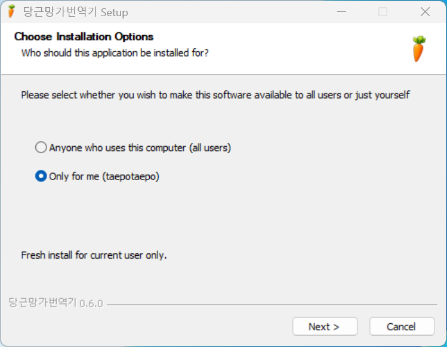

다음으로 앱 설치 폴더를 고릅니다. C드라이브가 부족하면 D드라이브 같은 여유 있는 드라이브를 선택해도 됩니다.

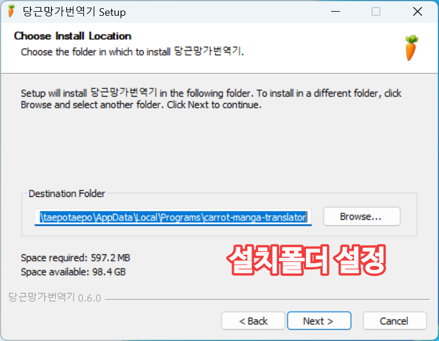

모델, Paddle OCR, 보관함, 로그처럼 용량이 커질 수 있는 데이터 저장 위치도 지정할 수 있습니다. 새 설치에서는 설치 폴더 안의 `data` 폴더를 기본으로 쓰며, 기존 데이터가 있다면 찾아보기로 해당 폴더를 선택할 수 있습니다.

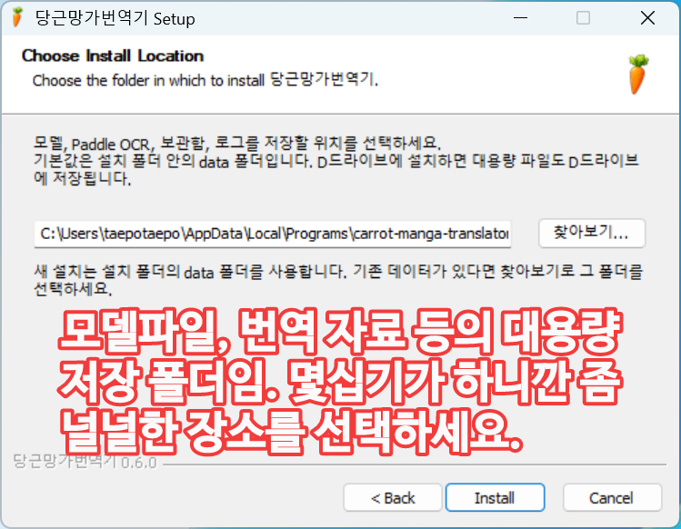

현재 설치 파일은 얇은 설치 파일을 지향합니다. 앱 본체와 기본 실행 파일만 먼저 설치하고, Gemma 모델, OCR 런타임, Flux 모델/런타임처럼 큰 파일은 처음 사용할 때 앱 데이터 폴더로 내려받습니다.

## 처음 실행

처음 실행하면 보관함이 비어 있고, 가운데에는 시작 안내가 보입니다. 한 화만 바로 번역하려면 `번역`, 여러 화를 한 번에 넣고 싶다면 `작품 일괄 번역`, 이미 받은 공유 파일을 열고 싶다면 `공유본 가져오기`를 사용합니다.

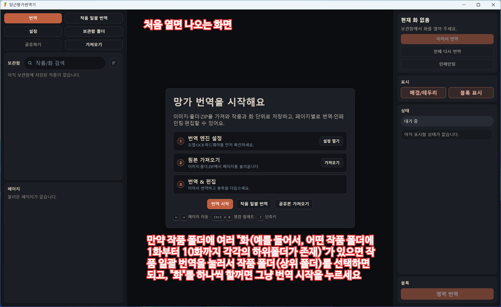

처음에는 모델과 OCR 런타임이 아직 없을 수 있습니다. 실제 번역이나 인페인팅을 시작하면 필요한 파일을 앱 데이터 폴더에 내려받고, 이후부터는 캐시된 파일을 다시 사용합니다.

## OpenAI Codex 엔진 준비

번역 엔진을 `OpenAI Codex`로 고르려면, 앱을 쓰기 전에 Windows에 Codex CLI 로그인이 되어 있어야 합니다.

이 앱은 OpenAI API 키를 직접 입력받지 않습니다. 대신 내 PC에서 Codex CLI가 로그인해 둔 정보를 이용해 `openai-oauth` 로컬 엔드포인트를 열고, 그 엔드포인트로 번역 요청을 보냅니다. 그래서 `OpenAI Codex`를 쓰려면 먼저 Codex CLI 설치와 로그인을 끝내야 합니다.

먼저 PowerShell을 열고 OpenAI 공식 Windows 설치 명령을 실행하세요.

```powershell
powershell -ExecutionPolicy ByPass -c "irm https://chatgpt.com/codex/install.ps1 | iex"
```

설치가 끝나면 PowerShell 창을 닫았다가 새로 열고 아래 명령을 실행합니다.

```powershell
codex
```

처음 실행하면 로그인 안내가 뜹니다. 브라우저가 열리면 ChatGPT/OpenAI 계정으로 로그인하고, PowerShell에서 Codex 화면이 정상적으로 뜨는지 확인하세요.

그 다음 앱으로 돌아와서 아래 순서대로 확인합니다.

1. `설정`을 엽니다.
2. `번역 엔진`에서 `OpenAI Codex`를 선택합니다.
3. `Codex 모델`, `생각`, `openai-oauth 포트`는 잘 모르면 기본값을 둡니다.
4. `OCR/모델 확인`을 눌러 Paddle OCR과 Codex 엔드포인트가 같이 준비되는지 확인합니다.
5. 문제가 없으면 `저장`을 누릅니다.

Codex를 쓰더라도 Paddle OCR은 필요합니다. 앱은 먼저 OCR로 페이지의 글자 위치를 잡고, 그 결과와 이미지를 Codex에 보내 번역 블록을 만들기 때문입니다.

이미 Node.js와 npm을 쓰는 개발자라면 npm 설치 방식도 사용할 수 있습니다. 이 방식은 Node.js/npm이 이미 설치된 사람에게만 권장합니다.

```powershell
npm install -g @openai/codex
```

설치 후에는 똑같이 PowerShell에서 `codex`를 실행해 로그인 상태를 확인하면 됩니다.

자주 막히는 경우는 아래와 같습니다.

- `npm` 명령이 없다고 나옴: 일반 사용자라면 npm 방식이 아니라 위의 PowerShell 설치 명령을 쓰세요.
- `codex` 명령이 없다고 나옴: 설치 후 PowerShell을 새로 열었는지 확인하고, 그래도 안 되면 설치 명령을 다시 실행하세요.
- 브라우저 로그인은 됐는데 앱에서 실패함: 앱 설정의 `openai-oauth 포트`가 다른 프로그램과 충돌할 수 있습니다. 포트를 바꿔 저장한 뒤 다시 확인하세요.
- OCR 확인에서 실패함: Codex 문제가 아니라 Paddle OCR 준비 문제일 수 있습니다. 이 경우 설정에서 `Paddle OCR 장치`를 CPU로 바꿔 다시 확인해 보세요.

공식 안내: [OpenAI Codex Quickstart](https://developers.openai.com/codex/quickstart)

## API 엔진 준비

번역 엔진을 `API`로 고르면 OpenAI 호환 `/chat/completions` 엔드포인트로 직접 요청합니다. Codex CLI 로그인이나 `openai-oauth` 실행은 필요하지 않습니다.

설정에서 `API Base URL`, `API 모델`, `API 키`를 입력합니다. Base URL은 보통 `https://api.openai.com/v1` 또는 `https://integrate.api.nvidia.com/v1`처럼 `/v1`까지 넣으면 되고, 앱이 실제 요청할 때는 `/chat/completions`를 붙여 호출합니다. 사용자가 실수로 `/chat/completions`까지 넣어도 저장 시 Base URL 형태로 정리됩니다.

API 키가 필요한 서비스는 키를 입력해야 합니다. LM Studio처럼 로컬 OpenAI 호환 서버를 쓰는 경우에는 API 키를 비워 둘 수 있습니다. OpenAI 공식 엔드포인트를 쓰면서 앱 설정에 키를 저장하고 싶지 않다면 `OPENAI_API_KEY` 환경 변수를 사용할 수 있고, 다른 호환 서버는 `MANGA_TRANSLATOR_API_BASE_URL`, `MANGA_TRANSLATOR_API_MODEL`, `MANGA_TRANSLATOR_API_KEY`로 실행 시 값을 덮어쓸 수 있습니다.

`고급 API 요청 설정`을 열면 서버별 튜닝 값을 더 넣을 수 있습니다.

- `Temperature`: 번역문 변동성을 조절합니다. 낮을수록 안정적이고, 높을수록 표현이 흔들릴 수 있습니다.
- `top_p`, `top_k`: 지원하는 OpenAI 호환 서버에서 샘플링 범위를 조절할 때 사용합니다. 서버가 지원하지 않으면 비워두거나 기본값을 쓰세요.
- `reasoning_effort`: reasoning 계열 모델이 받는 추론 강도 값입니다. 모델이나 서버가 모르는 값이면 요청이 실패할 수 있으니, 문제가 생기면 먼저 비워 두세요.
- `Extra request body JSON`: 기본 Chat Completions body에 추가로 합칠 JSON 객체입니다. OpenRouter, Gemini 호환 엔드포인트, 로컬 서버처럼 별도 옵션을 요구하는 곳에 사용합니다.
- `Custom headers JSON`: 요청 헤더를 추가하는 JSON 객체입니다. 예를 들어 OpenRouter의 referer/title 헤더처럼 서버가 요구하는 값을 넣을 수 있습니다.

고급 JSON 입력값은 객체 형태여야 합니다. 잘못된 JSON이면 설정 저장 전에 오류가 표시되고, 저장되지 않습니다.

이 앱은 페이지 이미지와 OCR 힌트를 함께 보내므로, 선택한 API 모델이 이미지 입력을 지원해야 합니다. 설정에서 일본어 → 한국어 외의 번역 언어쌍을 골랐다면, 해당 모델이 그 언어쌍 번역도 할 수 있어야 합니다. `401`, `403`, `404` 같은 오류가 나면 API 키, Base URL, 모델 이름을 먼저 확인하고, 키가 맞는데도 실패하면 해당 모델이 이미지 입력을 받는 모델인지 확인하세요. 자세한 요청 정보와 원인은 앱 로그에 남습니다.

### NVIDIA NIM으로 API 엔진 쓰기

NVIDIA NIM은 OpenAI 호환 API를 제공하므로 앱의 `API` 엔진에 바로 연결할 수 있습니다. [NVIDIA Build Models](https://build.nvidia.com/models?filters=nimType%3Anim_type_preview%2Cusecase%3Ausecase_image_to_text)에서 회원가입과 전화번호 인증을 마친 뒤, 이미지 입력이 되는 무료 엔드포인트 모델을 고르면 됩니다.

Kimi-K2.6을 쓰는 경우 앱 설정에는 아래 값을 넣으면 됩니다.

- `API Base URL`: `https://integrate.api.nvidia.com/v1`
- `API 모델`: `moonshotai/kimi-k2.6`
- `API 키`: NVIDIA Build에서 발급한 `nvapi--...` 형식의 키

먼저 NVIDIA Build의 Models 페이지에서 `Free Endpoint`와 `Image-to-Text` 조건을 켠 뒤, `kimi-k2.6`처럼 이미지 입력을 받는 모델을 선택합니다. 텍스트만 받는 LLM은 이 앱의 페이지 이미지 번역 요청을 처리할 수 없습니다.

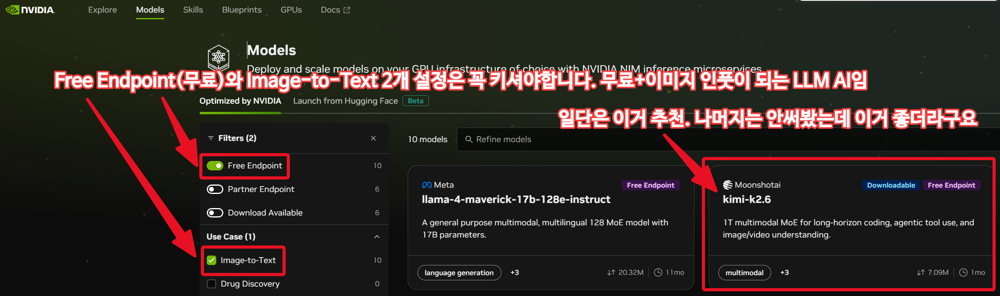

오른쪽 위 프로필 메뉴나 [API Keys 페이지](https://build.nvidia.com/settings/api-keys)에서 새 API 키를 만듭니다. 무료 엔드포인트의 분당 요청 한도도 여기서 확인할 수 있습니다.

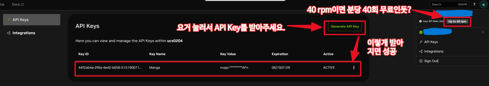

키는 생성 직후에만 전체 값을 볼 수 있으니, 앱 설정에 붙여넣기 전까지 따로 보관하세요. 잃어버렸다면 기존 키를 삭제하고 새로 만들면 됩니다.

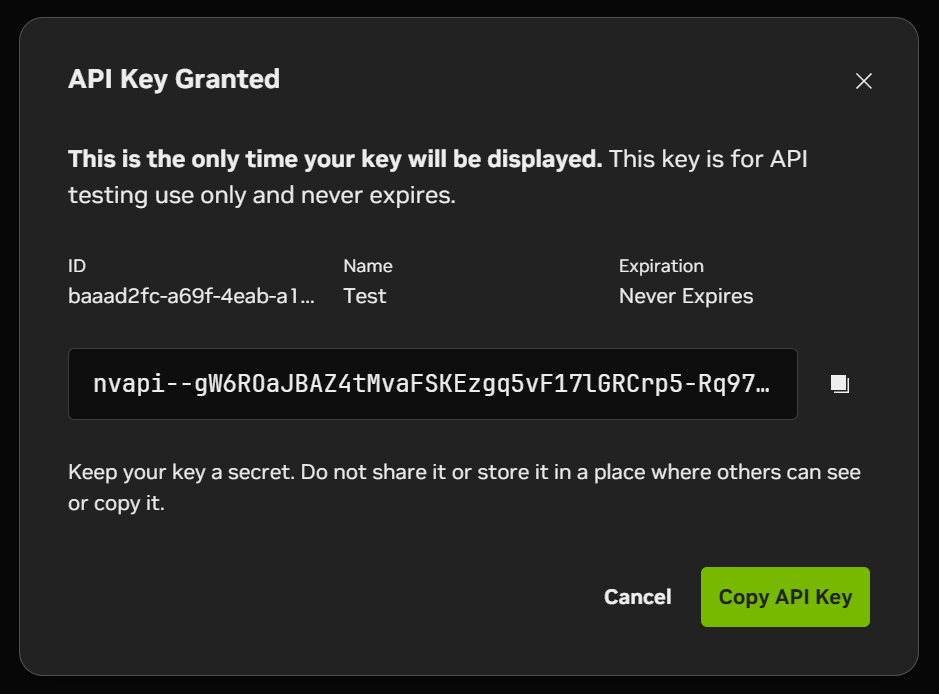

모델 페이지의 예제 코드에서 호출 URL과 모델 이름을 확인합니다. 예제에는 `/v1/chat/completions`처럼 전체 요청 주소가 보이지만, 앱의 `API Base URL`에는 `/chat/completions`를 빼고 `/v1`까지만 넣으면 됩니다.

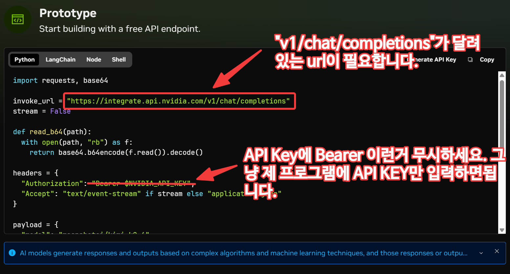

같은 예제 코드의 `model` 값이 앱 설정의 `API 모델`에 들어갈 값입니다.

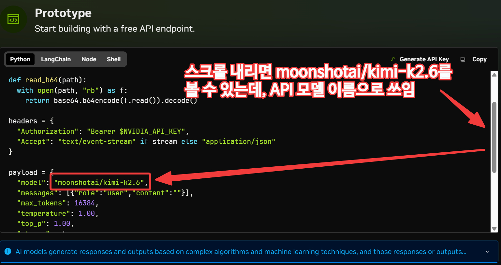

마지막으로 앱 설정에서 번역 엔진을 `API`로 바꾸고 Base URL, 모델, 키를 넣은 뒤 저장합니다.

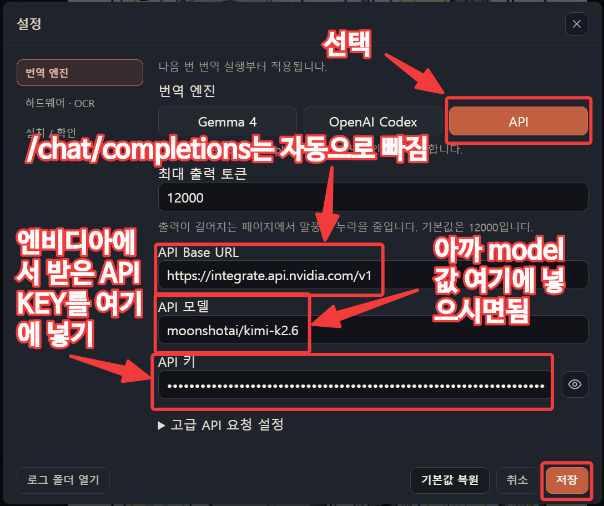

### Gemini API로 API 엔진 쓰기

Gemini도 OpenAI 호환 엔드포인트를 제공하므로 같은 `API` 엔진으로 사용할 수 있습니다. API 키는 [Google AI Studio](https://aistudio.google.com/)에서 발급합니다.

앱 설정에는 아래 값을 넣으면 됩니다.

- `API Base URL`: `https://generativelanguage.googleapis.com/v1beta/openai`
- `API 모델`: `gemini-3.5-flash`
- `API 키`: Google AI Studio에서 발급한 Gemini API 키

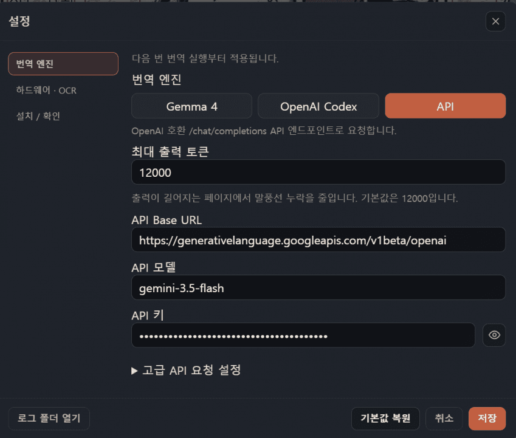

저장 후 번역을 실행하면 아래처럼 API 모델 이름으로 진행 상태가 표시됩니다. Gemini 모델명이나 무료 한도는 Google 정책에 따라 바뀔 수 있으니, 갑자기 실패하면 AI Studio에서 키와 사용 가능한 모델을 먼저 확인하세요.

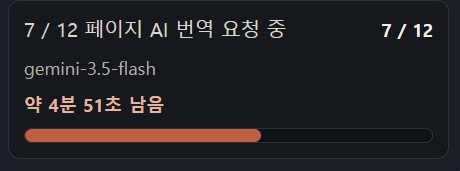

## 설정

설정은 저장한 뒤 다음 작업부터 적용됩니다. 처음 설치했다면 먼저 `설정`에서 번역 엔진, 모델 모드, OCR 장치, Gemma/Flux GPU 런타임을 확인하세요.

Gemma 4는 내 PC에서 로컬 모델 서버를 실행하는 방식입니다. 인터넷 연결 없이 돌리고 싶거나, OpenAI Codex를 쓰고 싶지 않은 경우에 사용합니다.

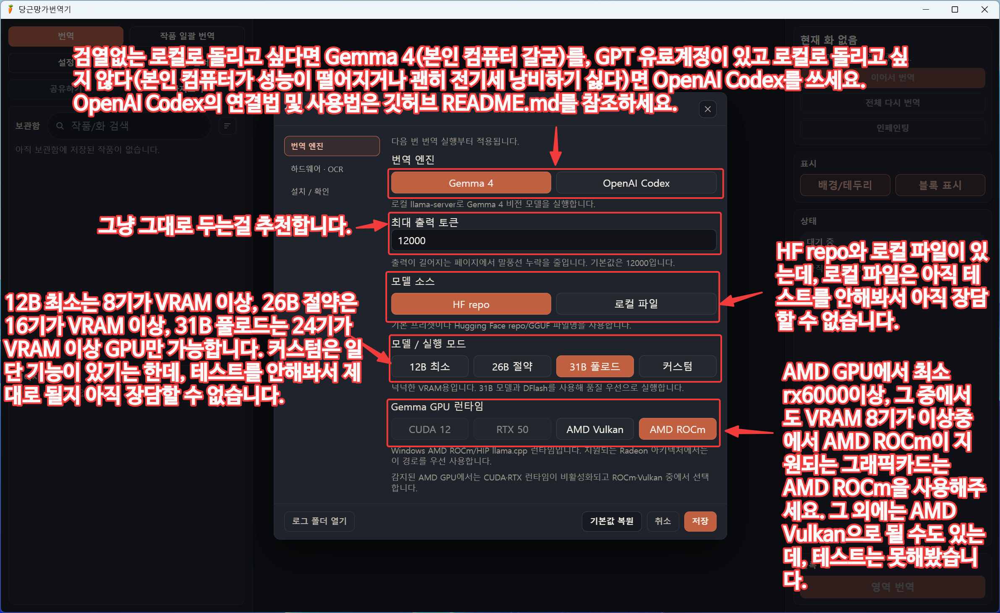

주요 항목은 다음과 같습니다.

- `번역 엔진`: `Gemma 4`, `OpenAI Codex`, `API` 중 하나를 고릅니다.
- `번역 언어`: 작품의 `원문 언어`와 `번역 언어`를 고릅니다. 기본값은 기존과 같은 일본어 → 한국어입니다. 영어, 중국어(간체/번체), 유럽/동남아 주요 언어 등 40개 이상을 목록에서 고를 수 있고, 목록에 없는 언어는 `직접 입력…`으로 `eo`, `pt-BR` 같은 언어 코드를 넣으면 됩니다. 가운데 `⇄` 버튼으로 원문/번역 언어를 서로 바꿀 수 있습니다. 언어쌍에 따라 모델의 이미지 입력 성능과 OCR 언어 지원에 따른 품질 차이가 있을 수 있으며, 일본어 → 한국어에는 만화 특화 프롬프트와 OCR 최적화가 그대로 적용됩니다.
- `최대 출력 토큰`: 긴 페이지에서 말풍선 누락을 줄이기 위한 출력 한도입니다. 잘 모르겠으면 기본값을 유지하세요.
- `모델 소스`: 기본 Hugging Face repo 또는 직접 받은 로컬 GGUF 파일을 고릅니다.
- `모델 / 실행 모드`: `12B 최소`, `26B 절약`, `31B 풀로드`, `커스텀` 중 하나를 고릅니다.
- `Gemma GPU 런타임`: NVIDIA CUDA 12, RTX 50, AMD Vulkan, AMD ROCm 중 하드웨어에 맞는 런타임을 고릅니다.
- `Paddle OCR 장치`: GPU가 안정적으로 지원되면 GPU, 아니면 CPU를 고릅니다.
- `인페인팅 모델`: `AOT 최소`, `LaMa 절약`, `Flux 풀로드` 중 하나를 고릅니다. 기본값은 `Flux 풀로드`입니다.
- `Flux 인페인팅 백엔드`: NVIDIA CUDA, AMD ZLUDA, CPU 중에서 고릅니다.

설정 창에는 `번역 엔진`, `하드웨어 · OCR`, `텍스트 서식`, `단축키`, `설치 / 확인` 탭이 있습니다.

- `번역 엔진`: Gemma/Codex/API 엔진과 엔진별 모델, 토큰, API 연결 정보를 정합니다. API 엔진은 고급 요청 설정도 이 탭에서 관리합니다.
- `하드웨어 · OCR`: Paddle OCR 장치와 품질 모드를 고릅니다. `최소`/`절약`은 CPU 기반 PP-OCRv6 경로로 저사양 PC에서 더 가볍게 돌리고, `풀로드`는 PaddleOCR-VL GPU 경로를 사용합니다.
- `텍스트 서식`: 새로 만들어지는 번역 블록의 방향, 정렬, 폰트, 글자 크기, 자동 맞춤, 줄 간격, 자간, 장평, 글자색, 외곽선을 미리 정합니다. 이미 있는 블록은 자동으로 바뀌지 않습니다.
- `단축키`: 보기 전환, 번역 시작, 페이지 재번역, 작업 도구 전환, 텍스트 모아보기, 인페인팅, 블록 복제/삭제 같은 단축키를 원하는 조합으로 바꾸거나 비울 수 있습니다. 같은 조합을 다른 기능에 지정하면 기존 기능의 단축키는 자동으로 해제됩니다.
- `설치 / 확인`: Paddle OCR과 선택한 번역 엔진이 실제로 준비되는지 확인하고, 현재 앱 버전과 GitHub Releases 업데이트 페이지를 볼 수 있습니다. 문제가 생기면 같은 화면의 결과 로그와 `로그 폴더 열기`를 함께 확인하세요.

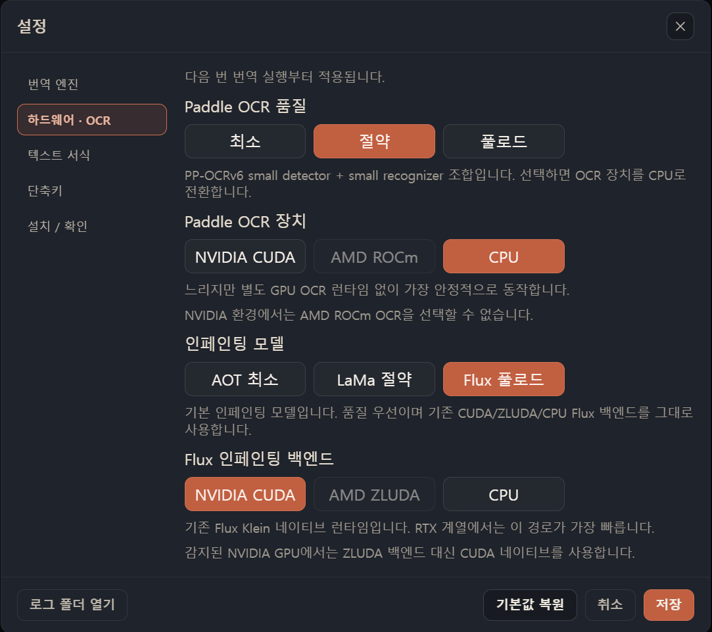

`Paddle OCR 품질`은 `최소`, `절약`, `풀로드` 중에서 고릅니다. `절약`은 CPU로도 비교적 빠르고 안정적인 편이라 먼저 시도하기 좋습니다. `풀로드`는 품질 우선 경로지만 무겁기 때문에 CPU와 함께 쓰면 매우 느릴 수 있고, 가능하면 NVIDIA CUDA나 AMD ROCm 같은 GPU OCR 장치와 함께 쓰는 편이 낫습니다.

인페인팅 모델도 PC 성능에 맞춰 고릅니다. `AOT 최소`는 가장 가볍고, `LaMa 절약`은 중간 정도의 가벼운 경로이며, `Flux 풀로드`는 품질을 우선하는 기존 Flux 경로입니다. 복잡한 배경을 깔끔하게 메우는 데는 Flux가 유리하지만, GPU가 부족하면 AOT나 LaMa부터 확인해 보세요.

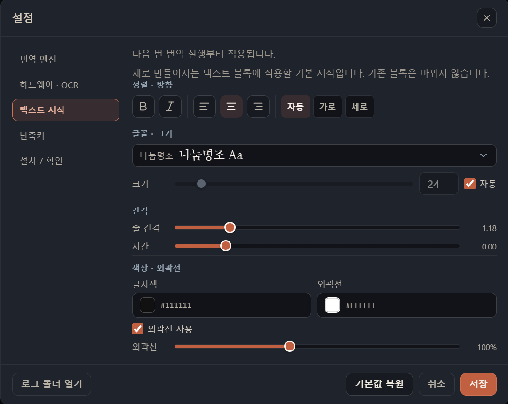

`텍스트 서식`은 이후 AI 번역이나 블록 도구로 새로 만들어지는 블록에 적용됩니다. 기존 블록을 한꺼번에 바꾸고 싶다면 블록을 선택한 뒤 오른쪽 블록 패널의 일괄 적용 기능을 사용합니다.

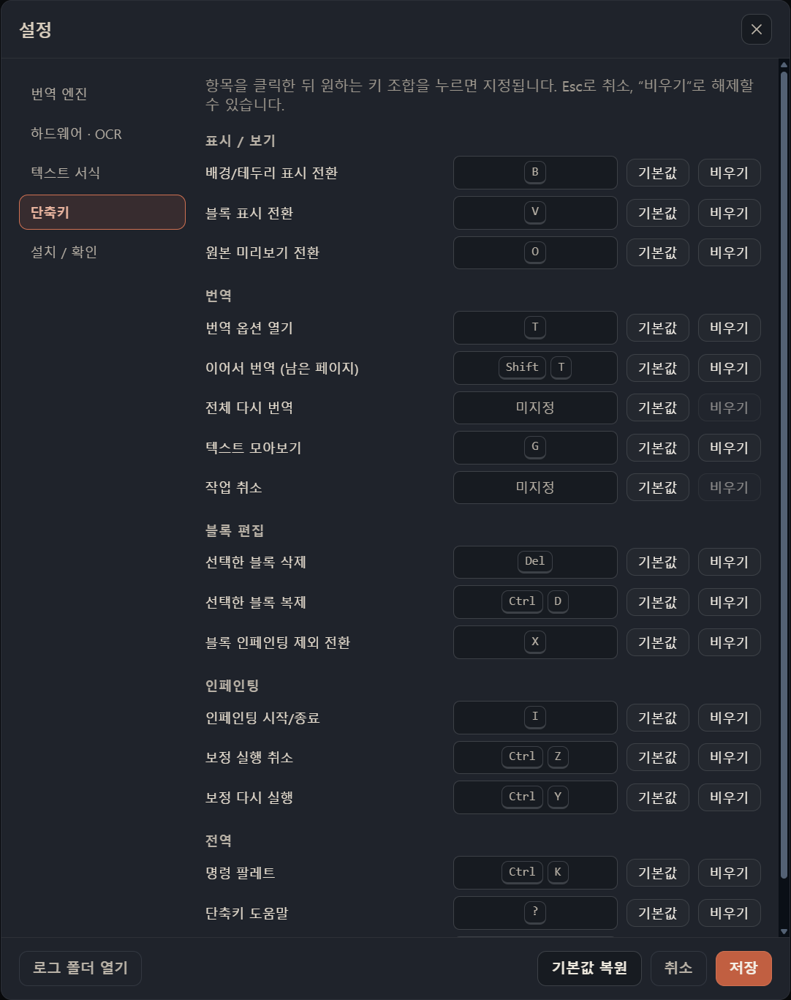

단축키는 항목의 키 입력 칸을 누른 뒤 원하는 조합을 직접 입력해 바꿉니다. `Esc`로 입력을 취소할 수 있고, `비우기`를 누르면 해당 기능의 단축키를 해제합니다.

8GB급 VRAM 환경에서는 `12B 최소`부터 시도하는 것이 가장 안전합니다. 16GB급은 `26B 절약`, 24GB 이상은 `31B 풀로드`가 기본 권장값입니다.

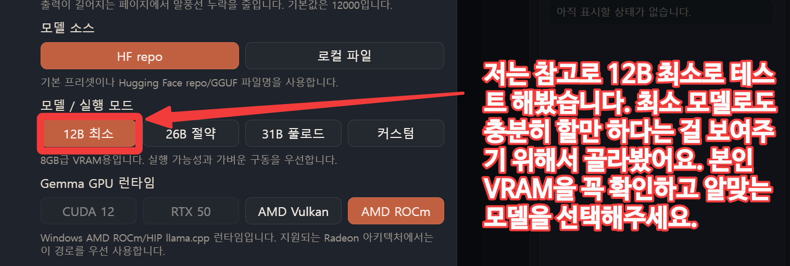

AMD GPU에서는 CUDA/RTX 런타임 대신 AMD ROCm 또는 AMD Vulkan 경로를 사용합니다. README 예시는 AMD PRO V710 환경에서 찍은 화면이며, 일반 Radeon 사용자는 본인 GPU와 드라이버에 따라 표시가 다를 수 있습니다.

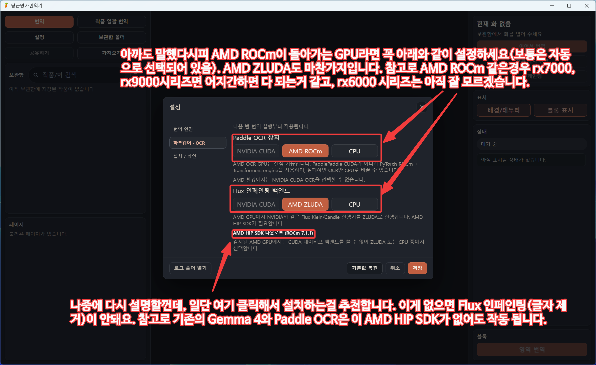

Codex를 선택할 예정이라면 위의 `OpenAI Codex 엔진 준비` 섹션에서 먼저 설치와 로그인부터 끝내 주세요. API를 선택할 예정이라면 `API 엔진 준비` 섹션에서 Base URL, 모델, 키 설정을 확인하세요.

## 원본 불러오기와 보관함 추가

`번역` 버튼을 누르면 원본 선택 창이 뜹니다.

- `이미지 열기`: 한 장짜리 이미지 파일을 불러옵니다.
- `폴더 열기`: 폴더 안의 여러 이미지를 한 화로 불러옵니다.
- `압축파일 열기`: ZIP/CBZ 같은 압축 파일을 풀지 않고 한 화로 불러옵니다.

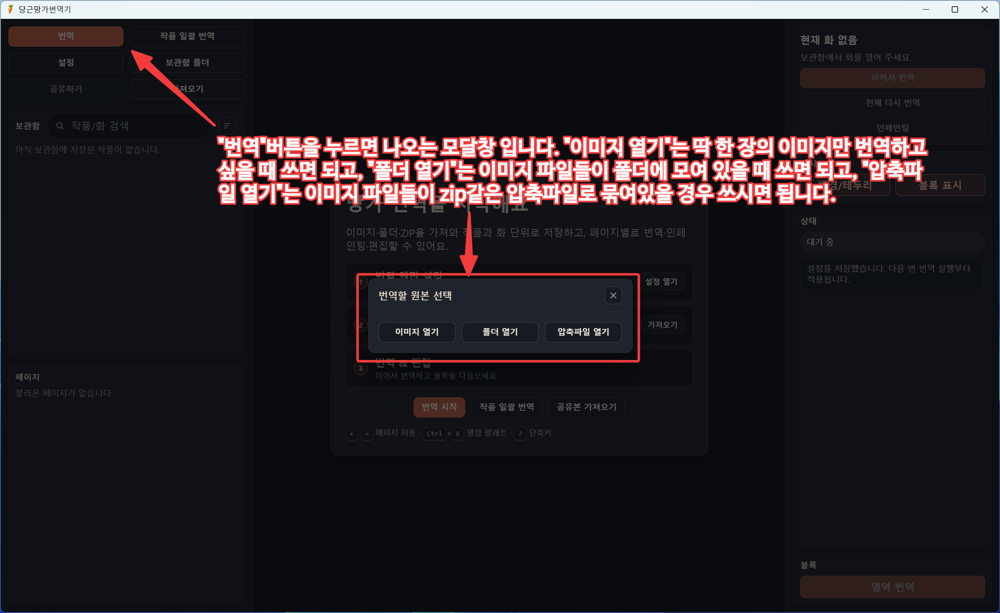

지원하는 이미지 파일은 `png`, `jpg`, `jpeg`, `webp`입니다. WEBP는 보관함에 넣을 때 PNG로 정규화해 저장합니다. 압축파일은 `zip`, `cbz`를 지원하며, ZIP 안의 이미지도 자연 정렬 순서로 페이지가 됩니다.

폴더나 압축파일을 불러오면 페이지 순서대로 보관함에 저장됩니다. 파일명이 `001.jpg`, `002.jpg`처럼 정렬 가능한 형태면 가장 안정적입니다. 너무 큰 이미지는 가져오기 단계에서 거절될 수 있습니다. 현재 일반 이미지 파일은 256MB를 넘지 않아야 하고, 디코딩한 해상도는 120MP를 넘지 않아야 합니다.

새 작품을 만들거나 기존 작품에 화를 추가할 때는 보관함 추가 창에서 작품 제목과 화 제목을 정합니다. 아래 화면은 원본 파일을 고른 뒤, 그 파일을 보관함의 어느 작품에 넣을지 정하는 단계입니다.

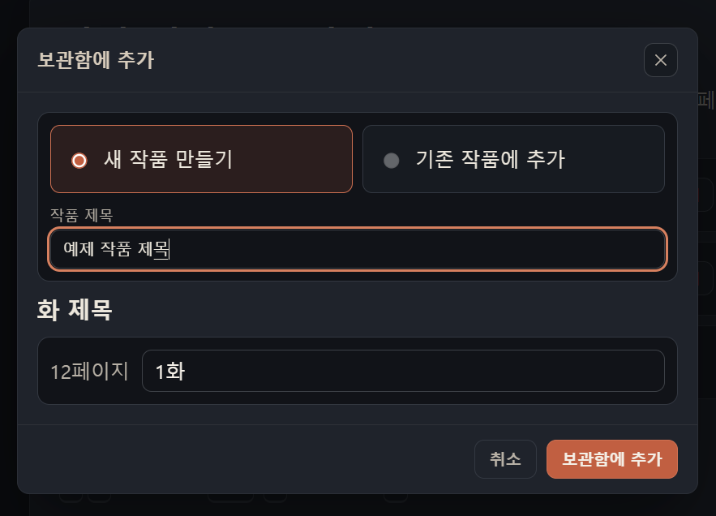

가져온 뒤에도 왼쪽 보관함의 화 목록과 페이지 목록에서 드래그 핸들을 잡아 순서를 바꿀 수 있습니다. 작품/화 이름은 보관함의 연필 버튼으로 바꿀 수 있고, 페이지 목록에서는 개별 페이지를 삭제할 수 있습니다. 순서 저장이나 삭제가 실패하면 이전 상태로 되돌리고 상태 메시지에 원인을 표시합니다.

작품이 많아지면 보관함 상단의 검색창에서 작품명이나 화 제목을 입력해 필터링할 수 있습니다. 정렬 메뉴에서는 `수정일`, `이름`, `추가일`, `화 개수` 기준과 오름차순/내림차순을 고릅니다.

## 메인 화면

메인 화면은 한 화면 안에서 보관함, 페이지, 번역 결과, 진행 상태, 블록 편집을 같이 보도록 구성되어 있습니다.

- 왼쪽 위: 번역, 작품 일괄 번역, 설정, 공유/가져오기 버튼
- 왼쪽 중간: 보관함의 작품과 화 목록, 검색, 정렬
- 왼쪽 아래: 현재 화의 페이지 목록
- 가운데: 현재 페이지 이미지와 번역 블록, 선택/블록/손바닥 작업 도구
- 화 카드와 작업 영역: `번역` 버튼으로 번역 시작 모달을 열고, `인페인팅`으로 원문 지우기 모드에 들어갑니다.
- 오른쪽 중간: 배경/테두리, 블록 표시, 텍스트 모아보기 같은 보기 옵션과 상태 로그
- 오른쪽 아래: 선택한 번역 블록의 문장, OCR, 방향, 폰트, 색상, 외곽선 편집. 편집기는 필요하면 앱 안에 띄우거나 별도 창으로 분리할 수 있습니다.

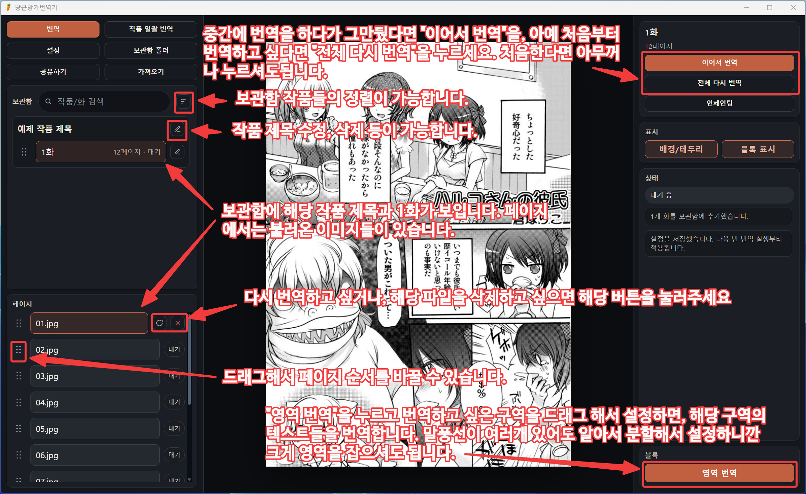

## 번역 시작 옵션

화 카드의 `번역` 버튼을 누르면 바로 작업이 시작되지 않고, 번역할 화와 페이지, 2차 번역, 블록 처리 방식을 고르는 모달이 먼저 열립니다. 이전처럼 `이어서 번역`과 `전체 다시 번역` 버튼이 화면에 따로 놓인 구조가 아니라, 하나의 `번역` 버튼 안에서 필요한 범위를 직접 선택하는 흐름입니다.

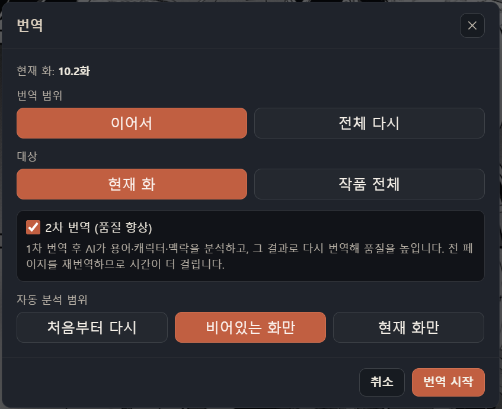

- `무엇을 번역할까요?`: 작품 안의 화를 펼쳐 페이지 단위로 선택합니다. 현재 화는 처음에 펼쳐져 있고, 기본값은 현재 화의 미번역 페이지입니다.
- `전체 선택`: 작품 안의 모든 화와 모든 페이지를 번역 대상으로 잡습니다.
- `미번역만`: 각 화에서 아직 완료되지 않은 페이지를 번역 대상으로 잡습니다. 이미 완료된 페이지를 최대한 유지하고 이어서 처리할 때 사용합니다.
- `전체 해제`: 선택을 모두 비웁니다. 이후 필요한 화나 페이지 썸네일만 다시 체크할 수 있습니다.
- `화 체크박스`: 해당 화 전체를 켜거나 끕니다.
- `페이지 썸네일 체크`: 한 화 안에서도 특정 페이지만 번역하도록 고릅니다. 예를 들어 20페이지 중 3페이지만 다시 처리하고 싶을 때 유용합니다.
- `2차 번역 (품질 향상)`: 1차 번역 후 AI가 용어, 캐릭터, 맥락을 다시 정리하고 그 결과를 반영해 재번역합니다. 2차에서는 OCR 후보, 이전 번역, 용어/기억을 함께 보며 말풍선이 잘못 쪼개진 경우를 합치고, OCR 오독이나 이전 번역 실수를 다시 확인합니다. 품질은 좋아질 수 있지만 전체 페이지를 다시 처리하므로 시간이 더 걸립니다.
- `자동 분석 범위`: 용어/캐릭터/스토리 메모리를 자동으로 채울 범위를 고릅니다. 새로 추가한 화만 빠르게 채우려면 `비어있는 화만`, 기존 분석까지 갈아엎으려면 `처음부터 다시`, 현재 화 기준으로만 확인하려면 `현재 화만`을 사용합니다.
- `블록`: `자동 생성`은 기존 블록을 새 OCR/AI 분석 결과로 다시 만들고, `기존 블록 유지`는 이미 있는 블록의 영역과 서식을 유지한 채 각 영역의 OCR/번역 텍스트만 다시 채웁니다. 블록이 없는 페이지는 `기존 블록 유지`를 골라도 자동 생성으로 처리됩니다.

선택 요약에는 몇 개 화와 몇 페이지가 번역될지 표시됩니다. 아직 페이지 목록을 불러오지 않은 화는 페이지 수가 약간으로 표시될 수 있고, 화를 펼치면 정확한 페이지별 선택 상태가 보입니다.

2차 번역에서 페이지를 직접 체크해 고른 경우에는 선택한 페이지만 다시 번역합니다. 반대로 화 전체나 `미번역만`처럼 화 단위 선택을 사용하면 2차 번역은 해당 화 전체를 다시 보며 문맥을 맞춥니다. 빠르게 대충 읽는 것이 목적이거나 API 비용이 부담된다면 2차 번역을 끄고, 공유용 결과물처럼 번역 일관성과 문체를 더 챙기고 싶다면 켜는 쪽을 권장합니다.

이미 말풍선 위치와 폰트를 많이 손본 페이지를 다시 번역할 때는 `기존 블록 유지`를 먼저 확인해 보세요. 이 모드는 새 블록을 다시 배치하지 않으므로 수동 편집한 레이아웃을 보존하기 좋습니다. 다만 말풍선 자체를 새로 찾거나 누락된 효과음을 새 블록으로 만들고 싶다면 `자동 생성`이 더 적합합니다.

## 모델 준비와 번역 진행

처음 번역하거나 처음 인페인팅을 실행하면 필요한 파일을 다운로드하고 검증합니다. 이 과정은 PC 성능과 인터넷 속도에 따라 꽤 오래 걸릴 수 있습니다.

- Gemma 4: GGUF 모델, mmproj, llama.cpp/beellama/BeeLlama HIP/Lemonade ROCm 런타임
- Paddle OCR: Python 런타임, PaddleOCR/PaddleOCR-VL 또는 AMD ROCm OCR 패키지, OCR 모델 캐시
- 인페인팅: Flux Klein 모델/VAE/실행기 또는 Koharu LaMa/AOT 모델과 runner 준비
- OpenAI Codex: 로컬 Codex 로그인 토큰을 사용하는 openai-oauth 연결
- API: OpenAI 호환 Chat Completions 엔드포인트 연결

다운로드 진행률을 알 수 있는 파일은 받은 용량 기준으로 표시합니다. pip 설치나 런타임 검증처럼 정확한 퍼센트를 알 수 없는 구간은 억지 퍼센트를 올리지 않고 로그 중심으로 표시합니다.

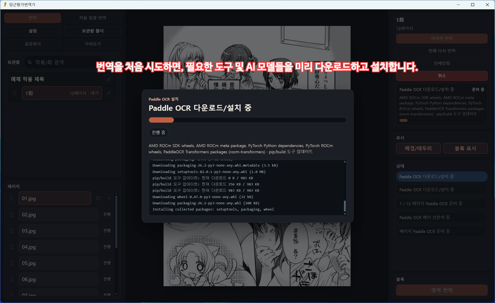

번역 작업은 보통 OCR 선분석이 먼저 돌고, 그 결과를 바탕으로 AI 번역 요청이 이어집니다. 오른쪽 작업 카드에서 현재 몇 번째 페이지가 OCR 중인지 볼 수 있습니다. 한 번 OCR이 끝난 페이지는 캐시를 재사용하고, OCR에서 일본어 근거가 거의 없는 페이지는 불필요한 AI 호출을 줄입니다.

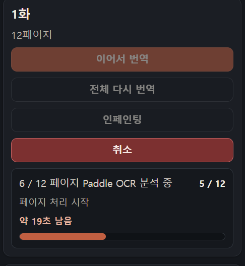

Gemma를 처음 쓰는 경우에는 모델 파일과 실행 런타임을 준비합니다. AMD 환경에서는 31B DFlash preset에 BeeLlama HIP 런타임을, 12B/26B mainline preset에 Lemonade ROCm 런타임을 내려받는 화면이 보일 수 있습니다.

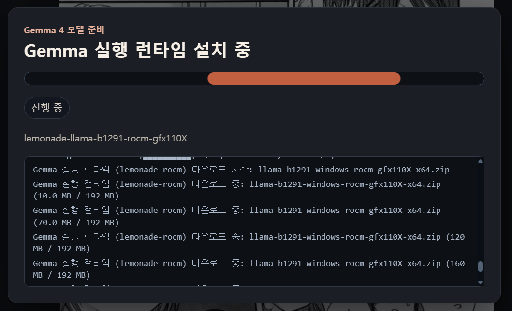

Gemma 번역 단계에서는 AI 모델이 OCR 힌트와 페이지 이미지를 보고 번역 블록을 만듭니다. 진행 중에는 현재 페이지 번호와 사용 중인 모델 이름이 작업 카드에 표시됩니다. OCR 텍스트는 참고 자료일 뿐 최종 원문은 이미지 기준으로 다시 읽도록 처리하며, 작은 노이즈성 OCR 조각은 번역 블록으로 번지지 않도록 걸러냅니다.

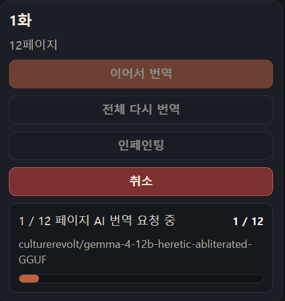

## 용어/기억 관리

`용어/기억` 화면은 작품 안에서 반복되는 표현을 한곳에 모아 관리하는 편집 화면입니다. 상단의 `AI 자동 분석`은 원문을 분석해 용어, 캐릭터, 번역 규칙, 스토리 메모리를 채우며, 오른쪽의 분석 범위에서 `현재 화` 또는 `작품 전체`를 선택할 수 있습니다.

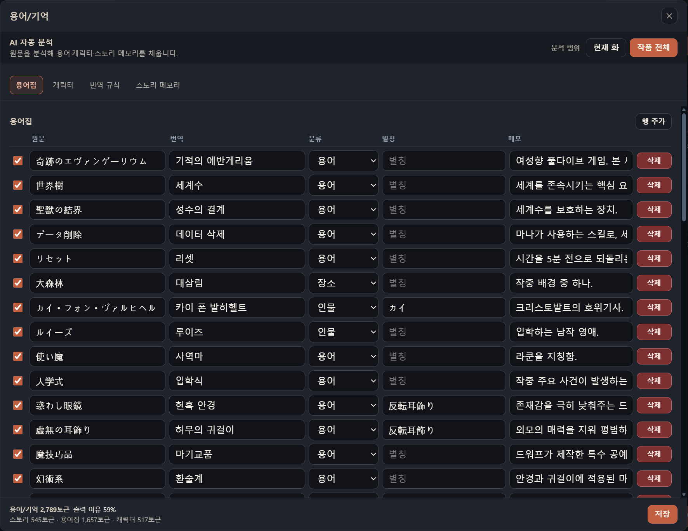

`용어집` 탭에서는 원문, 번역, 분류, 별칭, 메모를 행 단위로 관리합니다. 각 행 왼쪽 체크를 끄면 해당 항목을 번역 프롬프트에서 제외할 수 있고, `행 추가`와 `삭제`로 직접 정리할 수 있습니다. 하단에는 용어/기억이 차지하는 토큰과 출력 여유가 표시되어, 너무 많은 항목을 넣어 번역 응답 공간이 부족해지는 상황을 확인할 수 있습니다.

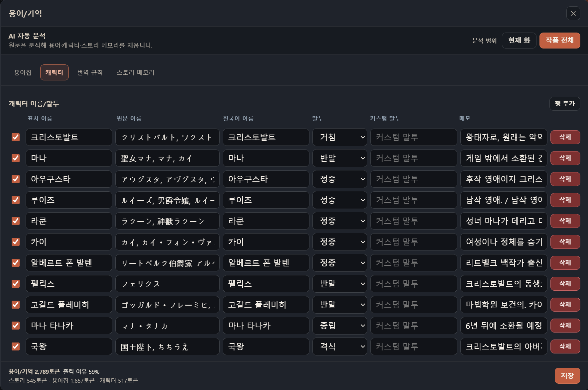

`캐릭터` 탭에서는 표시 이름, 원문 이름, 한국어 이름, 말투, 커스텀 말투, 메모를 관리합니다. 존댓말/반말 같은 기본 말투를 고르거나 직접 말투 지침을 적어두면 같은 인물이 여러 페이지에서 더 일관되게 번역됩니다. 수정한 내용은 `저장`을 눌러 보관함에 반영합니다.

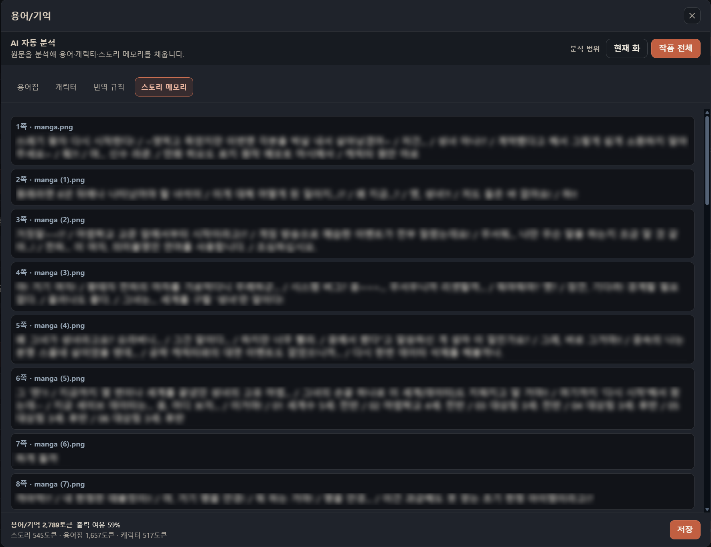

`스토리 메모리`는 1차 번역이 끝난 페이지를 바탕으로 자동으로 쌓이는 줄거리/상황 메모입니다. 용어집이나 캐릭터처럼 행 단위로 번역어를 강제하는 용도라기보다는, 2차 번역과 이후 페이지 번역에서 앞뒤 사건과 맥락을 참고하게 하는 메모에 가깝습니다.

## 번역 블록 편집

번역이 끝난 뒤 가운데 페이지의 블록을 클릭하면 오른쪽 `블록` 패널에서 내용을 수정할 수 있습니다.

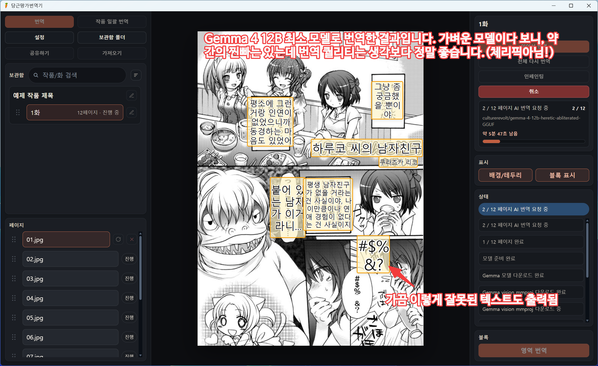

작업 영역 왼쪽에는 작은 도구 모음이 있습니다.

- `선택` 도구: 블록을 클릭해 선택하고, 드래그로 이동하거나 모서리 핸들로 크기를 바꿉니다. 기본 편집 모드입니다.
- `블록` 도구: 페이지 위 빈 영역을 드래그해 새 텍스트 블록을 만듭니다. AI가 놓친 말풍선, 효과음, 안내문을 사람이 직접 추가할 때 씁니다.
- `손바닥` 도구: 확대된 페이지를 드래그해 이동합니다. 페이지가 화면보다 클 때 블록을 건드리지 않고 화면 위치만 옮길 수 있습니다.
- 도구 모음 접기: 작업 영역을 넓게 쓰고 싶을 때 도구 모음을 숨기거나 다시 표시합니다.

기본 단축키는 `1` 선택, `2` 블록, `3` 손바닥, `4` 도구 모음 표시 전환입니다. 설정의 `단축키` 탭에서 바꿀 수 있습니다.

자주 쓰는 항목은 다음과 같습니다.

- `한국어`: 화면과 PNG 출력에 표시되는 번역문입니다.
- `OCR`: 모델이 읽은 원문입니다.
- `방향`: 가로쓰기 또는 세로쓰기를 고릅니다.
- `기울기`: 효과음이나 기울어진 글자에 맞춰 각도를 조절합니다.
- `투명도`: 블록 배경의 투명도를 조절합니다.
- `폰트`: 기본 폰트, 포함 폰트, 직접 추가한 폰트를 선택합니다.
- `이 폰트 일괄 적용`: 현재 페이지 또는 현재 화 전체의 블록에 같은 폰트를 적용합니다.
- `일괄 적용`: 선택한 블록의 글꼴, 글자 크기, 정렬, 가로/세로, 굵게/기울임, 줄 간격, 자간, 색상, 외곽선, 기울기/투명도 중 필요한 항목만 골라 선택 블록, 현재 페이지, 현재 화 전체에 적용합니다.
- `글자 크기`: 자동 맞춤을 끄고 직접 조절할 수 있습니다.
- `글자색`, `외곽선`, `외곽선 두께`: 배경에 따라 읽기 쉽게 조절합니다.
- `복제`, `삭제`: 선택한 블록을 복제하거나 제거합니다.

폰트 목록 아래의 `+ TTF/OTF 폰트 등록`으로 직접 받은 폰트를 추가할 수 있습니다. 등록한 폰트는 데이터 폴더의 `fonts/`에 복사되고, 폰트 목록에서 미리보기와 함께 표시됩니다. 등록한 폰트 오른쪽의 삭제 버튼을 누르면 앱 목록에서 제거됩니다.

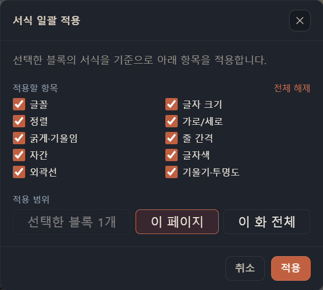

`일괄 적용`은 선택한 블록의 서식을 기준으로 필요한 항목만 골라 적용합니다. 예를 들어 글꼴과 외곽선만 맞추거나, 현재 페이지 전체 또는 현재 화 전체에 줄 간격과 색상까지 한 번에 맞출 수 있습니다.

오른쪽 블록 편집기가 좁게 느껴지면 패널 헤더의 버튼으로 편집기를 띄울 수 있습니다. `편집기 띄우기`는 앱 안에 드래그/크기 조절 가능한 패널을 만들고, `편집기 새 창`은 별도 OS 창으로 분리합니다. 새 창을 닫거나 도킹 버튼을 누르면 다시 오른쪽 패널 자리로 돌아갑니다.

현재 페이지만 다시 번역해야 할 때는 페이지 재번역 기능을 사용합니다. 재번역 모달에서는 `자동 생성`과 `기존 블록 유지` 중 하나를 고릅니다.

- `자동 생성`: 현재 페이지의 기존 블록을 지우고 OCR/AI 분석으로 새 블록을 만듭니다.
- `기존 블록 유지`: 현재 블록들의 영역과 서식을 그대로 두고 각 영역의 텍스트만 다시 채웁니다.

페이지 재번역은 기존 번역 결과와 수정 내용을 해당 페이지에서 덮어씁니다. 레이아웃을 살리고 문장만 고치고 싶으면 `기존 블록 유지`, 블록 위치 자체가 틀렸다면 `자동 생성`을 고르세요.

번역 중인 작업이 있어도 이미 완료된 페이지는 수정할 수 있습니다. 다만 같은 페이지가 다시 저장되는 순간과 겹치면 충돌이 생길 수 있으므로, 수정 직후 페이지 이동이나 저장 상태를 확인하는 것이 좋습니다.

## 텍스트 모아보기

오른쪽 보기 옵션의 `텍스트 모아보기`를 누르면 현재 페이지 또는 전체 화의 텍스트를 한곳에서 확인할 수 있습니다.

- `범위`: `이 페이지` 또는 `전체 화`를 고릅니다.
- `표시`: `번역문+OCR`, `번역문만`, `OCR만` 중 필요한 텍스트를 고릅니다.
- `검색`: 입력한 단어가 현재 표시된 텍스트 안에서 몇 번 나오는지 보여주고, Enter로 다음 결과를 따라갈 수 있습니다.
- `페이지 머리말 제외`: 복사하거나 저장할 때 `### page` 같은 페이지 구분 머리말을 빼고 본문만 다룹니다.
- `복사`: 선택한 범위의 텍스트를 클립보드에 복사합니다.
- `.txt로 저장`: 선택한 범위의 텍스트를 TXT 파일로 저장합니다.
- `.txt 불러오기`: `번역문만` 형식으로 저장한 TXT를 다시 읽어, 줄 순서 기준으로 번역문만 업데이트합니다.
- `검수표 CSV/TSV`: 현재 화의 블록을 `block_id`, OCR 원문, 번역문, 검수 상태, 메모가 들어간 표로 저장합니다.
- `검수표 가져오기`: 외부에서 수정한 CSV/TSV를 다시 읽어 같은 `block_id`의 번역문, 검수 상태, 메모만 업데이트합니다. OCR 원문은 가져오기에서 바꾸지 않으므로 원문 확인용 기준을 유지할 수 있습니다.

텍스트는 페이지별로 묶이고, 같은 페이지 안에서는 일본어 만화 읽기 흐름에 맞춰 위에서 아래로, 같은 줄에서는 오른쪽에서 왼쪽 순서로 정렬됩니다. 대사 확인, 맞춤법 검토, 외부 번역 검수, OCR 원문 백업이 필요할 때 쓰면 됩니다.

TXT 불러오기는 가벼운 문장 교정용입니다. `번역문만`으로 저장한 파일을 외부 편집기에서 고친 뒤 다시 불러오면, OCR 원문과 블록 위치는 그대로 두고 번역문만 바뀝니다. 페이지별 줄 수가 현재 블록 수와 맞지 않거나, 머리말이 현재 페이지와 맞지 않으면 해당 페이지는 건너뛰고 경고를 표시합니다.

CSV/TSV 검수표는 더 안정적인 왕복 검수용입니다. `block_id` 기준으로 적용하기 때문에 페이지 순서가 바뀌어도 같은 블록이면 반영됩니다. 가져오기 후 없는 block id, 중복 block id, OCR 원문 불일치, 사용할 수 없는 검수 상태 같은 문제는 `검수표 경고`로 접어 보여줍니다.

## 영역 번역

오른쪽 `블록` 패널 아래의 `영역 번역`은 페이지 일부만 다시 분석할 때 씁니다.

1. `영역 번역`을 누릅니다.
2. 가운데 페이지에서 번역하고 싶은 영역을 드래그합니다.
3. 선택 영역 안에서 모델이 텍스트 그룹을 다시 찾고 블록을 만듭니다.

영역 번역은 선택 crop을 좌표 기준으로 쓰고, 원본 전체 페이지 이미지는 말하는 사람, 주변 장면, 말풍선 일부 여부를 판단하는 문맥으로만 참고합니다. 현재 페이지 OCR 캐시가 있으면 선택 영역과 겹치는 후보만 crop 좌표로 바꿔 전달하고, 작품의 용어집/캐릭터/스토리 기억도 함께 넣습니다.

영역 번역 결과는 선택한 영역에 대한 블록 하나 또는 추가할 텍스트 없음으로 처리합니다. 말풍선 하나만 다시 만들거나, 자동 번역이 놓친 작은 구역을 보강할 때 유용합니다.

## 인페인팅

인페인팅은 원문 글자를 지우고 PNG로 저장하기 위한 별도 작업 모드입니다. 번역 블록 위치를 기준으로 원문을 먼저 지우고, 남은 자국은 보정 단계에서 직접 다듬습니다.

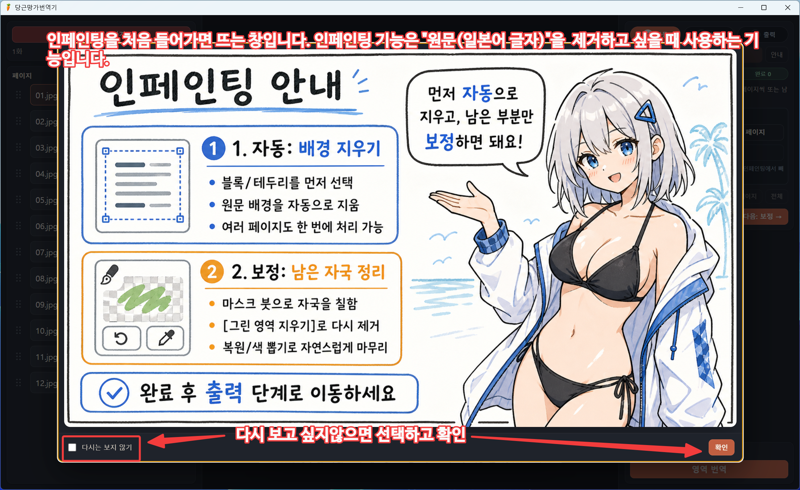

인페인팅 모드에 들어가면 오른쪽 패널이 `자동`, `보정`, `출력` 단계로 바뀝니다. 먼저 자동 원문 지우기를 실행하고, 필요하면 보정한 뒤 PNG로 내보내는 흐름입니다.

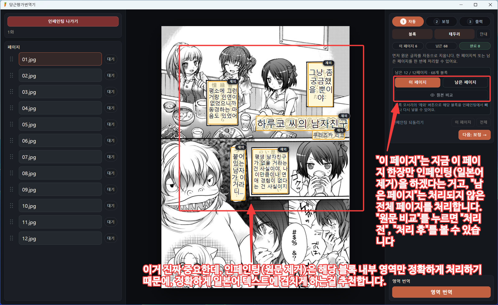

인페인팅 모델은 PC 성능과 원하는 품질에 맞춰 고를 수 있습니다.

- `AOT 최소`: 가장 가벼운 Koharu AOT 경로입니다. 실행 가능성과 낮은 사용량을 우선합니다.
- `LaMa 절약`: Koharu의 만화 특화 LaMa 경로입니다. 말풍선 안 작은 글자 제거를 빠르고 가볍게 처리할 때 좋습니다.
- `Flux 풀로드`: 품질 우선 경로입니다. NVIDIA CUDA, AMD ZLUDA, CPU Flux 백엔드를 그대로 사용합니다.

원문 지우기는 현재 페이지의 번역 블록 위치를 기준으로 Flux 인페인팅을 실행합니다. 원본 이미지는 유지하고 결과 이미지는 별도로 저장됩니다.

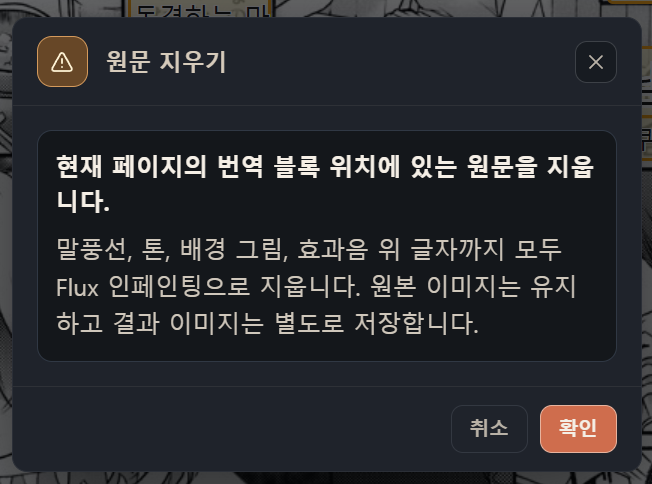

Flux 모델을 처음 쓸 때는 필요한 모델과 런타임을 다운로드합니다.

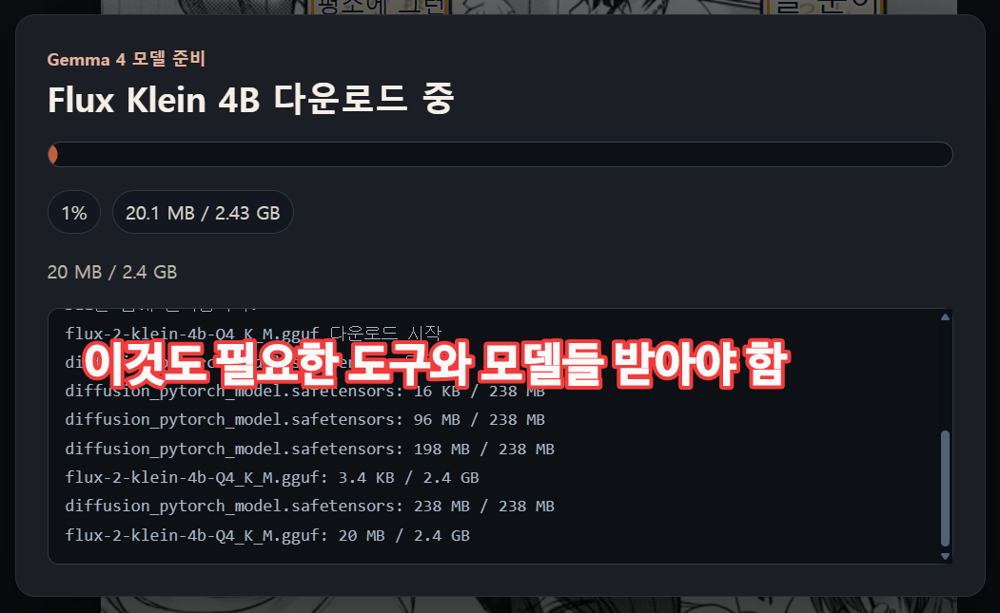

AMD에서 `AMD ZLUDA` 인페인팅을 쓰려면 AMD HIP SDK가 필요합니다. HIP SDK가 없거나 `HIP_PATH`가 제대로 잡히지 않으면 인페인팅 화면 오른쪽 작업 카드에 원인이 표시됩니다.

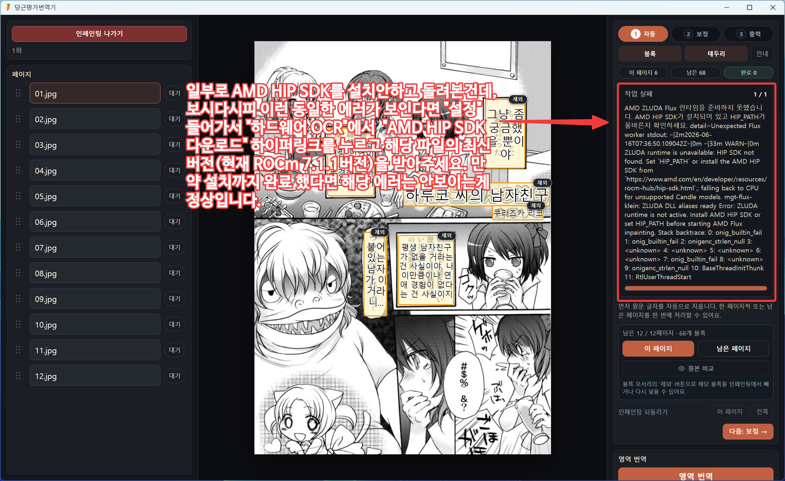

AMD HIP SDK는 AMD 공식 페이지에서 Windows용 HIP SDK를 받아 설치합니다. README 예시는 AMD PRO V710 테스트 환경을 기준으로 찍은 화면입니다.

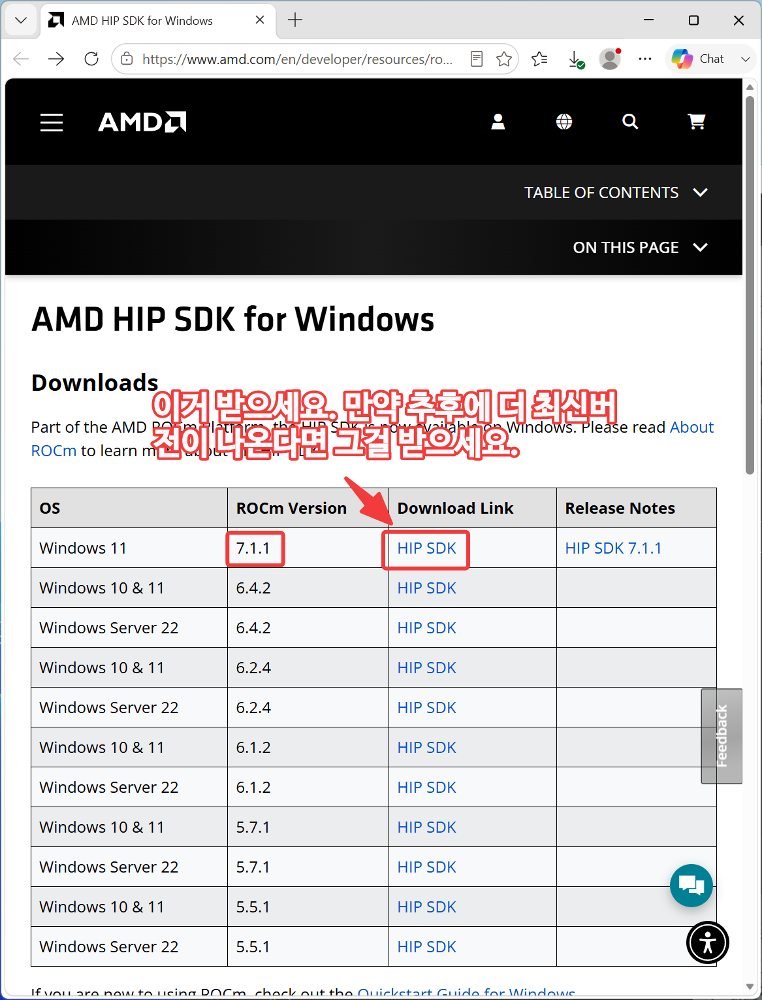

HIP SDK 설치 화면에서는 HIP SDK Core와 HIP Libraries를 설치합니다. 설치 후 앱을 다시 실행하고 `Flux 인페인팅 백엔드`를 `AMD ZLUDA`로 둔 뒤 다시 시도하세요.

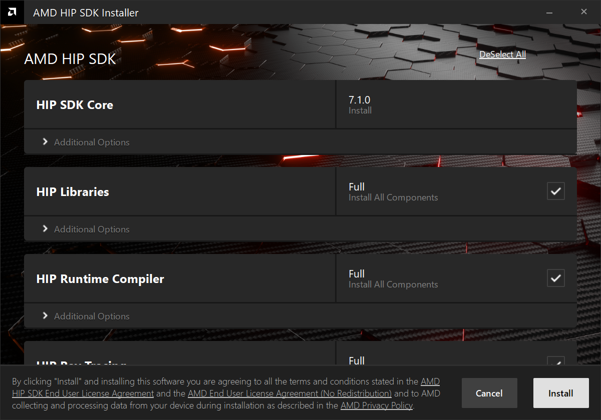

설치 후 다시 시도할 때도 앱이 안내 모달로 한 번 더 확인시켜 줍니다. ZLUDA가 계속 실패하면 작업을 이어가기 위해 백엔드를 `CPU`로 바꿔 확인할 수 있습니다.

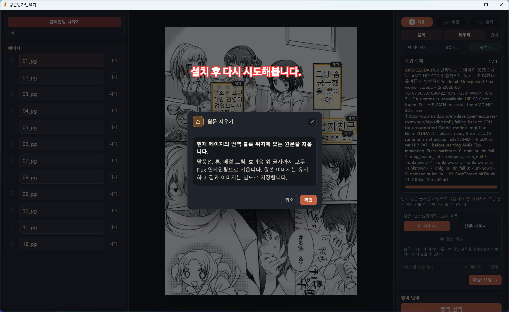

출력 단계에서는 자동 원문 지우기와 보정이 끝난 결과를 PNG로 저장합니다. 현재 페이지 하나만 저장하거나 현재 화 전체 페이지를 한 번에 저장할 수 있습니다.

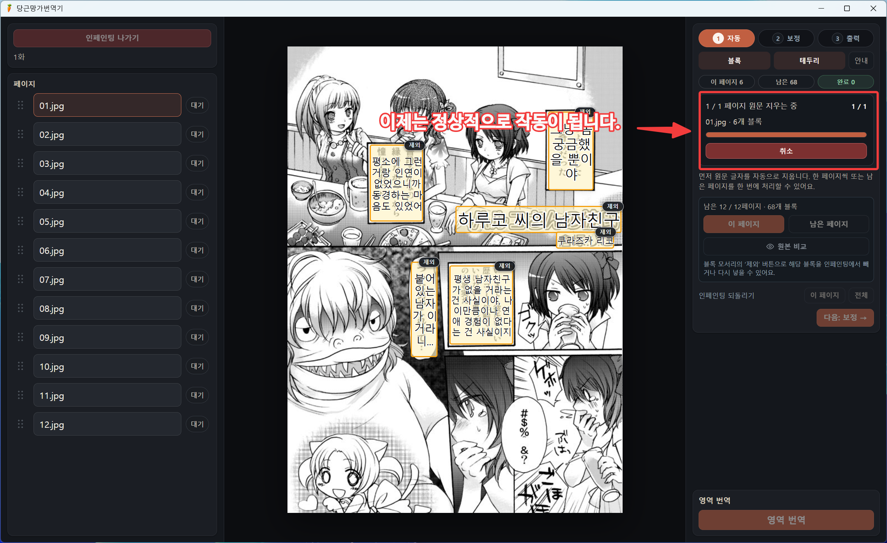

자동 지우기를 실행하면 페이지에 바로 결과가 반영됩니다. 결과가 어색하면 원본 비교로 확인하고, 다음 보정 단계에서 다듬으면 됩니다.

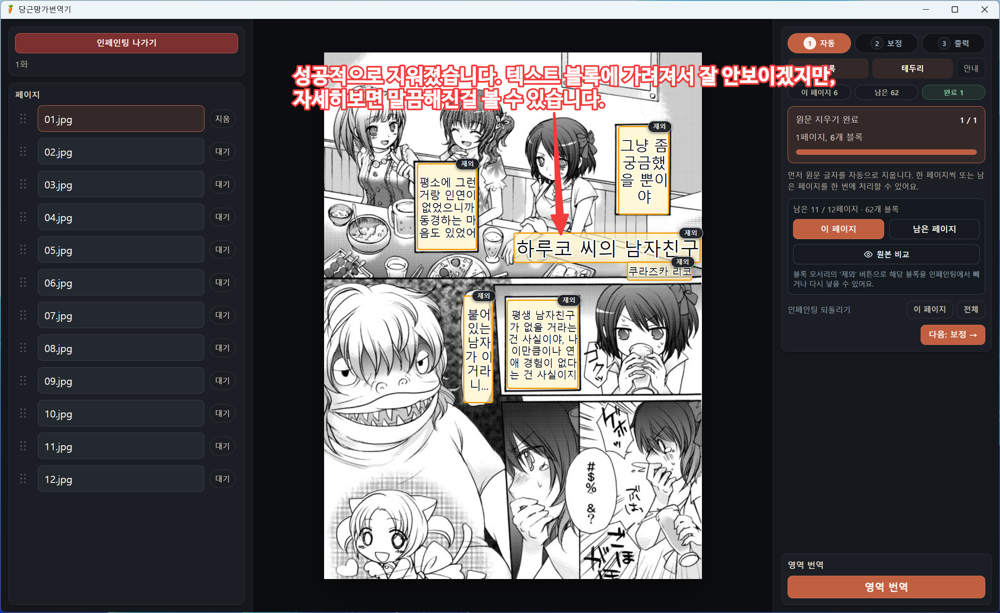

원문이 지워진 뒤에는 번역 블록만 남은 상태를 확인할 수 있습니다. 텍스트 배치가 어색하면 보정 단계에서 블록 위치나 폰트를 다시 손보세요.

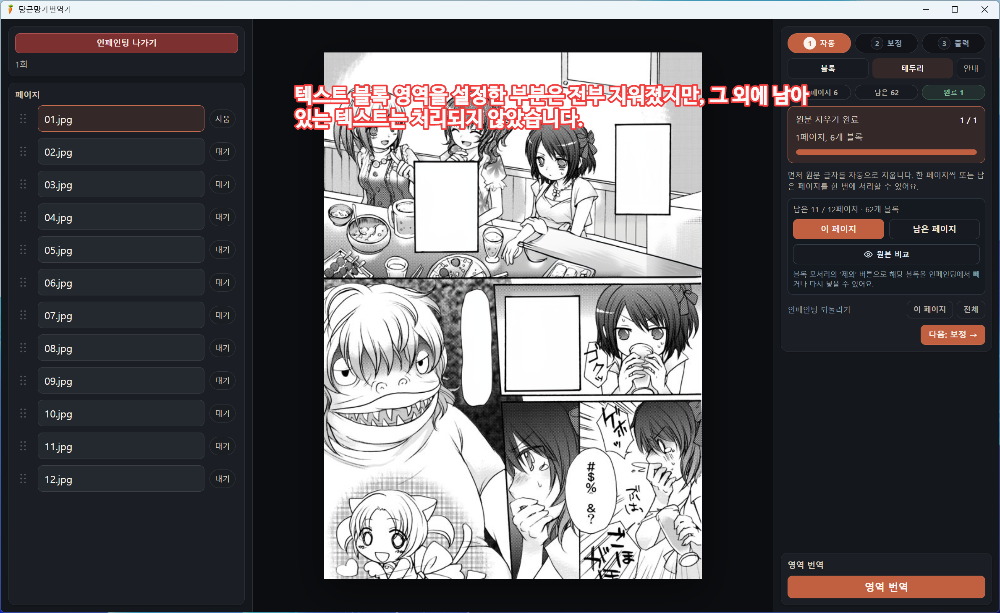

보정 단계에서는 블록별로 인페인팅에서 제외할지, 다시 넣을지, 테두리 범위를 얼마나 넓힐지 조절할 수 있습니다.

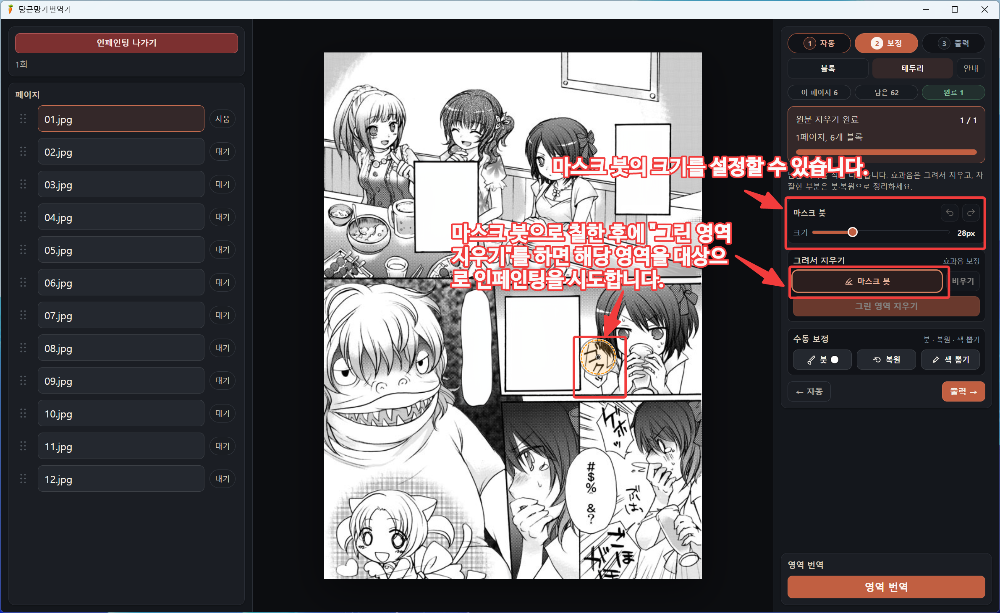

마스크 붓은 Flux로 다시 지울 영역을 그릴 때 사용합니다. 마스크로 칠한 뒤 `그린 영역 지우기`를 누르면 해당 영역만 다시 인페인팅합니다.

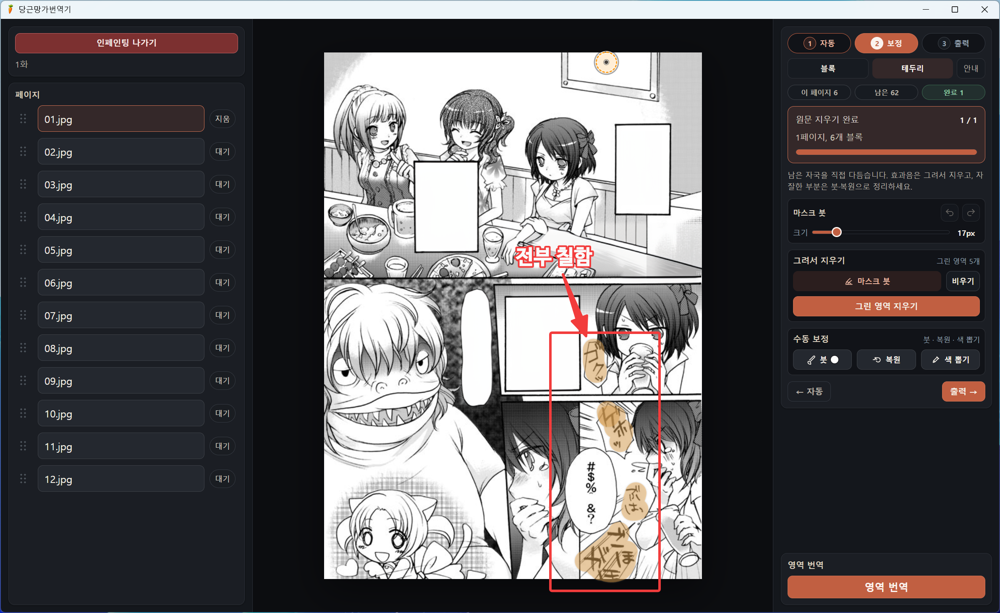

색 붓과 복원 붓은 작은 자국을 사람이 직접 정리할 때 씁니다. 색 뽑기로 주변 색을 찍어 덮어 칠하거나, 복원 붓으로 편집 전 상태를 되돌릴 수 있습니다.

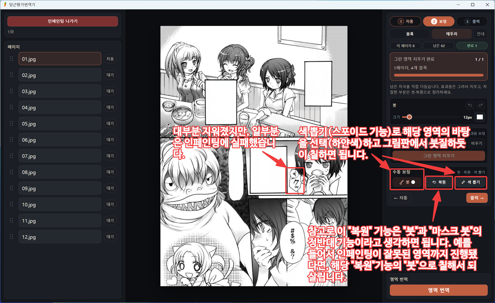

PNG 출력이 끝나면 저장된 파일 수와 폴더를 확인할 수 있습니다. 출력 PNG에는 텍스트 블록의 폰트, 색상, 위치, 방향, 기울기 설정이 반영됩니다.

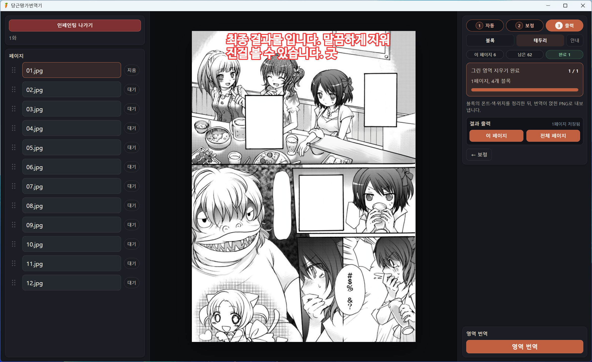

## AMD 지원 요약

AMD 지원은 번역, OCR, 인페인팅이 각각 다른 경로로 준비됩니다. 한 곳이 실패해도 나머지를 CPU나 다른 런타임으로 돌릴 수 있게 분리되어 있습니다.

### Gemma 4 on AMD

지원되는 AMD GPU에서는 `AMD ROCm` Gemma 런타임을 우선 사용합니다. 31B DFlash preset은 BeeLlama HIP/Radeon 런타임을 사용하고, 12B/26B mainline preset은 ROCm target별 Lemonade 런타임을 사용합니다. 앱은 GPU 이름, `rocm-smi`, Windows 장치 정보를 보고 ROCm target을 추정합니다.

지원 target 그룹은 다음과 같습니다.

- `gfx908`
- `gfx90a`
- `gfx103X`
- `gfx110X`
- `gfx1150`
- `gfx1151`
- `gfx120X`

자동 감지가 틀리면 고급 사용자는 환경 변수로 target을 지정할 수 있습니다.

```powershell
$env:MANGA_TRANSLATOR_AMD_ROCM_TARGET = "gfx110X"
```

### AMD OCR

AMD 환경에서는 PaddleOCR GPU 경로가 하드웨어와 드라이버 조합을 많이 탑니다. 번역 모델은 AMD ROCm/Vulkan으로 두고 OCR만 CPU로 쓰는 조합도 가능합니다. OCR만 CPU여도 Gemma 번역 자체는 GPU로 계속 실행할 수 있습니다.

### AMD ZLUDA 인페인팅

AMD에서 `AMD ZLUDA` 인페인팅을 쓰려면 AMD HIP SDK가 필요합니다.

- 다운로드: https://www.amd.com/en/developer/resources/rocm-hub/hip-sdk.html

## 작품 일괄 번역

`작품 일괄 번역`은 여러 화를 한 번에 추가하고 번역할 때 쓰는 기능입니다.

예를 들어 폴더 안에 여러 압축파일이 있거나, 여러 하위 폴더가 각각 한 화라면 이 기능으로 한 번에 보관함에 넣을 수 있습니다. 체크한 화만 생성되며, 적용 전에 화 제목을 바꿀 수 있습니다.

일괄 번역은 선택한 폴더 안의 `zip`/`cbz` 파일을 화 후보로 보고, 하위 폴더 안에 이미지가 들어 있으면 그 하위 폴더도 화 후보로 보여줍니다. 너무 깊거나 너무 많은 폴더/이미지가 있는 경우에는 가져오기를 중단해 실수로 거대한 폴더 전체를 읽는 상황을 막습니다.

일괄 번역 중에는 한 화 단위로 Paddle OCR 선분석을 먼저 돌고, 그 다음 AI 번역 단계로 넘어갑니다. Gemma와 Paddle OCR이 동시에 VRAM을 잡아먹지 않도록 순서를 분리해 처리합니다.

한 번 OCR이 끝난 페이지는 캐시를 재사용하므로, 같은 페이지를 다시 번역할 때는 처음보다 빨라질 수 있습니다.

## 공유하기와 가져오기

`공유하기`는 완성 이미지를 내보내는 기능이 아니라, 앱에서 다시 열 수 있는 작품 데이터 패키지를 만드는 기능입니다.

- 공유 파일 확장자는 `*.mgtshare`입니다.
- 선택한 작품과 화만 포함합니다.
- 원본 페이지 이미지, 번역 블록, 좌표, 폰트/색상 같은 스타일 정보가 포함됩니다.
- 인페인팅 결과가 있으면 함께 포함됩니다.
- 설정, 로그인 정보, 모델 파일, 로그, 임시 분석 파일은 포함하지 않습니다.

다른 사람이 보낸 `*.mgtshare` 파일은 `가져오기`로 열 수 있습니다.

- `새 작품 만들기`: 공유 파일을 새 작품으로 추가합니다.
- `기존 작품에 적용`: 기존 작품에 공유받은 화를 추가하거나, 순서를 바꾸거나, 일부 화를 교체합니다.

기존 작품에 적용할 때는 병합 화면에서 화 카드를 드래그해 들어갈 순서를 조정할 수 있습니다. 이미 있는 화와 새로 들어오는 화를 섞어 배치해야 할 때, 가져오기 전에 순서를 확인하고 정리할 수 있습니다.

공유 파일에는 원본 페이지 이미지가 들어갈 수 있습니다. 저작권이 있는 작품을 다른 사람에게 배포할 때는 주의해야 합니다.

## 저장 위치

설치형 앱은 앱 파일과 사용자 데이터를 분리해 관리합니다. 보관함, 로그, 모델, OCR 런타임, 인페인팅 모델은 앱 데이터 저장 위치 아래에 들어갑니다.

일반적인 데이터 구조는 다음과 같습니다.

```text
data/
  settings.json
  library/
  logs/
  fonts/
  hf-cache/
  llama.cpp/
  ocr-runtime/
  models/
  tmp/
  panel-window-bounds.json
```

- `settings.json`: 앱 설정입니다.
- `library/`: 작품, 화, 페이지, 번역 블록 데이터입니다.
- `logs/`: 오류 확인용 로그입니다.
- `fonts/`: 사용자가 추가한 폰트입니다.
- `hf-cache/`: Hugging Face 모델 다운로드 캐시입니다.
- `llama.cpp/`: Gemma 실행 캐시입니다.
- `ocr-runtime/`: Paddle OCR Python 런타임과 OCR 모델 캐시입니다.
- `models/`: Flux 인페인팅 모델과 런타임 캐시입니다.
- `tmp/`: 출력 렌더링, 인페인팅, 모델 테스트 같은 임시 작업 파일입니다.
- `panel-window-bounds.json`: 분리한 편집기 창의 위치와 크기 정보입니다.

앱을 제거할 때는 언인스톨러에서 작품 데이터와 모델/OCR 캐시 삭제 옵션을 따로 선택할 수 있습니다.

## 자주 묻는 질문

### 번역이 너무 느립니다.

처음 실행이면 모델과 런타임을 받는 시간이 포함되어 느릴 수 있습니다. 이미 다운로드가 끝난 뒤에도 느리다면 VRAM에 맞춰 `12B 최소`, `26B 절약`, `31B 풀로드` 중 더 가벼운 모드를 고르거나 OCR 장치를 CPU/GPU로 바꿔 테스트해 보세요.

### AMD에서 Gemma가 시작되지 않습니다.

설정에서 `Gemma GPU 런타임`을 확인하고 로그를 확인하세요. ROCm target을 못 잡는 경우 `MANGA_TRANSLATOR_AMD_ROCM_TARGET=gfx110X`처럼 target을 직접 지정할 수 있습니다. 그래도 실패하면 `Gemma GPU 런타임`을 `AMD Vulkan`으로 바꿔 확인하세요.

### AMD OCR GPU가 실패합니다.

AMD OCR GPU는 Windows ROCm 환경과 GPU 지원 범위가 민감합니다. GPU OCR이 실패하면 앱이 남은 페이지를 자동으로 CPU로 이어서 처리하고, 같은 세션에서는 CPU로 계속 실행합니다. 반복해서 실패하면 설정에서 `Paddle OCR 장치`만 `CPU`로 바꾸면 됩니다. 번역 모델은 계속 AMD GPU로 둘 수 있습니다.

`풀로드` OCR 품질(PaddleOCR-VL)은 CPU에서 못 쓸 만큼 느리기 때문에 CPU와 조합되지 않습니다. 장치를 CPU로 바꾸면 품질이 자동으로 `절약`으로 전환되고, GPU 실패로 인한 CPU 자동 폴백도 VL 대신 PP-OCRv6 텍스트라인 경로로 내려서 실행합니다.

자주 확인되는 원인은 다음과 같습니다.

- **지원 GPU 범위**: Windows ROCm PyTorch는 RX 7700~7900(gfx1100/1101)과 RX 9000(gfx1200/1201)급만 공식 지원합니다. RX 6000 시리즈, RX 7600, 라데온 내장 GPU(740M/760M/780M 등)에서는 GPU OCR이 기본 비활성화됩니다.
- **VRAM 부족**: Flux 풀로드 인페인팅 등 다른 GPU 작업과 겹치면 VRAM이 부족해질 수 있습니다. 앱이 GPU OCR 시작 전에 인페인팅 엔진 캐시를 자동 해제하지만, 다른 앱(게임, 브라우저 하드웨어 가속 등)이 VRAM을 쓰고 있으면 여전히 부족할 수 있습니다.
- **내장 GPU(iGPU) 동시 인식**: 라이젠 내장 GPU와 외장 GPU가 함께 보이면 Windows ROCm의 알려진 열거 버그로 크래시가 날 수 있습니다. BIOS에서 iGPU를 비활성화하면 해결되는 사례가 많습니다.
- **Windows TDR(드라이버 시간 초과)**: 디스플레이 겸용 GPU에서 오래 걸리는 연산은 Windows가 기본 2초 만에 드라이버를 재설정할 수 있습니다. 반복되면 레지스트리 `HKLM\SYSTEM\CurrentControlSet\Control\GraphicsDrivers`에 `TdrDelay`(DWORD, 예: 10)를 추가해 여유를 늘릴 수 있습니다. 레지스트리 수정은 신중히 진행하세요.

### AMD ZLUDA 인페인팅이 실패합니다.

AMD 공식 HIP SDK 페이지에서 Windows용 HIP SDK를 설치한 뒤 앱을 다시 실행하세요: https://www.amd.com/en/developer/resources/rocm-hub/hip-sdk.html

당장 작업을 이어가야 하면 `Flux 인페인팅 백엔드`를 `CPU`로 바꿔 확인하세요.

### RTX 50번대에서 OCR이 실패합니다.

RTX 50번대는 CUDA/Paddle 조합이 민감합니다. 앱은 RTX 50번대용 `cu129` OCR 런타임을 사용하도록 처리하지만, 드라이버 상태에 따라 GPU OCR이 실패할 수 있습니다. 이 경우 설정에서 `Paddle OCR 장치`를 CPU로 바꿔도 번역은 계속 사용할 수 있습니다.

### Codex 연결이 안 됩니다.

PowerShell에서 `codex`를 실행해 로그인이 되어 있는지 먼저 확인하고, 앱 설정에서 `OpenAI Codex`를 선택한 뒤 다시 `OCR/모델 확인`을 눌러 보세요. `codex` 명령 자체가 없다고 나오면 위의 `OpenAI Codex 엔진 준비` 섹션대로 Codex CLI부터 설치해야 합니다. 포트 충돌이 의심되면 `openai-oauth 포트` 값을 바꿔 저장하면 됩니다.

### API 연결이 안 됩니다.

앱 설정에서 `API Base URL`, `API 모델`, `API 키`를 확인하고 다시 `OCR/모델 확인`을 눌러 보세요. 인증 오류가 계속 나면 키가 잘못됐거나 만료됐을 수 있고, 키가 맞다면 선택한 모델이 이미지 입력을 지원하지 않는 모델일 수 있습니다. 자세한 상태 코드와 요청 요약은 로그에서 확인할 수 있습니다.

### 출력 PNG에 텍스트가 다르게 보입니다.

앱 화면과 PNG 출력은 같은 렌더링 규칙을 맞추도록 되어 있지만, 폰트 파일이 없거나 블록 방향/기울기/자동 맞춤 설정이 다르면 차이가 날 수 있습니다. 출력 전 보정 단계에서 페이지를 확인하고, 필요하면 폰트를 일괄 적용해 주세요.

### 빈 페이지인데 번역 블록이 생깁니다.

Paddle OCR에서 일본어 텍스트 근거가 없으면 모델 호출을 생략하도록 되어 있습니다. 그래도 블록이 생긴다면 해당 페이지가 예전 버전에서 분석된 결과일 수 있으니 `전체 다시 번역`으로 새로 분석해 보세요.

## 문제를 보고할 때

오류를 제보할 때는 아래 정보를 같이 주면 원인 파악이 빨라집니다.

- 앱 버전
- Windows 버전
- GPU 모델과 VRAM
- 선택한 번역 엔진: Gemma 4, OpenAI Codex, API
- 번역 범위: 전체 선택, 미번역만, 직접 고른 페이지, 페이지 재번역 중 어느 흐름인지
- 블록 처리 방식: 자동 생성 또는 기존 블록 유지
- Gemma라면 모델 프리셋과 Gemma GPU 런타임
- API라면 Base URL과 모델 이름
- Paddle OCR 장치: NVIDIA CUDA, AMD ROCm, CPU
- 인페인팅 모델: AOT 최소, LaMa 절약, Flux 풀로드
- Flux 인페인팅 백엔드: NVIDIA CUDA, AMD ZLUDA, CPU
- 문제가 난 페이지 이미지 또는 재현 가능한 작품/화
- `로그 폴더 열기`에서 나온 `app.log`

로그에는 로컬 경로가 들어갈 수 있습니다. 공개 게시판에 올릴 때는 사용자 이름이나 민감한 경로를 가리고 올리는 것을 권장합니다.

## 개발자 메모

아래 내용은 앱을 직접 수정하거나 빌드하려는 사람을 위한 내용입니다.

### 개발 환경

- Windows
- Node.js LTS
- npm
- Git

### 설치와 실행

```powershell
npm install
npm run dev
```

개발 실행은 프로젝트 내부의 `.tmp/electron-dev`를 Electron userData/session 위치로 사용합니다. 개발 중 Chromium 캐시가 꼬이면 `.tmp/electron-dev`를 삭제하고 다시 실행하면 됩니다.

### 검사

```powershell
npm run typecheck
npm test
```

가능하면 아래 전체 검사를 통과시키는 것을 권장합니다.

```powershell
npm run check
```

### 빌드

```powershell
npm run build
npm run dist:win
```

`dist:win`, `dist:win:nvidia`, `dist:win:amd`는 현재 모두 얇은 Windows NSIS 설치 파일 경로를 사용합니다. 설치 파일은 `dist/` 아래에 생성됩니다.

### 주요 스크립트

- `npm run dev`: Vite + Electron 개발 실행
- `npm run build`: renderer/main/preload 빌드
- `npm run dist:win`: Windows NSIS 설치 파일 생성
- `npm run dist:win:nvidia`: NVIDIA Flux runner 포함 설치 파일 경로
- `npm run dist:win:amd`: AMD/얇은 설치 파일 경로
- `npm run typecheck`: TypeScript 타입 검사
- `npm run typecheck:js`: JS 런타임 파일 타입 검사
- `npm run format:check`: Prettier 포맷 검사
- `npm run lint`: ESLint 실행
- `npm run deadcode`: knip 기반 죽은 코드 검사
- `npm run lint:error-handling`: 런타임 오류 처리 규칙 검사
- `npm run arch:deps`, `npm run arch:budget`: src 의존성 구조와 예산 검사
- `npm run check:renderer-bundle`, `npm run check:preload-bundle`: 번들 경계 검사
- `npm test`: Vitest 실행
- `npm run preview`: production build 후 앱 미리보기
- `npm run smoke:overlay`: 번역 오버레이 스모크 테스트
- `npm run perf:gemma-economy`: Gemma 절약 모드 성능 벤치
- `npm run build:flux-rocm-runtime`: Flux ROCm prebuilt 런타임 ZIP 빌드

### 코드 구조

```text
src/
  main/       Electron main, IPC, 보관함 저장, 런타임 준비, 번역/인페인팅 파이프라인
  preload/    renderer에 노출되는 안전한 API
  renderer/   React UI
  shared/     공용 타입, IPC schema, 모델 preset
docs/images/  README용 안내 이미지
scripts/      빌드, 개발 실행, 스모크 테스트, 런타임 준비 스크립트
tools/         ffmpeg, Flux runner, 개발용 네이티브 도구
```

### 런타임 관련 메모

- Gemma 번역은 `src/main/runtime/simple-page-*.cjs` 계열에서 처리합니다.
- Gemma CUDA/ROCm/Vulkan 런타임 선택은 `simple-page-runtime-paths.cjs`, `simple-page-llama-runtimes.cjs`, `simple-page-amd-rocm-target.cjs`에서 관리합니다.
- OCR 런타임은 `ocr-runtime` 아래에 variant별로 격리됩니다.
- NVIDIA OCR GPU는 PaddlePaddle CUDA + PaddleOCR/PaddleOCR-VL 경로를 씁니다.
- AMD OCR GPU는 아직 GPU/드라이버 조합이 민감하므로 CPU OCR을 기본 예비 경로로 둡니다.
- 인페인팅은 `src/main/inpainting` 아래에서 관리합니다. Flux 자산은 `fluxAssets`, Koharu LaMa/AOT 자산과 runner wrapper는 `koharu*` 파일에 있습니다.
- AMD ZLUDA Flux를 확인할 때는 AMD HIP SDK 설치 상태를 먼저 봅니다.
- 설치형 앱에서는 패키지 외부 런타임 override가 기본 차단되며, AMD ROCm target override만 허용됩니다.

릴리즈 전에는 최소한 아래 전체 검사를 확인하는 것을 권장합니다.

```powershell
npm run check
```

UI나 렌더링을 크게 바꿨다면 실제 앱에서 이미지/폴더/압축파일 번역, Gemma/Codex 모델 확인, 인페인팅 자동/보정/출력, 공유하기/가져오기를 함께 확인하세요.

## 데모 이미지 출처

README의 만화 예시 화면은 [IDPF EPUB 3 Samples Project](https://github.com/idpf/epub3-samples)의 `Haruko` 샘플을 바탕으로 만들었습니다.

- 원본 저장소: [idpf/epub3-samples](https://github.com/idpf/epub3-samples)
- 샘플 경로: [`30/haruko-jpeg`](https://github.com/idpf/epub3-samples/tree/main/30/haruko-jpeg)
- 원본 라이선스: [Creative Commons Attribution-ShareAlike 3.0](https://creativecommons.org/licenses/by-sa/3.0/)
- 변경 사항: CarrotMangaTranslator로 한국어 번역, 원문 제거, 번역 블록 재배치, README 설명용 주석 추가

`idpf/epub3-samples` 저장소 README는 샘플 표에서 별도로 지정하지 않은 샘플은 CC BY-SA 3.0으로 배포한다고 안내합니다. 따라서 README에 포함된 데모 이미지와 그 번역/주석 결과물은 앱 소스코드의 GPL-3.0-only 라이선스와 별도로 **CC BY-SA 3.0** 조건을 따릅니다.

## 라이선스

이 프로젝트의 앱 소스코드는 `GPL-3.0-only` 라이선스로 배포합니다. 자세한 내용은 [LICENSE](LICENSE)를 확인하세요.

앱 안에서 내려받거나 함께 쓰는 모델, Python 런타임, OCR 패키지, ffmpeg, llama.cpp/beellama/BeeLlama HIP/Lemonade ROCm, Flux 관련 런타임은 각각 별도 라이선스와 배포 조건을 가질 수 있습니다. 릴리즈 빌드와 런타임을 재배포하거나 수정 배포할 때는 [THIRD_PARTY_NOTICES.md](THIRD_PARTY_NOTICES.md)와 해당 구성요소의 라이선스도 함께 확인해야 합니다.
