<p align="center">
  
</p>

# 당근망가번역기

<p align="center">
  <strong>만화 이미지를 넣고 → 번역하고 → 말풍선을 다듬고 → PNG 또는 레이어 PSD로 출력하는 데스크톱 앱</strong>
</p>

<p align="center">
  Windows 10/11 · Apple Silicon macOS 14+
</p>

<p align="center">
  <strong>한국어</strong> ·
  <a href="README.en.md">English</a> ·
  <a href="README.ja.md">日本語</a> ·
  <a href="README.zh-Hans.md">简体中文</a> ·
  <a href="README.zh-Hant.md">繁體中文</a>
</p>

당근망가번역기는 이미지 속 대사와 효과음을 찾고, AI 번역 블록을 만든 뒤, 사람이 문장과 배치를 다듬어 완성 PNG나 레이어 PSD로 내보내는 만화 작업 도구입니다. 이미지 한 장부터 폴더, ZIP, CBZ까지 불러올 수 있습니다.

- 다운로드: [GitHub Releases](https://github.com/ucx0204/CarrotMangaTranslator/releases)
- 현재 소스 버전: `v1.17.1`
- 패치노트: [v1.17.1](docs/release-notes/v1.17.1.md)
- 문제가 생겼나요?: [자주 묻는 질문](#막히면-여기부터-확인하세요)

---

## 정말 처음이라면 이것만 따라 하세요

복잡해 보여도 실제 순서는 일곱 단계입니다.

1. 앱을 설치합니다.
2. `설정`에서 **원문 언어·번역 언어·번역 엔진**을 고릅니다.
3. `OCR/모델 확인`을 한 번 실행합니다.
4. `새 원본 추가`로 이미지나 압축파일을 넣습니다.
5. 화 카드의 `번역`을 누르고 `미번역만`을 번역합니다.
6. 이상한 문장과 말풍선 위치를 손봅니다.
7. 원문을 지운 뒤 PNG 또는 레이어 PSD 결과물로 출력합니다.

처음 실행하면 아래 화면이 나옵니다. 가운데 안내의 `1 → 2 → 3` 순서대로 눌러도 됩니다.

<p align="center">
  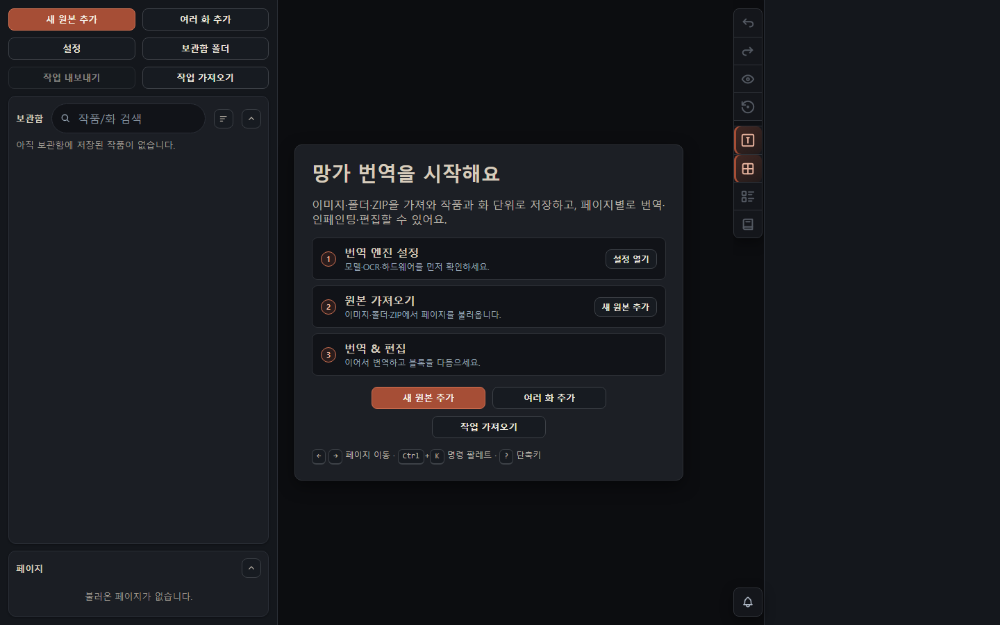
</p>

> **처음부터 완벽하게 설정할 필요는 없습니다.**
>
> 일단 한두 페이지만 번역해 보고, 결과가 마음에 들지 않을 때 OCR 품질과 번역 방식을 바꾸는 편이 쉽습니다.

---

## 먼저 알아둘 말 네 개

| 이름       | 아주 쉽게 말하면               | 앱에서 하는 일                      |
| ---------- | ------------------------------ | ----------------------------------- |
| **작품**   | 큰 서랍                        | 같은 만화의 여러 화를 묶습니다.     |
| **화**     | 서랍 안의 파일철               | 여러 페이지를 한 회차로 묶습니다.   |
| **페이지** | 이미지 한 장                   | PNG, JPG, WEBP 한 장입니다.         |
| **블록**   | 말풍선 위에 붙이는 투명 스티커 | 번역문, 위치, 폰트와 색을 담습니다. |

그리고 작업 과정에는 세 가지 도구가 등장합니다.

- **OCR**: 이미지에서 글자를 찾아 베껴 쓰는 눈입니다.
- **번역 엔진**: OCR 글자와 페이지를 보고 자연스러운 번역문을 만듭니다.
- **인페인팅**: 원문 글씨가 있던 자리를 주변 배경처럼 메우는 지우개입니다.

---

## 1. 다운로드하고 설치하기

### Windows

1. [GitHub Releases](https://github.com/ucx0204/CarrotMangaTranslator/releases)에서 Windows용 `Setup.exe`를 받습니다.
2. 설치 파일을 실행합니다.
3. 처음 실행할 때 Windows 경고가 나오면 파일을 받은 위치와 릴리스 체크섬을 먼저 확인하세요.

### Apple Silicon Mac

1. 같은 릴리스 페이지에서 arm64용 DMG 또는 ZIP을 받습니다.
2. 앱을 `응용 프로그램`으로 옮깁니다.
3. 처음 실행이 막히면 `시스템 설정 → 개인정보 보호 및 보안`에서 직접 승인합니다.

> Intel Mac은 지원하지 않습니다. macOS 14 이상, M1 이상의 Apple Silicon Mac이 필요합니다.

### 설치 전에 확인할 것

- 모델과 OCR 파일 때문에 앱 본체 외에 **수 GB 이상의 여유 공간**이 필요할 수 있습니다.
- 첫 모델 다운로드, Codex/API 사용에는 인터넷이 필요합니다.
- 로컬 모델은 준비가 끝나면 오프라인에서도 사용할 수 있습니다.
- GPU가 없어도 일부 CPU 경로를 쓸 수 있지만 OCR과 인페인팅은 느릴 수 있습니다.

---

## 2. 처음 한 번만 설정하기

### 2-1. 번역 엔진과 언어 고르기

`설정 → 번역 엔진`을 엽니다.

<p align="center">
  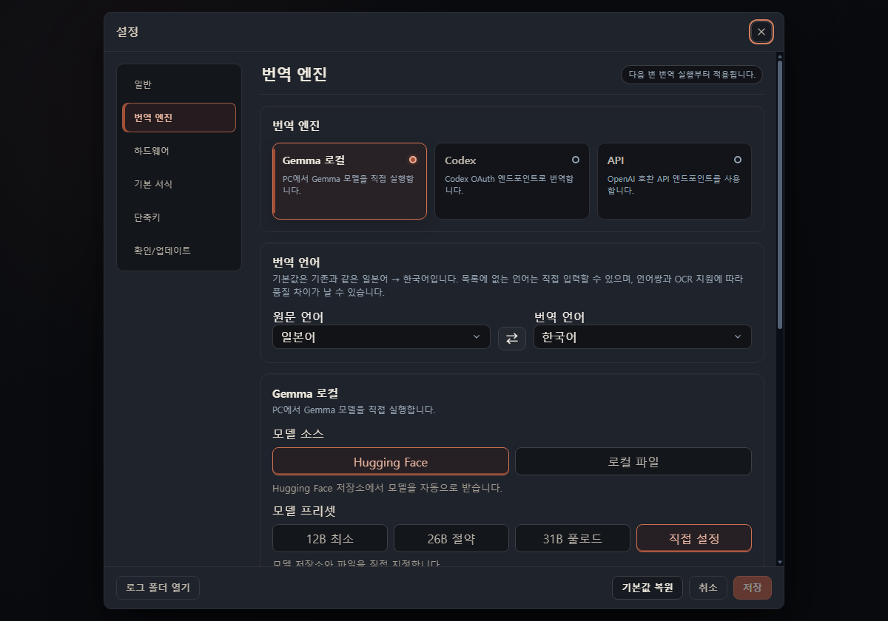
</p>

기본적인 일본 만화 번역이라면 다음처럼 시작하세요.

- **원문 언어**: 일본어
- **번역 언어**: 한국어
- **번역 엔진**: 아래 셋 중 하나

| 엔진           | 이런 사람에게 적합합니다                        | 준비할 것                          |
| -------------- | ----------------------------------------------- | ---------------------------------- |
| **Gemma 로컬** | 내 PC 안에서 처리하고 싶습니다.                 | 모델 다운로드, 충분한 RAM/VRAM     |
| **Codex**      | Codex CLI에 로그인해서 사용하고 싶습니다.       | Codex CLI 설치와 로그인, 인터넷    |
| **API**        | OpenAI 호환 비전 서버나 로컬 서버를 연결합니다. | Base URL, 모델 ID, 필요하면 API 키 |

고민된다면 PC 사양에 맞는 Gemma 프리셋부터 시도하면 됩니다. 로컬 모델이 너무 느리거나 메모리가 부족하면 Codex 또는 API로 바꿀 수 있습니다.

> **앱 언어와 번역 언어는 별개입니다.**
>
> 버튼을 한국어로 보면서 일본어 만화를 한국어로 번역할 수 있습니다. 앱 화면을 영어로 바꿔도 번역 언어쌍은 바뀌지 않습니다.

### 2-2. OCR과 하드웨어 확인하기

`설정 → 하드웨어`를 엽니다.

<p align="center">
  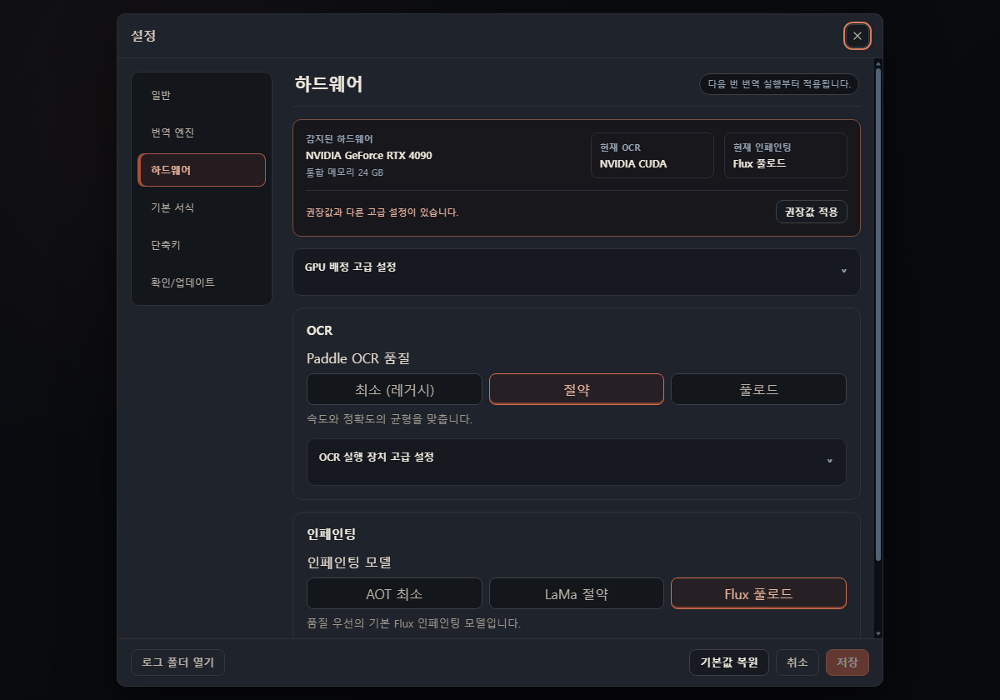
</p>

처음에는 이렇게 고르면 무난합니다.

- **OCR 품질**: `절약`
- **인페인팅**: 빠르게 시험하려면 `AOT 최소` 또는 `LaMa 절약`
- **장치**: 앱이 제안하는 권장값

그다음 `설정 → 확인/업데이트 → OCR/모델 확인`을 누릅니다. 필요한 파일이 없다면 앱이 준비합니다.

<p align="center">
  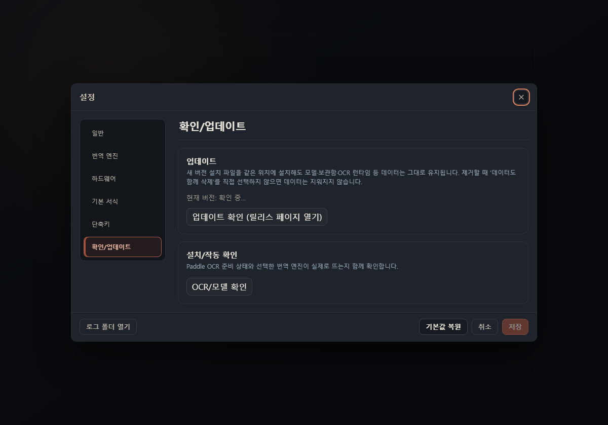
</p>

첫 실행만 오래 걸릴 수 있습니다. 다운로드와 체크섬 검사가 끝나기 전에 앱을 종료하지 마세요.

---

## 3. 첫 작품 가져오기

왼쪽 위의 `새 원본 추가`를 누릅니다.

- 이미지 한 장: `이미지 열기`
- 여러 이미지가 든 폴더: `폴더 열기`
- ZIP 또는 CBZ: `압축파일 열기`
- 웹 페이지의 이미지: `링크로 열기`
- 여러 화를 한 번에: `여러 화 추가` 또는 `작품 일괄 번역`

버튼을 누르는 대신 파일 탐색기에서 여러 이미지, 이미지 폴더 하나 또는 ZIP/CBZ 하나를 앱 어디에나 끌어 놓아도 됩니다. 폴더와 압축파일은 다른 항목과 섞지 말고 하나씩 놓아 주세요.

<p align="center">
  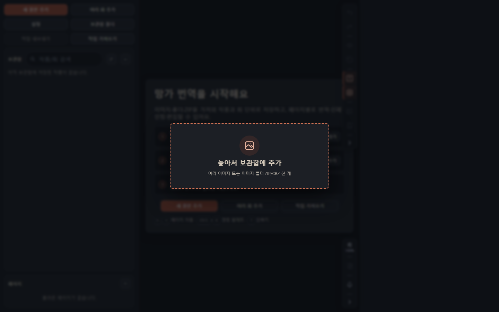
</p>

`링크로 열기`에서는 공개 웹 페이지 주소를 입력한 뒤 이미지 크기를 `전체`, `중간이상`, `최대`로 걸러 볼 수 있습니다. 필요한 이미지만 선택하면 페이지에 나타난 순서대로 `1.jpg`, `2.png`처럼 번호를 붙여 기존 보관함 추가 창으로 이어집니다.

<p align="center">
  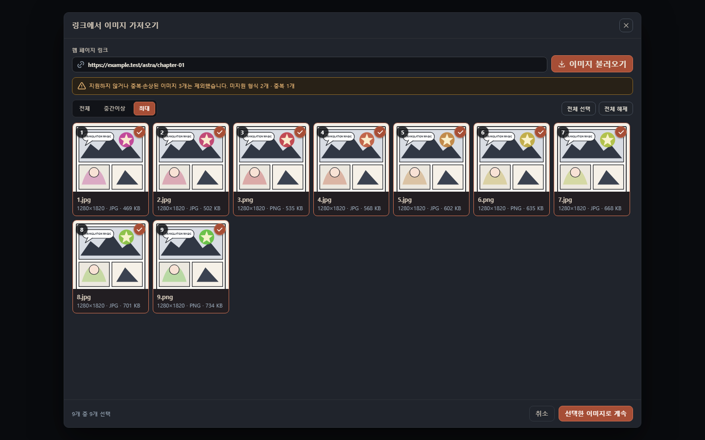
</p>

파일을 고르면 작품 제목과 화 제목을 확인하는 창이 나옵니다.

<p align="center">
  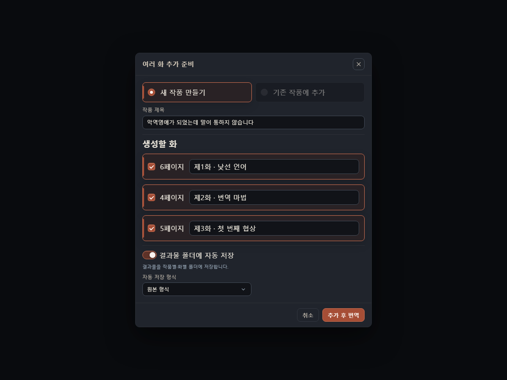
</p>

여기서는 세 가지만 확인하면 됩니다.

1. 새 작품을 만들지, 기존 작품에 붙일지 고릅니다.
2. 작품 제목을 적습니다.
3. 가져올 화에 체크하고 `추가 후 번역`을 누릅니다.

지원하는 형식은 PNG, JPG, JPEG, WEBP, ZIP, CBZ입니다. 폴더와 압축파일 안의 이미지는 파일명 기준으로 자연 정렬됩니다.

<details>
<summary><strong>가져오기 제한과 보관함 기능</strong></summary>

- WEBP는 보관함에 넣을 때 PNG로 정규화됩니다.
- 입력 파일 하나는 256MB, 디코딩한 이미지는 120MP를 넘지 않아야 합니다.
- 작품·화 검색과 정렬, 이름 변경, 삭제를 지원합니다.
- 화와 페이지는 드래그해서 순서를 바꿀 수 있습니다.
- 필요 없는 페이지는 개별 삭제할 수 있습니다.

</details>

---

## 4. 번역할 페이지 고르기

화 카드의 `번역`을 누르면 번역 실행 창이 열립니다.

<p align="center">
  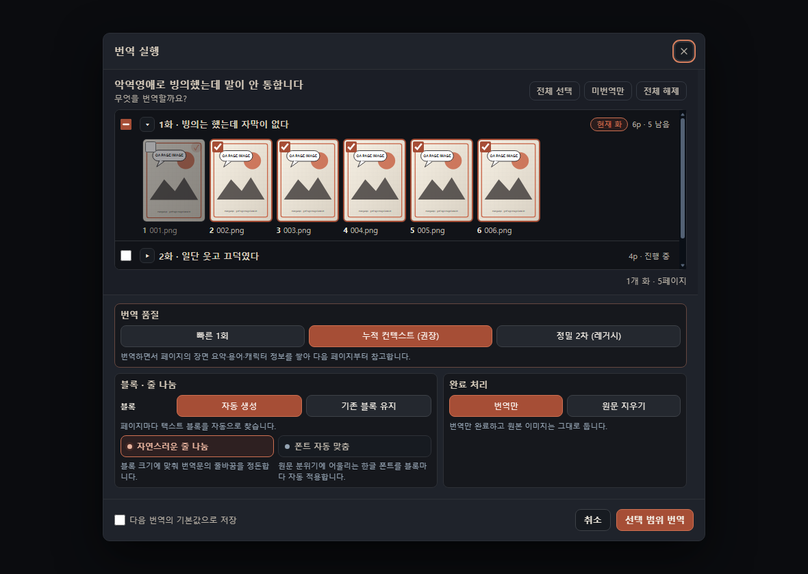
</p>

### 처음에는 이렇게 고르세요

- **범위**: `미번역만`
- **번역 품질**: `누적 컨텍스트 (권장)`
- **블록**: `자동 생성`
- **줄 나눔**: `자연스러운 줄 나눔`
- **완료 처리**: 우선 `번역만`

마지막에 `선택 범위 번역`을 누릅니다.

### 선택지가 무슨 뜻인가요?

| 선택지             | 하는 일                                                 | 언제 쓰나요?                   |
| ------------------ | ------------------------------------------------------- | ------------------------------ |
| **빠른 1회**       | 페이지를 빠르게 한 번 번역합니다.                       | 시험 번역이나 속도가 중요할 때 |
| **누적 컨텍스트**  | 앞 페이지의 장면·용어를 다음 페이지에서 참고합니다.     | 대부분의 일반 작업             |
| **자동 생성**      | OCR과 AI 결과로 새 블록을 만듭니다.                     | 처음 번역할 때                 |
| **기존 블록 유지** | 사람이 만든 블록 위치와 서식은 두고 글만 다시 채웁니다. | 배치를 보존하며 재번역할 때    |

원문 지우기까지 한 번에 할 수도 있습니다.

<p align="center">
  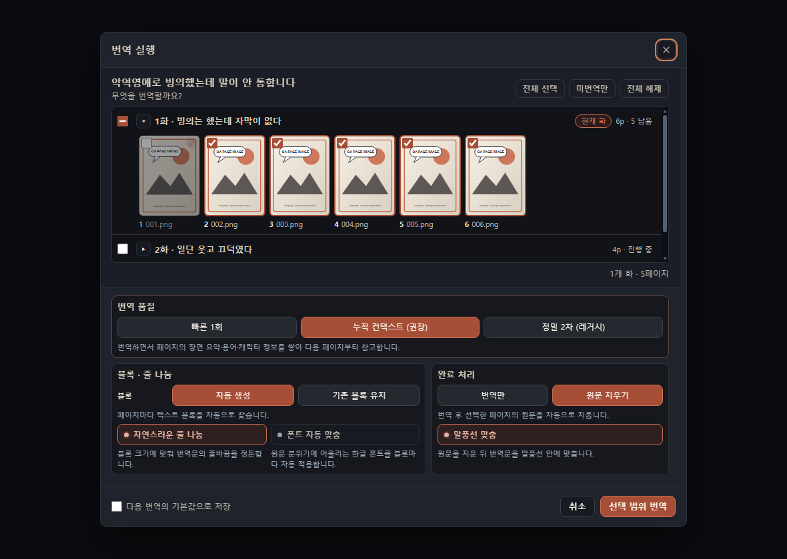
</p>

다만 처음에는 `번역만`으로 결과를 확인하는 편이 편합니다. 문장이 괜찮은지 본 뒤 원문을 지워도 늦지 않습니다.

> **번역이 이상하면 바로 전체를 다시 돌리지 마세요.**
>
> 한 페이지를 먼저 시험하고, 원문 언어·OCR 결과·캐릭터 이름을 확인한 다음 재번역하면 시간과 사용량을 아낄 수 있습니다.

---

## 5. 번역문과 말풍선 다듬기

번역이 끝나면 이미지 위에 블록이 생깁니다. 블록 하나를 클릭하면 편집 패널이 열립니다.

### 5-1. 글 고치기

<p align="center">
  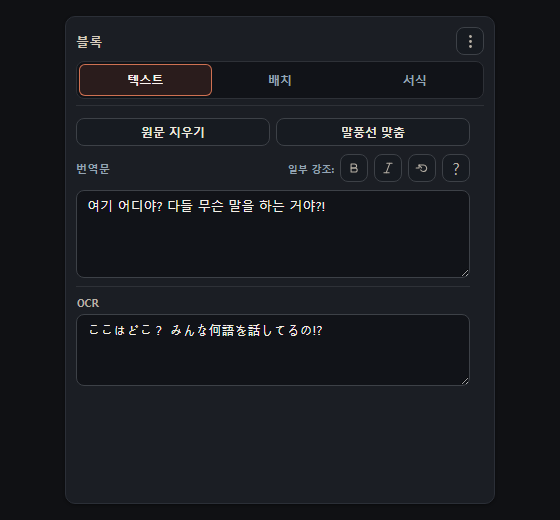
</p>

- **번역문**: 독자에게 보일 글입니다. 직접 고칠 수 있습니다.
- **OCR**: 앱이 원문에서 읽은 글입니다. 잘못 읽었다면 고친 뒤 다시 번역할 수 있습니다.
- **원문 지우기**: 이 블록 아래의 원문 배경을 지웁니다.
- **말풍선 맞춤**: 번역 블록을 말풍선 안에 맞춥니다.

일부 글자만 굵게 또는 기울임으로 표시할 수도 있습니다.

```text
**굵게**
*기울임*
***굵게 + 기울임***
```

### 5-2. 위치와 크기 맞추기

<p align="center">
  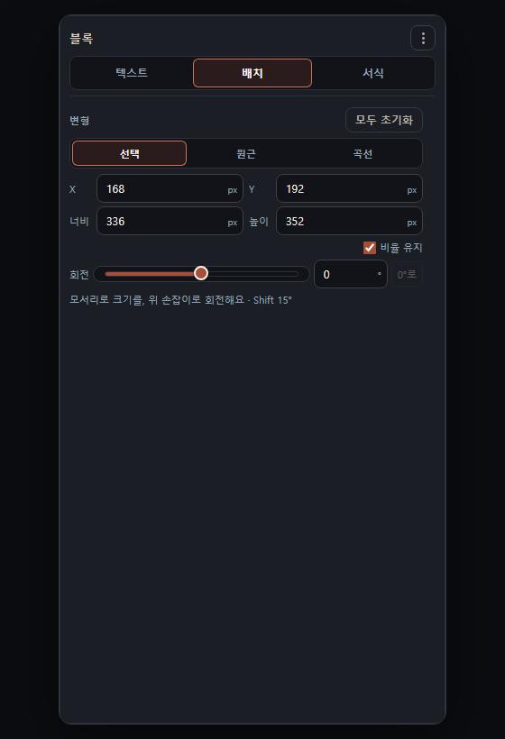
</p>

- 선택 도구로 블록을 끌어 이동합니다.
- 모서리 손잡이로 크기를 바꿉니다.
- `X`, `Y`, 너비와 높이를 숫자로 정확히 적을 수도 있습니다.
- 회전 슬라이더로 기울어진 말풍선에 맞춥니다.
- `Ctrl+클릭`으로 여러 블록을 함께 선택할 수 있습니다.

### 5-3. 글꼴과 색 정하기

<p align="center">
  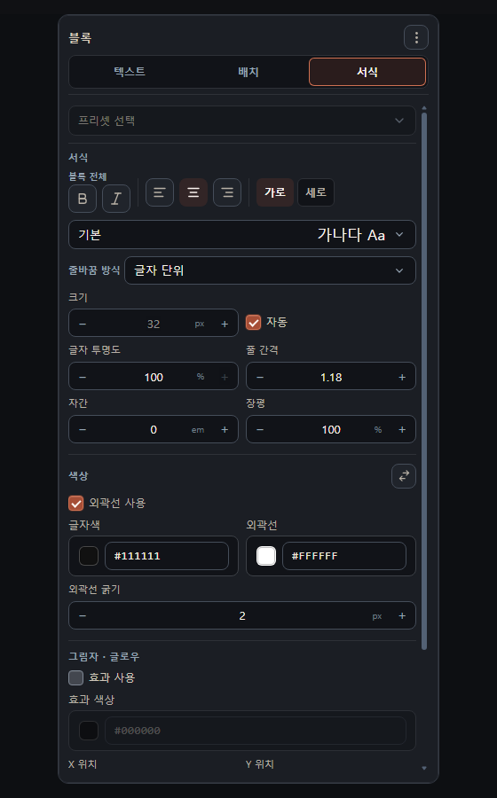
</p>

가로쓰기·세로쓰기, 정렬, 폰트, 크기, 자동 맞춤, 줄 간격, 자간, 장평, 투명도, 글자색과 외곽선을 바꿀 수 있습니다.

같은 모양을 계속 쓴다면 `설정 → 기본 서식`에서 기본값을 먼저 정하거나, 서식 프리셋으로 저장하세요.

<p align="center">
  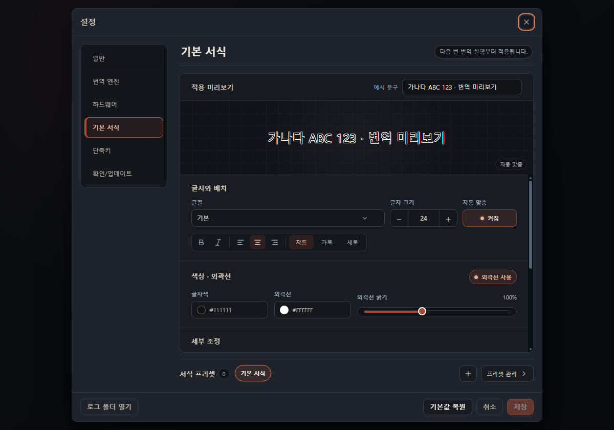
</p>

선택한 서식은 여러 블록, 현재 페이지 또는 현재 화에 한꺼번에 적용할 수 있습니다.

---

## 6. 원문 지우기

번역문을 확인했다면 인페인팅으로 원문 글씨를 지웁니다.

<p align="center">
  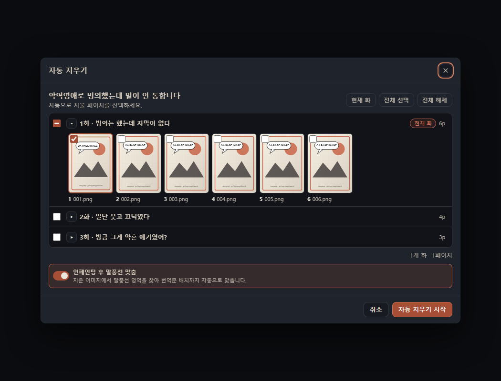
</p>

1. 지울 페이지를 체크합니다.
2. `인페인팅 후 말풍선 맞춤`을 켤지 정합니다.
3. `자동 지우기 시작`을 누릅니다.
4. 결과에 작은 자국이 남았다면 붓으로 보정합니다.

### 어떤 인페인팅을 골라야 하나요?

| 방식            | 특징                                     | 추천 상황                   |
| --------------- | ---------------------------------------- | --------------------------- |
| **AOT 최소**    | 가장 가볍고 실행 가능성을 우선합니다.    | 처음 시험할 때              |
| **LaMa 절약**   | 비교적 가벼운 만화 특화 원문 제거입니다. | 일반 말풍선                 |
| **Flux 풀로드** | 복잡한 배경 품질을 우선합니다.           | 충분한 GPU와 시간이 있을 때 |

자동 결과가 완벽하지 않아도 괜찮습니다. 마스크 붓으로 지울 곳을 더 칠하고, 복원 붓·색 붓·색 뽑기로 작은 부분만 마무리할 수 있습니다. 보정에도 실행 취소와 다시 실행을 사용할 수 있습니다.

<details>
<summary><strong>앱 안의 인페인팅 안내를 크게 보기</strong></summary>

<p align="center">
  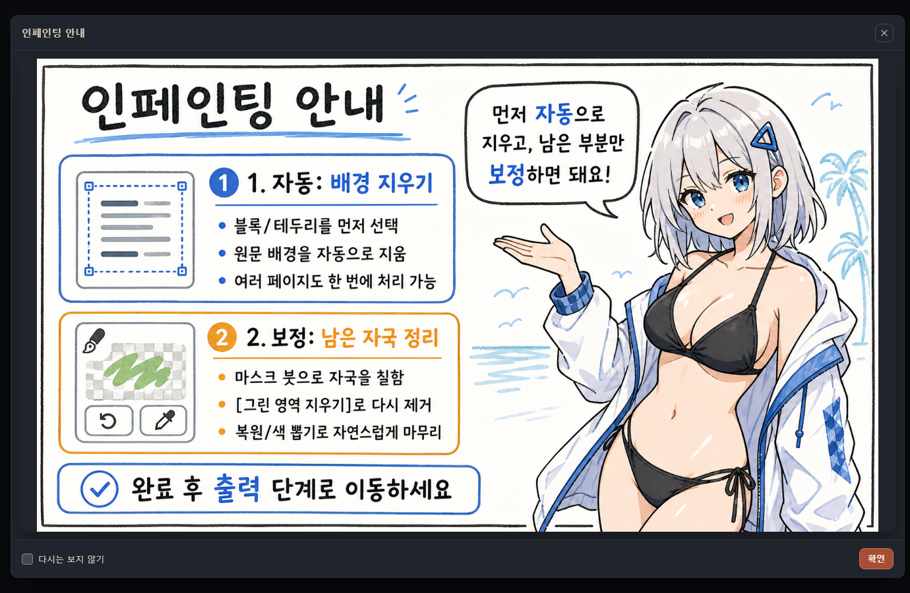
</p>

</details>

---

## 7. 결과물 출력하기

메인 화면의 `결과물 출력`에서 페이지와 파일 형식을 고릅니다. 현재 페이지만 고를 수도 있고, 현재 화나 여러 화의 원하는 페이지만 한 번에 선택할 수도 있습니다.

- **완성 이미지 (PNG)**: 번역문과 배경을 합친, 바로 게시할 수 있는 최종 이미지입니다.
- **레이어 문서 (PSD)**: `원본 배경`, `정리 배경 (Inpaint)`, 블록별 대사를 각각 나눠 저장합니다.
- **글자 없이 출력**: PNG에서는 인페인팅된 배경만, PSD에서는 원본과 정리 배경 레이어만 남깁니다.

<p align="center">
  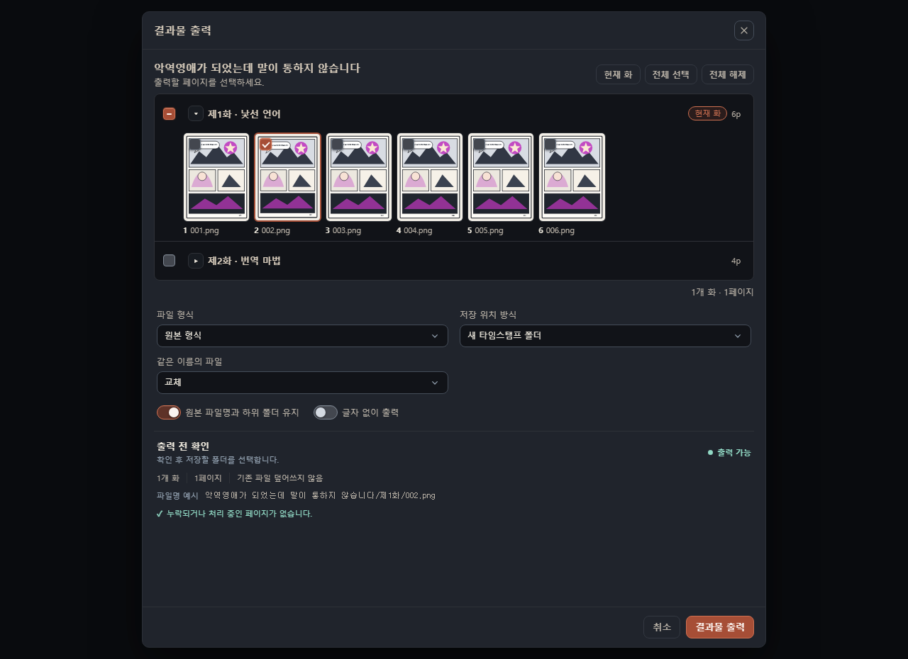
</p>

가로쓰기처럼 PSD 텍스트로 안전하게 표현할 수 있는 블록은 편집 가능한 텍스트 정보도 함께 넣습니다. 세로쓰기·곡선·원근처럼 복잡한 대사는 앱 화면과 모양이 달라지지 않도록 블록별 래스터 레이어로 보존합니다. 두 형식 모두 위치, 방향, 폰트, 색, 외곽선, 회전이 반영됩니다.

출력 전 점검은 선택 페이지 수, 파일명 예시, 누락된 번역이나 처리 중인 페이지를 보여 줍니다. 기존 파일은 덮어쓰지 않고 새 시간 폴더에 저장합니다. 원본 미리보기와 블록 표시도 번갈아 보면서 빠진 말풍선이 없는지 확인하세요.

> 여기까지 왔다면 첫 번역은 끝입니다. 아래 기능은 필요해졌을 때 하나씩 사용하면 됩니다.

---

## 번역이 길어질 때 유용한 기능

### 모든 대사를 한 화면에서 보기

페이지를 오가며 문장을 찾기 귀찮다면 `텍스트 모아보기`를 엽니다.

<p align="center">
  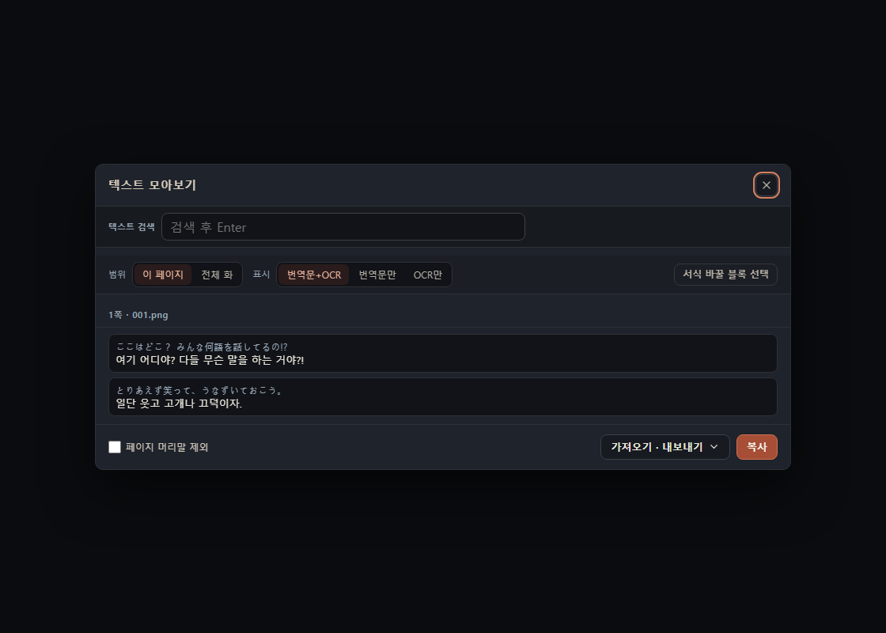
</p>

- 현재 페이지 또는 전체 화를 봅니다.
- `번역문+OCR`, `번역문만`, `OCR만` 중에서 고릅니다.
- 문장을 검색하고 결과 블록으로 바로 이동합니다.
- 내용을 복사하거나 TXT로 저장합니다.

### 현재 페이지나 전체 화에서 한꺼번에 바꾸기

`Ctrl+H` 또는 명령 팔레트의 `검색 및 치환`을 열면 여러 블록의 같은 이름·말투를 한 번에 고칠 수 있습니다.

<p align="center">
  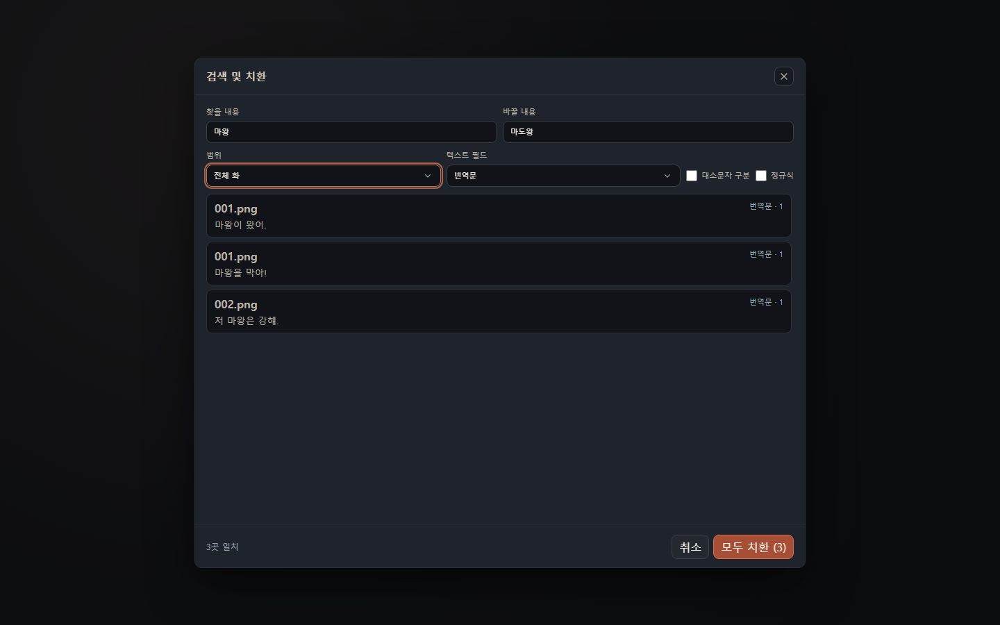
</p>

- 범위를 `현재 페이지` 또는 `전체 화`로 정합니다.
- `번역문`, `원문`, `둘 다` 중 검색할 텍스트를 고릅니다.
- 대소문자 구분과 정규식을 필요할 때만 켭니다.
- 결과를 눌러 해당 블록으로 이동해 확인한 뒤 `모두 치환`합니다.
- 한 번의 편집 기록으로 저장되므로 결과가 마음에 들지 않으면 실행 취소할 수 있습니다.

### 다른 사람에게 검수받기

<p align="center">
  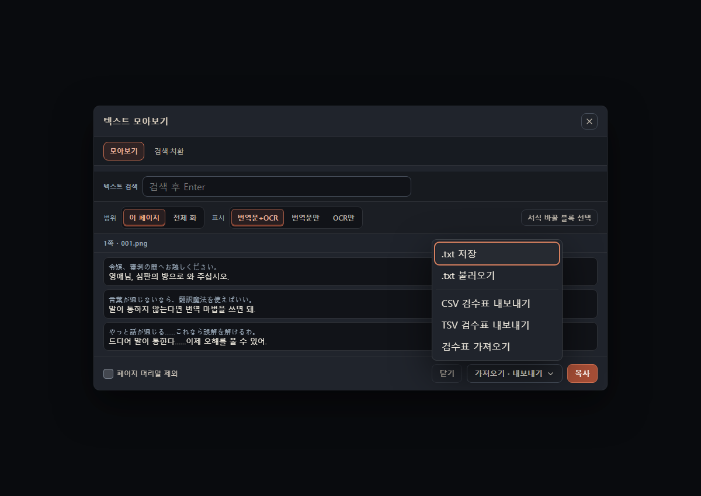
</p>

- `번역문만` TXT를 내보내 고친 뒤 다시 불러올 수 있습니다.
- CSV/TSV 검수표에는 블록 ID, OCR, 번역문, 검수 상태와 메모가 들어갑니다.
- 검수표를 다시 가져오면 같은 블록 ID의 번역문·상태·메모만 갱신합니다.
- 누락, 중복, OCR 불일치가 있으면 경고합니다.

### 이름과 말투를 작품 전체에서 통일하기

`용어/기억`에는 네 개의 탭이 있습니다.

#### 용어집

<p align="center">
  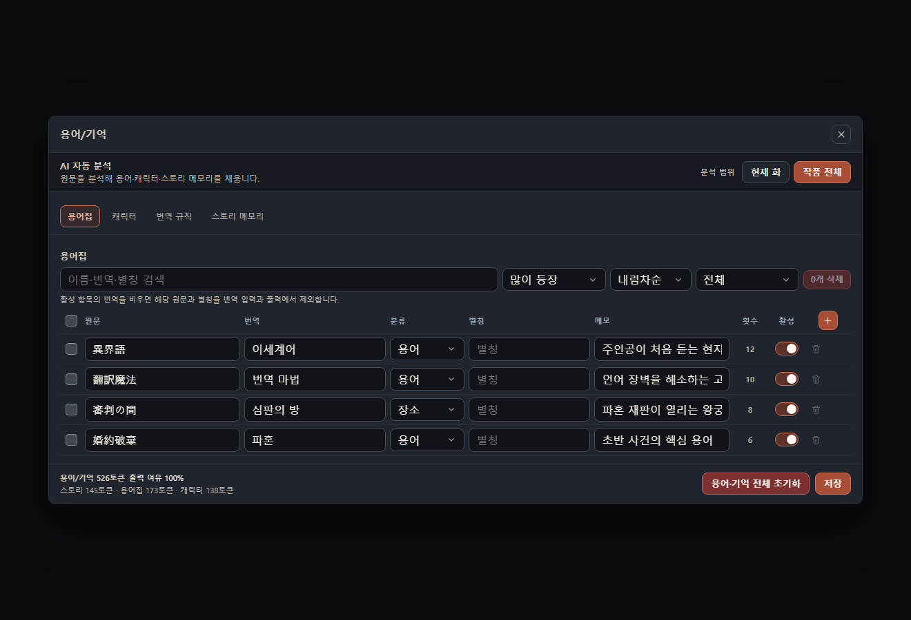
</p>

자주 나오는 이름, 지명, 기술명을 한 번 정해 둡니다. 예를 들어 같은 사람을 어떤 페이지에서는 `엘로디`, 다른 페이지에서는 `에로디`로 번역하는 일을 줄일 수 있습니다.

#### 캐릭터

<p align="center">
  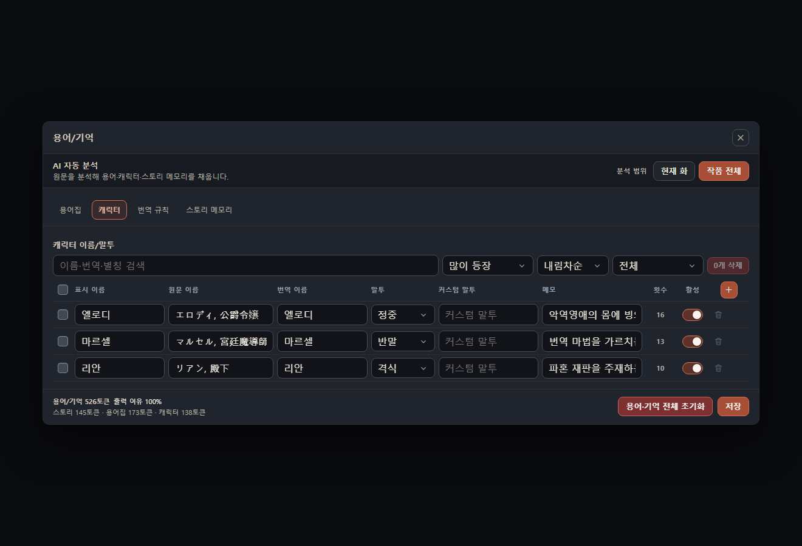
</p>

캐릭터별 원문·번역 이름, 존댓말·반말과 직접 작성한 말투 지침을 저장합니다.

#### 번역 규칙

<p align="center">
  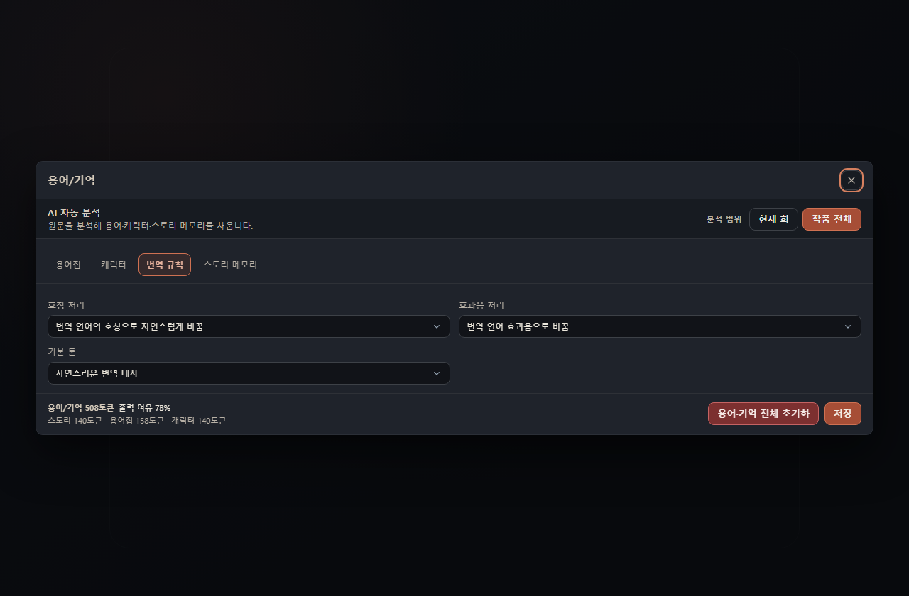
</p>

호칭, 효과음과 작품 전체 문체를 정합니다. 특정 작품에서만 지켜야 할 규칙도 메모할 수 있습니다.

#### 스토리 메모리

<p align="center">
  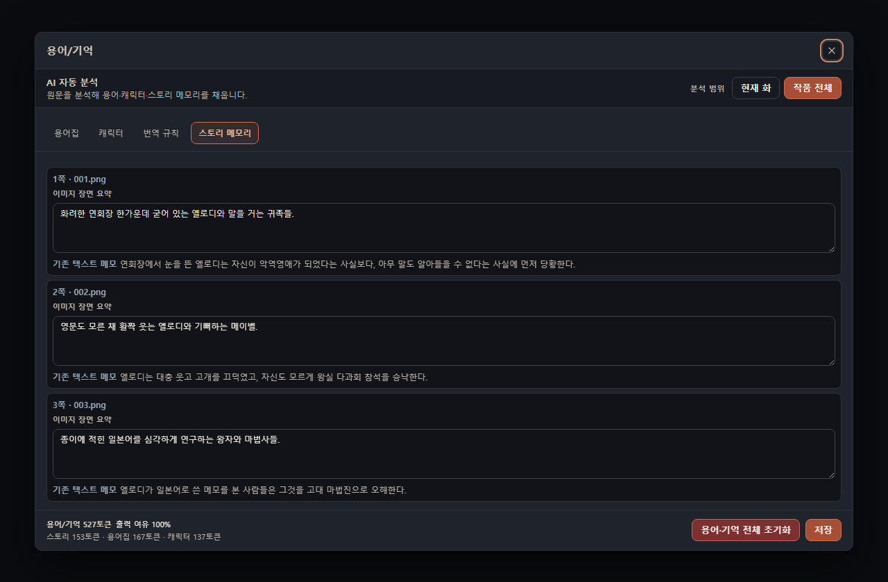
</p>

이전 페이지에서 일어난 일을 짧게 저장합니다. 누적 컨텍스트와 재번역이 뒤 장면을 이해할 때 참고합니다. `AI 자동 분석`으로 용어집, 캐릭터, 규칙과 스토리 메모리를 먼저 채울 수도 있습니다.

> 저장할 정보가 많을수록 무조건 좋은 것은 아닙니다. 화면 아래의 토큰 예산을 보면서 꼭 필요한 이름과 사건만 남기면 번역문에 쓸 여유가 늘어납니다.

---

## 편집을 더 편하게 만드는 기능

### 여러 블록과 읽기 순서 정리하기

- 선택 도구에서 빈 곳부터 드래그하면 사각형 안의 블록을 여러 개 고릅니다. `Ctrl`을 누른 채 드래그하거나 목록을 클릭하면 기존 선택에 더하거나 뺄 수 있고, `Shift` 클릭은 범위를 선택합니다.
- 오른쪽 `현재 페이지 블록` 목록의 위·아래 버튼으로 저장되는 읽기 순서를 바꿉니다. `좌표순 정렬`은 작품의 좌→우/우→좌 설정에 맞춰 순서를 다시 계산합니다.
- 이 순서는 이전/다음 블록 이동, 텍스트 모아보기와 검수표처럼 블록을 차례대로 다루는 기능에서 함께 사용됩니다.
- 여러 선택 블록은 함께 삭제하거나 같은 서식을 한 번에 적용할 수 있고, 기준 블록은 복제할 수 있습니다.

### 폰트 자동 맞춤 v2

한국어 번역에서 `설정 → 번역 → 폰트 자동 맞춤`을 켜면 원문의 굵기와 분위기를 보고 21개 한국어 후보 중 블록에 어울리는 폰트를 고릅니다. v1.12.1의 v2 런타임은 일반 대사와 강조 계열을 분리해 평가하고, 본문에 개성체 `Single Day`가 잘못 들어가지 않도록 별도 안전 조건을 적용합니다. 사용자가 직접 고정한 폰트와 외곽선·색은 덮어쓰지 않으며, 자동 선택은 `자동 폰트 선택 되돌리기`로 되돌릴 수 있습니다.

처음 사용할 때 약 467MB의 비전 모델 자산이 필요합니다. 기존 v1 캐시에 SHA-256이 같은 대형 파일이 있으면 검증 후 재사용하고, 없으면 GitHub Releases에서 한 번 내려받습니다. 릴리스 승인·파일 크기·해시 중 하나라도 맞지 않으면 자동 적용을 끄고 기존 폰트를 유지합니다.

### 내 폰트 추가하기

<p align="center">
  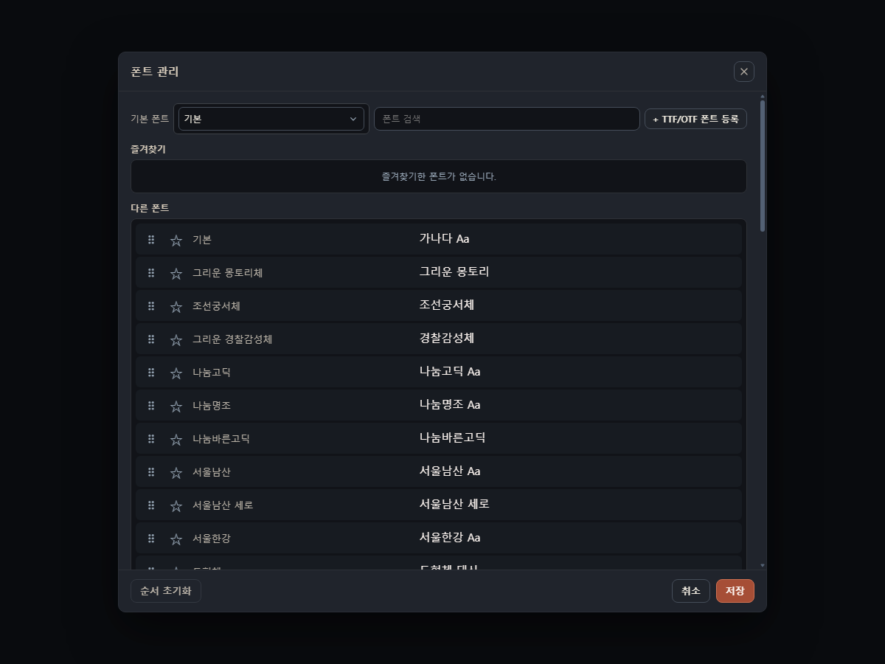
</p>

`+ TTF/OTF 폰트 등록`으로 폰트를 추가할 수 있습니다. 등록한 폰트는 화면 미리보기와 PNG·PSD 결과물에 함께 사용됩니다.

앱에는 한국어 폰트와 함께 다음 언어용 무료 폰트가 각 6개씩 포함됩니다.

| 그룹        | 포함 폰트                                                                                      |
| ----------- | ---------------------------------------------------------------------------------------------- |
| 영어        | Comic Neue, Kalam, Bangers, Luckiest Guy, Permanent Marker, Freckle Face                       |
| 일본어      | Yusei Magic, Mochiy Pop One, Hachi Maru Pop, Dela Gothic One, Reggae One, DotGothic16          |
| 중국어 간체 | ZCOOL KuaiLe, ZCOOL QingKe HuangYou, ZCOOL XiaoWei, Ma Shan Zheng, Long Cang, Liu Jian Mao Cao |
| 중국어 번체 | Huninn, Iansui, LXGW WenKai TC, LXGW Marker Gothic, ChenYuluoyan, Cubic 11                     |

폰트 출처와 라이선스는 [번들 폰트 고지](third_party/fonts/README.md)에서 확인할 수 있습니다.

### 단축키 보기와 바꾸기

`?`를 누르면 현재 단축키를 빠르게 볼 수 있습니다.

<p align="center">
  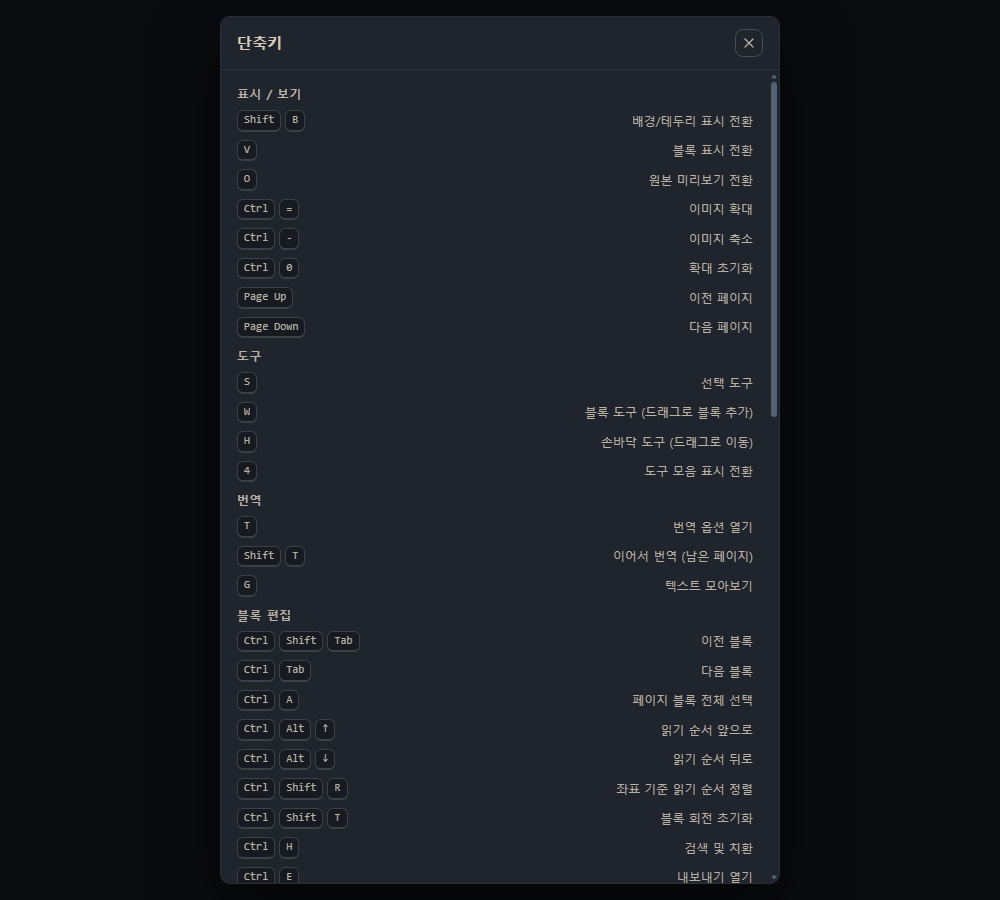
</p>

원하는 키로 바꾸려면 `설정 → 단축키`를 엽니다.

<p align="center">
  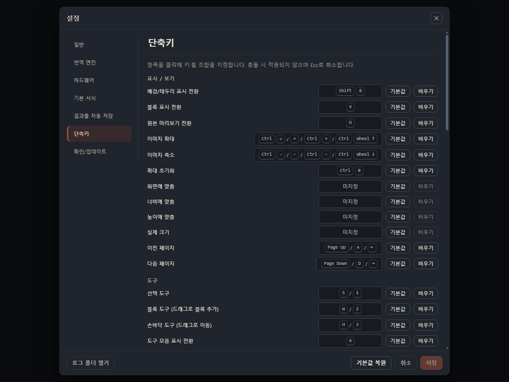
</p>

자주 쓰는 기본 키는 다음과 같습니다.

- `Ctrl+K`: 명령 팔레트
- `?`: 단축키 도움말
- `Ctrl+Z`: 실행 취소
- `Ctrl+Shift+Z`: 다시 실행
- `PageUp` / `PageDown`: 이전/다음 페이지
- `S` / `W` / `H` (`1` / `2` / `3`도 가능): 선택/블록/손바닥 도구
- `Ctrl+H`: 검색 및 치환
- `Ctrl+E`: 결과물 출력
- `Ctrl+A`: 현재 페이지 블록 전체 선택
- `Ctrl+Alt+↑` / `Ctrl+Alt+↓`: 읽기 순서 앞으로/뒤로
- `Ctrl+Shift+R`: 좌표 기준 읽기 순서 정렬
- `Alt+1` … `Alt+0`: 서식 프리셋 슬롯 1~10 적용

현재 화의 편집은 최대 100단계 실행 취소와 다시 실행을 지원합니다.

### 작업 파일로 공유하기

<p align="center">
  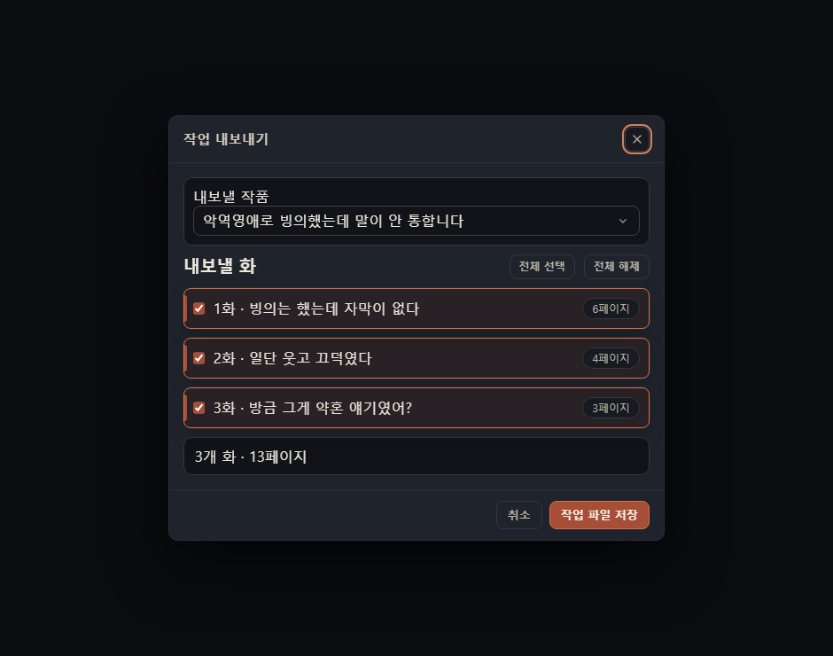
</p>

`*.mgtshare`는 완성 PNG나 PSD가 아니라 **다른 컴퓨터에서 다시 편집할 수 있는 작업 파일**입니다.

포함할 수 있는 것:

- 원본 이미지
- 번역 블록과 좌표
- 글꼴·색·방향 같은 서식
- 인페인팅 결과

포함하지 않는 것:

- 앱 설정
- 로그인 정보와 API 키
- AI/OCR 모델
- 로그

가져올 때 새 작품을 만들거나 기존 작품에 화를 추가·교체할 수 있습니다. 저작권이 있는 원본 이미지를 포함해 공유한다면 배포 권한을 먼저 확인하세요.

---

## 설정 화면 전체 지도

| 탭                | 바꾸는 것                                           |
| ----------------- | --------------------------------------------------- |
| **일반**          | 앱 버튼과 메뉴의 표시 언어                          |
| **번역 엔진**     | 원문·번역 언어, Gemma/Codex/API와 고급 요청 값      |
| **하드웨어**      | OCR 품질·장치, Gemma GPU 런타임, 인페인팅 모델      |
| **기본 서식**     | 새 블록의 방향, 정렬, 폰트, 크기, 간격, 색과 외곽선 |
| **단축키**        | 보기, 번역, 편집과 인페인팅 키 조합                 |
| **확인/업데이트** | OCR·모델 준비 확인, 앱 업데이트와 로그 폴더         |

<p align="center">
  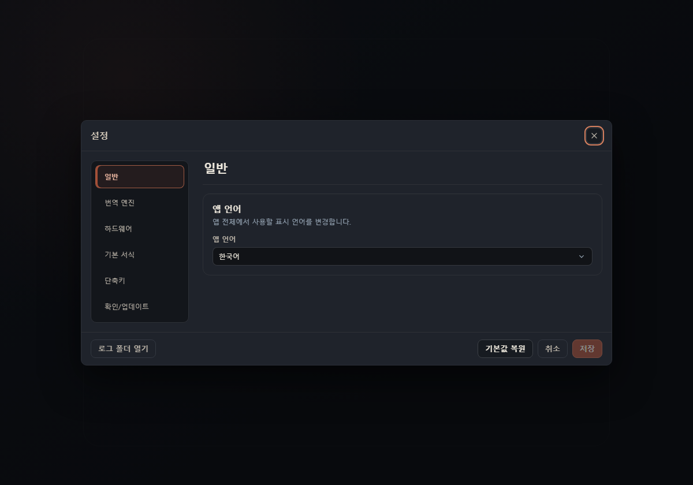
</p>

앱 화면은 한국어, 일본어, 영어, 중국어 간체와 중국어 번체를 지원합니다. 만화 원문·번역 언어는 48개 프리셋과 직접 입력한 BCP 47 언어 코드를 지원합니다.

---

## 막히면 여기부터 확인하세요

### 번역 버튼을 눌러도 시작하지 않습니다

1. 번역할 페이지가 체크되어 있는지 확인합니다.
2. `설정 → 확인/업데이트 → OCR/모델 확인`을 실행합니다.
3. 원문 언어와 번역 엔진이 선택되어 있는지 봅니다.
4. 로컬 모델이라면 모델 다운로드가 끝났는지 확인합니다.

### 첫 실행이나 첫 번역이 너무 느립니다

처음에는 모델, Python, OCR과 인페인팅 런타임 다운로드 및 검증 시간이 포함됩니다. 준비가 끝난 뒤에도 느리다면 다음 순서로 낮춰 보세요.

1. 더 작은 Gemma 프리셋
2. OCR `절약`
3. AOT 또는 LaMa 인페인팅
4. 동시에 실행 중인 게임과 GPU 작업 종료

### 번역문이 엉뚱합니다

- 원문 언어가 맞는지 확인합니다.
- 블록의 OCR 칸에 원문이 제대로 읽혔는지 봅니다.
- 이름이 계속 바뀐다면 용어집과 캐릭터 탭에 이름을 등록합니다.
- 한 페이지만 고쳐 재번역한 뒤 전체에 적용합니다.

### Codex 연결이 안 됩니다

PowerShell에서 `codex`가 실행되고 로그인되어 있는지 확인합니다. 앱에서 Codex 엔진을 다시 선택하고 `OCR/모델 확인`을 실행하세요. 포트 충돌이 의심되면 고급 설정의 `openai-oauth 포트`를 바꿉니다.

### API에서 401, 403 또는 404가 나옵니다

API 키, Base URL과 모델 ID를 확인합니다. Base URL에는 보통 `/v1`까지만 넣습니다. 모델이 이미지 입력을 지원해야 합니다. 서버가 지원하지 않는 고급 요청 값과 추가 JSON을 비운 뒤 다시 시험하세요.

### AMD OCR GPU가 실패합니다

OCR 장치만 CPU로 바꿔도 Gemma 번역은 AMD GPU에서 계속 실행할 수 있습니다. 지원 GPU·드라이버, 내장 GPU 동시 인식, VRAM 부족과 Windows TDR도 로그에서 확인하세요.

### AMD ZLUDA 인페인팅이 실패합니다

Windows용 AMD HIP SDK와 `HIP_PATH`를 확인하고 앱을 다시 실행합니다. 작업을 바로 이어가려면 Flux를 CPU로 바꾸거나 AOT/LaMa를 사용하세요.

### RTX 50번대에서 OCR이 실패합니다

최신 NVIDIA 드라이버와 앱의 RTX 50용 OCR 런타임을 확인합니다. 계속 실패하면 OCR만 CPU `절약`으로 바꿀 수 있습니다.

### 결과물의 폰트가 화면과 다릅니다

직접 등록한 폰트 파일이 삭제되지 않았는지 확인합니다. 다른 컴퓨터에서 작업 파일을 열었다면 그 폰트를 다시 등록해야 합니다. 출력 전에는 방향, 자동 맞춤, 굵기와 일괄 적용 범위도 확인하세요.

---

## 고급 설정

<details>
<summary><strong>Codex 엔진 준비</strong></summary>

Codex 엔진은 Codex CLI 로그인 정보를 로컬 OAuth 엔드포인트를 통해 사용합니다. 앱에 OpenAI API 키를 직접 입력하는 방식이 아닙니다.

PowerShell에서 Codex CLI를 설치합니다.

```powershell
powershell -ExecutionPolicy ByPass -c "irm https://chatgpt.com/codex/install.ps1 | iex"
```

새 PowerShell을 열고 로그인합니다.

```powershell
codex login
```

`codex`가 정상적으로 열리는지 확인한 뒤 앱에서 `Codex`를 선택하고 `OCR/모델 확인`을 실행합니다. 목록에 없는 모델은 `Custom`에 모델 ID를 입력할 수 있습니다.

공식 안내: [Codex CLI](https://learn.chatgpt.com/docs/codex/cli)

</details>

<details>
<summary><strong>OpenAI 호환 API, NVIDIA NIM과 Gemini</strong></summary>

API 엔진은 Base URL에 `/chat/completions`를 붙여 이미지와 OCR 힌트를 보냅니다. 선택한 모델이 이미지 입력을 지원해야 합니다.

- 일반 OpenAI 호환 서버: `https://server.example/v1`
- NVIDIA NIM: `https://integrate.api.nvidia.com/v1`
- Gemini OpenAI 호환: `https://generativelanguage.googleapis.com/v1beta/openai`
- LM Studio 같은 인증 없는 로컬 서버는 API 키를 비울 수 있습니다.

`Temperature`, `top_p`, `top_k`, `reasoning_effort`, 추가 request body JSON과 custom headers JSON도 설정할 수 있습니다. 서버가 값을 거부한다면 고급 값을 먼저 비우세요.

환경 변수로 값을 덮어쓸 수도 있습니다.

- OpenAI 공식 키: `OPENAI_API_KEY`
- 호환 서버: `MANGA_TRANSLATOR_API_BASE_URL`, `MANGA_TRANSLATOR_API_MODEL`, `MANGA_TRANSLATOR_API_KEY`

</details>

<details>
<summary><strong>NVIDIA와 AMD 경로</strong></summary>

| 작업       | NVIDIA                      | AMD                            | 가벼운 대안         |
| ---------- | --------------------------- | ------------------------------ | ------------------- |
| Gemma      | CUDA 12, RTX 50 전용 런타임 | ROCm 또는 Vulkan               | 더 작은 모델 프리셋 |
| Paddle OCR | CUDA Transformers           | 지원 GPU에서 ROCm Transformers | CPU 절약            |
| Flux       | NVIDIA CUDA                 | ZLUDA + AMD HIP SDK            | CPU, AOT, LaMa      |

AMD Gemma는 GPU와 드라이버에 맞는 ROCm target을 자동으로 찾습니다. 고급 사용자는 환경 변수로 직접 지정할 수 있습니다.

```powershell
$env:MANGA_TRANSLATOR_AMD_ROCM_TARGET = "gfx110X"
```

AMD ZLUDA 인페인팅에는 [Windows용 AMD HIP SDK](https://www.amd.com/en/developer/resources/rocm-hub/hip-sdk.html)가 필요합니다.

</details>

---

## 내 작업은 어디에 저장되나요?

설치 중 지정한 데이터 폴더 아래에 저장됩니다.

```text
data/
  settings.json
  library/
  logs/
  fonts/
  hf-cache/
  llama.cpp/
  ocr-runtime/
  models/
  tmp/
  panel-window-bounds.json
```

- `library/`: 작품, 화, 페이지와 블록 데이터
- `fonts/`: 직접 등록한 TTF/OTF
- `hf-cache/`, `llama.cpp/`, `ocr-runtime/`, `models/`: 모델과 런타임
- `logs/`: 현재 실행의 `app.log`와 직전 실행의 `previous.log`

macOS의 기본 데이터 위치는 `~/Library/Application Support/manga-gemma-translator`입니다. 중요한 작품은 데이터 폴더를 백업하거나 `*.mgtshare`로 내보내세요.

> 원본 로그에는 로컬 경로나 작품 내용이 들어갈 수 있습니다. 공개하기 전에 반드시 확인하고 가리세요.

---

## 문제를 보고하는 방법

작업이 실패하면 오류 보고 창이 열립니다. 다시 열려면 `Ctrl+K` 명령 팔레트에서 `문제 신고`를 선택합니다.

1. 오류 직전에 한 작업을 적습니다.
2. 자동 생성된 Markdown 미리보기를 확인합니다.
3. 필요하면 시스템 정보나 정제된 오류 로그를 제외합니다.
4. `GitHub에서 이슈 작성`을 눌러 [GitHub Issues](https://github.com/ucx0204/CarrotMangaTranslator/issues)에서 직접 제출합니다.

앱은 오류 보고서를 자동 업로드하거나 이슈를 자동 제출하지 않습니다. 민감한 값을 자동으로 가리지만 완벽하지 않으므로, 공개 전 미리보기를 꼭 확인하세요.

---

## 개발하기

필요 환경은 Windows, Node.js LTS, npm과 Git입니다.

```powershell
npm install
npm run dev
```

전체 검사:

```powershell
npm run check
```

빌드와 Windows 설치 파일 생성:

```powershell
npm run build
npm run dist:win
```

- 기여 안내: [CONTRIBUTING.md](CONTRIBUTING.md)
- 코드 구조와 품질 규칙: [docs/architecture.md](docs/architecture.md)
- 프로젝트 이용 현황: [docs/reputation.md](docs/reputation.md)

---

## 코드 서명 정책

Free code signing provided by [SignPath.io](https://about.signpath.io/), certificate by [SignPath Foundation](https://signpath.org/).

현재 Windows 릴리스 산출물에는 Authenticode 서명이 적용되지 않을 수 있습니다. 유효한 SignPath Foundation 서명이 있는 산출물만 해당 정책의 보호 대상입니다.

- [코드 서명 정책 전문](CODE_SIGNING_POLICY.md)
- [보안 정책](SECURITY.md)
- [개인정보 처리 안내](docs/privacy-policy.md)

## 데모 이미지

이 README의 새 사용법 화면은 저장소의 UI QA 도구로 실제 프로덕션 컴포넌트와 스타일을 렌더링해 캡처했습니다. 설명용 작품명, 인물과 대사는 가상의 예시이며 실제 작품을 인용하지 않습니다.

## 라이선스

앱 소스코드는 [GPL-3.0-only](LICENSE)로 배포합니다. 폰트, FFmpeg, JavaScript/Python 패키지, OCR·AI 모델과 런타임에는 각각 별도 조건이 적용될 수 있습니다. 재배포 전 [THIRD_PARTY_NOTICES.md](THIRD_PARTY_NOTICES.md)와 [번들 폰트 고지](third_party/fonts/README.md)를 확인하세요.
