

  

# 당근망가번역기

  <strong>OCR부터 번역, 식자, 원문 제거, 검수와 출력까지 한곳에서 처리하는 데스크톱 만화 번역 도구</strong>

  Windows 10/11 · Apple Silicon macOS 14+

  <strong>한국어</strong> ·
  <a href="README.en.md">English</a> ·
  <a href="README.ja.md">日本語</a> ·
  <a href="README.zh-Hans.md">简体中文</a> ·
  <a href="README.zh-Hant.md">繁體中文</a>

당근망가번역기는 사용자가 준비한 만화·코믹 이미지에서 대사와 효과음을 찾고, AI로 번역한 뒤, 화면 위에서 문장·배치·서식을 다듬어 PNG 또는 레이어 PSD로 내보내는 오픈소스 앱입니다. 이미지 한 장부터 여러 화가 든 폴더·압축파일·PDF·웹 페이지 링크까지 가져올 수 있고, 텍스트 일괄 편집으로 이름·말투·서식·검수 상태를 여러 블록에 한꺼번에 적용할 수 있습니다.

- 다운로드: [v2.4.0](https://github.com/ucx0204/CarrotMangaTranslator/releases/tag/v2.4.0) · [이전 버전](https://github.com/ucx0204/CarrotMangaTranslator/releases)
- 패치노트: [v2.4.0](docs/release-notes/v2.4.0.md)
- 오류 및 기능 제안: [GitHub Issues](https://github.com/ucx0204/CarrotMangaTranslator/issues)
- 라이선스: [GPL-3.0-only](LICENSE)

---

## 처음이라면 이 순서대로 하세요

처음 실행하면 빈 보관함과 시작 안내가 나타납니다.

  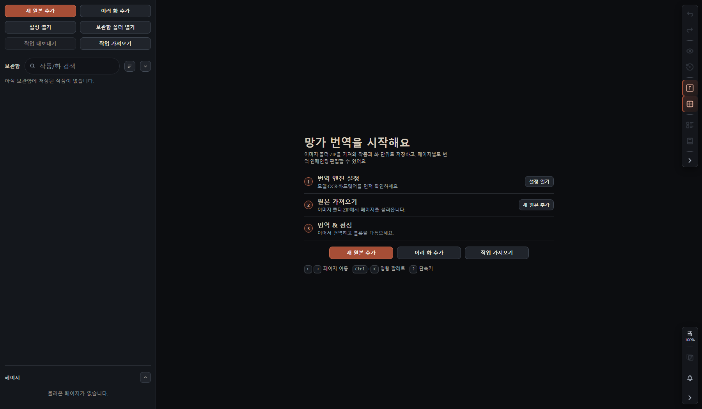

1. <strong>설정 열기</strong>에서 원문 언어, 번역 언어와 LLM을 정합니다.
2. <strong>하드웨어</strong>에서 OCR과 인페인팅 권장값을 적용합니다.
3. <strong>확인/업데이트</strong>에서 OCR·모델 준비 상태를 검사합니다.
4. <strong>새 원본 추가</strong>로 이미지, 폴더, 압축파일, PDF 또는 링크를 가져옵니다.
5. 화 카드의 <strong>번역</strong>을 열고 대표 페이지 한 장만 먼저 번역합니다.
6. OCR·번역문·글자 크기·원문 제거 결과가 괜찮은지 확인합니다.
7. 나머지 페이지를 번역하고 <strong>텍스트 모아보기</strong>와 <strong>일괄 편집</strong>으로 검수합니다.
8. <strong>내보내기</strong>에서 완성 PNG 또는 레이어 PSD를 만듭니다.

처음부터 한 화 전체를 처리하기보다 서로 다른 형태의 말풍선과 효과음이 있는 1~3페이지를 먼저 시험하는 편이 좋습니다. 잘못된 언어·OCR·폰트·인페인팅 설정을 일찍 발견하면 재작업과 API 사용량을 크게 줄일 수 있습니다.

---

## 네 가지 작업 단위

| 단위                    | 뜻                                | 함께 저장되는 내용                            |
| ----------------------- | --------------------------------- | --------------------------------------------- |
| <strong>작품</strong>   | 여러 화를 묶는 최상위 단위        | 공통 용어집, 캐릭터, 번역 규칙, 스토리 메모리 |
| <strong>화</strong>     | 번역·검수·출력 범위를 정하는 회차 | 여러 페이지와 회차별 진행 상태                |
| <strong>페이지</strong> | 원본 이미지 한 장                 | 이미지, OCR 결과, 블록, 인페인팅 결과         |
| <strong>블록</strong>   | 대사·나레이션·효과음 한 덩어리    | 원문, 번역문, 위치, 크기, 역할과 서식         |

처리 과정도 세 부분으로 나누어 생각하면 쉽습니다.

- <strong>OCR</strong>: 이미지에서 글자 영역과 원문을 읽습니다.
- <strong>LLM 번역</strong>: 이미지, OCR 원문, 작품 문맥을 참고해 번역문을 만듭니다.
- <strong>인페인팅</strong>: 원문 글자를 지우고 주변 배경을 복원합니다.

OCR이 틀리면 번역도 틀릴 가능성이 높습니다. 번역문만 고치기 전에 오른쪽 편집 패널의 OCR 원문부터 확인하세요.

---

## 설치

### Windows

1. [GitHub Releases](https://github.com/ucx0204/CarrotMangaTranslator/releases)에서 Windows용 Setup EXE를 받습니다.
2. 설치 파일을 실행하고 데이터 폴더를 정합니다.
3. Windows 경고가 표시되면 파일을 받은 릴리스와 체크섬을 먼저 확인합니다.

### Apple Silicon Mac

1. 같은 릴리스에서 arm64용 DMG 또는 ZIP을 받습니다.
2. 앱을 <strong>응용 프로그램</strong>으로 옮깁니다.
3. 첫 실행이 막히면 <strong>시스템 설정 → 개인정보 보호 및 보안</strong>에서 직접 승인합니다.

Intel Mac은 지원하지 않습니다. macOS 14 이상과 M1 이상의 Apple Silicon이 필요합니다.

### 저장 공간과 인터넷

- 앱 본체 외에 LLM·OCR·인페인팅 런타임을 위한 수 GB 이상의 여유 공간이 필요할 수 있습니다.
- 첫 모델 다운로드, Codex 로그인, API 번역, 인터넷 조사에는 인터넷이 필요합니다.
- 로컬 Gemma와 필요한 런타임 준비가 끝나면 해당 경로는 오프라인으로도 사용할 수 있습니다.
- CPU 경로도 있지만 OCR과 인페인팅은 GPU보다 오래 걸릴 수 있습니다.

---

## 첫 설정

### 1. 언어와 LLM 선택

<strong>설정 → LLM</strong>에서 만화의 원문 언어와 결과 언어를 먼저 정합니다. 앱 표시 언어는 <strong>설정 → 일반</strong>에서 별도로 바꿉니다.

  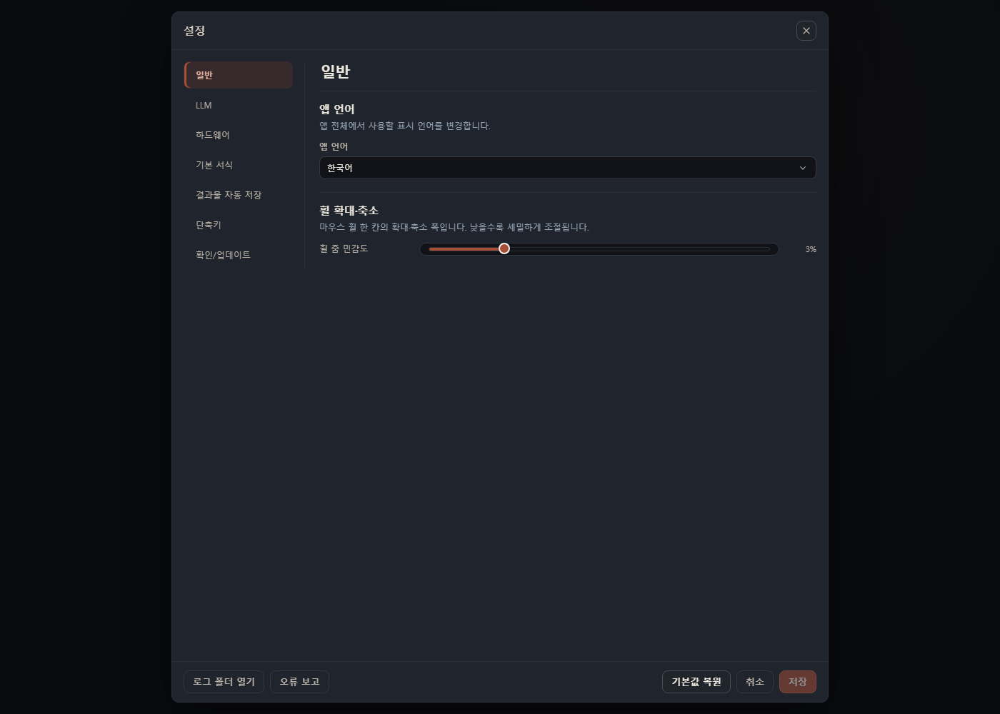

일본어 만화를 한국어로 옮긴다면 다음처럼 시작합니다.

- 원문 언어: <strong>일본어</strong>
- 번역 언어: <strong>한국어</strong>
- LLM: 아래 셋 중 환경에 맞는 하나

| LLM                         | 처리 위치                           | 준비할 것                         | 이런 경우에 적합                  |
| --------------------------- | ----------------------------------- | --------------------------------- | --------------------------------- |
| <strong>Gemma 로컬</strong> | 현재 PC                             | 모델 저장 공간, 충분한 RAM/VRAM   | 작품을 로컬에서 처리하고 싶을 때  |
| <strong>Codex</strong>      | Codex 계정                          | 앱 안의 ChatGPT 로그인, 인터넷    | 로컬 모델 준비를 줄이고 싶을 때   |
| <strong>API</strong>        | OpenAI 호환 비전 API 또는 로컬 서버 | Base URL, 모델 ID, 필요 시 API 키 | 이미 사용하는 서버·모델이 있을 때 |

Codex 엔진은 앱에 포함된 Codex App Server와 별도 앱 데이터 디렉터리를 사용합니다. 시스템에 Codex CLI를 따로 설치하거나 터미널에서 로그인할 필요는 없습니다.

  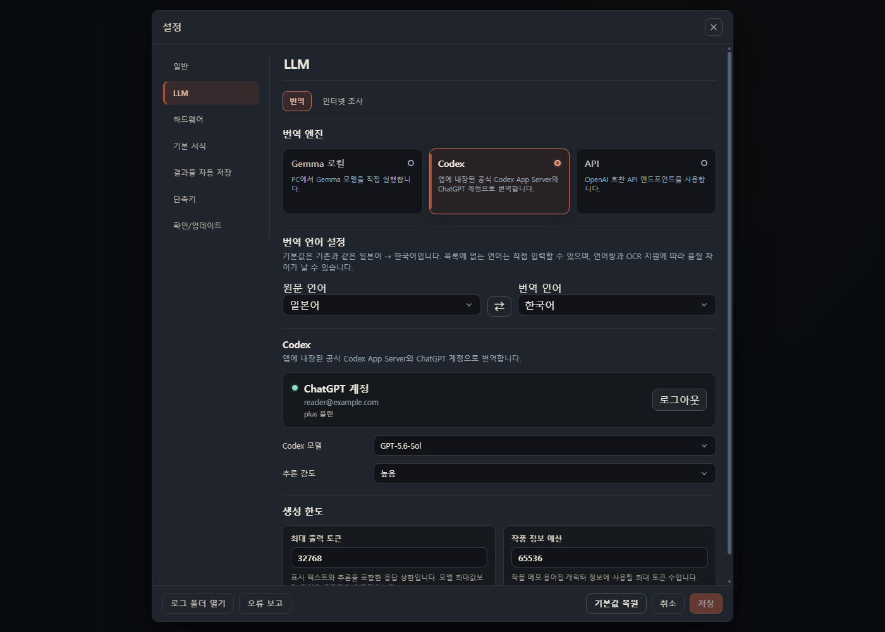

Gemma를 고르면 모델 크기, GPU 오프로딩과 컨텍스트 크기를 정할 수 있습니다. 처음에는 권장 프리셋으로 한 페이지를 시험하고, 메모리가 부족할 때만 더 작은 모델이나 컨텍스트로 낮추세요.

  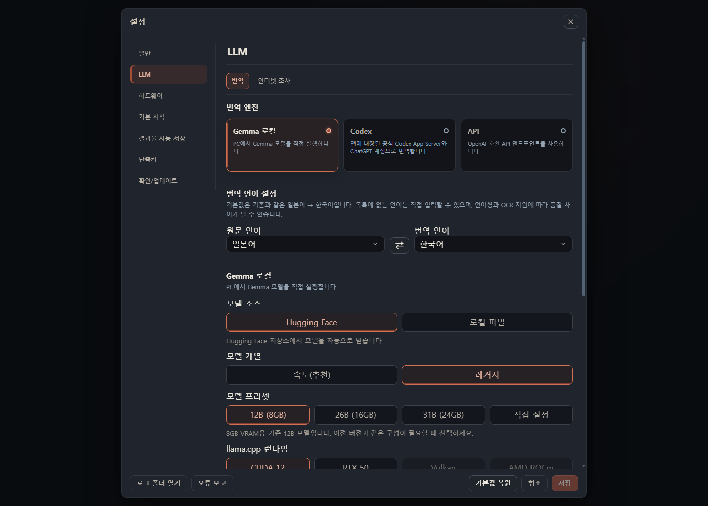

API 엔진은 이미지 입력을 지원하는 모델이 필요합니다. 401·403 오류는 키나 권한을, 404 오류는 Base URL과 모델 ID를 먼저 확인하세요.

  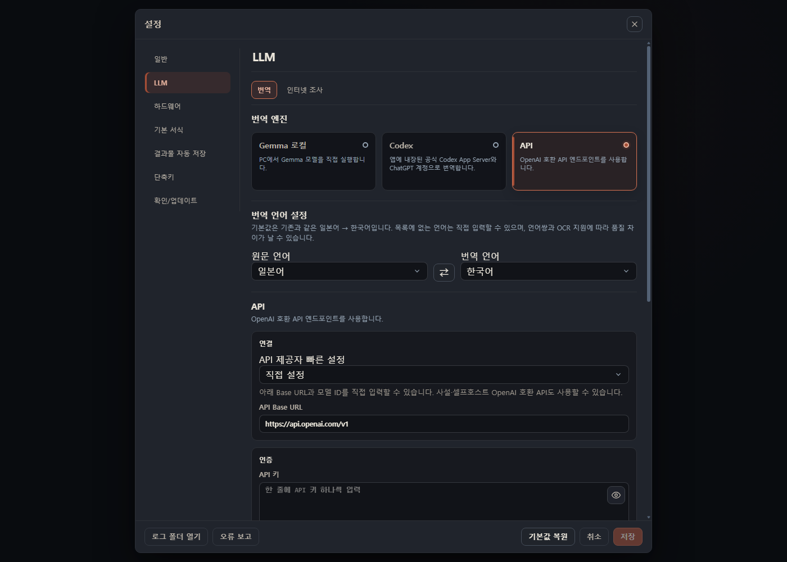

인터넷 조사를 켜면 번역 전에 기존 용어집을 점검하고 빠진 고유명사·인물 정보를 보완할 수 있습니다. <strong>설정 → LLM → 인터넷 조사</strong>에서 Tavily 또는 Codex를 고르고, 조사할 페이지 수와 결과 반영 방식을 확인하세요. 외부 서비스로 작품 문맥이 전달될 수 있으므로 공개해도 되는 자료에만 사용합니다.

  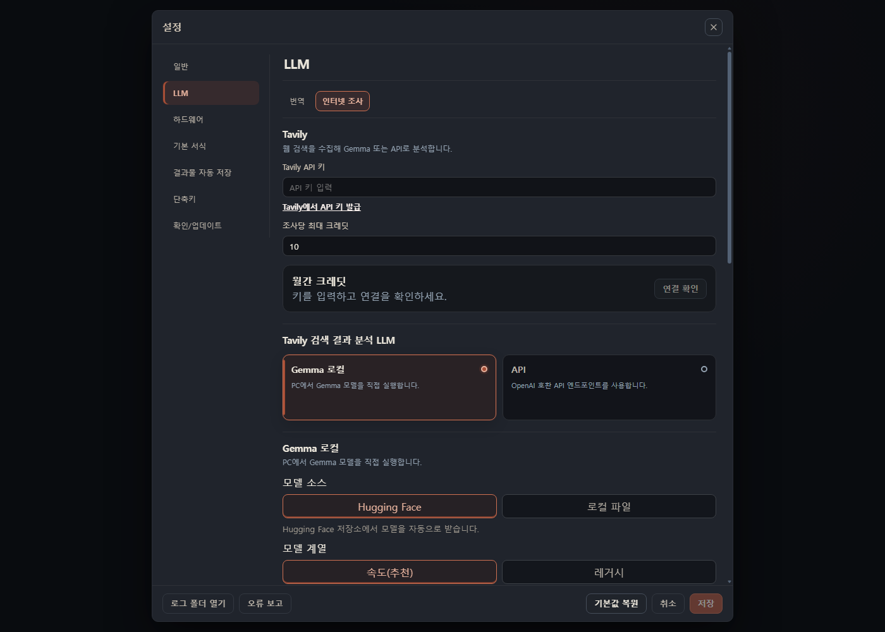

### 2. OCR과 인페인팅 선택

<strong>설정 → 하드웨어</strong>에서 자동 감지 결과와 권장값을 확인합니다.

  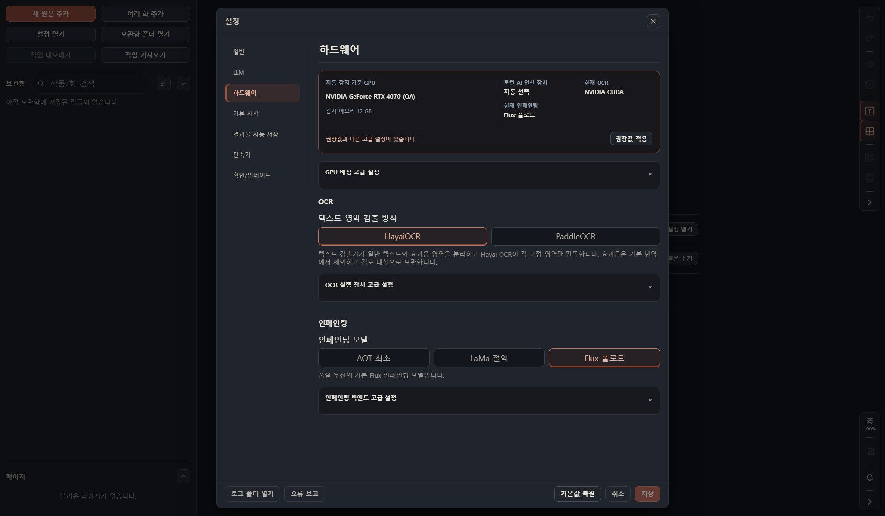

OCR 선택지는 용도가 다릅니다.

| OCR                        | 특징                                                                                                                  | 선택 기준                                      |
| -------------------------- | --------------------------------------------------------------------------------------------------------------------- | ---------------------------------------------- |
| <strong>HayaiOCR</strong>  | 일반 텍스트 영역과 효과음 후보를 나누고 고정된 영역별로 판독합니다. 효과음을 별도 검토·번역하는 새 흐름과 연결됩니다. | 새 작품을 시작하거나 효과음까지 다룰 때        |
| <strong>PaddleOCR</strong> | 이전 버전의 조각·그룹 처리 방식과 호환됩니다.                                                                         | 기존 작업에서 예전 블록 분리가 더 잘 맞았을 때 |

처음에는 화면 위의 <strong>권장값 적용</strong>을 누르고 대표 페이지로 시험하세요. 고급 장치 선택은 문제가 있을 때만 펼치는 편이 안전합니다.

인페인팅 모델은 다음처럼 고를 수 있습니다.

- <strong>AOT 최소</strong>: 가장 가벼운 호환성 확인용
- <strong>LaMa 절약</strong>: 비교적 가벼운 만화 원문 제거
- <strong>Flux 풀로드</strong>: 복잡한 배경 품질을 우선하는 무거운 경로

마지막으로 <strong>설정 → 확인/업데이트</strong>에서 OCR·모델 확인을 실행합니다. 처음에는 필요한 런타임을 내려받고 체크섬을 검사하므로 시간이 걸릴 수 있습니다. 문제가 생겼을 때는 이 화면에서 다시 확인하고 로그 폴더를 여는 것이 가장 빠릅니다.

  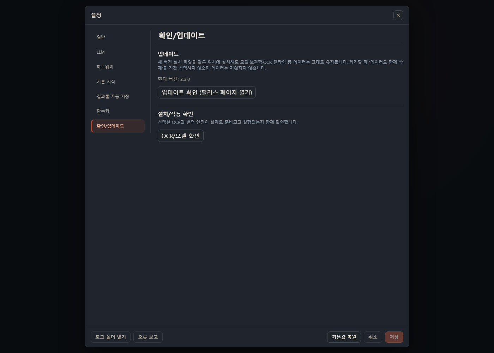

---

## 원본 가져오기

왼쪽 위의 <strong>새 원본 추가</strong> 또는 <strong>여러 화 추가</strong>를 사용합니다. 파일 탐색기에서 앱으로 끌어 놓아도 됩니다.

  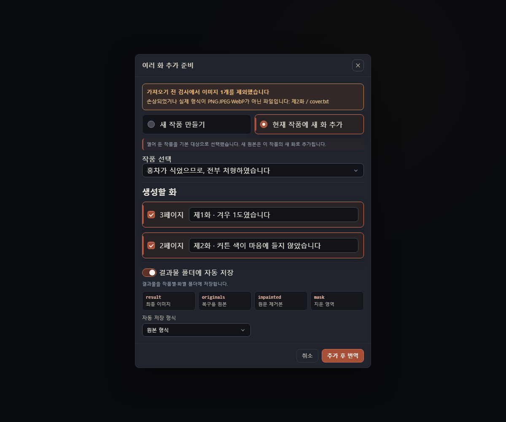

지원 입력:

- PNG, JPG, JPEG, WEBP 이미지
- 이미지 폴더
- ZIP, CBZ, RAR, CBR 압축파일
- PDF
- 공개 웹 페이지 링크

가져오기 창에서는 다음 순서로 확인합니다.

1. 새 작품을 만들지, 기존 작품에 화를 더할지 선택합니다.
2. 작품명과 화 제목을 확인합니다.
3. 여러 화라면 가져올 항목만 체크합니다.
4. 페이지 순서와 읽기 방향을 확인합니다.
5. <strong>추가</strong> 또는 <strong>추가 후 번역</strong>을 누릅니다.

폴더·압축파일 안의 이미지는 파일명 기준 자연 정렬을 사용하고, PDF는 페이지 순서대로 이미지로 변환합니다. WEBP는 보관함에 들어갈 때 PNG로 정규화됩니다.

주의할 점:

- 폴더·압축파일·PDF는 다른 종류의 항목과 섞지 말고 하나씩 놓으세요.
- 입력 파일 하나는 256MB, 디코딩된 이미지 한 장은 120MP를 넘지 않아야 합니다.
- 웹 가져오기는 페이지에서 발견한 이미지를 크기로 거른 뒤 필요한 것만 선택합니다.
- 저작권이 있는 원본은 본인이 처리·공유할 권한이 있는 범위에서 사용하세요.

웹 링크를 가져올 때는 주소를 붙여 넣고 <strong>이미지 찾기</strong>를 누른 뒤, 썸네일과 크기를 확인해 실제 만화 페이지만 남깁니다. 표지·배너·아이콘이 함께 잡히면 체크를 끄고, 페이지 순서는 가져오기 전에 정리하세요.

  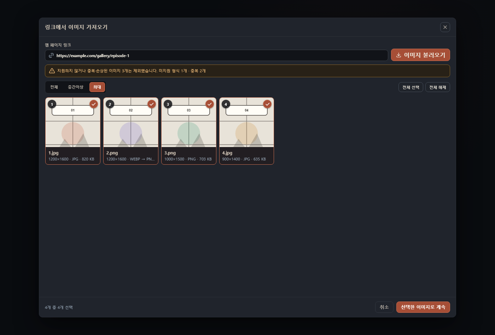

---

## 번역 실행

작품 아래의 화를 선택하고 <strong>번역</strong>을 누릅니다.

  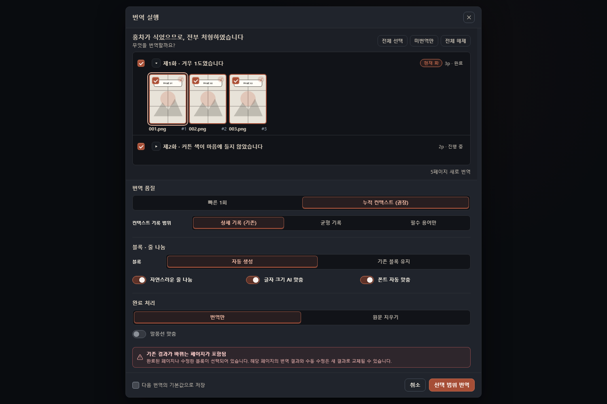

상단에서 현재 페이지·현재 화를 고르거나 화 목록을 펼쳐 필요한 페이지만 체크합니다. 아래 옵션에서 처리 모드, 블록 생성 방식, 자동 서식과 원문 지우기를 정한 뒤 예상 페이지 수를 다시 확인하세요.

### 초보자 권장 시작값

- 페이지: 대표 페이지 1~3장
- 처리 모드: <strong>누적 컨텍스트</strong>
- 블록: 새 원본이면 <strong>자동 생성</strong>
- 줄 나눔: <strong>자연스러운 줄 나눔</strong>
- 완료 처리: 처음에는 <strong>번역만</strong>
- 원문 제거: 번역 결과를 확인한 뒤 별도 실행

### 중요한 선택지

| 선택지                          | 하는 일                                          | 언제 쓰나          |
| ------------------------------- | ------------------------------------------------ | ------------------ |
| <strong>빠른 1회</strong>       | 각 페이지를 독립적으로 번역                      | 속도·연결 확인용   |
| <strong>누적 컨텍스트</strong>  | 앞 페이지의 인물·사건·용어를 다음 페이지가 참고  | 일반적인 연속 장면 |
| <strong>자동 생성</strong>      | OCR과 모델 결과로 블록을 새로 생성               | 최초 번역          |
| <strong>기존 블록 유지</strong> | 블록 위치와 서식을 보존하고 텍스트 중심으로 갱신 | 식자 후 재번역     |

화 번역이 중단되면 페이지별 체크포인트가 남을 수 있습니다. 다시 열었을 때 페이지 선택 상태는 대체로 다음 세 가지 의미를 가집니다.

- <strong>이어서 처리</strong>: 검증된 중간 결과를 재사용하고 남은 단계부터 진행
- <strong>새로 번역</strong>: 해당 페이지를 처음부터 다시 처리
- <strong>제외</strong>: 이번 실행에서 건너뜀

원본 페이지나 언어·블록 방식이 달라져 체크포인트 검증에 실패하면 앱은 오래된 결과를 억지로 재사용하지 않습니다.

### 자동 서식 옵션

- <strong>자연스러운 줄 나눔</strong>: 블록 크기를 참고해 번역문에 줄바꿈을 제안합니다.
- <strong>폰트 자동 맞춤</strong>: 원문의 역할과 형태를 참고해 후보 폰트를 선택합니다.
- <strong>AI 글자 크기 맞춤</strong>: 원문 글자 크기를 추정해 번역 블록의 명목 크기에 반영합니다.
- <strong>효과음 폰트 자동 맞춤</strong>: 효과음으로 분류된 블록의 폰트·굵기를 따로 맞춥니다.
- <strong>번역 후 원문 지우기</strong>: 번역 성공 뒤 인페인팅까지 이어서 실행합니다.
- <strong>말풍선 맞춤</strong>: 지운 영역과 말풍선 형태를 참고해 텍스트 영역을 조정합니다.

자동 결과는 출발점입니다. 작은 후리가나, 속삭임, 기울어진 효과음, 극단적으로 좁은 세로 문장은 직접 확인하세요.

---

## 작업 화면 읽는 법

  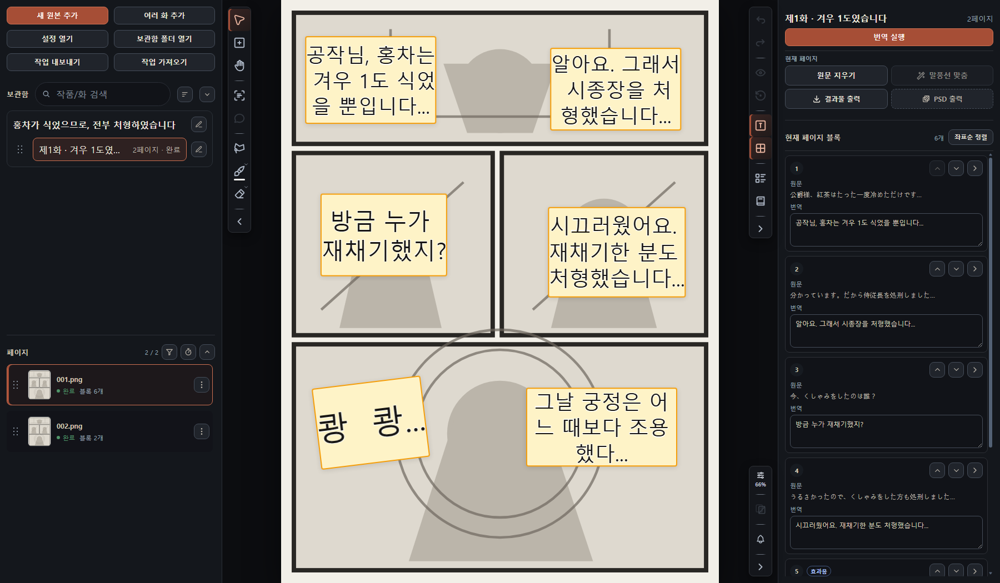

| 위치                             | 역할                                     |
| -------------------------------- | ---------------------------------------- |
| <strong>왼쪽 위</strong>         | 원본 추가, 설정, 작업 가져오기·내보내기  |
| <strong>왼쪽 보관함</strong>     | 작품·화 검색, 정렬, 열기                 |
| <strong>왼쪽 아래</strong>       | 현재 화의 페이지 목록과 순서             |
| <strong>가운데</strong>          | 페이지, 번역 블록, 선택·이동·확대·보정   |
| <strong>오른쪽 도구막대</strong> | 선택, 블록, 보기, 인페인팅 등 작업 모드  |
| <strong>오른쪽 패널</strong>     | 현재 페이지 블록 목록과 선택한 블록 편집 |

블록을 클릭하면 오른쪽에서 <strong>텍스트</strong>, <strong>배치</strong>, <strong>서식</strong>을 편집할 수 있습니다.

### 텍스트

- <strong>번역문</strong>: 결과 이미지에 보일 문장
- <strong>OCR</strong>: 이미지에서 읽은 원문
- <strong>글자별 서식</strong>: 선택한 일부 글자에만 굵기, 기울임, 밑줄, 취소선, 강조점, 글자 크기, 폰트, 색, 투명도, 배경, 외곽선과 광선 적용
- <strong>편집/코드</strong>: 눈으로 편집하거나 서식 코드를 직접 확인

<strong>편집</strong>에서는 문장을 드래그해 일부 글자만 고른 뒤 서식 도구를 누릅니다. 선택 범위가 없으면 입력 위치 이후의 새 글자에 적용될 수 있으므로, 기존 문장을 바꿀 때는 범위를 먼저 선택하세요.

  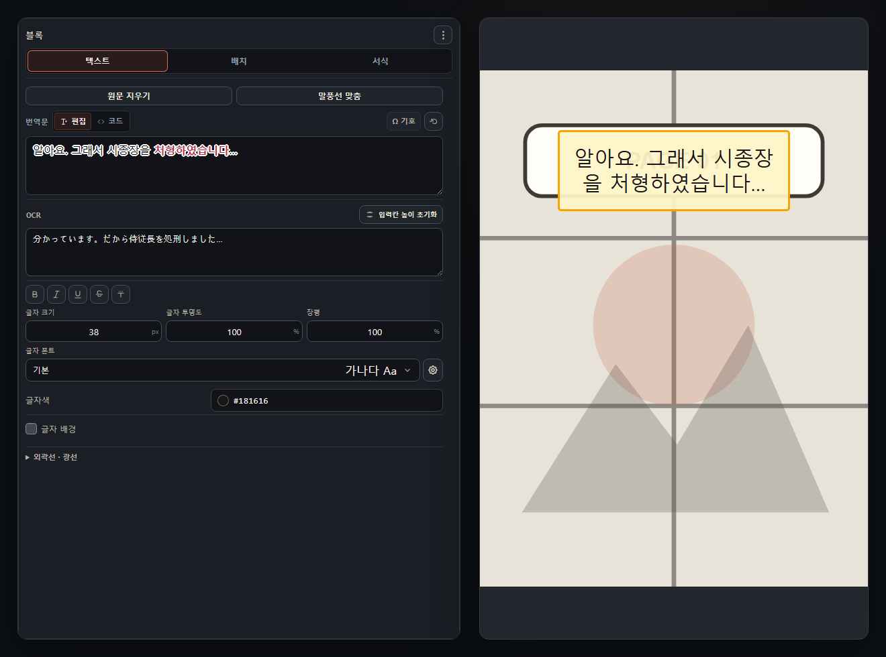

<strong>코드</strong>에서는 같은 서식을 마크업으로 확인하고 직접 수정할 수 있습니다. 태그가 잘못 닫히면 미리보기와 출력이 달라질 수 있으므로 복잡한 수정 뒤에는 다시 편집 화면으로 돌아가 결과를 확인하세요.

  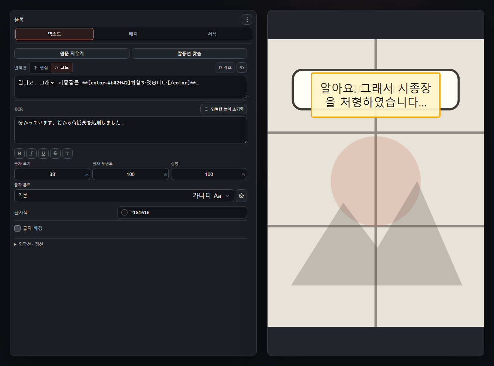

단순 강조는 다음 표기를 직접 입력해도 됩니다.

- 굵게: `**굵게**`
- 기울임: `*기울임*`
- 굵게와 기울임: `***강조***`

### 배치

- 블록을 끌어 이동하고 모서리 손잡이로 크기를 바꿉니다.
- X, Y, 너비와 높이를 숫자로 정확히 입력할 수 있습니다.
- 회전, 블록 형태와 말풍선 맞춤을 조절할 수 있습니다.
- <kbd>Ctrl</kbd>을 누른 채 클릭하면 여러 블록을 함께 선택합니다.

  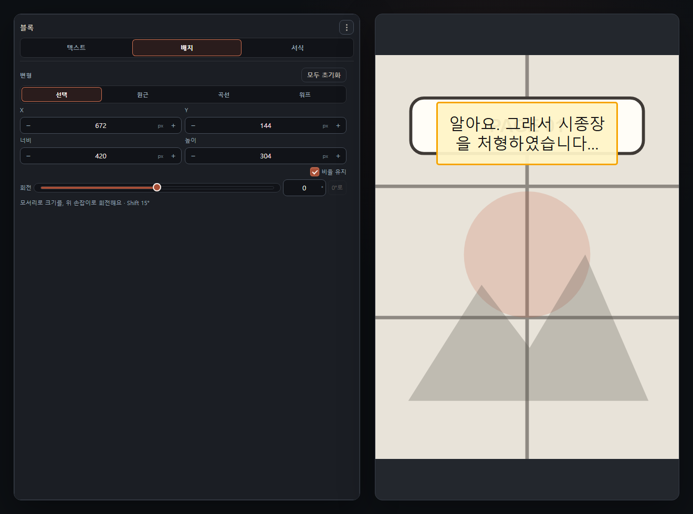

### 서식

- 가로쓰기·세로쓰기, 정렬, 줄바꿈
- 폰트, 글자 크기, 자동 맞춤
- 줄 간격, 자간, 장평
- 굵기, 기울임, 밑줄, 취소선, 강조점
- 글자색, 배경색, 외곽선, 이중 외곽선, 그림자·글로우, 투명도

반복해서 쓰는 서식은 프리셋으로 저장하고 1~10번 단축키 슬롯에 연결할 수 있습니다. 선택한 블록의 서식 일부를 다른 선택 블록, 현재 페이지 또는 현재 화 전체에 일괄 적용할 수도 있습니다.

  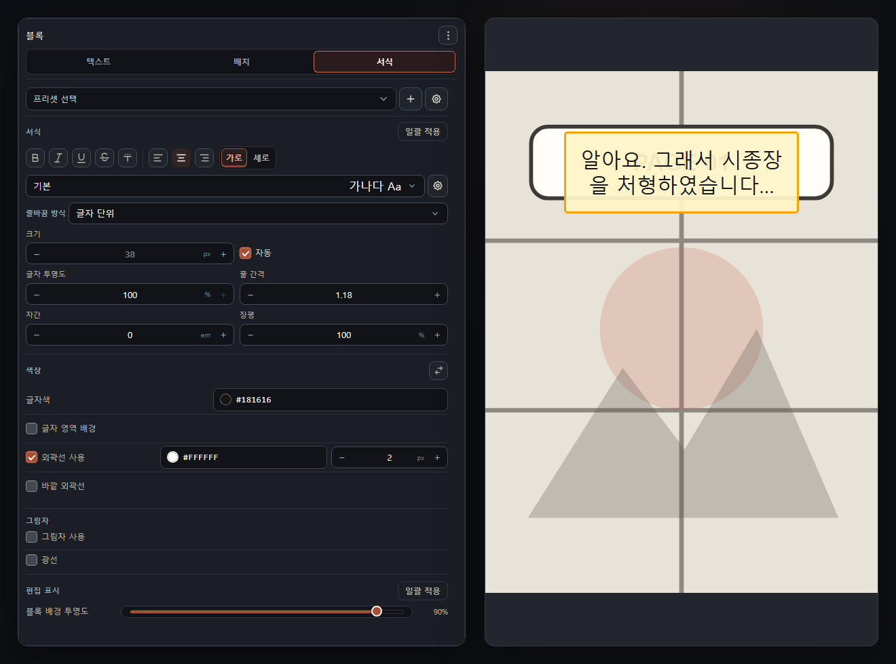

현재 블록의 서식을 여러 곳에 복사하려면 서식 패널의 <strong>일괄 적용</strong>을 누릅니다. 적용 범위와 복사할 속성만 체크하면 텍스트 내용은 건드리지 않고 모양만 맞출 수 있습니다.

  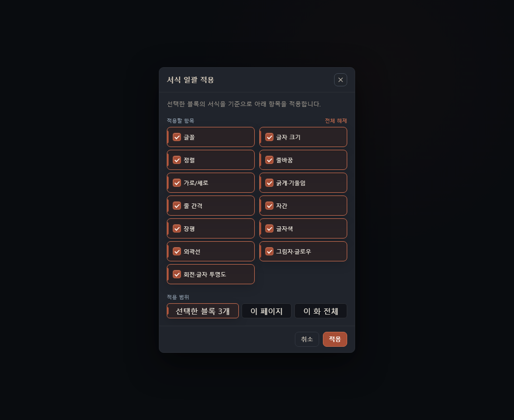

---

## 텍스트 일괄 편집

예전의 단순 검색·치환은 <strong>조건 + 작업 + 실제 페이지 미리보기</strong> 방식의 일괄 편집기로 확장되었습니다. 이름 통일뿐 아니라 화자별 말투, 효과음 서식, 검수 상태, 부분 글자 강조와 오류 후보 수집까지 한 규칙에 묶을 수 있습니다.

여는 방법:

- <kbd>Ctrl</kbd>+<kbd>H</kbd>
- <kbd>G</kbd>로 <strong>텍스트 모아보기</strong>를 연 뒤 <strong>텍스트 일괄 편집</strong>
- <kbd>Ctrl</kbd>+<kbd>K</kbd> 명령 팔레트에서 <strong>일괄 편집</strong>

### 적용 전에 알아둘 것

1. <strong>범위</strong>는 선택한 블록, 현재 페이지, 현재 화 중에서 정합니다. 선택 범위는 블록을 미리 여러 개 골랐을 때 사용할 수 있습니다.
2. <strong>대상 조건</strong>은 모두 맞을 때, 하나라도 맞을 때, 모든 말풍선 중 하나를 고릅니다.
3. <strong>작업</strong>은 위에서 아래 순서로 실행됩니다. 앞 작업이 바꾼 문장을 다음 작업이 다시 사용할 수 있습니다.
4. 가운데에서 <strong>변경 전/변경 후</strong>를 전환하고 실제 페이지 모양을 확인합니다.
5. 오른쪽 결과 목록에서 이번 실행에 넣지 않을 블록은 체크를 끕니다.
6. 미리보기 이후 원본 블록이 달라진 항목은 충돌로 보고 덮어쓰지 않습니다.
7. 한 번 적용한 결과는 한 번의 기록으로 남아 <strong>실행 취소</strong>할 수 있습니다.

처음에는 항상 <strong>페이지</strong> 범위에서 규칙을 검증한 뒤 <strong>화</strong>로 넓히세요.

### 기본 규칙 1 — 찾아 바꾸기

가장 단순한 시작점입니다. 아래 예시는 번역문의 <strong>공작</strong>을 <strong>대공</strong>으로 통일합니다.

  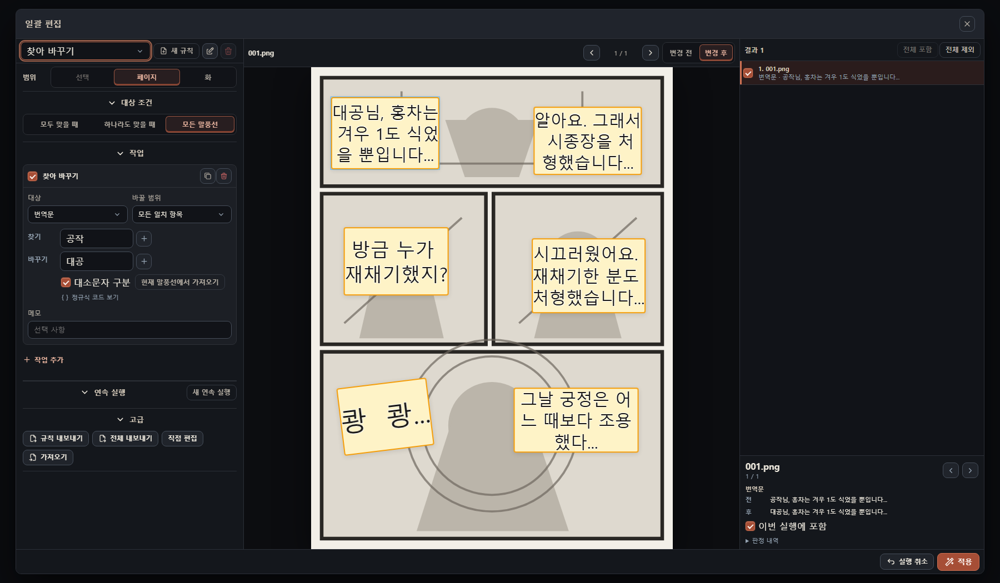

설정:

- 범위: <strong>페이지</strong>
- 대상 조건: <strong>모든 말풍선</strong>
- 작업: <strong>찾아 바꾸기</strong>
- 대상: <strong>번역문</strong>
- 찾기: <code>공작</code>
- 바꾸기: <code>대공</code>
- 바꿀 범위: <strong>모든 일치 항목</strong>

오른쪽에 결과 1개가 표시되고, <strong>공작님</strong>이 <strong>대공님</strong>으로 바뀌는 것을 확인할 수 있습니다. 동명이인이나 고유명사의 일부까지 바뀔 수 있으므로 결과 목록을 꼭 확인하세요.

### 기본 규칙 2 — 말줄임표와 공백 정리

두 작업을 연달아 실행하는 기본 예제입니다.

  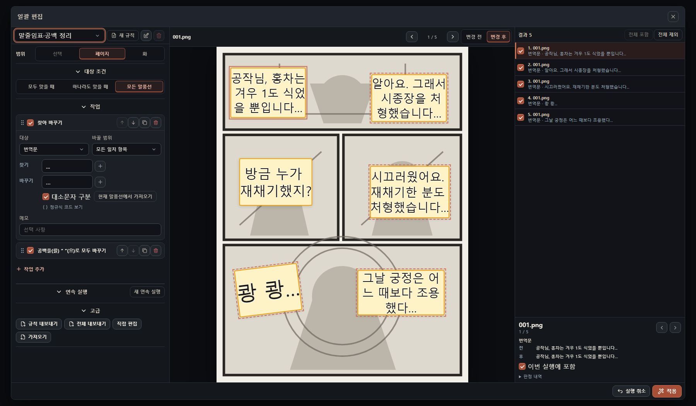

실행 순서:

1. 번역문의 <code>...</code>을 <code>…</code>으로 바꿉니다.
2. 두 칸 이상 이어진 공백 문자를 한 칸으로 줄입니다.

예시 페이지에서는 5개 블록이 바뀝니다. 의도적으로 넓힌 효과음 간격이나 특수한 줄바꿈도 후보가 될 수 있으므로, 효과음이 많은 작품에서는 결과를 제외하거나 조건에 <strong>텍스트 역할 ≠ 효과음</strong>을 추가하세요.

### 추천 규칙 1 — 화자별 처형 선고 통일

변덕스러운 폭군 세라피나의 대사 중 <strong>처형</strong>이 들어간 문장만 골라 격식체로 바꾸고 핵심 문구를 강조하는 예입니다.

  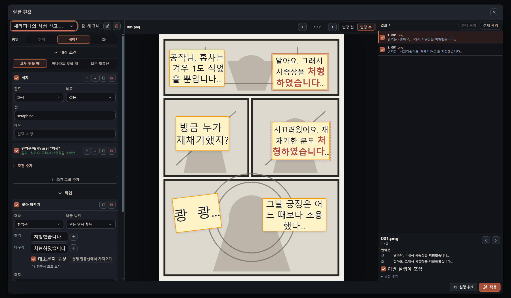

조건은 <strong>모두 맞을 때</strong>로 묶습니다.

- 화자 = <code>seraphina</code>
- 번역문이 <code>처형</code>을 포함

작업은 순서대로 두 개를 둡니다.

1. <code>처형했습니다</code> → <code>처형하였습니다</code>
2. 새로 생긴 <code>처형하였습니다</code> 부분만 굵게, 34px, 붉은색으로 지정

그러면 대신의 설명에는 손대지 않고 세라피나가 말한 두 문장만 바뀝니다. 실제 작품에서는 캐릭터에 연결된 화자 ID를 그대로 사용하세요. 화자 정보가 비어 있다면 먼저 캐릭터·블록 정보를 정리하거나, 화자 조건을 빼고 더 구체적인 문장 조건을 사용합니다.

### 추천 규칙 2 — 효과음 서식과 검수 상태 통일

텍스트 역할이 효과음인 블록만 골라 글자 크기·색·외곽선과 검수 상태를 한 번에 바꿉니다.

  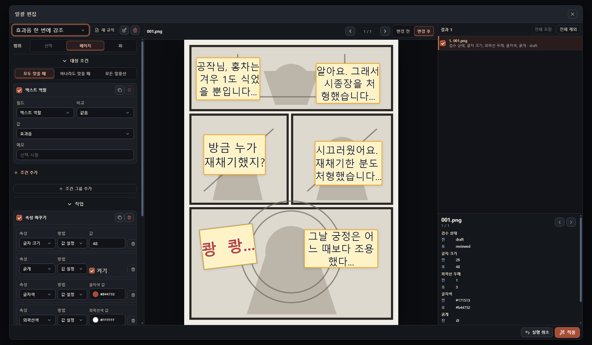

조건:

- 텍스트 역할 = <strong>효과음</strong>

속성 바꾸기:

- 글자 크기 = 48px
- 굵게 = 켜기
- 글자색 = 붉은색
- 외곽선색 = 흰색
- 외곽선 두께 = 3px
- 검수 상태 = 검수 완료

이 규칙은 이미 효과음으로 분류된 블록의 <strong>표시 방식</strong>을 바꾸는 용도입니다. 효과음을 새로 찾거나 번역하지는 않습니다. 감지와 번역은 아래의 효과음 검토 흐름을 사용하세요.

### 추천 규칙 3 — 공개 전 위험 문장만 모으기

작업을 하나도 넣지 않아도 일괄 편집기를 <strong>검수 검색기</strong>로 사용할 수 있습니다.

  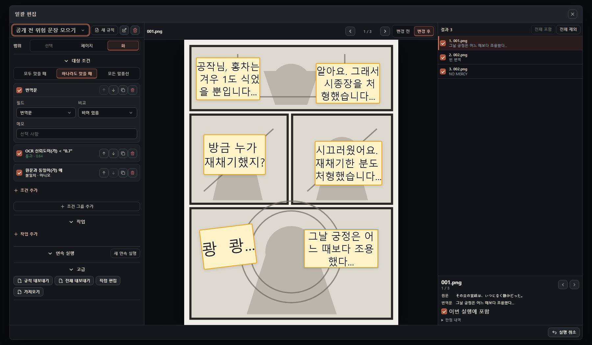

조건은 <strong>하나라도 맞을 때</strong>로 묶습니다.

- 번역문이 비어 있음
- OCR 신뢰도 &lt; 0.7
- 원문과 동일한 번역 = 예

작업은 비워 둡니다. 그러면 화 전체에서 위험 후보만 오른쪽에 모이고 적용 버튼은 나타나지 않습니다. 결과를 하나씩 열어 직접 수정하거나, 필요하다면 <strong>검수 상태를 검수 필요로 변경</strong>하는 작업을 나중에 추가하세요.

새 규칙 메뉴에는 빈 번역, 낮은 OCR 신뢰도, 원문과 같은 번역, 숫자 불일치, 괄호·따옴표 불균형, 의심스러운 공백, 용어집 불일치, 너무 긴 번역, 낮은 글꼴 신뢰도, 검수 대기 같은 점검용 시작점도 있습니다.

### 일괄 편집에서 할 수 있는 일

| 구분                         | 대표 항목                                                                                           |
| ---------------------------- | --------------------------------------------------------------------------------------------------- |
| <strong>조건</strong>        | 원문·번역문, 화자, 텍스트 역할, 폰트 역할, 방향, 검수 상태, OCR·글꼴 신뢰도, 길이·줄 수·페이지 번호 |
| <strong>자동 점검</strong>   | 원문과 동일, 숫자 불일치, 구두점 불균형, 의심스러운 공백, 용어집 불일치, 부분 서식 유무             |
| <strong>텍스트 작업</strong> | 일반 문자·시각 패턴·정규식 찾아 바꾸기, 원문·번역문·둘 다 대상                                      |
| <strong>속성 작업</strong>   | 글자 크기·방향·정렬·간격·색·외곽선·효과·화자·역할·검수 상태 등 설정 또는 초기화                     |
| <strong>서식 작업</strong>   | 저장한 서식 프리셋 적용, 번역문 전체 또는 특정 부분에 글자별 서식 적용                              |
| <strong>조합</strong>        | 조건 그룹, 여러 작업의 순차 실행, 여러 규칙의 연속 실행                                             |

저장한 규칙은 수정 후 자동 저장됩니다. 규칙을 즐겨찾기에 두거나 복제할 수 있고, 한 규칙 또는 전체 규칙을 YAML로 내보내 다른 PC와 교환할 수 있습니다. <strong>직접 편집</strong>은 숙련자를 위한 YAML 보기이므로, 처음에는 화면의 조건·작업 편집기를 권장합니다.

좁은 창에서도 왼쪽 규칙, 가운데 미리보기, 오른쪽 결과가 각각 내부 스크롤을 사용합니다. 다만 긴 규칙을 만들 때는 넓은 창이 훨씬 편합니다.

  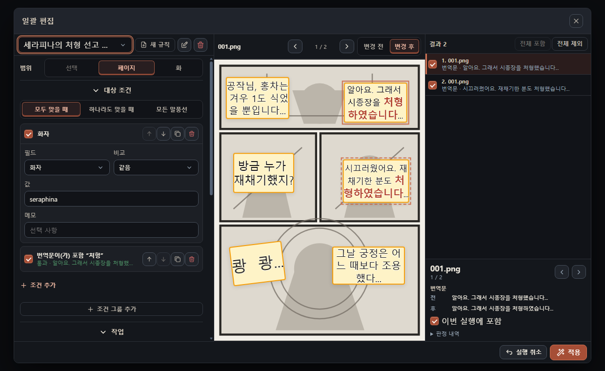

---

## HayaiOCR 효과음 검토와 번역

HayaiOCR을 사용하면 일반 대사 처리 뒤 별도 효과음 후보가 <strong>효과음?</strong> 상자로 남을 수 있습니다. 자동 판정을 그대로 확정하지 않고 사람이 확인하도록 만든 흐름입니다.

1. 페이지의 효과음 후보를 클릭합니다.
2. 분명한 효과음이면 <strong>이 영역만 번역</strong>하거나 <strong>효과음 전체 번역</strong>을 엽니다.
3. 전체 번역 창에서 페이지별 후보를 포함·제외합니다.
4. 필요하면 <strong>번역 후 원문 지우기</strong>를 켭니다.
5. 선택한 후보만 번역합니다.
6. 잘못 잡힌 그림·문양은 <strong>검토 대상에서 제외</strong>합니다.

  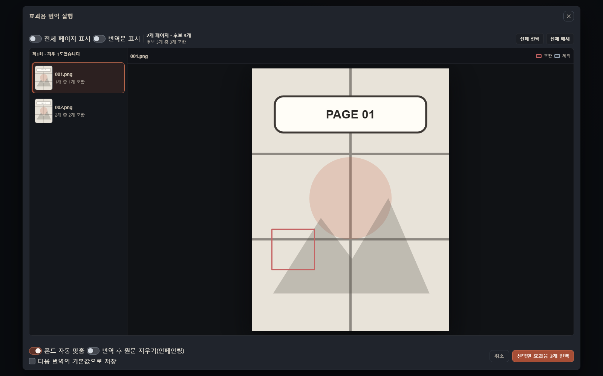

단건 번역은 원문을 유지합니다. 원문 제거까지 함께 하려면 전체 효과음 번역 창에서 인페인팅을 선택하세요.

효과음 번역 뒤에는 다음을 확인합니다.

- 글자 역할이 효과음으로 저장되었는지
- 회전과 세로·가로 방향이 원본과 맞는지
- 자동 폰트가 작품 분위기에 맞는지
- 지운 원문 주변에 번짐이나 선 끊김이 없는지
- 작은 효과음이 대사보다 지나치게 커지지 않았는지

여러 효과음의 서식이 제각각이면 앞의 <strong>효과음 한 번에 강조</strong> 규칙이나 서식 프리셋을 사용합니다.

---

## 텍스트 모아보기와 외부 검수

<kbd>G</kbd>를 누르면 현재 페이지 또는 화 전체의 문장을 한곳에서 볼 수 있습니다.

  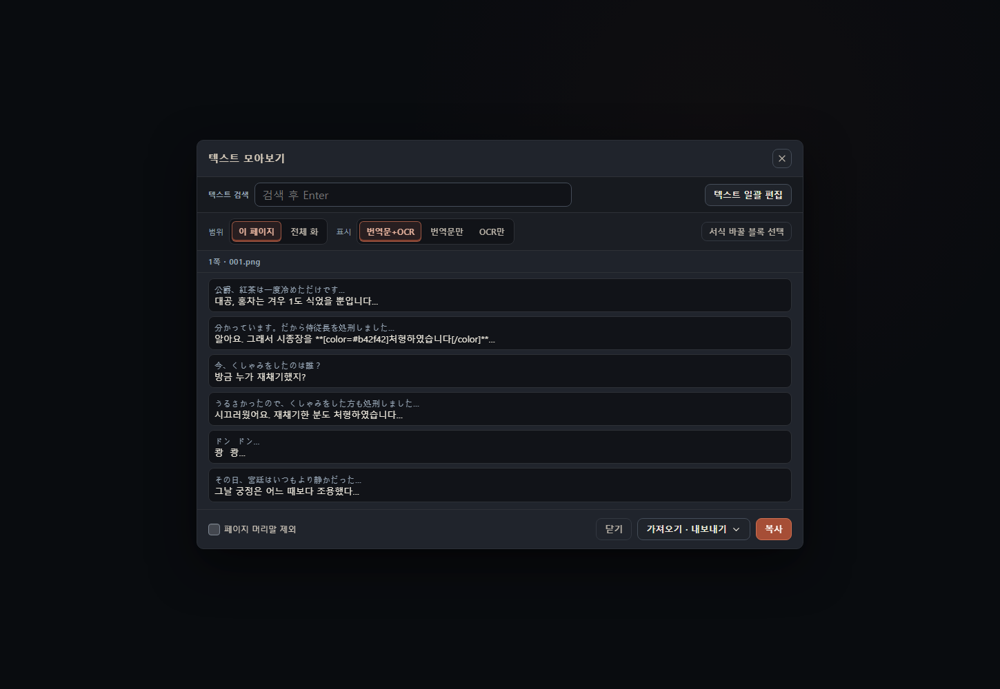

- 번역문+OCR, 번역문만, OCR만 전환
- 문자열 검색과 해당 블록으로 이동
- 전체 복사와 TXT 저장
- TXT, CSV, TSV 검수 파일 내보내기·가져오기
- 텍스트 일괄 편집으로 이동

CSV/TSV 검수표에는 블록 ID, OCR, 번역문, 검수 상태와 메모가 들어갑니다. 다시 가져오면 같은 블록 ID의 허용된 필드만 갱신하며 누락·중복·OCR 불일치는 경고합니다.

외부 편집자가 번역문만 고칠 때는 TXT가 간단하고, 상태·메모까지 함께 관리하려면 CSV/TSV가 적합합니다.

---

## 용어집, 캐릭터, 규칙과 스토리 메모리

작품 단위의 <strong>용어/기억</strong>은 페이지가 바뀌어도 번역을 일관되게 만드는 자료입니다.

### 용어집

인명, 지명, 기술명과 허용 표기를 등록합니다. 번역에서 빼야 하는 원문, 별칭과 메모도 함께 관리할 수 있습니다. 자주 등장하는데 표기가 계속 달라지는 항목부터 넣으세요.

  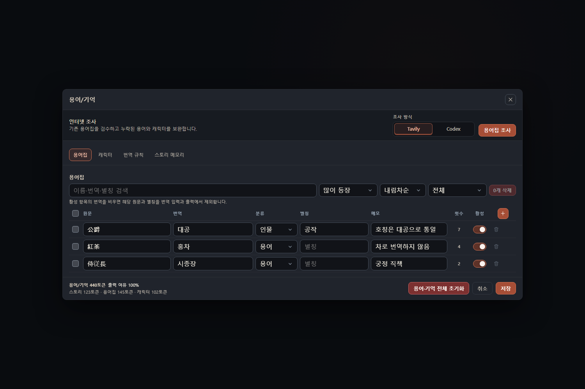

### 캐릭터

원문·번역 이름, 화자 ID, 호칭, 존댓말·반말과 말투 지침을 등록합니다. 블록의 화자와 캐릭터가 연결되어 있으면 번역 일관성을 높이고 화자별 일괄 편집 조건도 안전하게 사용할 수 있습니다.

  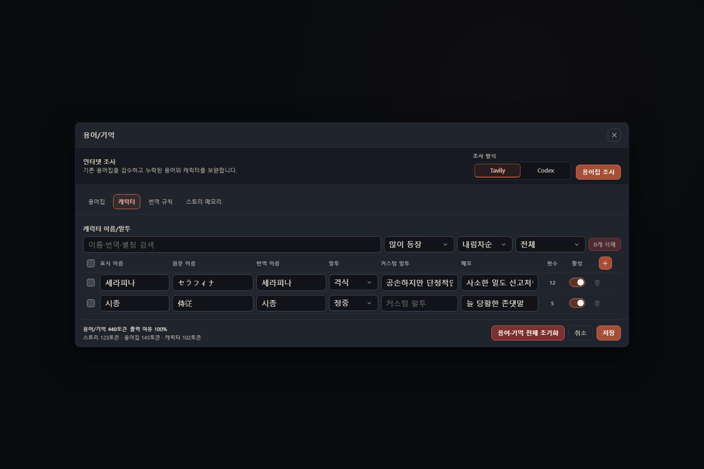

### 번역 규칙

호칭 처리, 효과음 처리와 작품 전체의 기본 문체를 정합니다. 규칙을 너무 많이 겹치기보다 결과가 계속 어긋나는 원칙만 명확하게 두는 편이 좋습니다.

  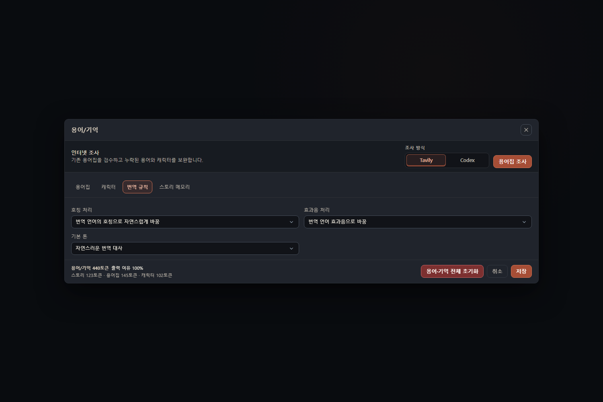

### 스토리 메모리

페이지별 장면 요약과 기존 메모를 확인하고, 다음 장면에서 꼭 필요한 사건·관계 변화를 남깁니다. 빈 요약을 직접 채울 수 있지만 이미 지난 장면을 장황하게 다시 적을 필요는 없습니다.

  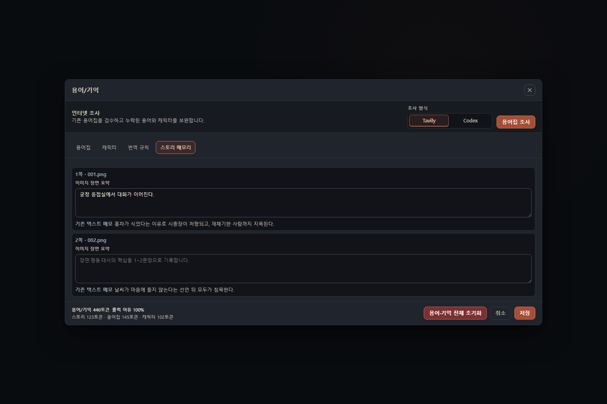

자료가 많다고 항상 좋은 것은 아닙니다. 자주 틀리는 고유명사와 다음 장면에 꼭 필요한 사건부터 넣고, 화면의 토큰 예산을 확인하세요.

이 정보는 일괄 편집 조건의 화자·용어집 불일치 점검과도 연결됩니다. 예를 들어 캐릭터 ID가 정리되어 있으면 화자별 말투 규칙을 안전하게 만들 수 있습니다.

---

## 원문 지우기와 수동 보정

번역문과 블록 위치를 확인한 뒤 인페인팅을 실행합니다.

  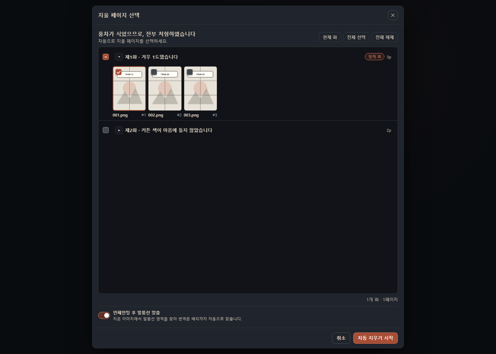

1. 지울 페이지 또는 블록을 고릅니다.
2. 인페인팅 모델과 <strong>말풍선 맞춤</strong> 사용 여부를 확인합니다.
3. 자동 지우기를 실행합니다.
4. 원본 보기와 결과 보기를 번갈아 확인합니다.
5. 남은 자국만 수동 보정합니다.

수동 도구:

- 마스크 브러시: 다시 지울 영역 표시
- 페인트 브러시: 선택한 색으로 직접 보정
- 사각형·타원 보정: 일정한 범위를 빠르게 처리
- 보정 지우개: 잘못 그린 마스크 제거
- 색상 추출: 페이지에서 색을 직접 가져오기
- 실행 취소·다시 실행: 수동 보정 단계 복구

  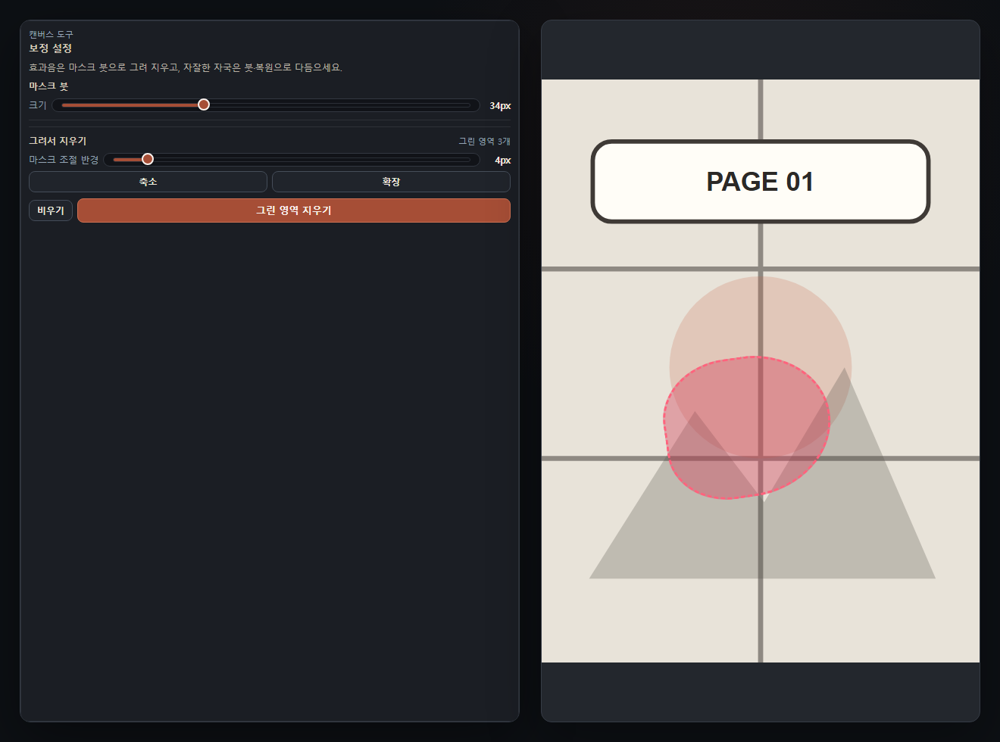

머리카락, 집중선, 무늬 배경처럼 선이 많은 부분은 자동 결과를 확대해서 확인하세요. 중요한 선을 함께 지웠다면 더 작은 범위로 다시 처리하거나 복원 도구로 정리합니다.

---

## 폰트와 글자 크기

### 자동 폰트 맞춤

자동 폰트 맞춤은 블록의 역할·굵기·형태와 같은 페이지의 일반 대사 경향을 함께 보고 후보를 정합니다. 일반 대사를 과장된 효과음 폰트로 바꾸지 않도록 보수적인 제한도 적용됩니다.

다만 결과는 사람의 최종 식자 판단을 대신하지 않습니다. 특히 짧은 감탄사, 장식 글자, 회전 효과음과 독특한 손글씨는 직접 비교하세요. 사용자가 직접 고정한 폰트·색·외곽선은 자동 선택이 함부로 덮어쓰지 않으며, 자동 선택 결과는 되돌릴 수 있습니다.

### AI 글자 크기 맞춤

원문 글자의 실제 획과 OCR 줄을 참고해 새 번역 블록의 명목 크기를 추정합니다. 좁은 세로 문장과 분리된 HayaiOCR 줄을 함께 보고, 세로쓰기의 짝 구두점도 방향에 맞춰 배치합니다.

기존 보관함의 블록을 일괄해서 몰래 바꾸지는 않습니다. 새 번역 또는 해당 페이지 재번역부터 새 측정이 적용됩니다.

### 사용자 폰트

폰트 선택기의 <strong>폰트 관리 → TTF/OTF 폰트 등록</strong>에서 추가합니다. 등록한 폰트는 화면 미리보기와 PNG·PSD 출력에 사용됩니다.

  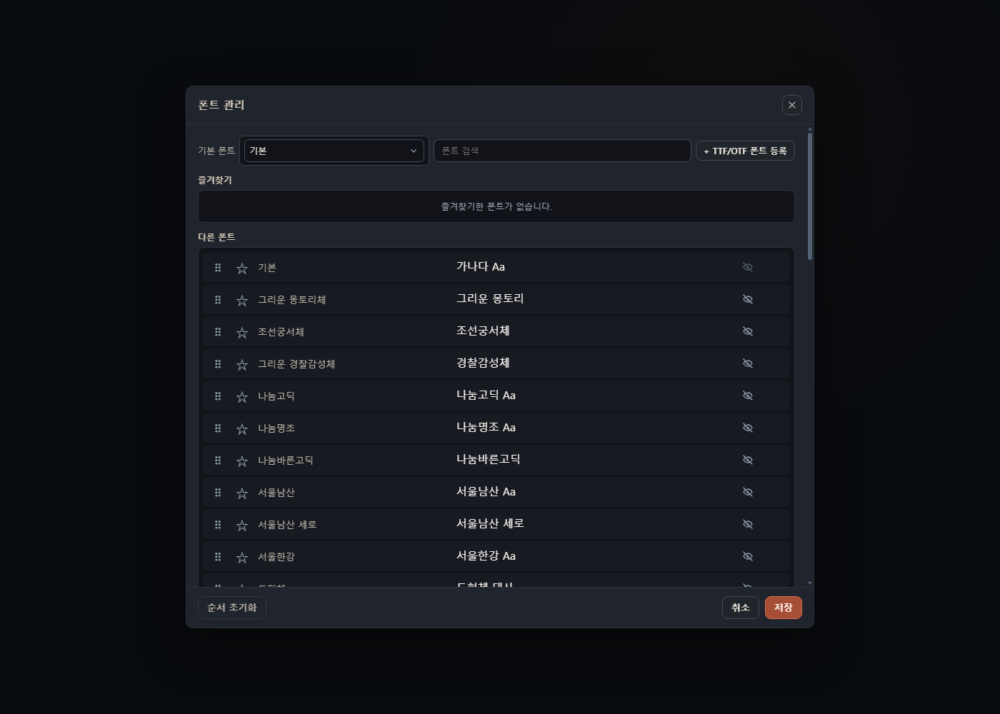

새로 만드는 블록의 기본 모양은 <strong>설정 → 기본 서식</strong>에서 정합니다. 방향·정렬·폰트·크기·간격·색과 외곽선을 원하는 출발값으로 맞추되, 이미 편집한 블록을 바꾸는 기능은 아니라는 점에 유의하세요.

  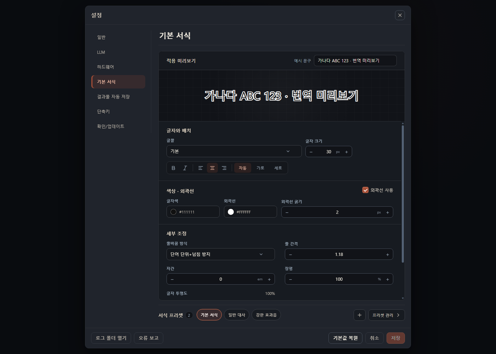

다른 PC에서 작업 파일을 열 경우 같은 폰트가 없으면 대체 폰트가 보일 수 있습니다. 함께 작업하는 사람에게 사용한 폰트와 라이선스를 알려 주세요.

번들 폰트의 출처와 조건은 [third_party/fonts/README.md](third_party/fonts/README.md)에서 확인할 수 있습니다.

---

## 결과물 내보내기

<kbd>Ctrl</kbd>+<kbd>E</kbd> 또는 명령 팔레트의 <strong>내보내기 열기</strong>를 사용합니다.

번역이 끝날 때마다 결과 이미지를 자동으로 저장하려면 <strong>설정 → 결과물 자동 저장</strong>에서 저장 시점, 파일 형식과 폴더 구조를 정합니다. 편집 중인 결과를 계속 덮어쓸 수 있으므로 처음에는 별도 폴더를 사용하고 파일명 예시를 확인하세요.

  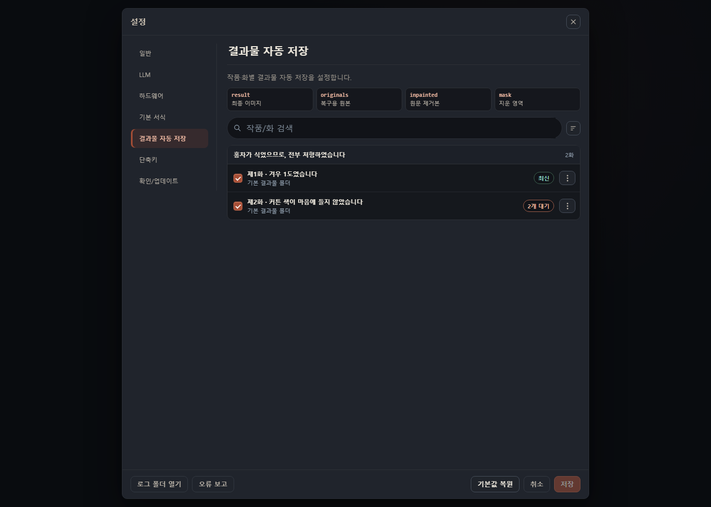

- <strong>완성 이미지 PNG</strong>: 인페인팅 배경과 번역문을 합친 최종 이미지
- <strong>레이어 PSD</strong>: 원본 배경, 정리 배경, 블록별 대사를 분리한 편집용 파일
- <strong>글자 없이 출력</strong>: 정리한 배경만 필요한 경우

PNG를 내보낼 때는 화와 페이지, 파일 형식, 저장 위치와 같은 이름 처리 방법을 정합니다. 아래쪽 <strong>출력 전 확인</strong>에서 빈 번역, 미완료 인페인팅과 덮어쓰기 위험을 먼저 확인하세요. 경고가 있는 페이지는 <strong>페이지 보기</strong>로 바로 이동할 수 있습니다.

  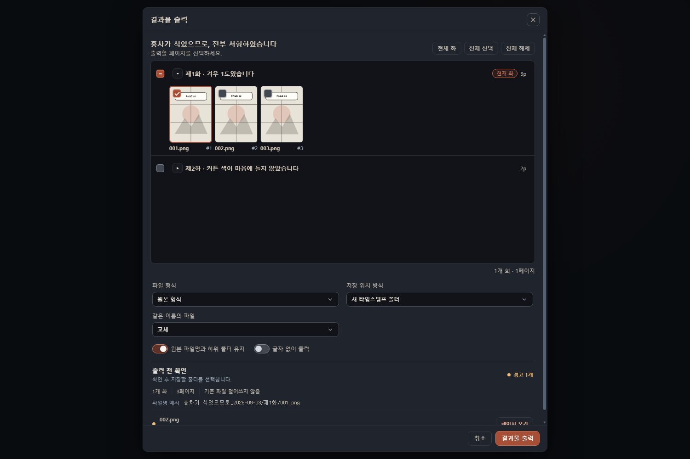

가로쓰기처럼 PSD 텍스트로 안전하게 표현할 수 있는 블록은 편집 가능한 텍스트 정보를 넣을 수 있습니다. 세로쓰기, 곡선, 원근과 복잡한 부분 서식은 앱과 모양이 달라지지 않도록 래스터 레이어가 될 수 있습니다.

  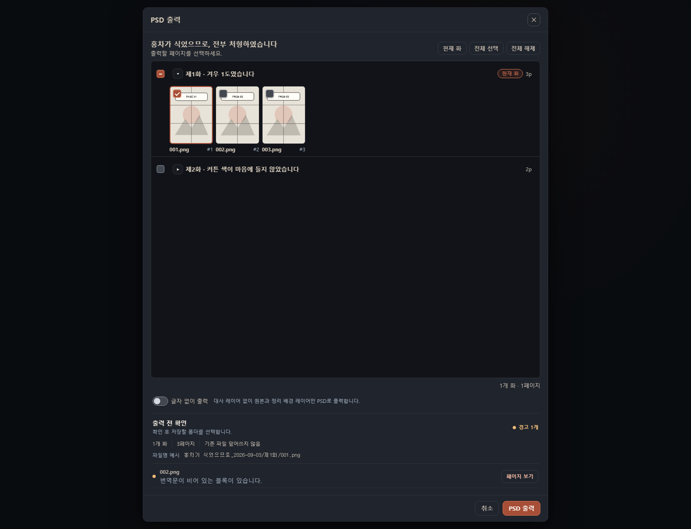

출력 전에 다음을 확인합니다.

- 선택한 작품·화·페이지 수
- 번역문이 비어 있거나 검수 대기인 블록
- 원본 제거가 빠진 블록
- 폰트 파일 누락
- 파일명 예시와 출력 폴더

기존 결과물을 덮어쓰지 않도록 새 출력 폴더를 사용하는 흐름이 기본입니다.

### 편집 가능한 작업 공유

<code>.mgtshare</code>는 완성 이미지가 아니라 다른 PC에서 이어서 편집하는 작업 파일입니다.

  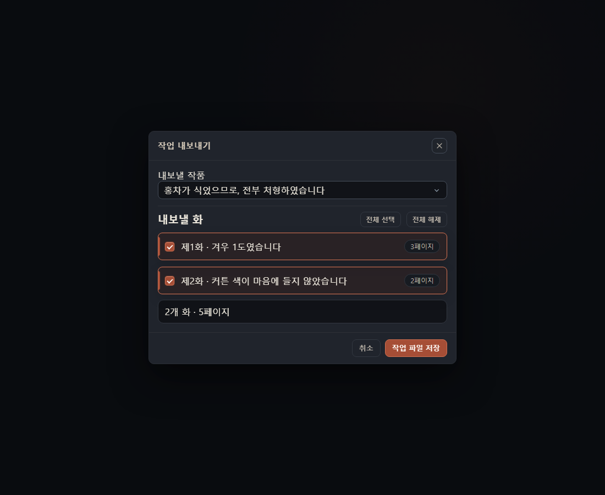

포함 가능:

- 원본 이미지
- 번역 블록, 좌표와 읽기 순서
- 폰트·색·방향을 포함한 서식
- 인페인팅 결과

포함하지 않음:

- 앱 설정
- ChatGPT 로그인 정보와 API 키
- AI/OCR 모델과 런타임
- 앱 로그

가져올 때 새 작품으로 만들거나 기존 작품의 화를 추가·교체할 수 있습니다. 원본 이미지가 포함되므로 공유 권한을 반드시 확인하세요.

---

## 자주 쓰는 단축키

<kbd>?</kbd>를 누르면 현재 단축키 도움말이 열립니다. <strong>설정 → 단축키</strong>에서 대부분의 키를 바꿀 수 있습니다.

  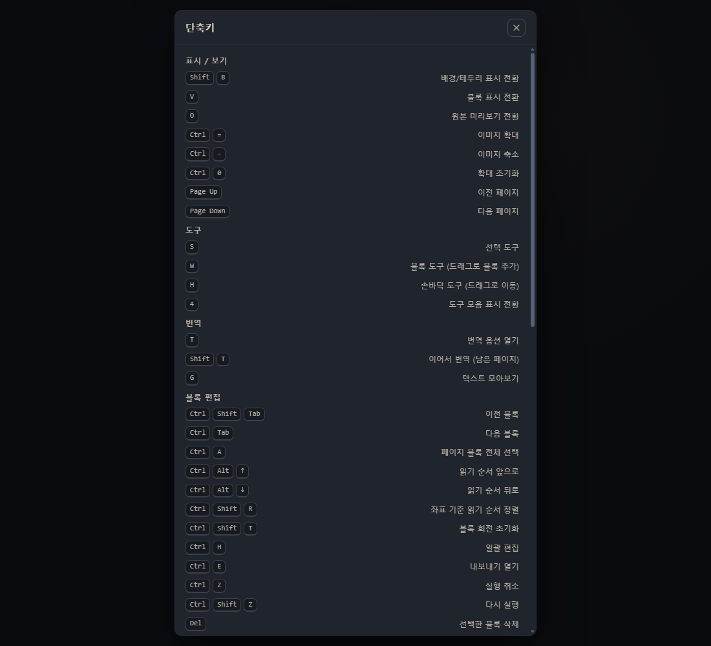

<kbd>Ctrl</kbd>+<kbd>K</kbd>는 명령 팔레트를 엽니다. 기능 이름 일부를 입력해 설정, 번역 옵션, 텍스트 모아보기, 일괄 편집과 내보내기를 메뉴를 찾지 않고 실행할 수 있습니다.

  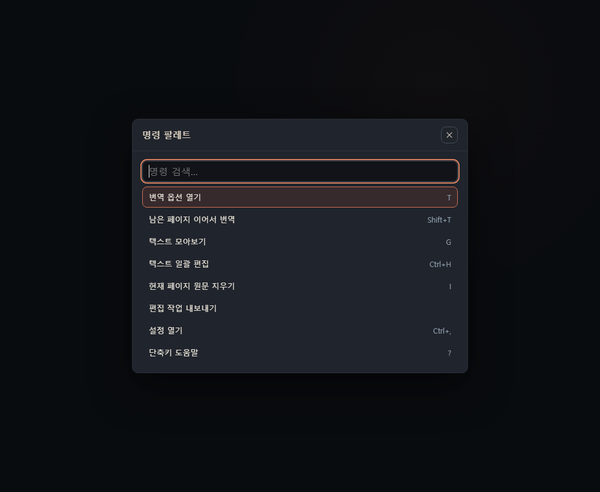

| 키                                                         | 동작                       |
| ---------------------------------------------------------- | -------------------------- |
| <kbd>Ctrl</kbd>+<kbd>K</kbd>                               | 명령 팔레트                |
| <kbd>Ctrl</kbd>+<kbd>,</kbd>                               | 설정 열기                  |
| <kbd>?</kbd>                                               | 단축키 도움말              |
| <kbd>T</kbd>                                               | 번역 옵션                  |
| <kbd>Shift</kbd>+<kbd>T</kbd>                              | 남은 페이지 이어서 번역    |
| <kbd>G</kbd>                                               | 텍스트 모아보기            |
| <kbd>Ctrl</kbd>+<kbd>H</kbd>                               | 일괄 편집                  |
| <kbd>Ctrl</kbd>+<kbd>E</kbd>                               | 내보내기                   |
| <kbd>Ctrl</kbd>+<kbd>Z</kbd>                               | 실행 취소                  |
| <kbd>Ctrl</kbd>+<kbd>Shift</kbd>+<kbd>Z</kbd>              | 다시 실행                  |
| <kbd>PageUp</kbd> / <kbd>PageDown</kbd>                    | 이전 / 다음 페이지         |
| <kbd>Ctrl</kbd>+<kbd>A</kbd>                               | 현재 페이지 블록 전체 선택 |
| <kbd>Ctrl</kbd>+<kbd>Alt</kbd>+<kbd>↑</kbd> / <kbd>↓</kbd> | 읽기 순서 이동             |
| <kbd>Ctrl</kbd>+<kbd>Shift</kbd>+<kbd>R</kbd>              | 좌표 기준 읽기 순서 정렬   |
| <kbd>Alt</kbd>+<kbd>1</kbd> … <kbd>Alt</kbd>+<kbd>0</kbd>  | 서식 프리셋 슬롯 1~10      |

텍스트 입력 중에도 동작해야 하는 명령과 편집기에 맡겨야 하는 키가 구분되어 있습니다. 키 충돌이 생기면 단축키 설정에서 기존 연결을 먼저 확인하세요.

단축키를 바꾸려면 원하는 명령의 입력란을 누른 뒤 새 조합을 입력하고 저장합니다. 이미 다른 명령에 연결된 조합은 충돌 표시를 확인한 뒤 한쪽을 바꾸세요. <strong>기본값으로 복원</strong>하면 사용자 지정 키를 모두 되돌릴 수 있습니다.

  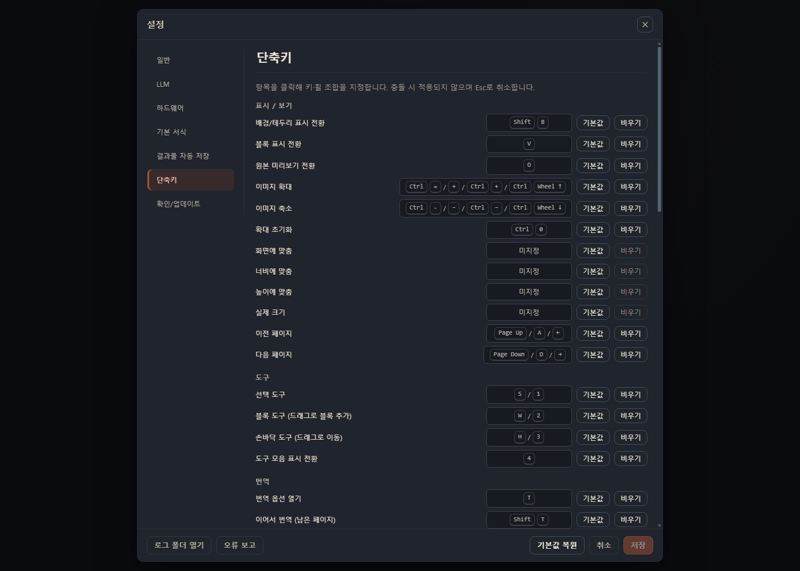

---

## 문제 해결

### 번역 버튼을 눌러도 시작하지 않습니다

1. 번역할 페이지가 선택되어 있는지 확인합니다.
2. <strong>설정 → 확인/업데이트</strong>에서 OCR·모델 확인을 실행합니다.
3. 원문·번역 언어와 LLM이 선택되어 있는지 봅니다.
4. Gemma라면 모델 다운로드, Codex라면 로그인, API라면 키와 모델을 확인합니다.

### 처음 실행하거나 첫 번역이 매우 느립니다

처음에는 모델, Python, OCR과 인페인팅 런타임을 내려받고 검증할 수 있습니다. 준비가 끝난 뒤에도 느리다면 작은 Gemma 프리셋, OCR CPU/권장 경로, AOT 또는 LaMa, 번역만 실행 순서로 부담을 낮춰 보세요.

### OCR 영역이 이상하게 합쳐지거나 갈라집니다

- 먼저 원문 언어가 맞는지 확인합니다.
- HayaiOCR과 PaddleOCR을 대표 페이지에서 각각 비교합니다.
- 기존 프로젝트의 예전 분리 방식이 더 낫다면 PaddleOCR을 사용합니다.
- 블록을 직접 고친 뒤 재번역할 때는 <strong>기존 블록 유지</strong>를 선택합니다.

### 효과음이 일반 대사로 들어갔습니다

블록의 텍스트 역할을 효과음으로 바꾸고 서식을 다시 적용합니다. 다음 번역에서는 HayaiOCR의 효과음 후보를 포함·제외하는 단계에서 분류를 확인하세요.

### 이름이나 말투가 페이지마다 달라집니다

용어집과 캐릭터에 표기를 등록하고 누적 컨텍스트를 사용합니다. 이미 번역한 화는 일괄 편집의 화자·번역문 조건으로 필요한 문장만 정리합니다.

### 일괄 편집 결과가 너무 많습니다

범위를 페이지로 줄이고, <strong>모든 말풍선</strong> 대신 텍스트 역할·화자·검수 상태 조건을 추가합니다. 오른쪽의 <strong>전체 제외</strong> 후 필요한 결과만 다시 포함하는 방법도 안전합니다.

### 일괄 편집에서 일부 항목이 충돌로 건너뛰어졌습니다

미리보기를 만든 뒤 다른 창이나 편집기에서 같은 블록이 바뀐 경우입니다. 창을 닫고 최신 내용으로 다시 열어 미리보기를 재계산하세요. 충돌 항목은 자동으로 덮어쓰지 않습니다.

### Codex 연결에 실패합니다

<strong>설정 → LLM → Codex</strong>에서 ChatGPT 로그인을 다시 확인하고 모델 테스트를 실행합니다. 계속 실패하면 확인/업데이트 탭에서 로그 폴더를 열어 내장 Codex App Server 시작 오류를 확인하세요.

### API에서 401, 403 또는 404가 나옵니다

API 키, Base URL, 모델 ID와 이미지 입력 지원 여부를 확인합니다. 서버가 거부할 수 있는 Temperature, top_p, top_k, reasoning_effort, 추가 JSON과 사용자 헤더를 잠시 비우고 재시도하세요.

### AMD 또는 최신 NVIDIA GPU에서 OCR이 실패합니다

드라이버와 권장 런타임을 확인합니다. OCR만 CPU로 바꿔도 LLM 번역은 GPU에서 계속 실행할 수 있습니다. 장치 고급 설정을 직접 바꿨다면 권장값으로 되돌려 비교하세요.

### 결과물의 폰트가 화면과 다릅니다

등록한 TTF/OTF 파일이 이동·삭제되지 않았는지 확인합니다. 다른 PC에서 연 작업이라면 같은 폰트를 등록하고, PSD에서 래스터 처리되는 세로·곡선·부분 서식 블록인지도 확인하세요.

---

## 데이터, 백업과 개인정보

설치 중 지정한 데이터 폴더 아래에 설정과 작품을 저장합니다.

<pre>
data/
  settings.json
  library/
  logs/
  fonts/
  hf-cache/
  llama.cpp/
  ocr-runtime/
  models/
  tmp/
</pre>

- <code>library/</code>: 작품, 화, 페이지, 블록과 인페인팅 데이터
- <code>fonts/</code>: 직접 등록한 TTF/OTF
- <code>hf-cache/</code>, <code>llama.cpp/</code>, <code>ocr-runtime/</code>, <code>models/</code>: 모델과 런타임
- <code>logs/</code>: 현재·직전 실행 로그

macOS 기본 데이터 위치는 <code>~/Library/Application Support/manga-gemma-translator</code>입니다.

중요한 작품은 데이터 폴더 전체를 백업하거나 <code>.mgtshare</code>로 별도 보관하세요. 보관함의 <code>library</code>, 원본과 출력물은 캐시가 아니므로 모델 정리와 함께 삭제하면 안 됩니다.

로그에는 로컬 경로나 작품 내용 일부가 들어갈 수 있습니다. GitHub 이슈에 붙이기 전에 미리보기를 읽고 민감한 내용을 가리세요. 앱은 오류 보고서를 자동 업로드하거나 이슈를 자동 제출하지 않습니다.

개인정보 안내는 [docs/privacy-policy.md](docs/privacy-policy.md), 보안 정책은 [SECURITY.md](SECURITY.md)에서 확인할 수 있습니다.

---

## 개발하기

필요 환경은 Node.js LTS, npm과 Git입니다.

<pre>
npm install
npm run dev
</pre>

주요 검사:

<pre>
npm run typecheck
npm run test
npm run lint
npm run build
npm run check
</pre>

Windows 패키지:

<pre>
npm run dist:win
</pre>

- 기여 안내: [CONTRIBUTING.md](CONTRIBUTING.md)
- 아키텍처 규칙: [docs/architecture.md](docs/architecture.md)
- UI 설계 규칙: [docs/ui-design-rules.md](docs/ui-design-rules.md)
- 프로젝트 이용 현황: [docs/reputation.md](docs/reputation.md)

---

## 코드 서명

릴리스마다 Windows Authenticode와 macOS Developer ID·공증 상태가 다를 수 있으므로 해당 버전 패치노트와 provenance를 확인하세요.

Free code signing provided by [SignPath.io](https://about.signpath.io/), certificate by [SignPath Foundation](https://signpath.org/).

- [코드 서명 정책](CODE_SIGNING_POLICY.md)
- [서드파티 고지](THIRD_PARTY_NOTICES.md)

## 라이선스

앱 소스코드는 [GPL-3.0-only](LICENSE)로 배포합니다. 폰트, FFmpeg, JavaScript/Python 패키지, OCR·AI 모델과 런타임에는 각각 별도 조건이 적용될 수 있습니다. 재배포 전 [THIRD_PARTY_NOTICES.md](THIRD_PARTY_NOTICES.md)와 [번들 폰트 고지](third_party/fonts/README.md)를 확인하세요.
