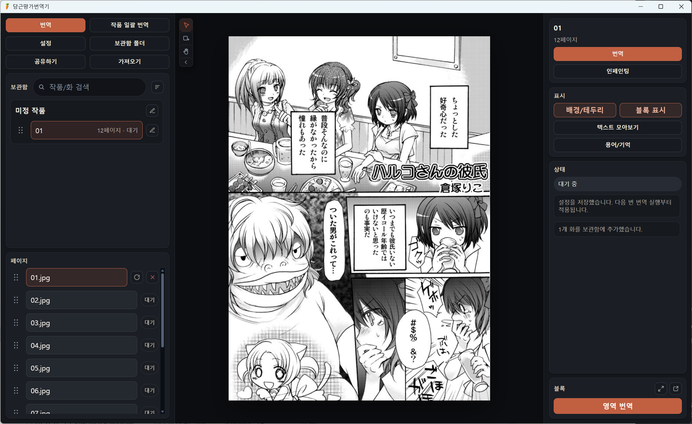
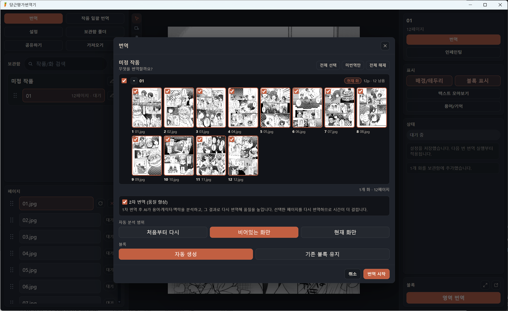
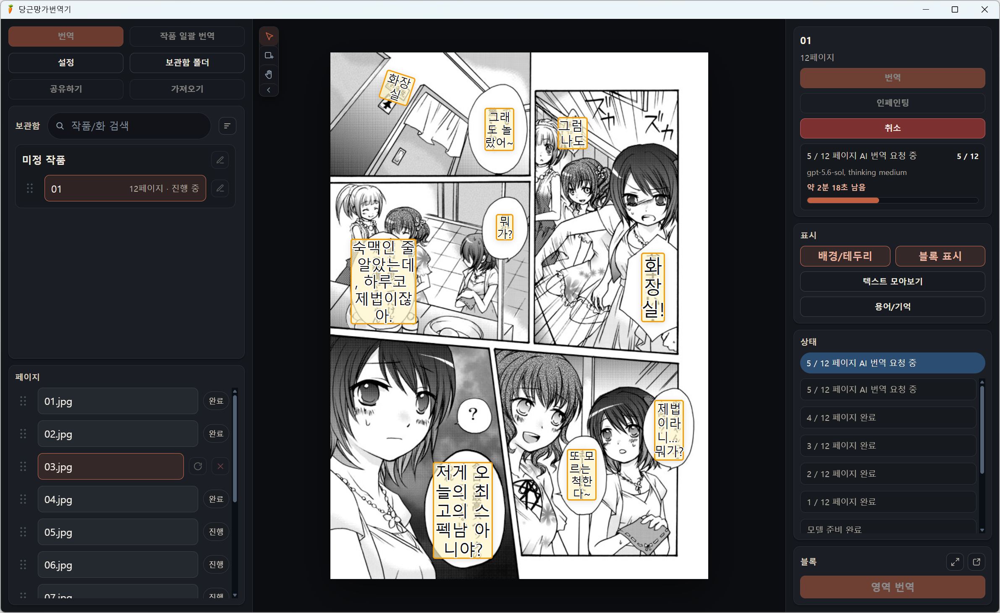
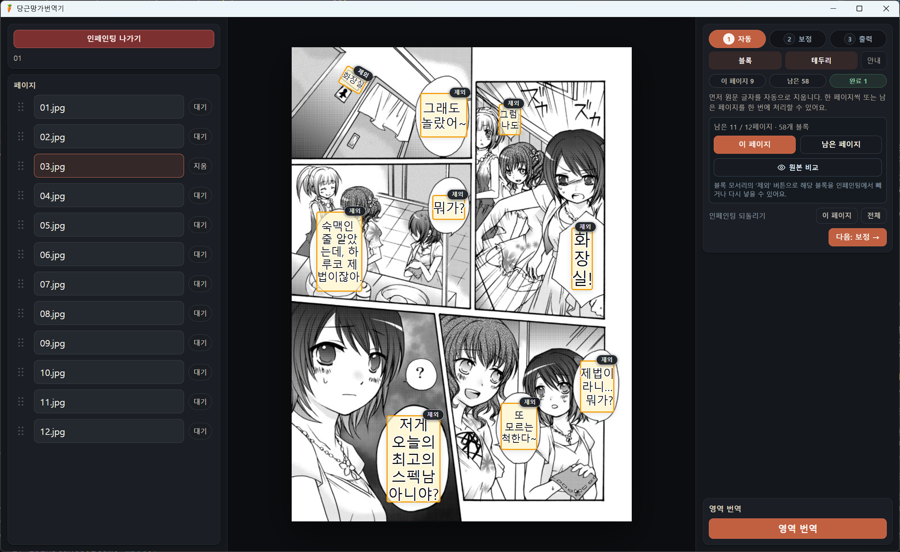

<p align="center">
  
</p>

# 胡萝卜漫画翻译器

<p align="center">
  支持 Windows 与 Apple Silicon macOS 稳定版，涵盖导入、OCR、AI 翻译、编辑、图像修复以及 PNG/分层 PSD 导出
</p>

<p align="center">
  <a href="README.md">한국어</a> ·
  <a href="README.en.md">English</a> ·
  <a href="README.ja.md">日本語</a> ·
  <strong>简体中文</strong> ·
  <a href="README.zh-Hant.md">繁體中文</a>
</p>

胡萝卜漫画翻译器是一款漫画制作工具：它可以从图片中识别对白与拟声词，用 AI 生成翻译区块，再由用户调整文字和排版，最后导出为完整 PNG 或分层 PSD。默认翻译方向为日语 → 韩语，也可以选择其他原文和译文语言。

- 下载 v2.4.3 正式版（Windows EXE · Apple Silicon DMG/ZIP）：[GitHub Releases](https://github.com/ucx0204/CarrotMangaTranslator/releases)
- 当前版本说明：[v2.4.3 更新说明](docs/release-notes/v2.4.3.md)
- 贡献指南：[CONTRIBUTING.md](CONTRIBUTING.md)
- 代码结构与质量规范：[docs/architecture.md](docs/architecture.md)
- 项目使用情况与公开资料：[docs/reputation.md](docs/reputation.md)

## 功能概览

- 可按作品和章节管理单张图片、图片文件夹、ZIP/CBZ 或 RAR/CBR 压缩文件以及 PDF。
- 可组合使用 Paddle OCR、`Gemma 4` 本地模型、`OpenAI Codex` 和兼容 OpenAI 的 `API` 进行翻译。
- 应用界面支持韩语、日语、英语、简体中文和繁体中文。
- 漫画的原文与译文语言支持 48 种预设，也可直接输入 BCP 47 语言代码。
- 可直接编辑翻译区块的文字、位置、方向、字体、颜色、描边和间距。
- 可让 AI 翻译参考术语表、角色语气、翻译规则和剧情记忆。
- 可用 AOT、LaMa、Flux 清除原文，再用画笔修正并导出完整 PNG 或分层 PSD。
- 可通过 TXT 和 CSV/TSV 进行外部校对，也可用 `*.mgtshare` 分享可继续编辑的作品数据。

## 安装前须知

- 支持的操作系统：Windows 10/11 x64；Apple Silicon（M1 及以上）的 macOS 14 或更高版本。不支持 Intel Mac。
- 所需可用空间：除应用本体外，根据所选 Gemma、OCR 和图像修复模型，可能还需要数 GB 或更多空间。
- 网络连接：安装、首次下载模型以及使用 Codex/API 时需要联网。本地模型准备完成后可以离线使用。
- 即使没有 GPU，也可使用部分 CPU 处理路径，但 OCR、本地翻译和 Flux 图像修复可能会非常慢。

Apple Silicon 正式版内置 arm64 FFmpeg、用于在 CPU 上运行 Paddle OCR 的 Python 环境以及 Metal 运行环境。Gemma、OCR 和图像修复模型权重会在首次使用时通过校验和检查后下载，以后会直接复用缓存。如果 v2.4.3 发布流程未配置 Developer ID 与公证凭据，macOS 版本会采用 ad-hoc 签名，因此 Gatekeeper 阻止首次启动时可能需要前往 `系统设置 → 隐私与安全性` 手动批准。macOS 数据保存在 `~/Library/Application Support/manga-gemma-translator`。

## 快速开始

1. 前往 [v2.4.3 正式版](https://github.com/ucx0204/CarrotMangaTranslator/releases/tag/v2.4.3)，Windows 用户下载 `CarrotMangaTranslator-Setup-v2.4.3.exe`，Apple Silicon 用户下载 arm64 DMG 或 ZIP。如果 macOS 阻止首次启动，请前往 `系统设置 → 隐私与安全性` 手动批准该应用。
2. 在 `设置 → 常规` 中确认应用界面语言。首次启动时会自动选择受支持的 Windows 语言，其他语言环境则默认使用韩语。
3. 在 `设置 → 翻译引擎` 中选择原文语言、译文语言和翻译引擎。
   - 希望在本机处理时，选择 `Gemma 4`
   - 希望通过内置的官方 Codex App Server 使用 ChatGPT 账号时，选择 `OpenAI Codex`
   - 希望连接支持图片输入的外部服务器时，选择 `API`
4. 在 `设置 → 硬件 · OCR` 中选择 OCR 质量和设备，然后前往 `安装 / 检查` 执行 `检查 OCR/模型`。首次使用时，应用会自动准备所需文件。
5. 在主界面的 `翻译` 中选择图片、文件夹、ZIP/CBZ 或 RAR/CBR 压缩文件、PDF，并设置作品名和章节名。
6. 点击章节卡片上的 `翻译`，选择页面范围。首次使用时建议选择 `仅未翻译 + 自动生成`；如果更重视上下文一致性，可以启用 `二次翻译`。
7. 检查生成的区块。如有需要，可在图像修复中清除原文并进行修正，然后将所选页面导出为完整 PNG 或分层 PSD。

> 应用界面语言与漫画翻译语言彼此独立。即使把界面切换为英语，日语 → 韩语的翻译设置也会保持不变。

## 界面预览

| 工作界面与原图                                                                                          | 翻译范围与二次翻译                                                                                      |
| ------------------------------------------------------------------------------------------------------- | ------------------------------------------------------------------------------------------------------- |
|            |  |
| **翻译进度与生成的区块**                                                                                | **自动图像修复步骤**                                                                                    |
|  |           |

## 功能说明

### 导入与作品库

- 支持的图片格式：PNG、JPG、JPEG、WEBP
- 支持的压缩文件：ZIP、CBZ、RAR、CBR
- 支持的文档：PDF（按顺序将每一页转换为 PNG）
- `打开图片` 可导入一张图片；`打开文件夹` 和 `打开压缩文件` 会将多张图片按自然顺序排序，并作为一个章节导入。
- `批量翻译作品` 会把文件夹内的子文件夹和 ZIP/CBZ/RAR/CBR 显示为多个候选章节，并一次性添加选中的章节。
- 支持搜索和排序作品与章节、重命名和删除、拖放调整章节与页面顺序，以及删除单个页面。
- WEBP 在加入作品库时会转换为 PNG。单个输入文件不得超过 256 MB，解码后的图片不得超过 120 MP。

### 翻译范围与处理流程

- 可通过缩略图直接选择作品中的章节和页面，也可使用 `全选`、`仅未翻译` 和 `全部取消`。
- `二次翻译` 会在首轮结果生成后重新分析术语、角色和上下文，并再次翻译所选范围。翻译质量可能会提高，但耗时和 API 用量也会增加。
- 自动分析范围可选择 `仅空白章节`、`从头开始` 或 `仅当前章节`。
- `自动生成` 会根据 OCR 和 AI 结果新建区块。
- `保留现有区块` 会保留人工调整过的区域和格式，只重新填充各区域的 OCR 与译文。没有区块的页面会按自动生成方式处理。
- 支持重新翻译页面、取消任务，以及拖选页面局部后重新分析的 `区域翻译`。
- 翻译会同时使用 Paddle OCR 结果和页面图片。OCR 缓存按原文语言分别保存；如果日语页面中几乎找不到日语依据，则会减少不必要的 AI 调用。

### 术语、角色与作品记忆

- 可使用 `AI 自动分析` 创建术语表、角色、翻译规则和剧情记忆。
- 术语表可保存原文、译文、分类、别名和备注，并可逐项设置是否启用。
- 角色信息可保存原文名、译名、敬语/非敬语等语气，以及自行编写的说话方式说明。
- 翻译规则可记录称谓、拟声词、文体以及各作品的注意事项。
- 剧情记忆会记录前面页面发生的事件和上下文，供后续翻译和二次翻译参考。
- 界面底部的令牌预算会显示记忆占用的上下文，以及为翻译响应预留的空间。

### 区块编辑与格式

- 使用选择工具可移动区块和调整大小；使用区块工具可拖出新区域；使用手形工具可移动放大后的画布。
- 按住 `Ctrl` 并点击可选择多个区块。
- 可编辑译文与 OCR 原文、横排/竖排、对齐、倾斜角度、透明度、自动适配、字号、行距、字距、字符宽度、粗体、斜体、文字颜色、描边和描边宽度。
- 可在译文中使用 `**粗体**`、`*斜体*`、`***粗体+斜体***` 标记，为部分文字单独应用格式。
- 可设置新建区块的默认格式，也可只选择所需属性，批量应用到多个区块、当前页面或当前章节。
- 编辑器可以显示在右侧面板、应用内可移动的浮动面板，或单独的 Windows 窗口中。
- 当前章节的编辑操作最多支持 100 步撤销与重做。
- 支持放大、缩小、原始大小、预览原图，以及切换区块和背景的显示状态。
- 提供 `Ctrl+K` 命令面板和 `?` 快捷键帮助，并可在设置中修改各项快捷键。

### 字体

除现有韩文字体外，应用还分别内置了 6 款适用于英语、日语、简体中文和繁体中文的免费字体。字体列表始终将 `默认` 放在最上方，并优先显示当前应用语言对应的字体组。其余字体组保持韩语 → 英语 → 日语 → 简体中文 → 繁体中文的顺序，只将当前语言的字体组移到前面。用户自行添加的字体显示在最后。

| 字体组   | 内置字体                                                                                       |
| -------- | ---------------------------------------------------------------------------------------------- |
| 英语     | Comic Neue, Kalam, Bangers, Luckiest Guy, Permanent Marker, Freckle Face                       |
| 日语     | Yusei Magic, Mochiy Pop One, Hachi Maru Pop, Dela Gothic One, Reggae One, DotGothic16          |
| 简体中文 | ZCOOL KuaiLe, ZCOOL QingKe HuangYou, ZCOOL XiaoWei, Ma Shan Zheng, Long Cang, Liu Jian Mao Cao |
| 繁体中文 | Huninn, Iansui, LXGW WenKai TC, LXGW Marker Gothic, ChenYuluoyan, Cubic 11                     |

也可以通过 `+ 添加 TTF/OTF 字体` 添加或删除其他字体。用户字体会复制到数据文件夹的 `fonts/` 中，并同时用于界面预览和 PNG/PSD 导出。内置字体的来源和许可证请参阅 [third_party/fonts](third_party/fonts/README.md)。

### 汇总文本与外部校对

- 可汇总查看当前页面或整个章节的 `译文+OCR`、`仅译文` 或 `仅 OCR`。
- 可按顺序跳转搜索结果、复制文本或保存为 TXT。
- 重新导入 `仅译文` TXT 时，会保留区块位置和 OCR 原文，只按行序更新对应的译文。
- CSV/TSV 校对表可导出 `block_id`、OCR 原文、译文、校对状态和备注。
- 导入校对表时，只会应用相同 `block_id` 对应的译文、状态和备注，并对缺失、重复及 OCR 不一致发出警告。
- 页面内的文本会按照原文语言的阅读方向排序。

### 图像修复与结果导出

- `AOT 最小`：最轻量，优先确保可以运行的处理方式
- `LaMa 节省`：轻量、针对漫画优化的原文清除方式
- `Flux 完整加载`：优先处理复杂背景质量的方式
- 支持按翻译区块排除图像修复、扩展边框，以及自动处理当前页面或剩余页面。
- 可用遮罩画笔指定需要再次清除的区域，并用颜色画笔、取色器和还原画笔手动修正细小痕迹。
- 修正操作同样支持撤销与重做。
- 可将所选页面导出为完整 PNG 或分层 PSD。PSD 会分离原始背景、修复背景和各文本区块；复杂的竖排、曲线或透视文本会以保真栅格图层保存。

### 分享与导入

`*.mgtshare` 不是完成的 PNG 或 PSD，而是可在应用中继续编辑的作品包。它可以包含所选作品和章节的原始图片、翻译区块、坐标、格式和图像修复结果，但不会包含设置、登录信息、模型或日志。

导入时，可以新建作品，也可以向现有作品添加或替换章节；应用前还可在合并界面中拖动调整章节顺序。分享受版权保护的原始图片之前，请务必确认自己拥有相应的分发权限。

## 语言与设置

### 应用语言与翻译语言

| 类型           | 用途                         | 支持范围                                             |
| -------------- | ---------------------------- | ---------------------------------------------------- |
| 应用语言       | 按钮、菜单、状态和错误信息   | 한국어、日语、English、简体中文、繁體中文            |
| 原文与译文语言 | OCR 和 AI 读取与翻译的语言对 | 48 种预设，也可直接输入 `eo`、`pt-BR` 等 BCP 47 代码 |

设置窗口分为六个选项卡。

- `常规`：应用界面语言
- `翻译引擎`：语言对、Gemma/Codex/API、模型、最大输出令牌、上下文长度和 API 高级请求参数
- `硬件 · OCR`：OCR 质量与设备、Gemma GPU 运行环境、图像修复模型与后端
- `文本格式`：新建区块的默认方向、对齐、字体、大小、间距、颜色和描边
- `快捷键`：查看、翻译、编辑、图像修复和全局命令的组合键
- `安装 / 检查`：检查 OCR 与模型是否就绪、应用版本、更新页面和日志文件夹

### 翻译引擎对比

| 引擎         | 优点                                                                       | 需要准备                                                         |
| ------------ | -------------------------------------------------------------------------- | ---------------------------------------------------------------- |
| Gemma 4      | 页面和模型都在本机处理，准备完成后可离线使用                               | GGUF 模型、适合本机的 CUDA/ROCm/Vulkan 运行环境、充足的 RAM/VRAM |
| OpenAI Codex | 使用内置的官方 Codex App Server 和应用专用 ChatGPT 登录，不保存 API 密钥   | 可使用 Codex 的 ChatGPT 账号、网络连接                           |
| API          | 可连接兼容 OpenAI 的视觉模型、本地服务器、NVIDIA NIM、兼容 Gemini 的端点等 | Base URL、支持图片输入的模型名称，以及按需提供 API 密钥          |

模型系列默认使用`速度（推荐）`。模型大小会自动按以下规则选择。

- 约 8 GB VRAM：`12B`
- 16 GB 或更多 VRAM（包括 24 GB 及以上显卡）：`26B`
- `31B`：希望优先于更快的默认选项时手动选择
- 特殊配置：`自定义`

OCR 质量分为 `最小`、`节省` 和 `完整加载`。`完整加载`使用 PP-OCRv6 Transformers 语义路径并需要受支持的 GPU；使用 CPU 时请从`节省`开始。

<details>
<summary><strong>准备 OpenAI Codex 引擎</strong></summary>

Codex 引擎使用应用内置的 OpenAI 官方 Codex App Server。在 `设置 → 翻译引擎 → Codex` 中点击 `使用 ChatGPT 登录` 后，系统浏览器会打开，认证信息只保存在本应用专用的数据目录中。不会使用系统中安装的 Codex CLI 及其 `~/.codex` 设置，也无需输入 OpenAI API 密钥。

翻译在只读的临时 Codex 线程中运行，完成后会删除。对于列表中没有的模型，可在 `Custom` 中输入模型 ID。

官方说明：[Codex App Server](https://learn.chatgpt.com/docs/app-server)、[Codex 认证](https://learn.chatgpt.com/docs/auth)

</details>

<details>
<summary><strong>兼容 OpenAI 的 API、NVIDIA NIM 与 Gemini</strong></summary>

API 引擎会在 Base URL 后附加 `/chat/completions`，并发送图片和 OCR 提示。所选模型必须支持图片输入。

- 通用 OpenAI 兼容服务器：`https://server.example/v1`
- NVIDIA NIM：`https://integrate.api.nvidia.com/v1`
- Gemini OpenAI 兼容端点：`https://generativelanguage.googleapis.com/v1beta/openai`
- LM Studio 等本地服务器如不需要身份验证，可以留空 API 密钥。

请在各服务提供商的界面中确认模型 ID 和密钥。还可以设置 `Temperature`、`top_p`、`top_k`、`reasoning_effort`、额外的 request body JSON 和 custom headers JSON。如果服务器拒绝无法识别的参数，请先清空高级参数再检查。

也可以通过环境变量覆盖这些值。

- OpenAI 官方密钥：`OPENAI_API_KEY`
- 兼容服务器：`MANGA_TRANSLATOR_API_BASE_URL`、`MANGA_TRANSLATOR_API_MODEL`、`MANGA_TRANSLATOR_API_KEY`

</details>

<details>
<summary><strong>NVIDIA 与 AMD 处理路径</strong></summary>

| 任务       | NVIDIA                       | AMD                            | 用户手动选择的替代方式 |
| ---------- | ---------------------------- | ------------------------------ | ---------------------- |
| Gemma      | CUDA 12、RTX 50 专用运行环境 | ROCm 或 Vulkan                 | 使用更小的模型预设     |
| Paddle OCR | NVIDIA CUDA                  | 在受支持的 GPU 上使用 AMD ROCm | CPU 最小/节省          |
| Flux       | NVIDIA CUDA                  | ZLUDA + AMD HIP SDK            | CPU                    |

AMD Gemma 会自动查找适合 GPU 和驱动程序的 ROCm target。如果自动检测不正确，高级用户可按以下示例手动指定。

```powershell
$env:MANGA_TRANSLATOR_AMD_ROCM_TARGET = "gfx110X"
```

AMD ZLUDA 图像修复需要安装 [Windows 版 AMD HIP SDK](https://www.amd.com/en/developer/resources/rocm-hub/hip-sdk.html)。OCR GPU 失败时，应用会停止任务并显示错误。若要改用 CPU 继续处理，请在设置中明确将 OCR 设备切换为 CPU；Gemma 仍可继续使用 AMD GPU。

</details>

## 数据存储位置

用户作品和大型运行环境会分别存放在安装时指定的数据文件夹下。

```text
data/
  settings.json
  library/
  logs/
  fonts/
  hf-cache/
  llama.cpp/
  ocr-runtime/
  models/
  tmp/
  panel-window-bounds.json
```

- `library/` 存放作品、章节、页面和区块数据。
- `fonts/` 存放用户自行添加的 TTF/OTF 字体。
- `hf-cache/`、`llama.cpp/`、`ocr-runtime/` 和 `models/` 存放下载的模型与运行环境。
- `logs/` 中包含本次运行的 `app.log` 和上一次运行的 `previous.log`。原始日志可能包含本地路径或作品相关内容，请勿直接公开。
- 卸载应用时，可另行选择是否删除作品数据以及模型/OCR 缓存。

请备份重要作品的数据文件夹，或将其导出为 `*.mgtshare`。

## 常见问题

### 首次启动和翻译速度太慢

首次启动包含下载和验证模型、Python、OCR 及图像修复运行环境所需的时间。准备完成后如果仍然很慢，请先尝试更小的 Gemma 预设、CPU `节省` OCR，以及 AOT/LaMa 图像修复。避免多个 GPU 任务、游戏和浏览器同时占用 VRAM 也会有所帮助。

### 无法连接 Codex

请在 `设置 → 翻译引擎 → Codex` 中点击 `使用 ChatGPT 登录`，完成浏览器认证后再执行 `检查 OCR/模型`。无需安装 Codex CLI，也无需在终端中单独登录。如果仍然失败，请在应用日志中检查内置 Codex App Server 的启动错误。OCR 准备失败有时看起来也像 Codex 连接问题，因此也请查看结果日志中具体失败的步骤。

### API 返回 401、403 或 404

请检查 API 密钥、Base URL 和模型 ID。Base URL 通常只需填写到 `/v1`，并且必须使用支持图片输入的模型。清空服务提供商不支持的高级请求参数和 JSON 后，再重新测试。

### AMD OCR GPU 运行失败

Windows ROCm 对支持的 GPU 与驱动程序组合较为敏感。即使只把 OCR 设备改为 CPU，Gemma 翻译仍可继续在 AMD GPU 上运行。还请在日志中检查是否同时识别了集成显卡、VRAM 是否不足，以及是否发生 Windows TDR。

### AMD ZLUDA 图像修复失败

请确认已安装 Windows 版 AMD HIP SDK，并正确设置 `HIP_PATH`，然后重新启动应用。如果需要立即继续工作，可将 Flux 后端改为 CPU，或使用 AOT/LaMa 处理方式。

### RTX 50 系列显卡上 OCR 失败

请确认已安装最新 NVIDIA 驱动程序，并检查应用中的 RTX 50 专用 OCR 运行环境。如果 GPU OCR 仍然失败，可以只把 OCR 改为 CPU `节省`，继续进行翻译。

### 导出结果中的字体与界面显示不同

内置字体会同时用于界面和 PNG/PSD。如果删除了用户字体文件，或在另一台电脑上打开作品，请重新添加该字体。导出前也请检查文字方向、自动适配、粗细以及字体批量应用状态。

## 报告问题时

翻译或分析任务失败，或者应用发生意外错误时，会打开`错误报告`窗口。若要稍后手动报告，请在 `Ctrl+K` 命令面板中选择`报告问题`。

可按以下步骤通过 [GitHub Issues](https://github.com/ucx0204/CarrotMangaTranslator/issues) 分享报告：

1. 填写错误发生前进行的操作，并检查自动生成的 Markdown 预览。
2. 如果不希望分享，可从报告中排除系统信息或已清理的错误日志。
3. 选择`在 GitHub 中创建 Issue`后，系统浏览器会打开预填内容的新 Issue。如果报告过长而无法放入 URL，诊断信息会复制到剪贴板，请将其粘贴到 Issue 正文中。
4. 再次确认没有不应公开的内容，然后由您在 GitHub 上提交。

应用不会自动上传错误报告，也不会自动提交 GitHub Issue。共享用诊断信息会自动遮盖 API 密钥、认证标头、用户目录路径和作品文本等可能敏感的内容，但无法保证自动检测覆盖所有情况。请务必检查预览。

原始 `app.log` 和 `previous.log` 比共享用诊断信息更详细，且未经过清理。如果进一步调查需要原始日志，请通过`打开日志文件夹`查找，并且只附上已手动删除路径、令牌和作品内容的副本。

## 开发

开发环境需要 Windows、Node.js LTS、npm 和 Git。

```powershell
npm install
npm run dev
```

开发模式会使用 `.tmp/electron-dev` 作为单独的 userData/session 文件夹。运行以下命令执行完整检查。

```powershell
npm run check
```

构建应用并生成 Windows 安装包：

```powershell
npm run build
npm run dist:win
```

有关进程边界、SSOT、错误处理和测试规范，请参阅 [代码边界与质量规范](docs/architecture.md)。

## Code signing policy

Free code signing provided by [SignPath.io](https://about.signpath.io/), certificate by [SignPath Foundation](https://signpath.org/).

**状态（2026年7月28日）：** SignPath Foundation 申请目前正在审核中。当前 Windows 发布产物尚未签名，不受此代码签名策略保护。

- [完整代码签名策略](CODE_SIGNING_POLICY.md)
- [安全策略](SECURITY.md)
- [隐私政策](docs/privacy-policy.md)

## 演示图片来源

README 中四个界面截图里的漫画基于 [IDPF EPUB 3 Samples Project](https://github.com/idpf/epub3-samples) 的 [`Haruko`](https://github.com/idpf/epub3-samples/tree/main/30/haruko-jpeg) 示例。原作采用 [CC BY-SA 3.0](https://creativecommons.org/licenses/by-sa/3.0/) 许可，截图中还加入了胡萝卜漫画翻译器的韩语翻译区块和工作状态。这些演示图片独立于应用源代码，适用 CC BY-SA 3.0 条款。

## 许可证

应用源代码以 [GPL-3.0-only](LICENSE) 许可证发布。与应用一起使用或下载的字体、ffmpeg、JavaScript/Python 软件包、OCR/AI 模型及其运行环境可能适用不同条款。重新分发前，请查看 [THIRD_PARTY_NOTICES.md](THIRD_PARTY_NOTICES.md) 和 [内置字体声明](third_party/fonts/README.md)。
