<p align="center"></p>

# Carrot Manga Translator

把 **OCR → 翻譯 → 原文擦除 → 嵌字與校對 → 匯出**放在一起的桌面應用。匯入自己準備的漫畫原稿，使用本機 Gemma、Codex 或 OpenAI 相容 API 翻譯。

[한국어](README.md) · [English](README.en.md) · [日本語](README.ja.md) · [简体中文](README.zh-Hans.md) · **繁體中文**

**[下載 v2.8.0](https://github.com/ucx0204/CarrotMangaTranslator/releases/tag/v2.8.0)** · [更新說明](docs/release-notes/v2.8.0.md) · [問題與建議](https://github.com/ucx0204/CarrotMangaTranslator/issues)

[快速入門](#start) · [編輯文字](#edit) · [音效 ImageGen](#sfx) · [快捷鍵](#shortcuts) · [常見問題](#troubleshooting)

Windows 10/11 · Apple Silicon macOS 14+ · [GPL-3.0-only](LICENSE)

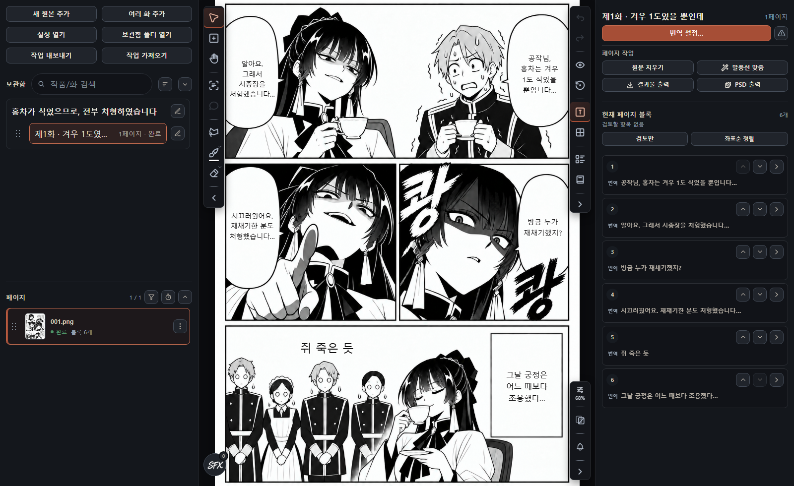

對白保留為**可編輯的文字區塊**，大型音效則可用 **Codex ImageGen** 轉成符合畫風的文字圖片。[前後對照與操作方法](#sfx)

<a id="start"></a>

## 先完成一頁

1. **[安裝](#install)**後，在**設定 → AI → 翻譯**中選擇原文語言、目標語言和引擎。
2. 檢查 **[OCR 與影像設定](#setup)**，執行**檢查/更新 → OCR/模型檢查**。
3. 透過**[新增原稿](#import)**匯入圖片或資料夾。
4. 開啟章節，在**[翻譯設定](#translate)**中選一頁，先用**僅翻譯**檢查結果。
5. **[修正 OCR 和譯文](#edit)**，再用**[擦除原文](#erase)**和**適配氣泡**整理。
6. **[匯出結果](#export)**儲存成品。設定合適後再處理剩餘頁面。

### 按任務查詢

| 想做什麼                         | 跳轉                                                          |
| -------------------------------- | ------------------------------------------------------------- |
| 安裝或切換引擎                   | [安裝](#install) · [AI、語言、硬體](#setup)                   |
| 匯入多章、壓縮包、PDF、網頁      | [書庫與匯入](#import)                                         |
| 選擇範圍、重新翻譯、恢復失敗頁面 | [翻譯](#translate)                                            |
| 移動畫面、選擇、對照原稿         | [工作區](#workspace)                                          |
| 修改臺詞、字級、換行、曲線、變形 | [文字與佈局](#edit)                                           |
| 重用字型、格式和文字區塊         | [字型、預設與文字區塊庫](#styles)                             |
| 清理殘字、塗色、恢復原稿         | [擦除與修補](#erase)                                          |
| 翻譯或生成音效字                 | [音效](#sfx)                                                  |
| 遮擋傳送圖片中的區域             | [傳送影像遮擋](#redaction)                                    |
| 統一人名、語氣和劇情上下文       | [術語、記憶與網路調查](#context)                              |
| 批次修改名稱、句子和格式         | [批次編輯](#batch)                                            |
| 集中讀臺詞、在外部校對           | [文字彙總與校對表](#review)                                   |
| 匯出圖片/PSD、自動儲存、分享工程 | [匯出](#export) · [自動儲存](#autosave) · [備份與分享](#data) |
| 找功能、解決故障                 | [快捷鍵](#shortcuts) · [常見問題](#troubleshooting)           |

<a id="install"></a>

## 安裝

| 平臺              | 下載與操作                                                                                      |
| ----------------- | ----------------------------------------------------------------------------------------------- |
| Windows 10/11     | 執行發行版的 **Setup EXE**，選擇資料資料夾。                                                    |
| Apple Silicon Mac | 下載 **arm64 DMG 或 ZIP**，把應用移到**應用程式**。需要 macOS 14 或更高版本，不支援 Intel Mac。 |

系統彈出警告時，請核對該發行版的簽名資訊與校驗和。Mac 首次啟動許可可在**系統設定 → 隱私與安全性**中確認。[簽名政策](CODE_SIGNING_POLICY.md)

模型與執行環境單獨下載，需要額外磁碟空間。首次準備需要聯網。檔案準備完成後，本機 Gemma、OCR 和影像修復可以在本機執行；Codex、遠端 API 與網路調查需要聯網。

<a id="setup"></a>

## 語言與 AI 設定

**介面語言**在**設定 → 一般**中選擇，**原文和目標語言**在**設定 → AI → 翻譯**中單獨選擇。

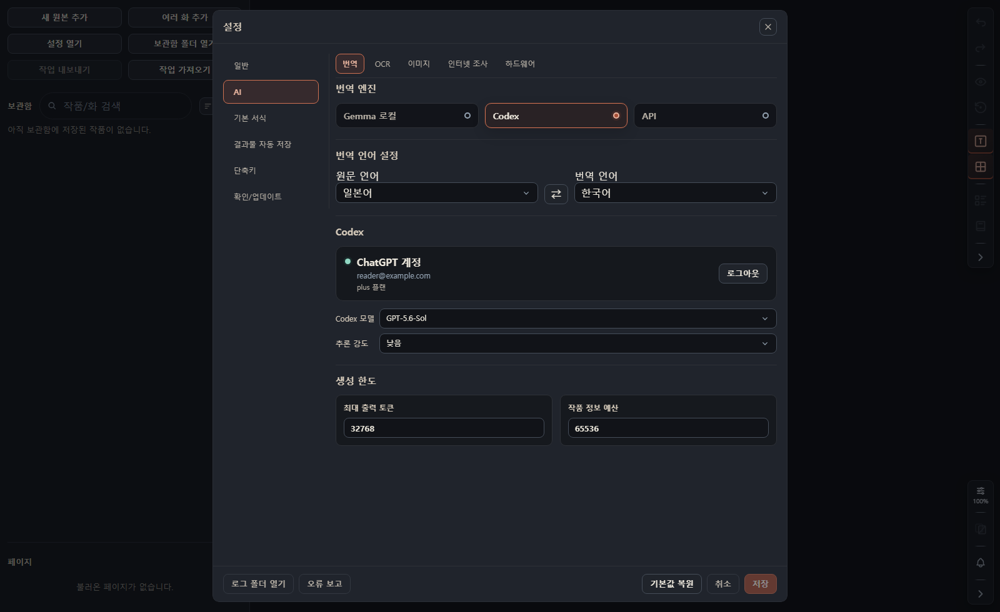

| 引擎           | 準備內容                          | 選擇後檢查                                                   |
| -------------- | --------------------------------- | ------------------------------------------------------------ |
| **本機 Gemma** | 模型儲存空間、RAM/VRAM            | 模型預設與執行環境。先試適合裝置的小預設。                   |
| **Codex**      | 在應用內登入 ChatGPT              | 帳戶可用模型與推理強度。使用內建伺服器，無需另裝 Codex CLI。 |
| **API**        | Base URL、模型 ID，必要時提供金鑰 | OpenAI 相容性及影像輸入支援。也可以使用相容的本機伺服器。    |

**AI 下的各個標籤配置不同任務。** 切換翻譯引擎不會同時更換所有 OCR、擦除、Codex 影像處理和調查設定。

| AI 子標籤    | 配置內容                                                                                |
| ------------ | --------------------------------------------------------------------------------------- |
| **翻譯**     | 語言、Gemma/Codex/API、生成上限                                                         |
| **OCR**      | HayaiOCR/PaddleOCR、支援的裝置。識別區域或文字不理想時，用同一頁比較。                  |
| **影像**     | **AOT / LaMa / Flux** 原文擦除及後端、獨立的 **Codex 影像模型與推理強度**、傳送影像遮擋 |
| **網路調查** | 帳戶/金鑰、搜尋結果分析模型、使用限額                                                   |
| **硬體**     | 應用圖形 GPU、本機 AI 計算 GPU、檢測裝置的推薦值。更換圖形 GPU 後需儲存並重啟。         |

<details>
<summary>高階設定與更多截圖</summary>

- **Gemma：**選擇 Hugging Face 模型或本機檔案。預設中的記憶體標註是參考，長頁面、上下文及其他程式也會佔用記憶體。執行環境須匹配裝置；記憶體不足時先降低預設和上下文上限。
- **API：**Temperature、top_p、top_k、reasoning_effort、額外 JSON、自定義請求頭只填寫伺服器支援的專案。請求間隔、重試和金鑰設定應符合服務限額。不要分享顯示金鑰的截圖。
- **生成上限：**最大輸出 token 限制回覆長度，作品資訊預算限制參考上下文的數量。數值越大不代表翻譯一定越好。
- **準備檢查：**儲存設定後執行**檢查/更新 → OCR/模型檢查**。檢查更新會開啟發行頁面。
- 截圖：[一般](docs/images/readme-v2712/settings-general.png) · [OCR](docs/images/readme-v2712/settings-ocr.png) · [影像](docs/images/readme-v2712/settings-image.png) · [調查](docs/images/readme-v2712/settings-research.png) · [硬體](docs/images/readme-v2712/settings-hardware.png) · [檢查/更新](docs/images/readme-v2712/settings-test.png)

</details>

<a id="import"></a>

## 匯入原稿與書庫

層級為**作品 → 章節 → 頁面 → 文字區塊**。作品儲存共用術語和角色；章節包含頁面；頁面包含原稿、翻譯文字區塊與修補結果。文字區塊是一段對白、旁白或音效。

使用**新增原稿**選擇來源，在預覽中檢查順序和排除項，再新建作品或新增到已有作品。一次匯入多回時使用**新增多個章節**，也可以把檔案或資料夾拖入應用。

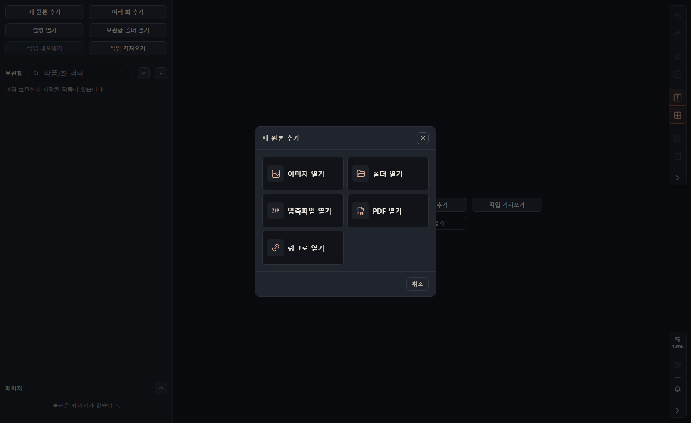

| 來源                      | 匯入方式                                      |
| ------------------------- | --------------------------------------------- |
| PNG、JPEG、WebP           | 選擇圖片或圖片資料夾                          |
| ZIP、CBZ、RAR、CBR        | 選擇壓縮包並檢查內部圖片                      |
| PDF                       | 將頁面作為圖片匯入                            |
| 含多個章節的資料夾/壓縮包 | 使用多章匯入，檢查章節劃分與順序              |
| 網頁                      | 載入圖片列表，按尺寸篩選後選擇所需圖片        |
| `.mgtshare`               | 用**匯入工程**恢復編輯工作。[分享說明](#data) |

書庫搜尋用於查詢作品與章節，頁面列表顯示順序和處理狀態。檢查損壞或不支援檔案的排除結果。網站登入或訪問限制導致無法讀取時，請使用自己準備的本機檔案。

<a id="translate"></a>

## 翻譯、繼續與重譯

開啟章節後點選**翻譯設定**或按 `T`。選擇作品中的章節和頁面，可用**僅未翻譯**篩選剩餘任務。

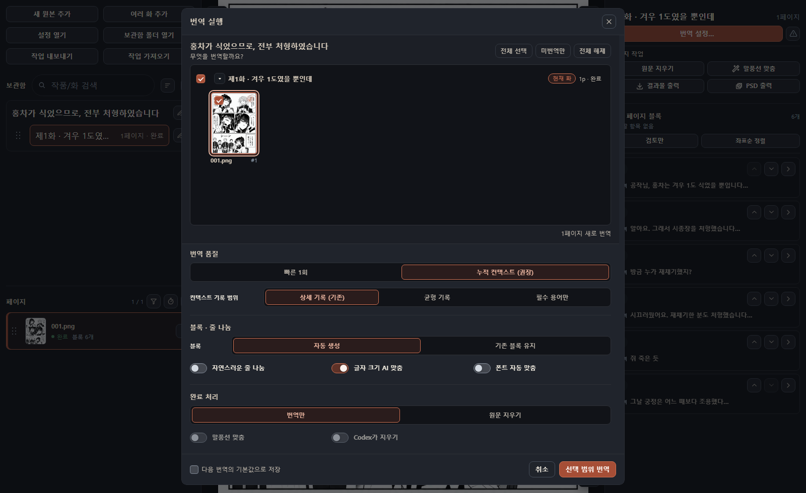

| 選項                  | 作用                                                                     |
| --------------------- | ------------------------------------------------------------------------ |
| **快速單次**          | 每頁翻譯一次，參考簡短的近期上下文。                                     |
| **累積上下文**        | 積累場景、術語和角色供後續頁面參考。可選詳細記錄、平衡記錄或僅關鍵術語。 |
| **自動生成文字區塊**  | 重新檢測文字區域。                                                       |
| **保留已有文字區塊**  | 保留區域與格式，更新文字；沒有文字區塊的頁面會自動建立。                 |
| **自然換行**          | 根據區域大小在譯文中插入換行。想保留手動換行時先檢查再開啟。             |
| **AI 字級匹配**       | 估計原文文字大小。                                                       |
| **自動字型匹配**      | 為每塊選擇風格合適的**韓文字型**，與字級匹配獨立。                       |
| **僅翻譯 / 擦除原文** | 只完成翻譯，或繼續擦除原文。                                             |
| **適配氣泡**          | 擦除後將譯文安排在氣泡內部。                                             |
| **Codex 擦除**        | 在可用條件下用 Codex 影像處理去除原文。也請檢查[影像設定](#setup)。      |

常用組合可儲存為下次預設值。`Shift+T`繼續剩餘頁面。檢視任務狀態中的進度與錯誤，優先選擇未完成部分，避免無必要地重做完成頁。

**重譯可能替換手動修改和已有結果，而且不進入工作區撤銷歷史。** 請先用[匯出工程](#data)保留需要的版本。處理中的頁面會限制修改，但未鎖定的其他頁面仍可編輯。影響整章的操作會根據該章的任務狀態限制。

<a id="workspace"></a>

## 熟悉工作區

左側是**書庫與頁面**，中間是**原稿**，右側是**頁面文字區塊與所選塊編輯器**。摺疊面板可增加原稿空間。選擇畫面文字或列表專案即可編輯。

| 操作               | 方法                                                          |
| ------------------ | ------------------------------------------------------------- |
| 翻頁               | 縮圖、`PageUp` / `PageDown`                                   |
| 平移               | 用手形工具 `H` 或 `3` 拖動                                    |
| 縮放               | `Ctrl+滾輪`或縮放控制元件；可適合頁面/寬度/高度或顯示實際尺寸 |
| 原稿對照           | `O`切換原稿預覽                                               |
| 顯示譯文           | `V`切換文字區塊，`Shift+B`切換編輯背景與邊框                  |
| 新建文字區塊       | `W`或`2`後拖出區域                                            |
| 選擇、移動、縮放塊 | `S`或`1`，拖動塊和控制點                                      |
| 多選               | 多選操作或`Ctrl+A`選中當前頁所有塊                            |
| 閱讀順序           | 列表上下按鈕、`Ctrl+Alt+↑/↓`、按座標排序                      |

選中顏色與編輯邊框不等同於最終輸出。放大檢查細節後，也要在整頁檢視中確認換行與平衡。

<a id="edit"></a>

## 修改臺詞與嵌字

### 文字：先檢查 OCR

選擇文字區塊，在**文字**標籤中對照原文與譯文。名字、數字或符號誤識別時先修正原文，再重譯所需範圍。角色型別、說話人、校對狀態和備註也用於後續批次操作。

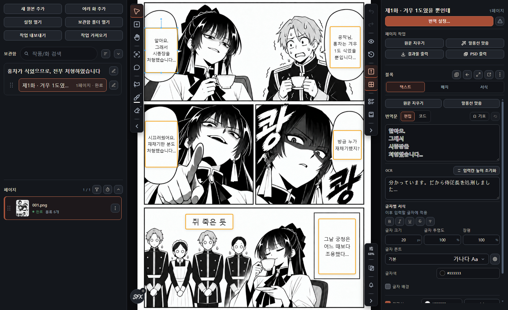

選中部分譯文，可以只為這些字設定粗體、斜體、字型、字級、顏色、透明度、背景、描邊和輝光。無選區時注意設定是否作用於之後輸入的文字。**程式碼**檢視可直接檢查和修改格式表達。**清除全部格式**會去除句子中的局部格式。

### 佈局：讓文字適合氣泡

| 調整                 | 用途                                                                           |
| -------------------- | ------------------------------------------------------------------------------ |
| 位置、大小、旋轉     | 移動和調整區域；`Ctrl+Shift+T`重置旋轉。                                       |
| 橫/豎排、對齊、換行  | 配合原稿與氣泡形狀，區分手動換行和自動折行。                                   |
| 氣泡適配             | 以內側區域排版；用多邊形或擴充套件/縮減筆刷編輯形狀，取消適配則恢復 OCR 區域。 |
| 曲線、透視、網格變形 | 使用畫面控制點調整彎曲或傾斜的臺詞和音效，並檢視預覽。                         |

### 格式：字形與間距

**格式**標籤可調整字型、字級、粗體、斜體、對齊、文字顏色、描邊、輝光、行距、字距、字寬與透明度。少數字符外觀不同時，也要檢查局部格式。

**批次應用**可把選定格式組複製到選區、頁面或章節。只想複製顏色時，避免把字級也選中。[佈局截圖](docs/images/readme-v2712/editor-layout.png) · [格式截圖](docs/images/readme-v2712/editor-format.png)

<a id="styles"></a>

## 重用字型、格式與文字區塊

| 功能           | 儲存內容           | 使用方法                                                               |
| -------------- | ------------------ | ---------------------------------------------------------------------- |
| **預設格式**   | 新文字區塊的初始值 | 設定 → 預設格式；已有塊需要另行應用。                                  |
| **格式預設**   | 選定的格式組       | 從當前格式建立，命名並選擇組，可固定到快捷格式、分配`Alt+1`～`Alt+0`。 |
| **文字區塊庫** | 可複用文字與格式   | 塊選單 → 儲存到庫；按名稱/原文/譯文搜尋後插入當前頁。                  |
| **字型管理**   | 註冊字型和顯示順序 | 註冊 TTF/OTF、收藏、隱藏、排序和指定預設字型。                         |

預設可以改名、分組或用當前格式覆蓋；庫中的文字區塊也可編輯內容。換電腦後若缺少字型，請註冊相同字型或選擇替代。翻譯時的自動字型匹配與儲存預設是不同功能。

[預設格式截圖](docs/images/readme-v2712/settings-format.png)

Codex ImageGen 音效也可存入**文字區塊庫**，一起保留圖片、遮色片和字重，在其他頁面重複使用。選取的文字/圖片區塊可用 `Ctrl+C` / `Ctrl+V` 在頁面、章節和作品之間複製。

<a id="erase"></a>

## 擦除原文與手動修補

按**自動擦除 → 清理殘留 → 對照原稿**的順序處理。自動擦除使用文字區塊的原文區域來修復背景。要保留的文字，在塊選單中設為**從自動擦除中排除**。

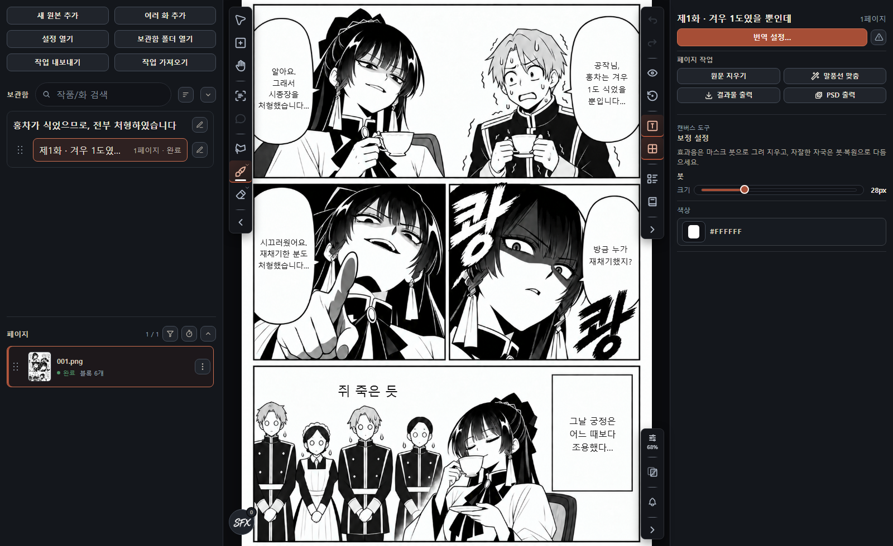

| 工具                             | 作用                                           |
| -------------------------------- | ---------------------------------------------- |
| **自動擦除** / `I`               | 選頁並執行設定的修復模型，可接著適配氣泡       |
| **遮色片** / `J`                 | 手動畫出待擦除區域，應用後重建背景             |
| **畫筆** / `B`                   | 用選定顏色塗畫，適合平坦背景的小殘痕           |
| **矩形** / `R`、**橢圓** / `E`   | 用所選顏色覆蓋拖出的形狀                       |
| **橡皮擦** / `X`、**矩形橡皮擦** | 恢復**原始影像畫素**，不是擦除修復遮色片的工具 |
| **取色器** / `P`                 | 從原稿取繪畫顏色                               |

畫筆、矩形和橢圓中，**`Alt+左鍵`可取色**。繪畫工具的`Alt+右鍵拖動`調整半徑；`Shift`拖動畫筆可約束直線。在允許的工具狀態下，`Space`應用遮色片。

矩形、橢圓和矩形恢復工具使用黑白雙輪廓的固定十字游標，淺色和深色原稿上都容易定位。畫錯了用撤銷，要恢復原始畫素則用橡皮擦。[自動擦除截圖](docs/images/readme-v2712/erase.png)

<a id="sfx"></a>

## 音效：先確認，再處理

大型音效只換字型，容易失去原有的筆觸和衝擊力。**Codex ImageGen** 可以翻譯文字圖片，同時讓對白繼續保留為可編輯文字。

| 日語原稿                                                                              | 韓語對白＋音效圖片                                                                             |
| ------------------------------------------------------------------------------------- | ---------------------------------------------------------------------------------------------- |
| 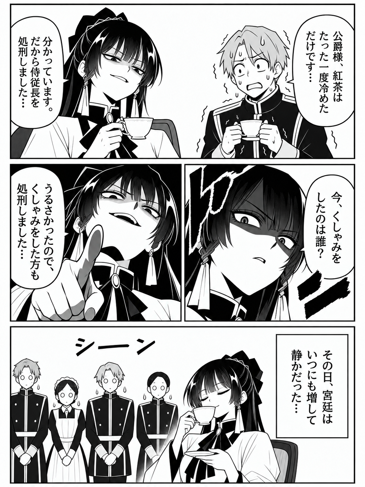 | 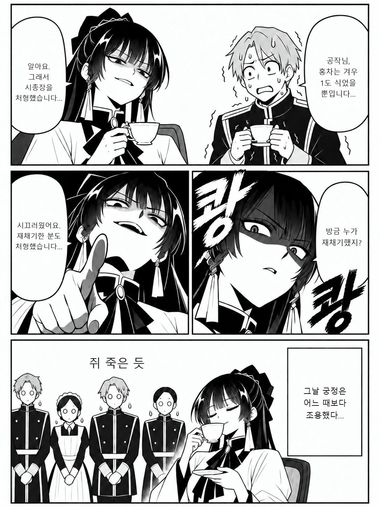 |

範例把大型 `ドン` 改成了筆刷風格的 `쾅`。對白先擦除原文，再對齊文字區塊。此對照使用 Codex 內建 imagegen 準備的素材和應用程式的實際文字渲染器。[製作過程](docs/images/readme-v2712/README.md)

HayaiOCR 的音效候選可與臺詞分開稽核。開啟**音效翻譯**，逐頁包含或排除候選。把畫面誤識別成文字時排除，漏檢時手動新增或修正區域。

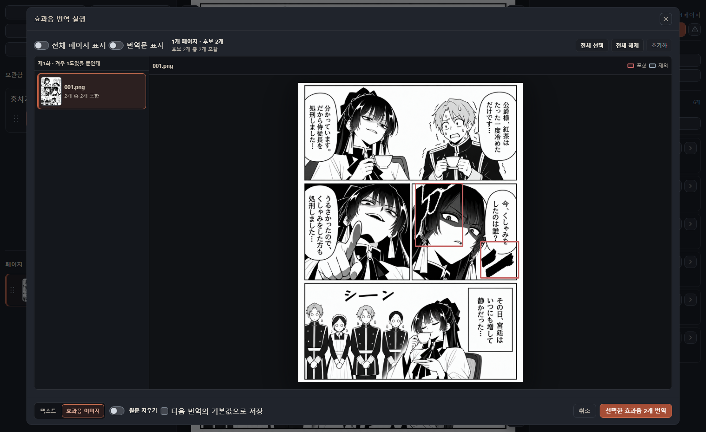

1. 檢查識別原文與區域。
2. 選擇可編輯的**文字**或**Codex 影像**；影像方式使用獨立的 Codex 影像設定。
3. 影像方式先稽核譯文，**全部頁面確認後生成**。在文字變成圖片前定稿。
4. 對照原稿。文字按普通塊編輯；生成字使用提供的影像編輯與恢復工具調整。

單區域翻譯保留原文。擦除選項在整批音效翻譯中選擇。**重置**會恢復刪除/排除的候選顯示，同時保留區域修正與譯文。

繼續影像任務時，音效與遮擋區域重疊的頁面會**儲存譯文並暫緩影像步驟**，其他頁面繼續。調整遮擋後再繼續，只處理未完成影像。[遮擋說明](#redaction)

<a id="redaction"></a>

## 傳送影像遮擋

在**設定 → AI → 影像 → 傳送影像遮擋**中啟用。它作用於支援的 AI 影像流程中的**傳送副本**，不是在原稿檔案上塗色。

使用頁面、章節或作品範圍的**準備遮擋**命令檢查並調整區域。自動判斷需要人工確認。翻譯或生成目標文字不能被遮住，否則無法處理；先修正重疊。它與擦除原文的用途不同。

開啟影像遮擋並不意味著請求裡的 OCR 文字和作品上下文也全部被移除。請結合所用引擎與[隱私政策](docs/privacy-policy.md)確認傳送內容。

<a id="context"></a>

## 用術語與記憶統一名稱和語氣

從右側工具開啟**術語/記憶**，維護同一作品跨章節的共用資訊。

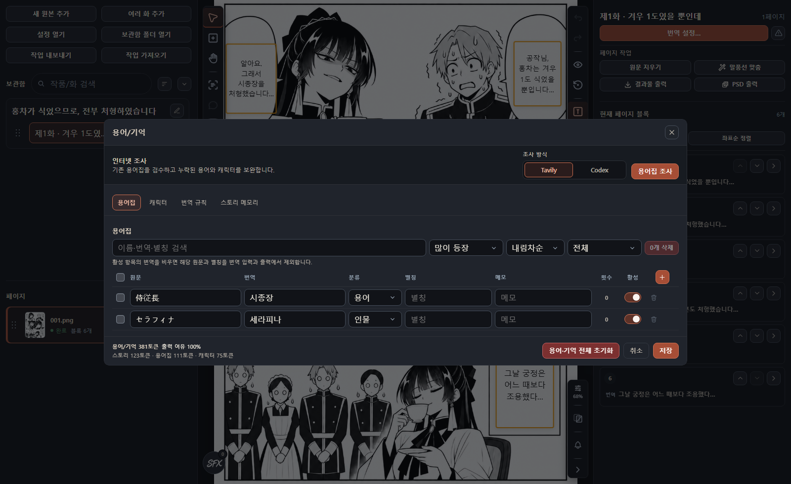

| 標籤         | 記錄內容                               | 範例原稿                           |
| ------------ | -------------------------------------- | ---------------------------------- |
| **術語表**   | 原文、譯法、別名、類別、備註、啟用狀態 | `侍従長 → 시종장`（侍從長）        |
| **角色**     | 名字、別名、說話方式、人物備註         | 瑟拉菲娜：用平靜敬語下達殘酷命令   |
| **翻譯規則** | 敬稱、音效處理、基本語氣               | 保留敬稱、翻譯音效                 |
| **劇情記憶** | 各頁場景摘要與視覺資訊                 | 她因紅茶變涼下令處刑，宮廷陷入寂靜 |

手動輸入或檢查 **AI 術語/記憶**分析結果，也能整理翻譯積累的內容。合併重複名稱和別名後儲存。[角色](docs/images/readme-v2712/context-characters.png) · [規則](docs/images/readme-v2712/context-rules.png) · [劇情](docs/images/readme-v2712/context-memory.png)

<details>
<summary>網路調查、提案稽核與上下文預算</summary>

**網路調查**在確認作品標題、引擎和範圍後補充外部資訊。搜尋標題獨立於書庫名稱。Codex 調查與 Tavily 搜尋後由 LLM 分析，需要的帳戶、金鑰和限額不同；先檢查**設定 → AI → 網路調查**。

將建議的術語、角色、規則與來源和現有內容比較，只應用需要的專案。搜尋結果可能錯誤或屬於另一作品。沒有外部資料的原創範例可直接手動填寫。

資訊增多後留意預算，優先保留翻譯所需內容。儲存衝突時先檢查其他改動，再開啟最新版本應用修改。**清空全部術語/記憶**會刪除作品術語表、角色及所有章節的劇情記憶，不要作為一般整理工具。

</details>

<a id="batch"></a>

## 批次修改文字與格式

`Ctrl+H`開啟**批次文字編輯**，按**範圍 → 條件 → 操作 → 前後對照 → 應用**進行。先在當前頁驗證規則，再擴大到整章。

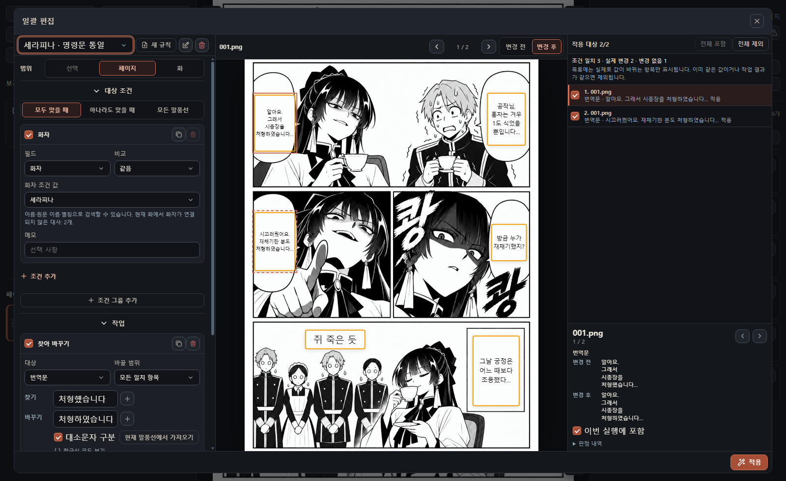

可按原文、譯文、角色型別、說話人、校對狀態等篩選。區分**全部滿足**與**任一滿足**；**所有氣泡**會包含所選範圍內的全部塊。把文字替換、格式/欄位修改、區域性強調按執行順序排列。

### 範例：只統一瑟拉菲娜的語氣

1. 條件設為**說話人 = 瑟拉菲娜**且**譯文包含`처형했습니다`**。
2. 將`처형했습니다`替換為更正式的`처형하였습니다`。
3. 只把新生成的`처형하였습니다`加粗。
4. 確認侍從的臺詞未變，再應用。

說話人條件需要文字區塊已正確關聯人物。各作品的 ID 不同，不要直接照搬範例 ID。

<details>
<summary>其他用法與儲存規則</summary>

- **省略號與空格：**用初始範例規則把`...`變成`…`，合併連續空格。
- **音效格式：**只篩選音效角色，調整粗細、字級和描邊。
- **校對標記：**查詢空譯文或指定表達，更新校對狀態與備註。
- **正規表示式：**普通字元匹配不夠時使用；檢查大小寫和全部替換設定。
- **排除結果：**即使符合條件，也可排除不該修改的項。檢查真實頁面上的前後效果與應用數量。
- **複用：**命名後儲存為 YAML。序列能按順序執行多個規則，前一步結果作為下一步輸入。
- **衝突：**預覽後已變化的塊會跳過，避免覆蓋。用最新資料重新預覽；剛執行的批次編輯可以撤銷。

</details>

<a id="review"></a>

## 集中閱讀與校對

`G`開啟**文字彙總**，可同時顯示 OCR 與譯文，也可只顯示一方並搜尋。點選頁面標題返回原稿，也能選擇文字區塊，只批次應用改動的格式項。

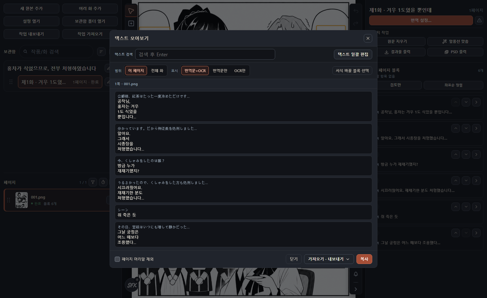

| 交換格式         | 對應方式               | 注意                                           |
| ---------------- | ---------------------- | ---------------------------------------------- |
| 複製 / TXT 匯出  | 當前顯示文字           | 可選擇是否包含頁面標題                         |
| TXT 匯入         | **僅譯文**匯出的行順序 | 改變順序可能錯配；確認警告和數量               |
| CSV / TSV 校對表 | `block_id`             | 更新譯文、校對狀態、備註，不改 OCR；保留 ID 列 |

外部電子表格校對建議使用校對表以保持對應關係。保留匯出原件，匯入前檢查未知 ID、重複和缺失等警告。

<a id="export"></a>

## 匯出成品與 PSD

在**匯出結果**或`Ctrl+E`中選擇章節與頁面。預檢發現未翻譯、失敗或後處理未完成時，返回相關頁面確認。

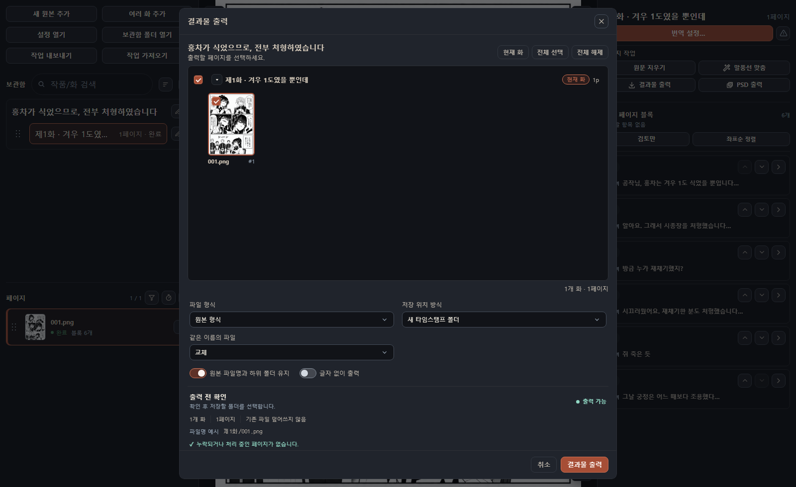

| 輸出                           | 用途與設定                                                                                                 |
| ------------------------------ | ---------------------------------------------------------------------------------------------------------- |
| **原格式 / PNG / JPEG / WebP** | 合成成品圖片；選擇 JPEG/WebP 質量及是否保留原檔名、子資料夾                                                |
| **不含文字**                   | 不合成譯文，只儲存清理後的背景；需要擦除結果                                                               |
| **分層 PSD**                   | 分開原稿、清理背景和各塊文字。支援的文字保留可編輯性，複雜豎排、曲線、透視或局部格式可能點陣化以保留外觀。 |

選擇新建時間戳資料夾或直接儲存到指定資料夾，並確認同名檔案的**替換 / 跳過 / 取消**策略。影像匯出不同於[工程分享](#data)，PSD 也不是應用全部編輯狀態的完整備份。[PSD 截圖](docs/images/readme-v2712/export-psd.png)

<a id="autosave"></a>

## 自動儲存結果

在**設定 → 結果自動儲存**中管理作品、章節的連線狀態與輸出格式。需要編輯時持續更新外部結果資料夾，就使用此功能。確認目標位置與狀態，在狀態控制元件中重試失敗或待處理項。

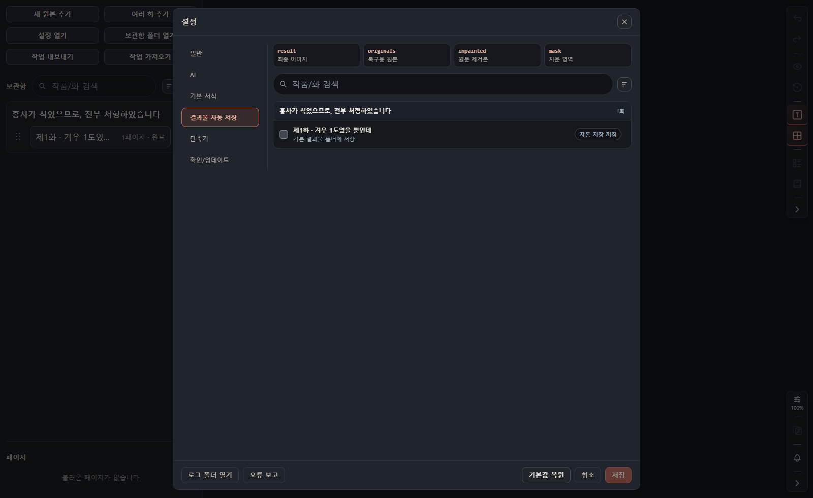

`result`是成品圖，`originals`是恢復用原稿，`inpainted`是擦除圖，`mask`是擦除區域。它與儲存應用編輯資料不同。關閉連線或更換格式前先確認路徑，不要把這些資料夾當快取刪除。

<a id="data"></a>

## 工程分享、備份與隱私

**匯出工程**可選擇作品與章節並儲存為`.mgtshare`。另一臺電腦的**匯入工程**可以新建作品，或向現有作品新增/替換章節。檢查最終列表和順序後應用。

| 工程檔案包含                                           | 另行準備                                                                                 |
| ------------------------------------------------------ | ---------------------------------------------------------------------------------------- |
| 原稿圖片、文字區塊、閱讀順序、格式、修復結果等工作資料 | 應用設定、ChatGPT 登入/API 金鑰、AI/OCR 模型與執行環境、記錄檔；目標環境也須檢查所需字型 |

需要保留完整環境時，關閉應用後**備份資料資料夾**。`library`儲存原稿和編輯資料，不是可刪除的快取。區分設定、字型、記錄檔、模型快取，並保留原始檔案和輸出。macOS 預設路徑為`~/Library/Application Support/manga-gemma-translator`。

外部引擎可能接收任務所需圖片、文字和上下文。記錄檔可能含路徑或部分原稿，分享前請檢查。錯誤報告不會自動上傳。[隱私政策](docs/privacy-policy.md) · [安全政策](SECURITY.md)

<a id="shortcuts"></a>

## 快捷鍵與命令搜尋

**`Ctrl+K`搜尋功能**，**`?`開啟快捷鍵幫助**。**設定 → 快捷鍵**可修改繫結、檢查衝突或恢復預設。macOS 也可用`Cmd`代替下表的`Ctrl`。輸入文字時部分工具快捷鍵不會觸發。

| 操作                          | 預設按鍵                                         |
| ----------------------------- | ------------------------------------------------ |
| 設定 / 命令面板 / 幫助        | `Ctrl+,` / `Ctrl+K` / `?`                        |
| 翻譯設定 / 繼續剩餘           | `T` / `Shift+T`                                  |
| 文字彙總 / 批次編輯 / 匯出    | `G` / `Ctrl+H` / `Ctrl+E`                        |
| 上/下頁                       | `PageUp` / `PageDown`（也支援`A` / `D`及方向鍵） |
| 選擇 / 新增塊 / 平移          | `S`或`1` / `W`或`2` / `H`或`3`                   |
| 原稿 / 譯文 / 編輯邊框        | `O` / `V` / `Shift+B`                            |
| 自動擦除 / 遮色片 / 畫筆      | `I` / `J` / `B`                                  |
| 矩形 / 橢圓 / 恢復橡皮 / 取色 | `R` / `E` / `X` / `P`                            |
| 縮放 / 重置縮放               | `Ctrl+滾輪` / `Ctrl+0`                           |
| 撤銷 / 重做                   | `Ctrl+Z` / `Ctrl+Shift+Z`                        |
| 全選塊 / 複製塊 / 刪除        | `Ctrl+A` / `Ctrl+D` / `Delete`                   |
| 上/下文字區塊                 | `Ctrl+Shift+Tab` / `Ctrl+Tab`                    |
| 調整閱讀順序 / 按座標排序     | `Ctrl+Alt+↑/↓` / `Ctrl+Shift+R`                  |
| 格式槽 1～10                  | `Alt+1`～`Alt+0`                                 |

[命令面板](docs/images/readme-v2712/palette.png) · [快捷鍵設定](docs/images/readme-v2712/settings-shortcuts.png)

<a id="troubleshooting"></a>

## 遇到問題時

| 症狀                  | 先檢查                                                      |
| --------------------- | ----------------------------------------------------------- |
| 翻譯不啟動            | 選頁 → 語言/引擎 → 登入/金鑰/模型 → OCR/模型檢查            |
| 首次執行慢            | 下載與校驗進度；準備完成後用代表頁比較                      |
| 記憶體不足或 GPU 錯誤 | 分別嘗試小 Gemma 預設、推薦裝置設定、CPU OCR、輕量擦除模型  |
| OCR 錯誤合併/拆分     | 原文語言、對比 HayaiOCR/PaddleOCR；修正區域後保留已有塊重譯 |
| 名稱或口吻不一致      | 術語表、角色、累積上下文；已有譯文按說話人批次修改          |
| 文字溢位或過小        | 區域、方向、換行、字級、字寬，以及局部格式和氣泡適配        |
| 擦除損壞畫面          | 撤銷/恢復原稿，排除塊或縮小遮色片，對比其他模型             |
| 音效影像被暫緩        | 修正與遮擋的重疊後繼續影像任務                              |
| 儲存或批次應用衝突    | 開啟最新資料比較，避免覆蓋其他修改後再應用                  |
| Codex 連線失敗        | 應用內登入、模型列表，以及記錄檔中的內建伺服器錯誤          |
| API 401/403/404       | 金鑰、URL、模型、影像支援；移除不支援的高階引數             |
| 匯出字型不同          | 字型註冊/缺失情況，是否屬於 PSD 點陣化情形                  |

若可重複出現，透過**設定 → 錯誤報告**檢查內容，再在 [Issue](https://github.com/ucx0204/CarrotMangaTranslator/issues) 中提供版本、OS、引擎、重現步驟、預期與實際結果。分享前檢查金鑰、私人路徑和原稿內容。

<a id="development"></a>

## 開發、文件與授權條款

準備 Node.js、npm 與 Git，然後執行：

```sh
npm install
npm run dev
```

檢查用`npm run check`，Windows 封裝用`npm run dist:win`，Apple Silicon 封裝用`npm run dist:mac`。真實 UI 截圖工具見`npm run qa:ui -- --help`。

- [貢獻指南](CONTRIBUTING.md) · [架構](docs/architecture.md) · [UI 規則](docs/ui-design-rules.md)
- [專案使用情況](docs/reputation.md) · [第三方宣告](THIRD_PARTY_NOTICES.md) · [內建字型](third_party/fonts/README.md)
- Free code signing provided by [SignPath.io](https://about.signpath.io/), certificate by [SignPath Foundation](https://signpath.org/).
- 應用程式原始碼採用 [GPL-3.0-only](LICENSE)。字型、模型和執行環境請分別核對分發條件。

本文以 v2.8.0 為準。截圖使用真實應用元件、範例資料和韓語介面。範例原稿與譯文用於說明功能，不是模型效能對比資料。[截圖與素材來源](docs/images/readme-v2712/README.md)

[返回開始](#start)
