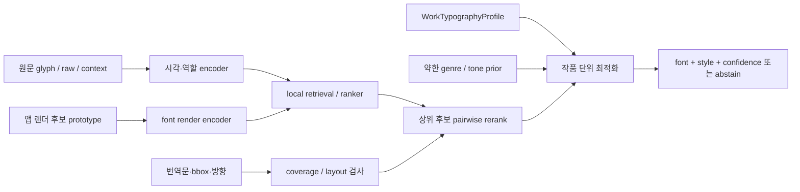

# Font Matching V2 — 전면 재설계 및 학습 계획

- 작성일: 2026-08-01
- 상태: 구현 전 확정 설계안
- 대상: 한국어 번역 결과와 앱 내장 한글 폰트

## 1. 결론

현재 자동맞춤은 개선해서 이어갈 구조가 아니다. 이름과 달리 FontCLIP을 사용하지 않으며, 작품 제목·번역문 정규식과 블록 크기·각도만으로 고정 폰트를 고르는 규칙 엔진이다. 원문 글자 이미지는 아예 입력받지 않는다. 따라서 현행 코드는 비교용 baseline으로만 보존하고 제품 경로에서는 교체한다. 저신뢰 fallback으로도 다시 사용하지 않는다.

새 엔진의 목표는 다음 한 문장으로 정리한다.

> 원문 글자 모양과 문맥을 실제 앱 렌더러로 만든 한글 폰트 후보와 비교하고, 일반 대사는 작품 단위로 고정하되 내레이션·강조·효과음의 의도적인 변화만 허용한다.

이를 위해 `crop → 15개 font_id 중 하나`라는 단순 분류 문제를 버리고 아래 네 단계를 분리한다.

1. 블록의 의미 역할과 시각 스타일을 판정한다.
2. 앱의 실제 렌더 결과를 기준으로 복수의 허용 폰트와 선호 순위를 구한다.
3. 실제 번역문이 있을 때 글리프 커버리지와 배치 적합성을 다시 계산한다.
4. 작품의 본문 앵커·역할 앵커·효과음 팔레트로 전체 결과를 최적화한다.

Gemma 4, OpenAI API, Codex는 역할·문맥 해석과 라벨링 중계에 사용한다. 정확한 font_id를 단독으로 결정하거나 앱의 실시간 필수 의존성으로 두지 않는다.

## 2. 현재 상태에서 확인된 사실

### 2.1 데이터

| 항목            | 기본 데이터 | 변칙 데이터 |   통합 |
| --------------- | ----------: | ----------: | -----: |
| 승인 crop       |       8,763 |      19,352 | 28,115 |
| 작품            |          17 |          24 |     24 |
| 화              |          51 |         204 |    214 |
| 가로쓰기        |         333 |       1,644 |  1,977 |
| 세로쓰기        |       8,430 |      17,708 | 26,138 |
| 폰트 정답 label |           0 |           0 |      0 |

두 데이터셋의 crop 자체는 교차 중복이 없지만 기존 split은 함께 사용할 수 없다.

- 공통 17작품 중 7작품이 서로 다른 split에 배치되어 있다.
- 공통 원문 페이지 437개 중 271개가 서로 다른 split에 놓인다.
- hard 데이터의 정규화된 `glyph_224`에는 동일 픽셀 16쌍이 있다.
- 기본 데이터의 `clip_image_path`는 배경 포함 raw letterbox인 반면 hard 데이터에서는 마스킹된 glyph다. 이 필드를 그대로 합치면 모델이 글꼴이 아니라 데이터 출처를 배운다.
- 기본 데이터는 상위 4작품이 약 90.1%이고 hard 데이터도 상위 4작품이 약 43.8%다. crop 수 기준 학습은 특정 작품 화풍을 외우게 된다.
- hard의 `page_sound` 420건은 효과음의 강한 힌트일 뿐이다. 실제 효과음·말풍선 옆글·필기·강조는 `bubble_edge`, `text_free`, `ocr_hard`에도 섞여 있으므로 전부 새로 역할을 판정해야 한다.
- 두 데이터셋의 기존 `fontFamily`/`weak_font_family`는 정답이 아니다. 보관함의 기존 명시 폰트도 73.4%가 나눔명조에 몰려 있어 과거 기본 설정의 흔적으로 봐야 한다.

기본셋의 고정밀 glyph mask는 5,873건이다. 나머지 2,890건은 glyph branch의 초기 학습에서 제외하고 raw/context 입력으로 쓰거나 마스크를 다시 확인한다. hard의 raw/context/glyph/mask/outline/color/inverse 파생물은 독립 샘플이 아니라 같은 `root_real_id`의 여러 view로 취급한다.

빨간 사각형 같은 과거 QA overlay는 학습 데이터가 아니다. 최종 hard 데이터의 overlay와 synthetic 개수는 모두 0이며, 새 master manifest에서도 `qa_overlay=false`와 자산 hash 검사를 통과한 이미지만 허용한다.

### 2.2 앱 폰트

한국어 내장 후보는 15 family, 실제 폰트 파일은 31 face다.

| 용도상 묶음         | 후보 font_id                                                                   | 용도                                 |
| ------------------- | ------------------------------------------------------------------------------ | ------------------------------------ |
| 본문용 sans 후보    | `nanum-gothic`, `nanum-barun-gothic`, `seoul-namsan`                           | 평범한 대사·중립적 본문 후보         |
| 본문용 serif 후보   | `nanum-myeongjo`, `seoul-hangang`, `ridi-batang`                               | 고전적·문학적·격식 있는 본문 후보    |
| 강한 display 후보   | `dohyeon`, `jua`                                                               | 고함·충격·코믹 강조 후보             |
| 손글씨/display 후보 | `mongtori`, `griun-pol-sensibility`, `cafe24-gowoonbam`, `start-over`, `gaegu` | 말풍선 옆글·필기·감정·동작 효과 후보 |
| 고전 display 후보   | `chosun-gungseo`                                                               | 고전적 강조·분위기 효과 후보         |
| 세로 조건부 후보    | `seoul-namsan-vertical`                                                        | 세로 조판에만 노출                   |

이 표는 정답 매핑이 아니라 annotation 후보 균형과 hard-negative 구성용 초기 묶음이다. 실제 렌더를 보고 다시 검증한다.

폰트 메타데이터만 믿으면 안 된다.

- 대표 regular face 15개가 모두 OS/2 weight 400, width class 5로 읽혀 현행 폭 점수는 모두 같다.
- 일부 CSS weight와 폰트 내부 weight가 다르다.
- 정적 regular 파일 하나를 CSS에서 400–800 범위로 선언한 family가 있다.
- `griun-pol-sensibility`와 `gaegu`는 한글 커버리지가 제한되어 본문 전체용으로 부적합할 수 있다.
- PANOSE 기반 serif 판정은 서울남산·주아·리디바탕을 잘못 분류한다.

따라서 학습과 추론의 안정 식별자는 앱의 `font_id`로 고정하고, `font_id`, 실제 face/weight, 합성 bold/italic, outline·shadow·color·왜곡을 서로 다른 필드와 head로 다룬다. 모든 후보는 CSS 선언이 아니라 프로덕션 렌더러 결과로 검증한다.

### 2.3 현행 자동맞춤의 구조적 한계

- 원문 crop이나 글자 모양을 보지 않는다.
- 작품 제목 정규식으로 `neutral/romance/action/cozy`를 정한다.
- 지속되는 역할은 사실상 `ordinary/sound`뿐이라 내레이션, 독백, 속삭임, 말풍선 옆글, 강조, 간판을 구별하지 못한다.
- 효과음은 번역문 키워드와 크기·면적·각도로 5개 슬롯에 넣는다.
- 사용자 폰트는 실제 생김새가 아니라 파일/표시 이름의 `bold`, `brush`, `comic`, `serif` 같은 문자열로 고른다.
- 작품 단위 폰트 프로필이 저장되지 않아 일관성이 명시적으로 보장되지 않는다.
- family만 고르고 실제 weight, italic, outline, color를 고르지 못한다.
- 자동맞춤이 기존 블록의 폰트를 덮어쓸 수 있다.

현행 규칙은 오프라인 비교군으로만 둔다. V2 저신뢰 시에는 현행 규칙으로 되돌아가지 않고 `사용자 잠금 → 저장된 작품 앵커 → 사용자 기본폰트 → Top-3 제안` 순으로 안전하게 물러난다.

## 3. 제품 동작 명세

### 3.1 우선순위

폰트 결정의 우선순위는 반드시 다음과 같아야 한다.

1. 사용자가 직접 고정한 블록 폰트/스타일
2. 사용자가 고정한 작품 역할별 폰트
3. 저장된 `WorkTypographyProfile`
4. V2 자동 점수와 작품 최적화 결과
5. 사용자 기본폰트 또는 선택 가능한 Top-3

자동맞춤은 사용자가 수정한 값을 다시 덮어쓰지 않는다. 수동 수정은 로컬 피드백으로 보관하되 외부 전송과 전역 학습 편입은 opt-in으로 제한한다.

### 3.2 작품 프로필

작품 모델에 새 `WorkTypographyProfile`을 둔다.

- `dialogue_anchor`: 일반 대사의 기본 허용 집합과 대표 font
- `narration_anchor`: 내레이션에 별도 스타일이 있을 때만 생성
- `thought_anchor`: 독백/생각이 반복적으로 구분될 때만 생성
- `accent_palettes`: 강조 및 SFX 역할별 2–4개 허용 font
- `orientation_policy`: 가로/세로 후보 규칙
- `user_locks`: 사용자 고정값
- `evidence_count`, `confidence`, `catalog_version`, `model_version`

본문은 블록마다 새로 선택하지 않는다. 작품 초반의 고신뢰 일반 대사 여러 개를 robust aggregate하여 앵커를 만들고 저장한다. 점수 차가 충분히 커지기 전에는 앵커를 바꾸지 않는 hysteresis를 적용한다.

효과음도 무작정 다양하게 만들지 않는다. `impact`, `motion`, `ambient`, `emotion`, `comic`별 허용 팔레트 안에서만 변화를 허용하고, 반복되는 같은 시각 클러스터는 같은 폰트를 재사용한다. 다양성 자체가 목표가 아니라 원작의 의도적 대비 재현이 목표다.

### 3.3 장르 prior

장르는 font_id로 직결하지 않고 작품의 `tone/style attribute` 분포에만 약하게 작용한다.

- 영애물·시대 로맨스는 serif/formal 속성 확률을 조금 높일 수 있다.
- 액션·소년만화는 본문에서 견고한 sans, 효과음에서 display/energy 속성 확률을 조금 높일 수 있다.
- 같은 장르라도 원문 글자와 작품 프로필이 다르면 결과가 달라야 한다.

구현 시작값은 전체 점수 기여 상한 10%, 학습 중 genre dropout 50%로 둔다. 정확한 값은 validation ablation으로 낮추거나 제거한다. 작품명과 `work_id`는 모델 입력에 넣지 않는다. 장르는 페이지/작품 문맥에서 나온 multi-label 확률만 사용하며 `unknown`, 제거, 임의 교환 평가를 반드시 통과해야 한다.

## 4. 정답 데이터 구축

### 4.1 통합 manifest

`master-font-label-v1`을 새로 만든다.

- 총 28,115개의 승인 crop을 하나씩만 등록한다.
- view contract를 `raw_224`, `context_224`, `glyph_224`로 통일한다.
- split은 기존 값을 폐기하고 `work_id` 기준 전역 map으로 다시 만든다.
- 동일 시리즈·작가 정보가 확인되면 작품보다 상위 group으로 묶는다.
- 16개 동일 glyph pair와 모든 `root_real_id`/`variant_group_id`는 같은 split에 고정한다.
- 모든 view와 font binary, renderer, annotation schema에 SHA-256/version을 기록한다.
- `work_balance_weight`와 역할별 weight는 최종 라벨 이후 다시 계산한다.
- 합성 렌더, 생성형 보강, 실데이터를 provenance로 엄격히 분리한다.

24작품만으로 단일 split은 변동성이 크다. 약 5작품은 최종 frozen test로 봉인하고 나머지는 GroupKFold 또는 leave-one-work-out으로 개발한다. 모든 보고는 crop micro 평균보다 작품 macro 평균·중앙값·하위 작품 성능을 우선한다.

### 4.2 역할 taxonomy

최소 역할은 다음과 같다.

- `dialogue`
- `narration`
- `thought`
- `whisper`
- `aside_balloon_edge`
- `emphasis_dialogue`
- `shout`
- `sfx_impact`
- `sfx_motion`
- `sfx_ambient`
- `sfx_emotion`
- `sfx_comic`
- `sign_ui_title`
- `other`
- `unknown_needs_review`

`handwritten`, `serif`, `rough`, `angular` 같은 항목은 역할이 아니라 시각 속성이다. 예를 들어 손글씨는 말풍선 옆글, 독백, 감정 효과음 어디에나 나타날 수 있다.

### 4.3 라벨 단위

단일 정답을 강제하지 않고 모든 후보를 계층적으로 판정한다.

```json
{
  "sample_id": "...",
  "work_id": "...",
  "source_page_sha256": "...",
  "role": { "primary": "aside_balloon_edge", "confidence": 0.91 },
  "source_style": {
    "serifness": 0.2,
    "weight": 0.4,
    "width": 0.3,
    "roundness": 0.8,
    "stroke_contrast": 0.2,
    "handwritten": 0.9,
    "angularity": 0.1,
    "irregularity": 0.7,
    "slant": 0.2,
    "energy": 0.4,
    "unknown_fields": []
  },
  "treatment": {
    "orientation": "vertical",
    "outline": "single",
    "shadow": "none",
    "fill": "solid",
    "distortion": "none"
  },
  "font_judgment": {
    "preferred": ["gaegu"],
    "acceptable": ["cafe24-gowoonbam"],
    "marginal": ["start-over"],
    "unacceptable": [],
    "unrenderable": [],
    "not_reviewed": [],
    "none_acceptable": false
  },
  "consistency": {
    "policy": "intentional_override",
    "reason_code": "handwritten_aside"
  },
  "review": {
    "reviewer": "...",
    "reviewed_at": "...",
    "catalog_version": "...",
    "renderer_hash": "...",
    "candidate_order_seed": "...",
    "confidence": 0.88,
    "flags": []
  }
}
```

같은 tier 안의 폰트는 동률이고 `preferred > acceptable > marginal > unacceptable`만 학습 제약으로 만든다. `not_reviewed`를 `unacceptable`로 간주하지 않는다. 15개 안에 맞는 것이 없으면 `none_acceptable=true`를 허용하고 별도 abstention head를 학습한다.

`font_id` 적합성과 번역문 배치 적합성도 분리한다.

- `style_fit`: 번역문이 없어도 평가 가능한 원문 모양과 후보 family의 적합성
- `layout_fit`: 실제 번역문이 있을 때만 평가하는 폭, 줄바꿈, 최소 글자 크기, glyph coverage

이 구분이 없으면 폭이 좁아서 잘 들어간 폰트를 원작과 닮은 폰트로 잘못 학습하게 된다.

### 4.4 실제 전수 검수 순서

전수 검수는 cluster 자동 전파로 끝내지 않는다. 제안값을 전파할 수는 있지만 모든 28,115건이 정확히 한 번 primary review 화면에 나타나고 승인 또는 override 이벤트를 가져야 한다.

1. **카탈로그 audit**  
   15 family/31 face의 실제 렌더·한글 coverage·weight·vertical·합성 style을 hash로 고정한다.
2. **1,000–1,200건 pilot**  
   24작품과 214화를 모두 포함하고 일반 대사, 가로쓰기, 말풍선 옆글, 필기, 효과음, 외곽선·역상·컬러를 층화한다. 라벨 규약과 review UI를 먼저 고정한다.
3. **약 4,000건 calibration batch**  
   hard의 위험군 2,972건과 각 화의 평범한 대사 4–6개를 우선 본다. 위험군은 `page_sound`, `ocr_hard`, `ocr_anime_region`, 역상 후보, 자동 review, 수동 재크롭, 색/외곽선 극단값의 합집합이다.
4. **작품 프로필 선결정**  
   작품마다 대표 일반 대사 40–80개를 함께 보고 body anchor와 필요한 역할 anchor를 정한다.
5. **잔여 전수 review**  
   페이지 단위 문맥으로 묶어 모든 crop을 `inherit-work-anchor`, `intentional-override`, `undetermined` 중 하나로 명시한다. 효과음·강조·필기체는 개별 crop 또는 작은 시각 클러스터마다 후보 순위를 정한다.
6. **일관성 audit**  
   작품 전체를 다시 훑어 일반 대사의 불필요한 전환, 반복 효과음의 불일치, 의도적 예외 누락을 검사한다.

모든 항목은 1회 직접 확인하고 최소 20%(5,623건)는 독립 이중 검수한다. 모든 불일치, 낮은 확신, `none_acceptable`, 수동 재크롭 39건은 100% 재판정한다. ledger는 sample당 primary review 정확히 1개, 최종 상태 정확히 1개, 누락 0개를 검증한다.

### 4.5 review 카드

각 화면은 다음을 동시에 보여준다.

- 원본 페이지 문맥과 bbox 위치
- raw crop, 정규화 glyph, mask/outline 보조 view
- 실제 앱 렌더러로 만든 15 family 후보 전체
- 실제 번역문이 있으면 같은 bbox/방향으로 렌더한 결과
- 번역문이 없으면 길이·받침 밀도·획 복잡도가 다른 3개 이상의 표준 한글 probe
- weight/italic/outline은 family와 분리된 비교 탭
- `none`, `unrenderable`, 역할 불명, crop 재검수 버튼

첫 판정에서는 모델 제안과 폰트 이름을 숨기고 후보 순서를 seed 기반으로 무작위화한다. 첫 판정이 끝난 뒤에만 Gemma/Codex 제안과 차이를 보여준다. 이렇게 해야 자동 제안에 끌려가는 anchoring bias를 줄일 수 있다.

## 5. 후보 렌더뱅크와 합성 데이터

`font-render-bank-v1`은 프로덕션 렌더러로 생성한다.

- 15 family × 실제 지원 face/weight × 가로/세로 × 크기 × 자간 × 길이
- 동일 font에서 내용이 다른 여러 한글 probe
- family와 별도로 합성 bold/italic, outline, shadow, fill, inverse를 기록
- font binary hash, renderer hash, OS/runtime, CSS weight를 고정
- coverage가 부족한 후보는 문자열 단위로 `unrenderable`

같은 font의 서로 다른 문자열을 positive로, 시각적으로 비슷한 고딕/명조/손글씨/display font를 hard negative로 쓴다. 이 결정론적 렌더 데이터는 실제 crop과 별도 provenance지만 정확한 font label을 가진 유용한 pretraining 데이터다.

생성형 이미지 보강은 첫 버전의 font family 정답으로 사용하지 않는다. 생성 모델은 글자 골격을 바꾸거나 특정 font identity를 훼손할 수 있다. 실제 데이터만으로 부족한 배경 오염·거친 외곽선·색 번짐의 robustness를 실험할 때만 격리된 train augmentation으로 사용하고, validation/test에는 절대 넣지 않는다. 실제 hard 데이터가 이미 풍부하므로 우선순위는 낮다.

## 6. MangaFontMatcher V2 모델



### 6.1 두 단계 retrieval

1. **빠른 bi-encoder**  
   `glyph_224`는 글자 골격, `raw/context`는 역할과 주변 문맥을 맡는다. 후보 font는 실제 한글 render prototype으로 인코딩한다. L2 정규화 embedding과 cosine similarity로 전체 후보를 빠르게 순위화한다.
2. **상위 후보 reranker**  
   Top-3~5만 실제 번역문으로 동적 렌더하여 원문 crop과 pairwise 비교한다. 폭, 줄바꿈, 최소 글자 크기, coverage를 함께 본다.

기본 font prototype은 모델과 함께 미리 배포한다. 커스텀 font는 등록 시 probe를 한 번 렌더하고 font hash별 embedding을 캐시할 수 있지만, 이것을 곧바로 지원한다고 약속하지 않는다. 내장 15개에 없는 font를 통째로 hold-out한 평가를 통과한 뒤 별도 기능으로 연다.

### 6.2 학습 목표

- tier 기반 listwise/pairwise ranking loss
- `preferred`와 `acceptable`을 multi-positive로 쓰는 supervised contrastive loss
- 역할 분류 loss
- serifness, weight, width, roundness, handwriting, angularity, roughness 같은 style attribute loss
- outline/inverse/color/orientation을 family에서 분리한 treatment loss
- `none_acceptable`와 calibrated confidence/abstention loss
- 같은 작품의 일반 대사 anchor를 안정화하는 work-consistency regularizer

hard negative는 반드시 다음을 포함한다.

- 나눔고딕/나눔바른고딕/서울남산처럼 비슷한 본문 sans
- 나눔명조/서울한강/리디바탕처럼 비슷한 serif
- 손글씨끼리 모양은 비슷하지만 역할이 맞지 않는 후보
- 같은 작품의 body와 SFX 후보
- 같은 장르의 다른 작품 crop. 장르가 아니라 원문 스타일을 보게 만드는 음성 대조군이다.

augmentation은 polarity, 약한 blur/noise, 보수적인 crop/scale, 실제 관측 outline/color 변형만 사용한다. 좌우 반전, 강한 elastic warp, 글자 골격을 바꾸는 생성 변형은 금지한다.

### 6.3 작품 최적화

로컬 점수는 다음 성분으로 나눈다.

`시각 유사도 + 역할 적합도 + 배치/coverage + 작품 앵커 + 사용자 선호 + 약한 장르 prior - 불필요 전환 penalty`

- 일반 대사는 작품 anchor가 기본이며 높은 margin의 `intentional_override`만 변경한다.
- 내레이션/생각은 반복 증거가 있을 때 별도 anchor를 만든다.
- SFX는 역할 팔레트 안에서 block-local 선택을 허용한다.
- 같은 반복 효과음/스타일 클러스터에는 재사용 보너스를 준다.
- 무작위 font switching과 모든 SFX를 하나로 평준화하는 양쪽 오류를 각각 측정한다.
- 저신뢰 결과는 임의의 font로 확정하지 않고 작품 anchor 또는 Top-3 제안으로 abstain한다.

### 6.4 비교 실험

한 번에 복잡한 최종 모델만 학습하지 않고 다음 ablation을 같은 frozen split에서 비교한다.

1. 현행 제목/정규식 규칙
2. 역할별 majority와 작품 body majority
3. 공개 FontCLIP frozen embedding
4. 실제 앱 렌더뱅크로 fine-tune한 visual retrieval
5. visual retrieval + context/role
6. visual retrieval + context/role + 작품 최적화
7. 위 모델 + 약한 genre prior

FontCLIP은 다국어/CJK 일반화가 보고된 유용한 초기값이지만, 최종 구조를 고정하는 이름이 아니다. frozen FontCLIP보다 다른 소형 vision backbone이 실제 work-holdout에서 좋으면 교체한다.

## 7. Gemma 4, OpenAI API, Codex의 역할 분담

### Gemma 4

- 로컬/오프라인 우선 teacher
- 페이지 문맥에서 역할, 감정, 강도, 속도, 공포, 유머, 시대감, 장르·톤 확률 제안
- 작은 글자와 OCR 문맥은 높은 image token budget으로 처리
- 구조화된 JSON proposal 생성
- 필요하면 role/tone head용 LoRA 실험

정확한 font_id 정답은 맡기지 않는다. 최신 VLM도 글자를 읽는 능력과 글자체를 보는 능력 사이에 큰 격차가 있다는 연구 결과가 있기 때문이다.

### OpenAI API

- 저마진, Gemma와 전용 ranker 불일치, `none_acceptable` 후보만 선택적으로 재판정
- 원본 해상도 이미지 입력과 Structured Outputs로 동일 JSON schema 강제
- 안정된 대량 큐만 Batch API로 처리하고 `custom_id`로 결과 재결합
- cloud 업로드는 사용자 opt-in과 데이터 정책 확인 후에만 실행

OpenAI vision fine-tuning은 신규 사용자를 위한 주 학습 경로로 두지 않는다. 현재 공식 문서상 해당 기능은 축소 중이므로, API는 teacher/adjudicator로만 사용한다.

### Codex

- 프로덕션 렌더러를 사용하는 review sheet와 pairwise 카드 생성
- 모든 28,115건의 직접 시각 판정과 ledger 기록
- 독립 review shard 운영, 불일치 재판정, 작품 일관성 audit
- split·hash·schema·누락·중복·overlay 검증
- `codex exec --output-schema`를 이용한 재현 가능한 JSON 산출
- 학습/평가/ONNX export/회귀 테스트 오케스트레이션

Codex도 자유형 font 이름 맞히기를 하지 않는다. 동일 조건으로 렌더된 제한 후보를 비교하고 `preferred/acceptable/marginal/none`으로 판정한다. 앱 실시간 hot path에는 넣지 않는다.

## 8. 평가 체계

### 8.1 offline 지표

- `Preferred@1`
- `Acceptable@1`, `Acceptable@3`
- tier NDCG와 pairwise agreement
- 작품 macro 평균·중앙값·하위 10% 작품 성능
- 역할 macro-F1
- confidence별 selective accuracy와 abstain rate
- 번역문 overflow, 최소 글자 크기, 글리프 누락 실패율
- 일반 대사 100블록당 의도하지 않은 font 전환 수
- 의도적 override 재현율
- SFX 역할 팔레트 위반과 반복 스타일 불일치
- cold start: 프로필 없음, 첫 페이지 후, 3페이지 후, 1화 후

cohort는 최소 다음을 각각 보고한다.

- 평범한 말풍선
- 말풍선 옆글/작은 aside
- 휘갈긴 손글씨
- 효과음 5종
- 고함/강조
- 외곽선·역상·컬러
- 가로쓰기/세로쓰기
- 고정밀 mask/저품질 mask/raw detector crop
- 장르 unknown 및 처음 보는 장르

장르 shortcut 검사는 `genre 제거`, `genre 임의 교환`, `unknown` 세 조건으로 수행한다. 작품명과 ID는 어느 실험에서도 입력하지 않는다.

### 8.2 라벨링 go/no-go

- 1차 catalog pilot에서 `none_acceptable`이 일반 대사 10% 또는 hard SFX 25%를 넘으면 모델보다 폰트/후처리 후보군을 먼저 확장한다.
- 역할 검수자 합의 macro-F1 ≥ 0.85
- tier pairwise 합의 ≥ 0.80
- acceptable set Jaccard ≥ 0.70
- 미검수, 손상 렌더, split leakage, QA overlay 각각 0건
- 전체 1회 primary review, 최소 20% 이중 검수, 모든 불일치/저확신/none/재크롭 재검수 완료

### 8.3 모델·제품 go/no-go

절대 임계값은 pilot 결과와 함께 한 번만 동결한다. 초기 게이트는 다음으로 둔다.

- 작품 macro `Acceptable@1`의 bootstrap 95% 하한이 현행 규칙과 역할별 majority보다 높음
- 핵심 cohort 퇴행 ≤ 3%p
- 작품 최적화 후 일반 대사의 불필요 전환이 독립 block ranker 대비 ≥ 50% 감소
- 의도적 override 재현율 ≥ 90%
- genre 제거 성능 하락 ≤ 3%p, 잘못된 genre 주입 하락 ≤ 5%p
- 글리프 coverage 실패 0
- 미관측 작품 최소 5개·100페이지 blind QA에서 현행 대비 V2 선호 ≥ 65%
- 수동 font 변경 ≥ 30% 감소, 페이지 수정 시간 ≥ 25% 감소
- SFX/필기 cohort의 V2 선호 ≥ 60%
- 최소 지원 PC에서 초기 예산 p95 ≤ 150ms/block, 10블록 page ≤ 1초, peak RAM ≤ 300MB

하나라도 핵심 게이트를 못 넘으면 자동 적용하지 않고 shadow/suggestion 모드에 둔다.

## 9. 앱 통합

### 9.1 저장 모델

현재 `TranslationBlock.fontFamily`만으로는 부족하다.

- 작품/작업 문맥에 `WorkTypographyProfile` 추가
- 블록에 지속 가능한 semantic role과 `intentionalOverride` 추가
- `fontWeight`를 boolean bold와 분리
- 자동 판단에는 ranked candidates, confidence, model/catalog version, reason code 저장
- 사용자 수정 여부와 lock 저장

### 9.2 추론 위치

현재 동기식 item별 `resolveAutomaticFontDecision` 호출을 유지할 수 없다. bbox가 확정된 뒤 페이지 단위 batch inference를 먼저 실행하고, block ID별 evidence map을 조판 단계에 전달한다.

1. 해당 작품의 저장 프로필과 잠금 로드
2. 페이지/chapter의 대표 block batch 추론
3. built-in prototype retrieval
4. 상위 후보만 실제 번역문으로 렌더·배치 검사
5. 작품 단위 최적화
6. font/style 적용 또는 abstain
7. 사용자 수정 보호

배포는 로컬 ONNX encoder/ranker와 사전 계산 prototype bank를 기본으로 한다. 클라우드나 Codex가 없어도 자동맞춤이 재현 가능해야 한다.

### 9.3 출시 전략

- V2는 별도 feature flag와 모델 버전으로 추가한다.
- 초기는 결과만 기록하는 shadow mode로 현행/수동 결과와 비교한다.
- 다음은 Top-3 suggestion mode로 사용자 수정률을 측정한다.
- gate 통과 후에만 자동 적용한다.
- V2 정식 전환 시 현행 제목/정규식 엔진은 제품 fallback에서 제거하고 test baseline으로만 남긴다.
- rollback은 모델/프로필 버전을 바꾸는 방식으로 즉시 가능하게 한다.

## 10. 실행 단계와 산출물

### P0. 데이터·폰트 계약 고정

- `font-face-manifest-v1`
- `master-font-label-v1` 초안과 전역 work split map
- 통일된 3-view contract
- font/renderer/license/coverage audit
- overlay·중복·split leakage 검사

완료 조건: 28,115건의 source와 view가 정확히 한 번 매핑되고 leakage가 0이다.

### P1. 라벨 규약·review UI pilot

- 15-family 실제 렌더 grid와 pairwise 카드
- 1,000–1,200건 blind pilot
- `none_acceptable` ceiling 측정
- 역할·tier 합의도 측정 및 schema 동결

완료 조건: 8.2의 합의도 gate를 통과한다.

### P2. 전수 폰트 대응

- 약 4,000건 calibration 우선 검수
- 24개 작품 profile 생성
- 전체 28,115건 primary review
- 최소 5,623건 독립 이중 검수
- 모든 예외 재판정과 작품 일관성 audit

완료 조건: 미검수·불일치·ledger 오류가 0이다.

### P3. baseline과 모델 bakeoff

- 현행 규칙, majority, frozen FontCLIP 기준선
- 결정론적 한글 render pretraining
- multi-view retrieval/ranker 학습
- role/treatment/none head
- work-disjoint ablation과 genre 반사실 평가

완료 조건: frozen test를 열기 전에 개발 split의 모델 선택 규칙을 고정한다.

### P4. 작품 최적화와 앱 런타임

- `WorkTypographyProfile`
- page batch inference와 evidence map
- 실제 번역문 동적 rerank
- 사용자 lock/수정 보호
- ONNX export, prototype cache, 성능 회귀 테스트

완료 조건: 기능·레이아웃·성능 gate와 manual override 불변식을 통과한다.

### P5. blind QA와 출시

- 미관측 작품 5개 이상, 100페이지 이상 blind A/B
- 일반 대사·옆글·휘갈김·SFX별 수정률/시간/선호 측정
- shadow → suggestion → automatic 순차 전환

완료 조건: 8.3의 제품 gate를 통과한다.

## 11. 바로 다음 작업

학습 코드를 먼저 작성하지 않는다. 다음 구현 순서는 고정한다.

1. 통합 manifest의 view contract와 work split을 다시 만든다.
2. 실제 프로덕션 렌더러 기반 15-family/31-face 후보뱅크를 만든다.
3. blind review 카드와 JSON/ledger schema를 만든다.
4. 1,000–1,200건 pilot으로 `none_acceptable` 비율과 합의도를 측정한다.
5. 기준을 통과하면 4,000건 calibration과 28,115건 전수 대응을 시작한다.

가장 먼저 답해야 할 질문은 “모델이 얼마나 좋은가”가 아니라 “앱의 15개 후보 안에 사람이 보기에 만족할 답이 실제로 존재하는가”다. 특히 말풍선 옆글, 휘갈김, 효과음에서 `none_acceptable`이 높다면 학습으로 억지 선택을 정교하게 만드는 대신, 앱의 한글 폰트·weight·후처리 팔레트를 먼저 보강해야 한다.

## 참고 자료

- [FontCLIP 논문](https://arxiv.org/abs/2403.06453)
- [VLM typography gap 연구](https://arxiv.org/abs/2603.08497)
- [Gemma 4 모델 카드](https://ai.google.dev/gemma/docs/core/model_card_4)
- [Gemma fine-tuning 안내](https://ai.google.dev/gemma/docs/tune)
- [OpenAI 최신 모델 안내](https://developers.openai.com/api/docs/guides/latest-model)
- [OpenAI vision 입력 안내](https://developers.openai.com/api/docs/guides/images-vision)
- [OpenAI Structured Outputs](https://developers.openai.com/api/docs/guides/structured-outputs)
- [OpenAI Batch API](https://developers.openai.com/api/docs/guides/batch)
- [OpenAI vision fine-tuning](https://developers.openai.com/api/docs/guides/vision-fine-tuning)
