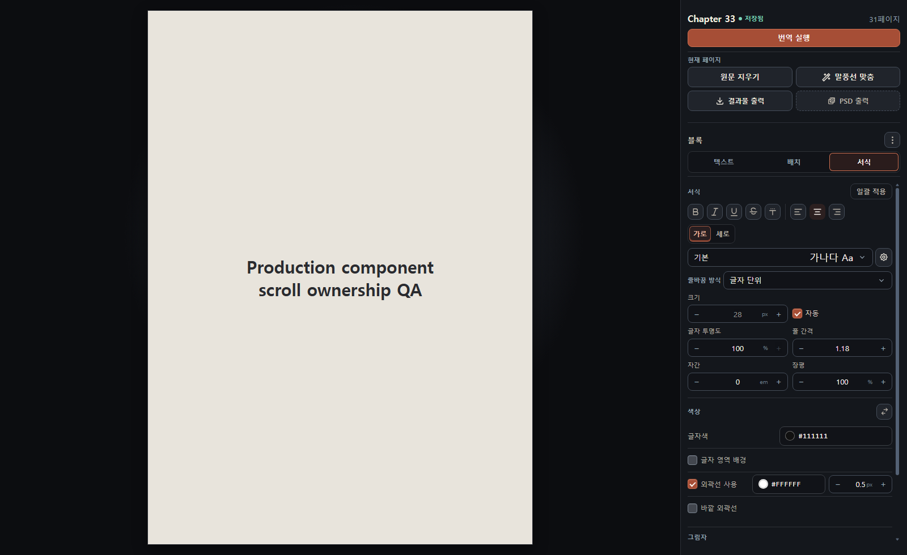
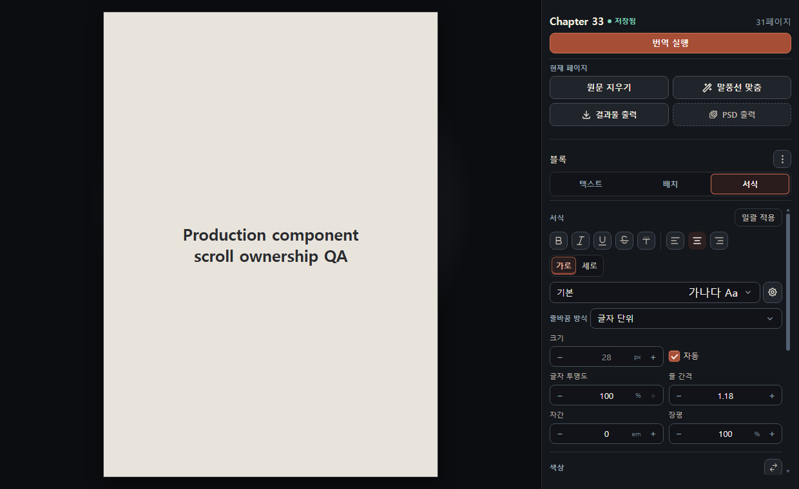

# UI 설계 규칙

이 문서는 현재 다크 팔레트와 좌·중앙·우 레이아웃, 기능의 진입 위치를 유지하면서 UI를 일관되게 다듬기 위한 구현 기준이다. 실제 코드와 정적 게이트가 규칙의 권위이며, 예외는 사유·소유 범위·행동 테스트를 같이 남긴다.

## 표면 계층

동일한 시각 평면에는 표면을 하나만 사용한다.

```text
앱 shell
├─ 좌측 rail
├─ workspace/canvas
└─ 우측 rail
   └─ section: 여백 + 제목 + divider
      └─ control/selection item

중첩 계층: modal / popover / menu / tooltip
```

- rail은 이미 표면이다. rail 안의 일반 그룹에 배경, 둥근 테두리, 그림자를 다시 추가하지 않는다.
- 그룹은 `Section`, `SectionHeader`, `CollapsibleSection`의 여백·타이포·divider로 나눈다.
- inset 표면은 코드, 로그, 이미지 미리보기, 캔버스처럼 실제로 다른 작업 공간일 때만 사용한다.
- 그림자와 elevation은 다른 콘텐츠 위에 겹쳐 뜨는 modal, popover, menu에만 사용한다. 같은 평면의 tile은 elevation을 사용하지 않는다.
- 하나의 활성 작업 범위에 high-emphasis primary action은 하나만 둔다. 나머지 행동은 secondary, ghost, danger로 의미를 분리한다.

이 원칙은 카드를 단순 장식용 테두리로 쓰지 말라는 [USWDS Card 지침](https://designsystem.digital.gov/components/card/), 같은 평면의 tile에 elevation을 주지 않는 [Carbon Tile 지침](https://carbondesignsystem.com/components/tile/usage/), 하나의 범위에 primary button을 하나만 두는 [Carbon Button 지침](https://carbondesignsystem.com/components/button/usage/)를 이 앱의 구조에 맞게 적용한 것이다.

## primitive 선택표

| 의도                       | 사용할 primitive                                 | 사용하지 말 것                        |
| -------------------------- | ------------------------------------------------ | ------------------------------------- |
| 즉시 행동                  | `Button`, `IconButton`                           | feature의 raw `<button>`              |
| 텍스트·숫자 입력           | `Field`, `NumberField`                           | 레이블없는 raw `<input>`              |
| 한 항목 선택               | `Select`, `SegmentedControl`                     | 임의 드롭다운, clickable `div`        |
| 독립 boolean               | `CheckboxField`                                  | 스타일이 서로 다른 raw checkbox       |
| 뷰 전환                    | `Tabs`                                           | 키보드 규칙이 없는 버튼 묶음          |
| 일반 그룹                  | `Section`, `SectionHeader`, `CollapsibleSection` | generic `Card`, 표면 안의 동일 표면   |
| 선택·실행 가능한 반복 항목 | `SelectionSurface`                               | 장식 목적의 selectable card           |
| 앱 위 다이얼로그           | `Modal`                                          | feature 전용 focus trap               |
| anchored popup             | `usePopupController` + 공용 menu/popover         | 각 component의 별도 document listener |

새 primitive를 만들기 전에 component 이름과 의도의 동의어를 `rg`로 검색한다. 모양이 비슷하다는 이유로 합치지 않고, 소유 도메인, 입력·출력, 오류 정책, 변경 이유가 모두 같을 때만 공용화한다.

## 접근성과 상호작용 계약

- 포인터 대상은 최소 24×24 CSS px을 확보한다. 예외가 필요하면 [WCAG 2.2 Target Size](https://www.w3.org/TR/WCAG22/#target-size-minimum)의 간격·동등 대상 조건을 만족해야 한다.
- 키보드 focus는 항상 보여야 하고, sticky 헤더나 overlay에 완전히 가려지지 않아야 하며, DOM과 시각 순서를 일치시킨다.
- Modal은 열릴 때 내부의 적절한 요소로 focus를 옮기고, Tab을 내부에 가두며, Escape로 닫고, 닫힌 후 호출 요소로 focus를 복원한다.
- Menu는 화살표·Home·End·Escape 조작과 focus 복원을 지원한다. Tab은 메뉴 항목 순환용으로 변질시키지 않는다.
- Tabs는 `tablist`/`tab`/`tabpanel`, 화살표 이동, Home/End, 선택과 focus 상태를 일관되게 구현한다.
- Combobox는 입력 focus를 유지하는동안 popup option을 키보드로 탐색하고, Escape로 popup을 닫으며, 표준 텍스트 편집 키를 가로채지 않는다.

위 패턴의 role·키보드·focus 계약은 [WAI-ARIA APG Modal](https://www.w3.org/WAI/ARIA/apg/patterns/dialog-modal/), [Menu](https://www.w3.org/WAI/ARIA/apg/patterns/menubar/), [Tabs](https://www.w3.org/WAI/ARIA/apg/patterns/tabs/), [Combobox](https://www.w3.org/WAI/ARIA/apg/patterns/combobox/)를 따른다.

## 레이아웃과 스크롤 소유권

- 앱 shell은 `100vh` 범위를 넘지 않고 page/body 스크롤을 만들지 않는다. 좌·우 rail이 필요한 스크롤을 소유한다.
- editor의 sticky chrome은 고정하고 `.editor-panel-body`만 세로로 스크롤한다. rail과 editor body에 동시에 외부·내부 스크롤바가 보이지 않게 한다.
- scroll container의 grid/flex 조상은 `min-height: 0`을 갖고, 가로 넘침은 해당 container에서 차단한다.
- 접힌 section은 본문과 내부 여백을 layout에서 제거한다. 본문이 없는 유령 표면을 남기지 않는다.
- 200% zoom, 1240×760, 긴 번역문에서도 page scrollWidth/scrollHeight가 viewport를 넘지 않아야 한다. 필요한 콘텐츠는 소유 container 안에서만 스크롤한다.

## CSS 소유권

- 전역 CSS는 foundations, app shell, 캔버스 paint order처럼 여러 component가 공유하는 경계만 소유한다. feature 스타일은 CSS Module을 사용한다.
- UI chrome의 색상, 그림자, z-index는 `foundations.css`의 semantic token을 사용한다. 캔버스 표시색, 이미지 출력색, 네이티브 특수 입력만 명시적 허용 목록으로 분리한다.
- feature 전용 selector가 전역으로 누출되거나 다른 feature의 DOM 구조에 의존하지 않는다.
- 기존 허용 목록은 제거 대상이지 새 코드의 예시가 아니다. `npm run check:maintainability`는 raw control, 색상/z-index, cross-feature selector, 파일 단위 lint disable의 신규 증가를 실패시킨다.

## Do / Don't

| Do                                                                 | Don't                                          |
| ------------------------------------------------------------------ | ---------------------------------------------- |
| rail 안의 그룹을 제목·여백·divider로 구분                          | panel → card → inset card로 표면 중첩          |
| 표시 이름은 하나만 두고 icon button에 정확한 `aria-label` 제공     | 같은 범위의 이름을 제목과 toolbar에 반복       |
| 같은 명령은 command map의 이름·실행 함수 공유                      | sidebar·빈 화면·palette에 실행 로직 복제       |
| 기본·오류·disabled·focus·긴 텍스트 상태를 primitive에서 해결       | feature별로 hover/focus/disabled 스타일 재구현 |
| 내부 scroll owner를 하나로 정하고 page overflow assertion으로 검증 | body와 rail, panel body에 중첩 스크롤 방치     |

## 실제 적용 예시

기존 서식 패널은 rail 안에 테두리와 우측 스크롤을 다시 쌓았다.


현재 서식 패널은 rail을 단일 표면으로 사용하고, 그룹은 divider와 여백으로 나누며, 고정 chrome와 본문 scroll owner를 분리한다.





## UI 변경 완료 조건

1. 실제 production component와 stylesheet를 import한다. 정적 HTML 복제는 QA 근거가 아니다.
2. 최소 1600×980과 1240×760을 캡처하고 두 PNG를 열어 확인한다.
3. 한국어·영어·일본어, 긴 텍스트, 200% zoom, popup/modal, focus-visible, disabled 상태 중 변경 범위에 해당하는 것을 검증한다.
4. `documentElement`/`body`의 외부 overflow, 잘림, 겹침, 가로 overflow, 불필요한 중첩 표면이 없어야 한다.
5. focused test, architecture/duplicate/UI policy gate, `npm run check`, build를 통과한다.
